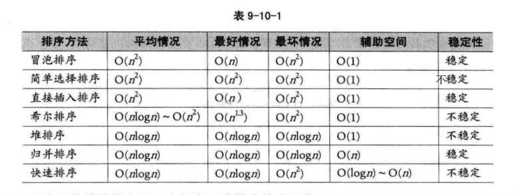

# 综述

## 分类

### 是否比较

**比较排序**

-   冒泡排序
-   选择排序
-   插入排序
-   归并排序
-   堆排序
-   快速排序

**非比较排序**

-   计数排序
-   基数排序
-   桶排序

### 内/外部排序

- 内部排序：待排序记录存放在计算机存储器中
- 外部排序：需要借助外部空间进行排序

## 对比



# 冒泡排序(Bubble Sort)

## 思想

重复地走访过要排序的元素，依次比较相邻两个元素，如果他们的顺序错误就把他们调换过来，直到没有元素再需要交换，排序完成。这个算法的名字由来是因为越小(或越大)的元素会经由交换慢慢“浮”到数列的顶端。

## **步骤**

-   比较相邻的元素，如果前一个比后一个大，就把它们两个调换位置。
-   对每一对相邻元素作同样的工作，从开始第一对到结尾的最后一对。这步做完后，最后的元素会是最大的数。
-   针对所有的元素重复以上的步骤，除了最后一个。
-   持续每次对越来越少的元素重复上面的步骤，直到没有任何一对数字需要比较。

## **属性**

| 名称           | 说明         |
| -------------- | ------------ |
| 分类           | 内部比较排序 |
| 最差时间复杂度 | O(n^2)       |
| 最优时间复杂度 | O(n)         |
| 所需辅助空间   | O(1)         |
| 稳定性         | 稳定         |

## **代码**

```python
#!/bin/python3
# coding: utf-8

"""
冒泡排序
"""

def bubble_sort(l):
    """
    冒泡排序
    :param l: 带排序列表
    :return: 排序后列表
    """
    for i in range(len(l)-1):
        for j in range(1, len(l) - i):
            if l[j-1] > l[j]:
                t = l[j-1]
                l[j-1] = l[j]
                l[j] = t
    return l


if __name__ == "__main__":
    arr = [3, 2, 1, 5, 6, 9, 0, 4, 2]
    print(bubble_sort(arr))
    
# Output
[0, 1, 2, 2, 3, 4, 5, 6, 9]
```

# 选择排序(Selection Sort)

## **思想**

初始时在序列中找到最小（大）元素，放到序列的起始位置作为已排序序列；然后，再从剩余未排序元素中继续寻找最小（大）元素，放到已排序序列的末尾。以此类推，直到所有元素均排序完毕。

## 属性

| 名称           | 说明   |
| -------------- | ------ |
| 最差时间复杂度 | O(n^2) |
| 最优时间复杂度 | O(n^2) |
| 平均时间复杂度 | O(n^2) |
| 所需辅助空间   | O(1)   |
| 稳定性         | 不稳定 |

## 代码

```python
#!/bin/python3
# coding: utf-8

"""
选择排序
"""

def selection_sort(l):
    """选择排序
    :param l: 带排序数组
    :return: 排序后数组
    """
    for i in range(len(l) - 1):
        _min = l[i]
        _index_min = i
        for j in range(i+1, len(l)):
            if l[j] < _min:
                _min = l[j]
                _index_min = j
                
        if i != _index_min:
            t = l[i]
            l[i] = _min
            l[_index_min] = t

    return l


if __name__ == "__main__":
    arr = [4, 2, 1, 0, 9, 8, 3, 7 ,5, 6]
    print(selection_sort(arr))
```

# 插入排序(Insertion Sort)

## 思想

原理非常类似于抓扑克牌，对于未排序数据(右手抓到的牌)，在已排序序列(左手已经排好序的手牌)中从后向前扫描，找到相应位置并插入。

插入排序在实现上，通常采用in-place排序（即只需用到O(1)的额外空间的排序），因而在从后向前扫描过程中，需要反复把已排序元素逐步向后挪位，为最新元素提供插入空间。

## 步骤

-   从第一个元素开始，该元素可以认为已经被排序
-   取出下一个元素，在已经排序的元素序列中从后向前扫描
-   如果该元素（已排序）大于新元素，将该元素移到下一位置
-   重复步骤3，直到找到已排序的元素小于或者等于新元素的位置
-   将新元素插入到该位置后
-   重复步骤2~5

## 属性

| 名称           | 说明   |
| -------------- | ------ |
| 最差时间复杂度 | O(n^2) |
| 最优时间复杂度 | O(n)   |
| 平均时间复杂度 | O(n^2) |
| 所需辅助空间   | O(1)   |
| 稳定性         | 稳定   |

## 代码

```python
#!/bin/python3
# coding: utf-8

"""
插入排序
"""

def insertion_sort(l):
    """插入排序
    :param l:   带排序数组
    :return:    排序后数组
    """

    for i in range(1, len(l)):
        j = i - 1
        pick = l[i]
        while j >= 0 and l[j] > pick:
            l[j+1] = l[j]
            j -= 1
        l[j+1] = pick
    return l


if __name__ == "__main__":
    arr = [4, 2, 1, 3, 0, 9, 8, 7, 6, 5, 2]
    print(insertion_sort(arr))
```

# 二分插入排序(Insertion Sort Dichotomy)

## 属性

| 名称           | 说明     |
| -------------- | -------- |
| 最差时间复杂度 | O(n^2)   |
| 最优时间复杂度 | O(nlogn) |
| 平均时间复杂度 | O(n^2)   |
| 所需辅助空间   | O(1)     |
| 稳定性         | 稳定     |

## 代码

```python
#!/bin/python3
# coding: utf-8

"""
二分排序
"""


def insertion_sort_dichotomy(l):
    """二分排序
    :param l:   带排序数组
    :return:    排序后数组
    """

    for i in range(1, len(l)):
        pick = l[i]
        left = 0
        right = i - 1
        while left <= right:
            mid = (left + right) // 2
            if l[mid] > pick:
                right = mid - 1
            else:
                left = mid + 1
        for j in range(i-1, left-1, -1):
            l[j+1] = l[j]
        l[left] = pick
    return l


if __name__ == "__main__":
    arr = [4, 2, 3, 1, 0, 9, 8, 5, 8, 7, 6]
    print(insertion_sort_dichotomy(arr))
```

# 希尔排序(Shell Sort)

希尔排序，也叫**递减增量排序**，是插入排序的一种更高效的改进版本。希尔排序是**不稳定**的排序算法。

1959年Shell发明，第一个突破O(n^2)的排序算法，是简单插入排序的改进版。它与插入排序的不同之处在于，它会优先比较距离较远的元素。希尔排序又叫缩小增量排序。

希尔排序的核心在于间隔序列的设定。既可以提前设定好间隔序列，也可以动态的定义间隔序列。动态定义间隔序列的算法是《算法（第4版》的合著者Robert Sedgewick提出的。　

时间复杂度和选取的步长有关。

**希尔排序是不稳定的排序算法，**虽然一次插入排序是稳定的，不会改变相同元素的相对顺序，但在不同的插入排序过程中，相同的元素可能在各自的插入排序中移动，最后其稳定性就会被打乱。

## 算法描述

先将整个待排序的记录序列分割成为若干子序列分别进行直接插入排序，具体算法描述：

-   选择一个增量序列t1，t2，…，tk，其中ti>tj (其中, i < j)，tk=1；
-   按增量序列个数k，对序列进行k 趟排序；
-   每趟排序，根据对应的增量ti，将待排序列分割成若干长度为m 的子序列，分别**对各子表进行直接插入排序**。仅增量因子为1 时，整个序列作为一个表来处理，表长度即为整个序列的长度。

## 过程演示


## 思想

希尔排序通过将比较的全部元素分为几个区域来提升插入排序的性能。这样可以让一个元素可以一次性地朝最终位置前进一大步。然后算法再取越来越小的步长进行排序，算法的最后一步就是普通的插入排序，但是到了这步，需排序的数据几乎是已排好的了（此时插入排序较快）。

假设有一个很小的数据在一个已按升序排好序的数组的末端。如果用复杂度为O(n^2)的排序（冒泡排序或直接插入排序），可能会进行n次的比较和交换才能将该数据移至正确位置。而希尔排序会用较大的步长移动数据，所以小数据只需进行少数比较和交换即可到正确位置。

改进：

-   插入排序在对几乎已经排好序的数据操作时，效率高，即可以达到线性排序的效率
-   但插入排序一般来说是低效的，因为插入排序每次只能将数据移动一位

## 属性

| 名称           | 说明         |
| -------------- | ------------ |
| 最差时间复杂度 | O(n(logn)^2) |
| 最优时间复杂度 | O(n)         |
| 所需辅助空间   | O(1)         |
| 稳定性         | 不稳定       |

## 代码

```python
#!/bin/bash
# coding: utf-8

"""
希尔排序
"""


def ShellSort(l):
    """希尔排序
    :param l:   带排序序列
    :return:    排序后序列
    """
    
    n = len(l)
    h = len(l)  # 步长
    while h > 1:
        h = h // 3 if h // 3 >= 1 else 1  # 更新步长
        for i in range(h, n):
            j = i
            while j >= h and l[j] < l[j-h]:
                t = l[j]
                l[j] = l[j-h]
                l[j-h] = t
                j -= h
    return l


if __name__ == "__main__":
    arr = [1, 6, 4, 3, 2, 5, 9, 0, 8, 7]
    print(ShellSort(arr))
```

# 堆排序

```c++
#include <iostream>

using namespace std;

void swap(int &a, int &b) {
    int t = a;
    a = b;
    b = t;
}

void heapify(int arr[], int n, int cur) {
    int next;
    while (2 * cur + 1 < n) {
        next = 2 * cur + 1;
        
        if (next + 1 < n && arr[next] < arr[next+1]) 
            ++next;
        
        if (arr[cur] < arr[next]) {
            swap(arr[cur], arr[next]);
        } else {
            break;
        }
        
        cur = next;
    }
}

void heapSort(int arr[], int n) {
    for (int i = n / 2 - 1; i >= 0; --i) {
        heapify(arr, n, i);
    }
    for (int i = n-1; i > 0; --i) {
        swap(arr[0], arr[i]);
        heapify(arr, i, 0);
    }
}

int main() {
    int arr[] = {1, -1, 0, 19, 5, 8, 3, 2, 1}, n = 9;
    heapSort(arr, n);
    for (int i = 0; i < n; ++i) {
        cout << arr[i] << " ";
    }
    cout << endl;
    return 0;
}
/** Output
-1 0 1 1 2 3 5 8 19
*/
```


# 参考

-   [参考一](https://www.cnblogs.com/eniac12/p/5329396.html)
-   [参考二](https://www.cnblogs.com/onepixel/articles/7674659.html)
-   [参考三](https://www.cnblogs.com/chengxiao/p/6104371.html)

