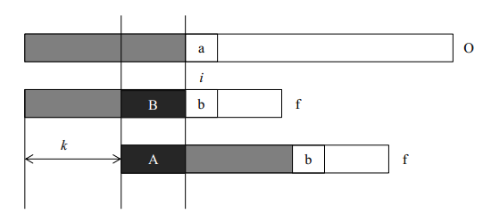

# 简介

给定两个字符串O和f, 长度分别为n和m, 判断f是否在O中出现, 如果出现则返回出现的位置.

复杂度为O(n+m).

# 算法思想

在字符串O中查找f, 当匹配到位置i时, 两个字符串不相等, 这时我们需要将字符串f向前移动。常规方法是每次向前移动一位，但是它没有考虑前i-1位已经比较过这个事实，所以效率不高。事实上，如果我们提前计算某些信息，就有可能一次前移多位。假设我们根据已经获得的信息知道可以前移k位，我们分析移位前后的f有什么特点。我们可以得到如下的结论：

- A段字符串是f的一个前缀。
- B段字符串是f的一个后缀。
- A段字符串和B段字符串相等。

所以前移k位之后，可以继续比较位置i的前提是f的前i-1个位置满足：**长度为i-k-1的前缀A和后缀B相同**。只有这样，我们才可以前移k位后从新的位置继续比较。

# 参考

- [参考一](http://blog.csdn.net/yutianzuijin/article/details/11954939/)