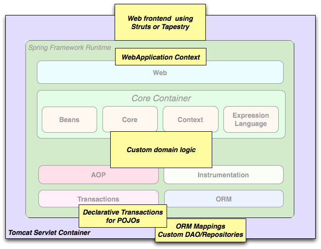

[TOC]

# 描述

Spring是一个开源框架，为基于Java的现代企业应用程序提供了全面的编程和配置模型。

# 特性

- 轻量级
  - 非侵入
- 依赖注入 & 控制反转
  - Dependency injection (DI) OR Inversion of control (IOC)
- 面向切面编程
  - Aspect oriented programing (AOP)
- 容器
  - 包含并且管理应用对象的生命周期
- 框架
  - 使用简单的组件配置组合成一个复杂的应用
  - 可以使用XML和Java注解组合这些对象
- 一站式
  - 第三方组件

# 模块

## Core Container

Core Container 由 `spring-core` 、`spring-beans`、`spring-context`、`spring-context-support`、`spring-expression` 模块组成。

- `spring-core & spring-beans`
  - 提供框架的基础
  - 包括IoC和DI
  - BeanFactory是工厂模式的复杂实现，省略显式的单例编程、允许配置和指定程序逻辑依赖之间的解耦
- `spring-context` 
  - 以 `spring-core & spring-beans` 为基础
  - 提供符合框架规范访问对象的方法
- `spring-context-support` 
  - 为集成常用第三方库提供支持，比如
    - 缓存：EhCache、Guava、JCache
    - 邮件：JavaMail
    - Scheduling：CommonJ、Quartz
    - 模板引擎：FreeMarker、JasperReports、Velocity
- `spring-expression`
  - 提供强大的表达语言，用于在运行时查询和操作对象图
  - 统一表达语言的扩展
  - 支持设置和获取属性值、property assignment、方法调用、访问数组及集合，逻辑和算术运算符、命名变量、按名称从Spring的IoC容器中检索对象、列表投影、集合聚合

## AOP

- `spring-aop` 
  - 模块提供了一种符合面向切面的编程实现，例如可以定义方法拦截器和切入点，以干净的解耦代码实现需要分离的功能代码
- `spring-aspects`
  - 提供与AspectJ的集成
- `spring-instrument`
  - 提供类检测支持和类加载器实现，以在某些应用程序服务器中使用，比如 `spring-instrument-tomcat`

## Messaging

- `spring-messaging`
  - 有来自 Spring Integration项目的关键抽象，作为基于消息应用程序的基础
    - Message
    - MessageChannel
    - MessageHandler
  - 还包含一组注解，用于将消息映射到方法

## Data Access/Integration

数据访问/集成层包括JDBC、ORM、OXM、JMS、Transaction模块，对应依赖有：

- `spring-jdbc`
- `spring-tx`
- `spring-orm`
- `spring-oxm`
- `spring-jms`

## Web

Web层包括`sping-web`, `spring-webmvc`, `spring-websocket`, `spring-webmvc-protlet` 模块。

- `spring-web`
  - 提供基本的面向Web的集成功能，例如文件上传功能、使用Servlet监听器和面向Web的应用程序上下文对IoC容器的初始化
- `spring-webmvc`
  - 也被称为`Web-Servlet` 模块
  - 包含向Web程序，提供Spring的 model-view-controller (MVC) 和 REST Web 服务的实现
  - Spring的MVC框架在模型代码和Web表达之间提供清晰的分隔，并与Spring框架的其他功能集成在一起
- `spring-webmvc-protlet`
  - 也被称为 `Web-Portlet` 模块
  - 提供可在Portlet环境中使用的MVC实现，并镜像了基于Servlet的`spring-webmvc`模块的功能

## Test

`spring-test` 模块支持使用JUnit或TestNG针对Springs组件进行单元测试和集成测试。

# 使用场景

## 典型的成熟Spring Web应用程序

## 使用第三方Web框架的中间层

# 参考

- [Spring Framework Reference Document](https://docs.spring.io/spring/docs/4.3.26.RELEASE/spring-framework-reference/htmlsingle/)