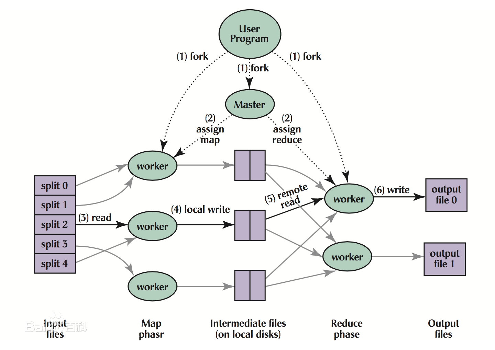

# 简介

MapReduce是一种编程模型，用于大规模数据集的并行运算。

MR有两个阶段组成：Map和Reduce，用户只需实现map()和reduce()两个函数，即可实现分布式计算。

# 运算过程

# 执行步骤

- Map
  - 读取HDFS中的文件。每一行解析成一个<k,v>。每一个键值对调用一次map函数。
  - 覆盖map()，接收1.1产生的<k,v>，进行处理，转换为新的<k,v>输出。
  - 对1.2输出的<k,v>进行分区。默认分为一个区。
  - 对不同分区中的数据进行排序（按照k）、分组。分组指的是相同key的value放到一个集合中。
  - （可选）对分组后的数据进行归约。
- Reduce
  - 多个map任务的输出，按照不同的分区，通过网络copy到不同的reduce节点上。（**shuffle**）
  - 对多个map的输出进行合并、排序。覆盖reduce函数，接收的是分组后的数据，实现自己的业务逻辑，处理后，产生新的<k,v>输出。
  - 对reduce输出的<k,v>写到HDFS中。