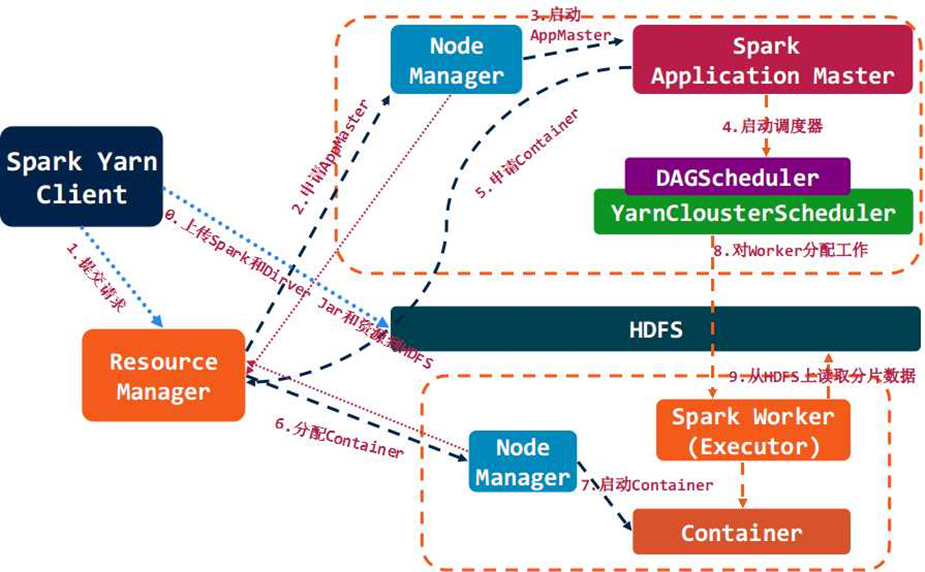

# 简介

Apache Spark 是专为大规模数据处理而设计的快速通用的计算引擎。

# 生态

# 特点

**速度快**

- Spark拥有DAG执行引擎，支持在内存中对数据进行迭代计算

**适用场景广泛**

- 大数据分析统计
- 实时数据处理
- 图计算
- 机器学习

**易用性**

- 编写简单，支持80种以上高级算子

**容错性高**

- Spark引进了弹性分布式数据集RDD
  - RDD可重新构建

# 适用场景

- 复杂的批量处理
  - 偏重点在于处理海量数据的能力，至于处理速度可忍受，通常的时间可能是在数十分钟到数小时
- 基于历史数据的交互式查询
  - 通常的时间在数十秒到数十分钟之间
- 基于实时数据流的数据处理
  - 通常在数百毫秒到数秒之间

# 架构

**基础运行架构**

**结合yarn**

# 参考

- [Spark 以及 spark streaming 核心原理及实践](https://www.cnblogs.com/liuliliuli2017/p/6809094.html)