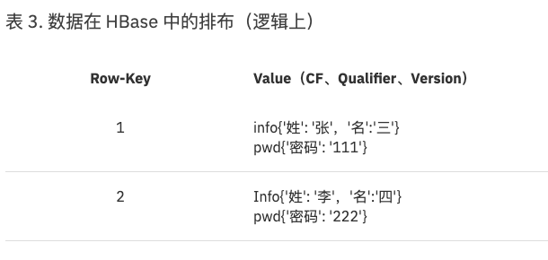
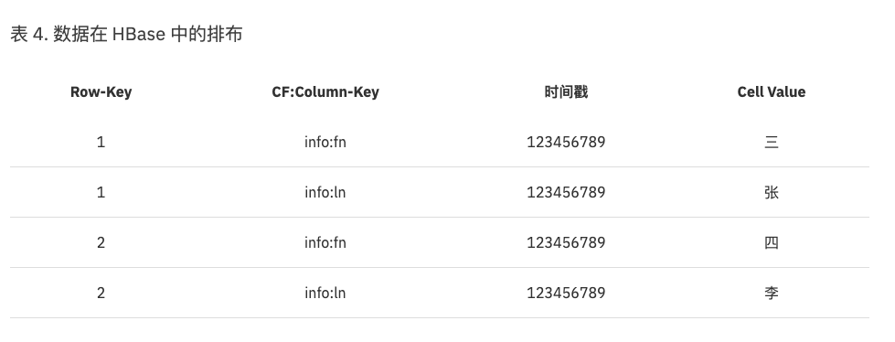
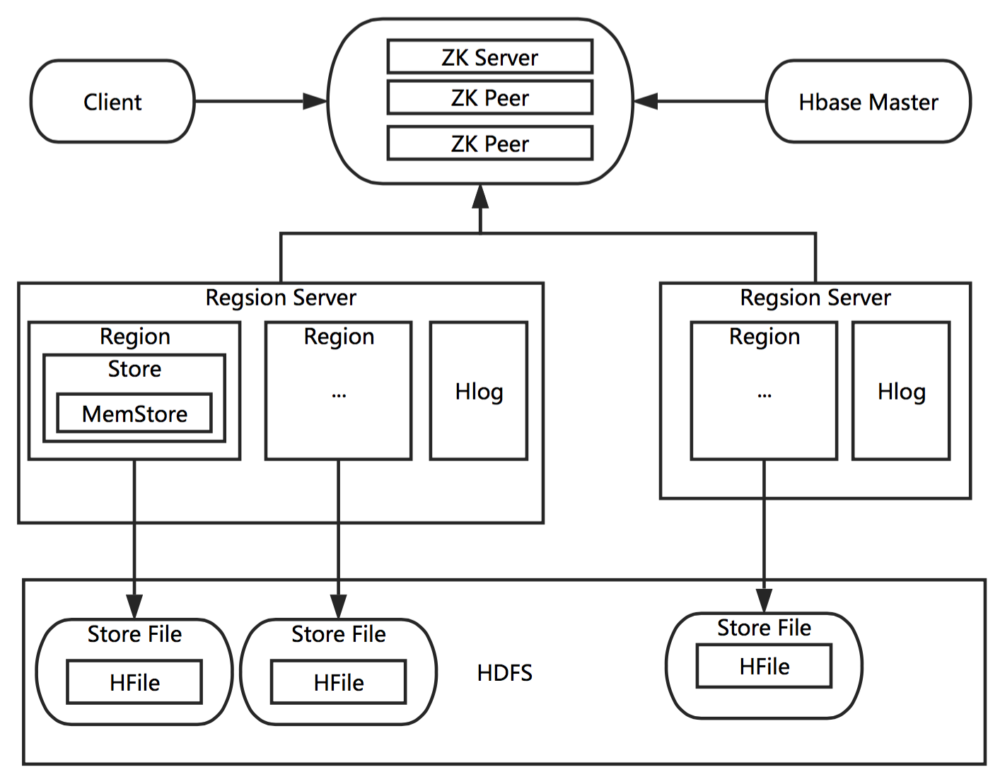

# 简介

HBase是一种列式的分布式数据库，适用于结构化的存储，其底层存储由HDFS实现，此外还依赖Zookeeper。

# 存储结构

- 列式存储
- 逻辑结构如下

- 物理上HBase按CF存储，按照RowKey将CF中的列关联起来，物理上的数据排布如下

- 逻辑上数据的排布和物理上排布的关联

# 工作原理

# 参考

- https://www.ibm.com/developerworks/cn/analytics/library/ba-cn-bigdata-hbase/index.html

