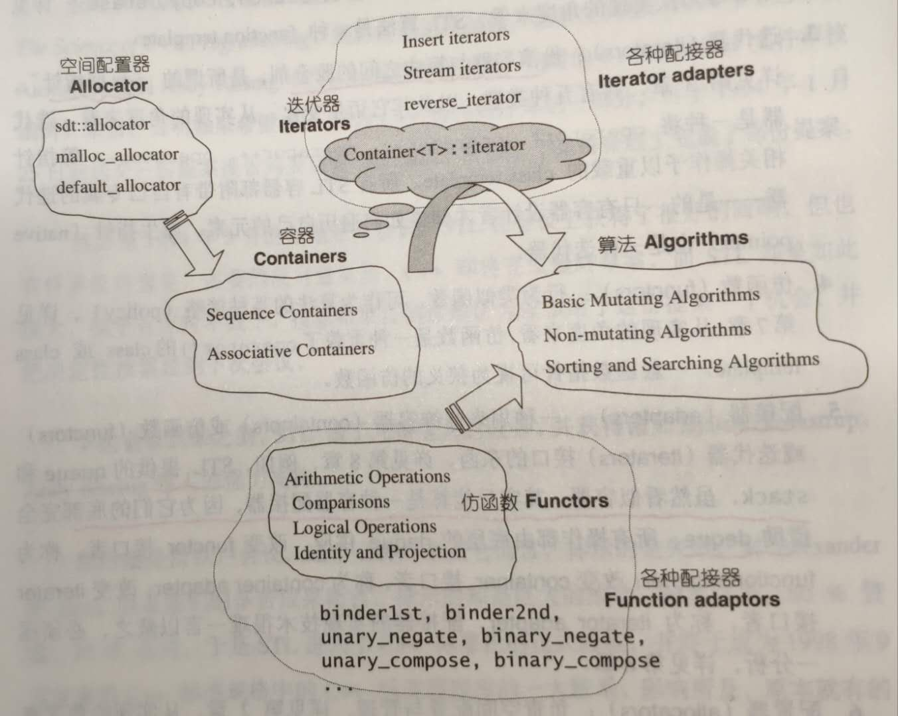

# 组件

STL提供六大组件，彼此可以组合套用

- 容器
  - 数据结构
    - vector
    - list
    - deque
    - set
    - map
  - 是一种 class template
- 算法
  - 比如
    - sort
    - search
    - copy
    - erase
- 迭代器
  - 容器和算法胶合剂
  - 所谓的“泛型指针”

- 仿函数
  - 行为类似函数，可作为算法的某种策略
- 配接器
  - 一种用来修饰容器、仿函数、迭代器接口的东西
- 配置器
  - 负责空间配置与管理

**关系**

- Container通过Allocator获取数据存储空间
- Algorithm通过Iterator存取Container内容
- Functor可以协助Algorithm完成不同的策略变化
- Adapter可以修饰或套接Functor

