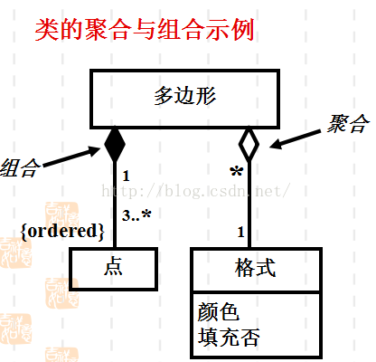
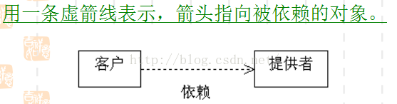
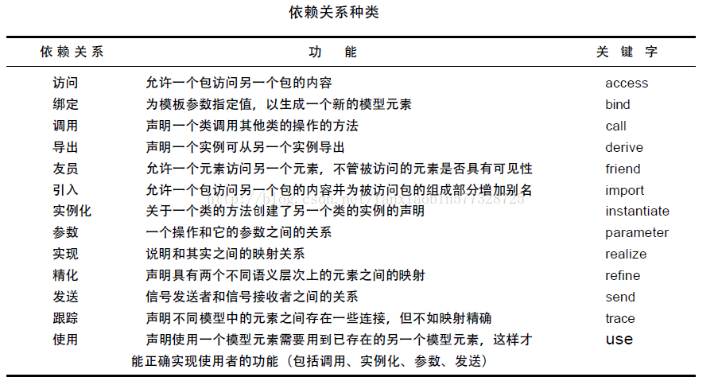
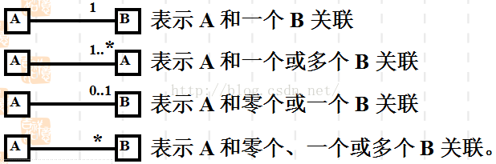
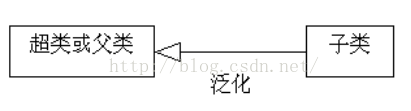

# 简介

Unified Modeling Language (*UML*)又称统一建模语言或标准建模语言。是一个支持模型化和软件系统开发的图形化语言，为软件开发的所有阶段提供模型化和可视化支持，包括由需求分析到规格，到构造和配置。

# 关系

## 说明及表示

- 关联
  - 连接模型元素及链接实例
  - 一条实线表示
- 依赖
  - 表示一个元素以某种方式依赖于另一个元素
  - 用一条虚线加箭头来表示
- 聚合
  - 表示整体与部分的关系
  - 用一条实线加空心菱形来表示
- 组成
  - 表示整体与部分的有一关系
  - 用一条实线加实心菱形来表示
- 泛化(继承)
  - 表示一般与特殊的关系
  - 用一条实线加空心箭头来表示
- 实现
  - 表示类与接口的关系
  - 用一条虚线加空心箭头来表示

## 分类

- 一般关系
  - 泛化
  - 实现
- 成员变量
  - 关联
  - 聚合
  - 合成/组合
- 参数
  - 依赖关系

## 类与类之间的关系

- 依赖关系：类之间使用的关系
- 泛化关系：类之间的一般/特殊关系
- 关联关系：对象之间结构关系
- 实现关系：类中规格说明和实现之间的关系

## 详解

**聚合（Aggregation）**

- 一种特殊类型的关联
- 表示整体与部分关系的关联
- 描述了 **has a** 的关系

**组合（Composite）**

- 聚合关系中的一种特殊情况，是更强形式的聚合，又称强聚合
- 成员对象的生命周期取决于组合的生命周期
- 组合不仅控制着成员对象的行为，而且控制着成员对象的创建和解构

**依赖**

- 指一个模型元素的变化必影响到另一个模型元素的变化

- > 可以简单的理解，就是一个类A使用到了另一个类B，而这种使用关系是具有偶然性的、临时性的、非常弱的，但是B类的变化会影响到A；比如某人要过河，需要借用一条船，此时人与船之间的关系就是依赖；
  >
  > 表现在代码层面，为类B作为参数被类A在某个method方法中使用（使用依赖之参数传递）。

- 

- 导致依赖的原因

  - **一个类向另一个类发送消息**
  - **一个类是另一个类的数据成员**
  - **一个类用另一个类作为它的某个操作的参数**

- 四种基本类型依赖

  - 使用依赖（Usage）：表示客户使用提供者提供的服务以实现它的行为。
    - 使用（Use）：声明使用一个模型元素需要用到已存在的另一个模型元素，以实现使用者的正确功能
    - 调用（Call）：声明一个类中的方法调用其它类的操作
    - 参数（Parameter）：声明一个操作和他的参数之间的关系
    - 发送（Send）：声明信号发送者和信号接受者之间的关系
    - 实例化（Instantiate）：声明用一个类的方法创建了另一个类的实例
  - 抽象依赖（Abstraction）：表示客户与提供者之间的关系，依赖于在不同抽象层次上的事物。
    - 跟踪（trace）：声明不同模型中的元素之间存在一些连接，通常这些模型是开发过程中不同阶段的模型
    - 精化（refine）：声明具有两个不同语义层次上的元素之间的映射，它们中的一个通常是另一个的未完善的形式
    - 派生（derive）：声明一个实例可以从另一个实例导出，表示一个元素可以通过计算另一个元素来得到
  - 授权依赖（Permission）：表达一个事物访问另一个事物的能力。
    - 访问（access）：允许一个包访问另一个包的内容
    - 导入（import）：允许一个包访问另一个包的内容，并可以将目标包内容的名字加入到导入包的命名空间内
    - 友元（friend）：允许一个元素访问另一个元素，不管被访问的元素是否具有可见性
  - 绑定依赖（Binding）：较高级的依赖类型，用于绑定模板以创建新的模型元素。
    - 绑定（bind）：为模板参数指定值，以生成一个新的模型元素，可通过取代模板备份中的参数实现

  

**关联**

代表对象类的实例（对象）之间的一组链接。关联是一种结构关系，指一种对象和另一种对象有联系。给定关联的两个类，可以从其中的一个类的对象访问到另一个类的相关对象。

应用于关联的修饰：名称、角色、多重性、聚合、组合、导航性。

**泛化**

泛化(generalization)：是类的一般描述和具体描述之间的关系。继承是实现泛化的一种机制。

**实现**

实现（realization）：规格说明和其实现之间的关系。

# 参考

- https://blog.csdn.net/fanxiaobin577328725/article/details/51586141