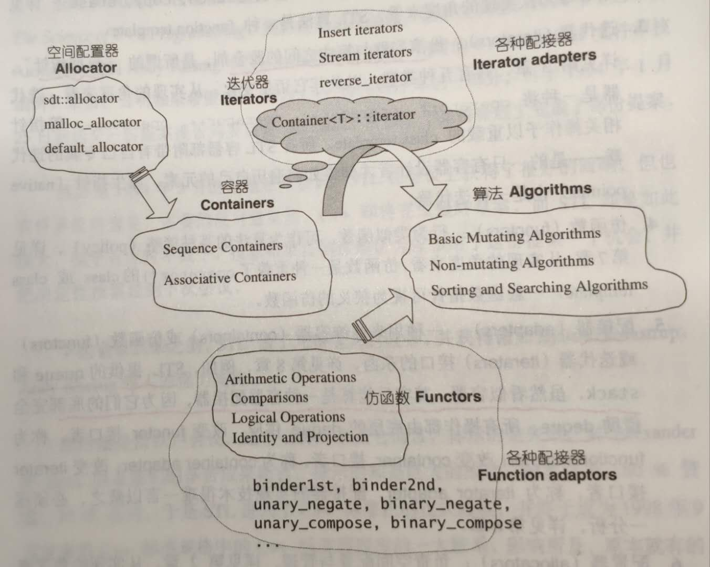

# 组件

STL提供六大组件，彼此可以组合套用

- 容器
  - 数据结构
    - vector
    - list
    - deque
    - set
    - map
  - 是一种 class template
- 算法
  - 比如
    - sort
    - search
    - copy
    - erase
- 迭代器
  - 容器和算法胶合剂
  - 所谓的“泛型指针”

- 仿函数
  - 行为类似函数，可作为算法的某种策略
- 配接器
  - 一种用来修饰容器、仿函数、迭代器接口的东西
- 配置器
  - 负责空间配置与管理

**关系**

- Container通过Allocator获取数据存储空间
- Algorithm通过Iterator存取Container内容
- Functor可以协助Algorithm完成不同的策略变化
- Adapter可以修饰或套接Functor

# SGI空间配置器

保留字 new 运算子内含两阶段操作：

- 调用 `::operator new` 配置内存
- 调用对象构造函数

保留字 delete 运算子也包含两阶段操作：

- 调用对象析构函数
- 调用 `::operator delete` 释放内存

STL allocator 将两阶段操作区分开来：

- `alloc::allocate()` ： 负责内存配置操作
- `alloc::deallocate()` ：负责内存释放操作
- `::construct()` ：负责对象构造操作
- `::destroy()`：负责对象析构操作

## 对象构造和析构工具

`construct()` 、`destroy()` 作为构造、析构之用的函数被设计为全局函数。

- `construct()` 接受一个指针p和一个初值 `value`，将初始值设定到指针所指的空间上。

- `destroy()` 有两个版本：
  - 接受一个指针，准备将该指针所指之物析构掉
  - 接受`first`和`last`两个迭代器，准备将 `[first, last)` 内的对象析构掉。但是这里会首先利用 `value_type` 获得迭代器所指对象的类别，再利用 `_type_traits<T>` 判断该类型的析构函数是否无关痛痒。若是(`_true_type`)，则什么也不做；否则调用每个对象的析构函数。

## 空间的配置和释放

对于空间的配置和释放，SGI的设计哲学是：

- 向 `system heap` 要求空间
- 考虑多线程状态
- 考虑内存不足时的应变措施
- 考虑过多小型区块可能造成的内存碎片(`fragment`)的问题

SGI以`malloc()`和`free()`完成内存的配置和释放。

考虑到小型区块可能造成的内存碎片问题，SGI设计了双层级配置器。

- 第一级配置直接使用`malloc()` 和 `free()`
- 第二级配置则视情况采用不同的策略
  - 如果配置区块足够大(大于128bytes)：调用第一级配置器
  - 如果过小(小于128bytes)时：为了降低额外负担(overhead)，便采用复杂的 memory pool 整理方式

### 第一级配置器`__malloc_alloc_template`

`allocate()` 和 `realloc()` 都是在调用 `malloc()` 和 `realloc` 不成功后，调用 `oom_malloc()` 和 `oom_realloc` 。后两者都有内循环，不断调用 内存不足处理例程 ，期望在某次调用后，获得足够的内存而圆满完成任务。如果调用 内存不足处理例程 没有被客户端设定，会调用 `__THROW_BAD_ALLOC` 抛出异常。

### 第二级配置器`__default_alloc_template`

# 分类

## 序列式容器

- vector
  - 连续线性空间存储
- list
  - 双链表实现
- deque
  - 双向开口
  - **分段连续空间存储**
- stack
  - 先进后出
  - deque作为缺省底部实现
  - 不允许遍历
- queue
  - 先进先出
  - deque作为缺省底部实现
  - 不允许遍历
- priority_queue
  - 底部实现是堆
  - 默认大根堆，所有每次pop都是最大的元素
- slist
  - 单链表实现

## 关联式容器

- set
- map
- multiset
- multimap
- hashtable
- hash_set
- hash_map
- hash_multiset
- hash_multimap

### 底部实现

- RB-tree
  - set
  - map
  - multiset
  - multimap
- hashtable
  - hash_set
  - hash_map
  - hash_multiset
  - hash_multimap

# 对比

## list VS slist

- 共有操作时间复杂度相同
- slist使用单链表，更节省空间
- slist特别提供了`inert_after` 和 `erase_after`
- slist不提供 `push_back()` ，只提供 `push_front`