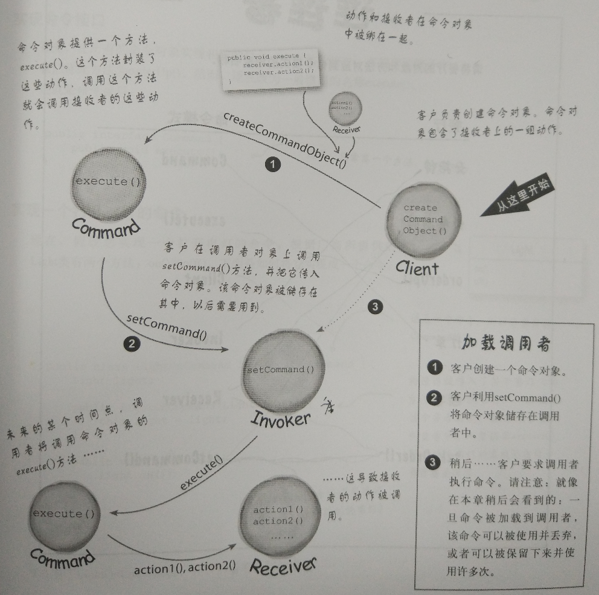
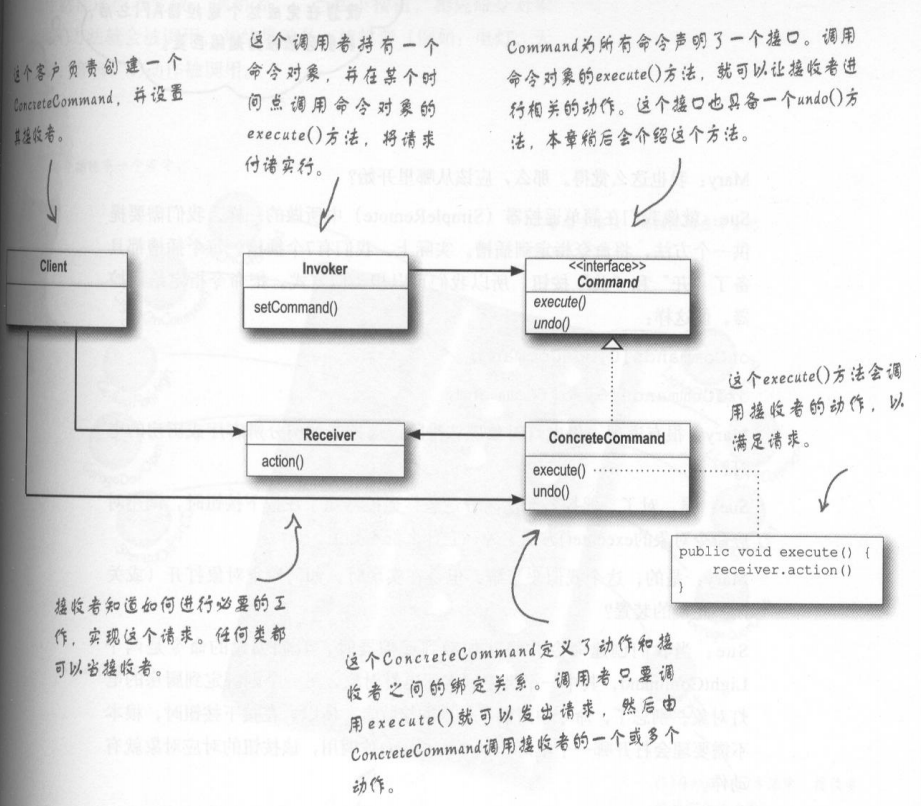
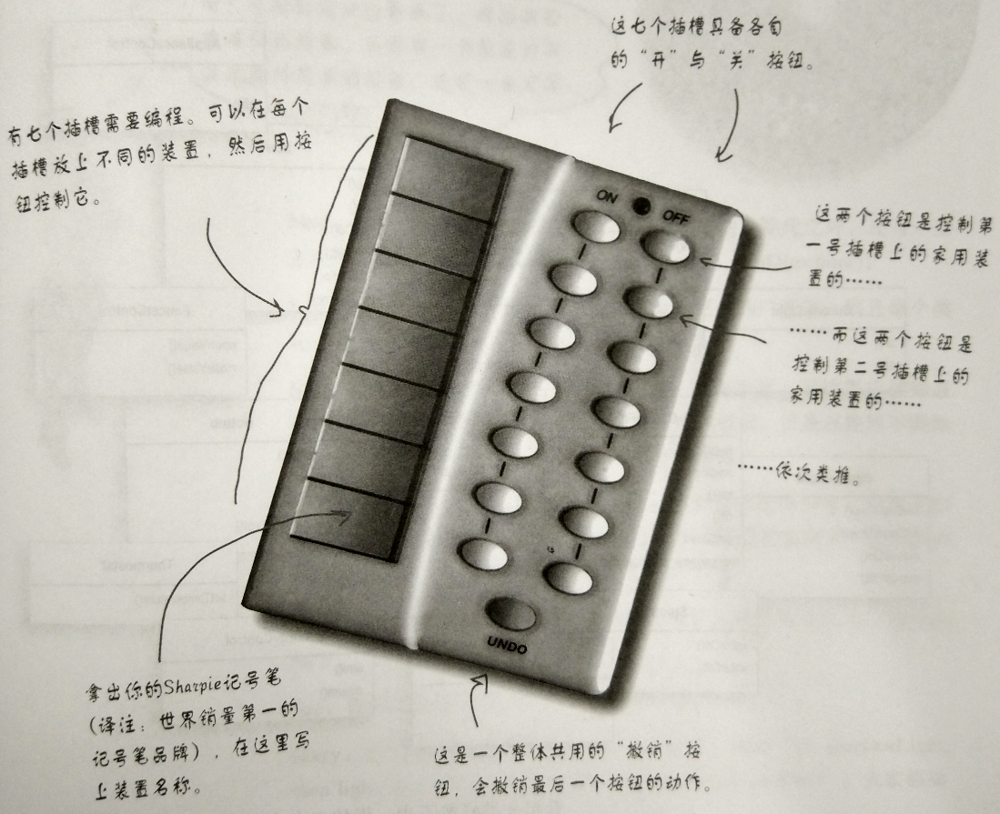
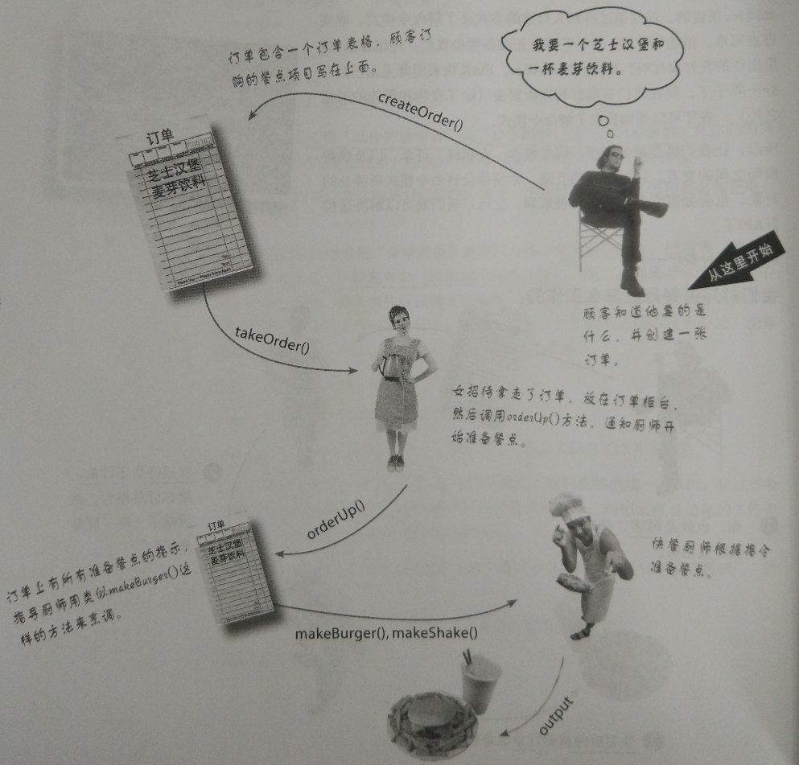

# 命令模式

**命令模式** 将“请求”封装成对象，以便使用不同的请求、队列或者日志来参数化其他对象。命令模式也支持可撤销的操作。

- 封装调用

  ```
  通过封装方法调用，可以把运算块包装成形。所以调用此运算的对象不需要关心事情是如何进行的，只要知道如何使用包装成形的方法来完成它就可以。
  通过封装方法调用，也可以做一些很聪明的事情，比如：记录日志、重复使用这些封装来实现撤销。
  ```

- 命令模式可将“动作的请求者”从“动作的执行者”对象中解耦。利用命令对象，把请求封装成一个特定对象。



一个命令对象通过在特定接受者上绑定一组动作来封装一个请求。要达到这一点，命令对象将动作和接受者包进对象中。这个对象只暴露出一个`execute()`方法。此方法被调用的时候，接受者就会进行这些动作。

## 类图



## 总结

### 基础

- 抽象
- 封装
- 多态
- 继承

### 原则

- 封装变化
- 多用组合，少用继承
- 针对接口编程，不针对实现编程
- 为交互对象之间松耦合设计而努力
- 类应该对扩展开放，对修改关闭
- 依赖抽象，不要依赖具体类

### 要点

- 命令模式将发出请求的对象和执行请求的对象解耦
- 在被解耦的两者之间是通过命令对象进行沟通的。命令对象封装了接受者和一个或一组动作
- 调用者通过调用命令对象的execute()发出请求，这会使得接受者的动作被调用
- 调用者可以接受命令当做参数，甚至在运行时动态地进行
- 命令可以支持撤销，做法是实现一个undo()方法来回到execute()被执行前的状态
- 宏命令是命令的一种简单的延伸，允许调用多个命令。宏方法也可以支持撤销
- 命令模式也可以用来实现日志和事务系统

# 案例

## 遥控器

### 先来看一下遥控器的样子



我们想让我们的遥控器适应五花八门厂商生产的各种产品（比如，电视、电灯、车库门等）。不同产品的方法又各有不同，比如点灯有`on()`,`off()`, TV除了开关，还有`setVolumn()`等。

利用命令对象，把请求（例如打开电灯）封装成一个特定对象（例如客厅电灯对象）。所以对每个按钮都存储一个命令对象，那么当按钮被按下的时候，就可以请命令对象做相关的工作。遥控器并不需要知道工作内容是什么，只要是个命令对象能和正确的对象沟通，把事情做好就可以了。这样，遥控器和电灯对象解耦了。

使用这个模式，能够创建一个API，将这些命令对象加载到按钮插槽，让遥控器的代码尽量保持简单。而把家电自动化的工作和进行该工作的对象一起封装在命令对象中。

### 再以餐厅为例



餐厅的女招待通过订单和厨师解耦。

**命令模式允许将“发出请求的对象”和“接受与执行这些请求的对象”分隔开来。**比方说，对于遥控器API，我们需要分隔开“发出请求的按钮代码”和“执行请求的厂商特定对象”。万一遥控器的每个插槽都持有一个像餐厅订单那样的对象，那么，当一个按钮被按下，只要调用该对象的`orderUp()`方法，点灯就开了，而遥控器不需要知道事情是怎么发生的，也不需要知道设计哪些对象。

### 从餐厅到命令模式


**角色对应关系：**

- 女招待：Invoker
- 快餐厨师：Receiver
- `orderUp()`：`execute()`
- 订单：Command
- 顾客：Client
- `takeOrder()`：`setCommand()`

### 实现命令接口

```java
/**
 * 设计模式 - 命令模式
 * 命令接口
 */
public interface Command {
    public void execute();
}
```

### 实现一个打开点灯的命令

```java
/**
 * 设计模式 - 命令模式
 * 打开灯命令
 */
public class LightOnCommand implements Command {    // 这是一个命令，需要实现Command接口
    Light light;

    public LightOnCommand(Light light) {
        this.light = light;
    }

    public void execute() {
        light.on();
    }
}
```

### 使用命令对象

```java
/**
 * 设计模式 - 命令模式
 * 使用命令对象
 */
public class SimpleRemoteControl {
    Command slot;   // 有一个插槽持有命令，而这个命令控制着一个装置

    public SimpleRemoteControl() {}

    public void setCommand(Command command) {
        slot = command;
    }

    public void buttonWasPressed() {
        slot.execute();
    }
}
```

### 简单测试

```java
/**
 * 设计模式 - 命令模式
 * 测试程序
 */
public class RemoteControlTest {    // 这是命令模式的客户
    public static void main(String[] args) {
        SimpleRemoteControl remote = new SimpleRemoteControl(); // 遥控器就是调用者，传入一个命令对象，可以用来发出请求
        Light light = new Light();  // 创建一个点灯对象，此对象也就是请求的接受者

        LightOnCommand lightOn = new LightOnCommand(light); // 这里创建一个命令，然后将接受者传给它

        remote.setCommand(lightOn);
        remote.buttonWasPressed();
    }
}
```

### 输出

```shell
bovenson@ThinkCentre:/home/...$ cd "/home/public/Git/notes/Design Pattern/Code/Cha6/" && javac RemoteControlTest.java && java RemoteControlTest
Light is on
```

### 实现遥控器

```java
/**
 * 设计模式 - 命令模式
 * 遥控器类
 */
public class RemoteControl {
    Command[] onCommands;   // 遥控器处理7个开关命令
    Command[] offCommands;

    public RemoteControl() {
        onCommands = new Command[7];
        offCommands = new Command[7];

        Command noCommand = new NoCommand();
        for (int i=0; i < 7; ++i) {
            onCommands[i] = noCommand;
            offCommands[i] = noCommand;
        }
    }

    public void setCommand(int slot, Command onCommand, Command offCommand) {
        onCommands[slot] = onCommand;
        offCommands[slot] = offCommand;
    }

    public void onButtonWasPushed(int slot) {
        onCommands[slot].execute();
    }

    public void offButtonWasPushed(int slot) {
        offCommands[slot].execute();
    }

    public String toString() {
        StringBuffer stringBuff = new StringBuffer();
        stringBuff.append("\n------ Remote Control ------\n");
		for (int i = 0; i < onCommands.length; ++i) {
			stringBuff.append("[slot " + i + "] " + onCommands[i].getClass().getName()
				+ "    " + offCommands[i].getClass().getName() + "\n");
		}
		return stringBuff.toString();
    }
}
```

### 再次测试遥控器

```java
/**
 * 设计模式 - 命令模式
 * 测试遥控器
 */
public class RemoteLoader {

    public static void main(String[] args) {
        RemoteControl remoteControl = new RemoteControl();

        Light livingRoomLight = new Light("Living Room");
        Light kitchenLight = new Light("Kitchen");
        CeilingFan ceilingFan = new CeilingFan("Living Room");
        GarageDoor garageDoor = new GarageDoor("Home");
        Stereo stereo = new Stereo("Living Room");

        LightOnCommand livingRoomLightOn = new LightOnCommand(livingRoomLight);
        LightOffCommand livingRoomLightOff = new LightOffCommand(livingRoomLight);
        
        LightOnCommand kitchenLightOn = new LightOnCommand(kitchenLight);
        LightOffCommand kitchenLightOff = new LightOffCommand(kitchenLight);

        CeilingFanOnCommand ceilingFanOn = new CeilingFanOnCommand(ceilingFan);
        CeilingFanOffCommand ceilingFanOff = new CeilingFanOffCommand(ceilingFan);

        GarageDoorUpCommand garageDoorUpCommand = new GarageDoorUpCommand(garageDoor);
        GarageDoorDownCommand garageDoordownCommand = new GarageDoorDownCommand(garageDoor);

        StereoOnWithCDCommand stereoOnWithCDCommand = new StereoOnWithCDCommand(stereo);
        StereoOffCommand stereoOffCommand = new StereoOffCommand(stereo);

        remoteControl.setCommand(0, livingRoomLightOn, livingRoomLightOff);
        remoteControl.setCommand(1, kitchenLightOn, kitchenLightOff);
        remoteControl.setCommand(2, ceilingFanOn, ceilingFanOff);
        remoteControl.setCommand(3, stereoOnWithCDCommand, stereoOffCommand);
        remoteControl.setCommand(4, garageDoorUpCommand, garageDoordownCommand);

        System.out.println(remoteControl);

        remoteControl.onButtonWasPushed(0);
        remoteControl.offButtonWasPushed(0);
        remoteControl.onButtonWasPushed(1);
        remoteControl.offButtonWasPushed(1);
        remoteControl.onButtonWasPushed(2);
        remoteControl.offButtonWasPushed(2);
        remoteControl.onButtonWasPushed(3);
        remoteControl.offButtonWasPushed(3);
        remoteControl.onButtonWasPushed(4);
        remoteControl.offButtonWasPushed(4);
    }
}
```

### 输出

```shell
bovenson@ThinkCentre:/home/public/Git/notes/Design Pattern/Code/Cha6$ cd "/home/public/Git/notes/Design Pattern/Code/Cha6/" && javac RemoteLoader.java && java RemoteLoader

------ Remote Control ------
[slot 0] LightOnCommand    LightOffCommand
[slot 1] LightOnCommand    LightOffCommand
[slot 2] CeilingFanOnCommand    CeilingFanOffCommand
[slot 3] StereoOnWithCDCommand    StereoOffCommand
[slot 4] GarageDoorUpCommand    GarageDoorDownCommand
[slot 5] NoCommand    NoCommand
[slot 6] NoCommand    NoCommand

Living Room light is on
Living Room light is off
Kitchen light is on
Kitchen light is off
Living Room ceiling fan is on high
Living Room ceiling fan is off
Living Room stereo is on
Living Room stereo is set for CD input
Living Room Stereo volume set to 11
Living Room stereo is off
Home garage Door is Up
Home garage Door is Up
```

