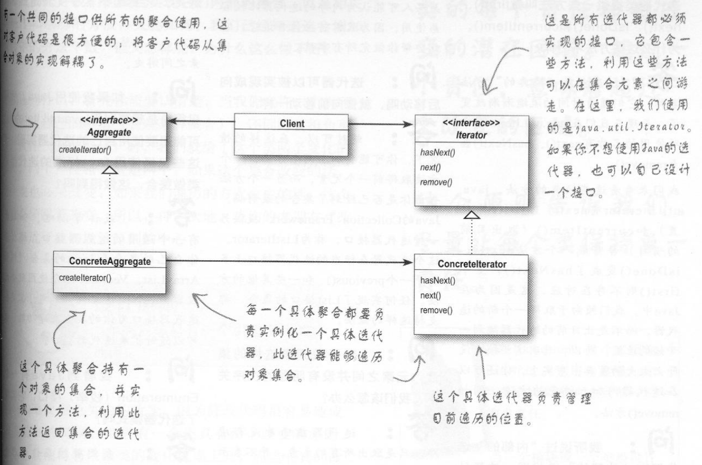

[TOC]

# 状态模式

## 和策略模式的区别

- 策略模式：围绕可以互换的算法来创建成功业务
- 状态模式：通过改变对象内部的状态来帮助对象控制自己的行为

## 定义

**状态模式** 允许对象在内部状态改变时改变它的行为，对象看起来好像修改了它的类。

- 状态模式将状态封装成为独立的类，并将动作委托到代表当前状态的对象
- 行为会随着内部状态而改变
- 以状态模式而言，我们将一群行为封装在状态对象中

