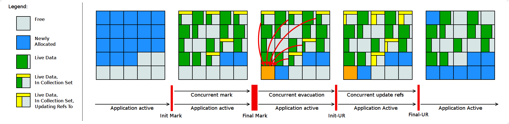

# Description

Shenandoah是低暂停时间的垃圾回收器。Shenandoah通过与正在运行的Java程序协同工作，来减少GC的暂停时间。Shenandoah可以同时进行大量的GC工作，包括并发压缩，这意味着其暂停时间不再与堆大小成正比。

# Overview

Shenandoah是区域回收器，它将堆作为区域的集合进行维护，常规的回收周期如下图所示。



**GC LOG**

```shell
GC(3) Pause Init Mark 0.771ms
GC(3) Concurrent marking 76480M->77212M(102400M) 633.213ms
GC(3) Pause Final Mark 1.821ms
GC(3) Concurrent cleanup 77224M->66592M(102400M) 3.112ms
GC(3) Concurrent evacuation 66592M->75640M(102400M) 405.312ms
GC(3) Pause Init Update Refs 0.084ms
GC(3) Concurrent update references  75700M->76424M(102400M) 354.341ms
GC(3) Pause Final Update Refs 0.409ms
GC(3) Concurrent cleanup 76244M->56620M(102400M) 12.242ms
```

**Period**

**初始化标记阶段**初始化并行标记。为并发标记准备堆空间和应用程序线程，然后扫描根集合。这是回收周期的第一次停顿，最主要的消耗是根集扫描，因此它的耗时主要取决于根集合的大小。

**并行标记阶段**遍历堆，并跟踪可达到的对象。该阶段与应用程序同时运行，其持续时间取决于存活对象的数量以及堆中对象图的结构。在此期间，应用程序可以自由分配内存，所以堆占用率会上升。

**最终标记阶段** 通过清空所有挂起的标记/更新队列来结束并行标记，并重新扫描根集合。该阶段也会通过计算将要被拷贝的区域来初始化目标内存区域，预先分配一些根集合，通常也会为下阶段的运行做准备。该任务的一部分会在**并发预阶段**完成。这是回收周期的第二次停顿，主要耗时是清空队列和扫描根集。

**并行清理阶段** 会回收即时垃圾区域（并发标记之后检测到的不存在活动对象的区域）。

**并发疏散阶段** 将对象从集合集中复制到其他区域，这是和其他垃圾回收器的主要不同。这个阶段同样是和应用程序并行运行，因此应用程序可以自有分配。它的持续时间取决于为该周期选择的收集集合的大小。

**初始化更新引用阶段** 除了确保所有GC和应用程序线程均已完成疏散，为下一阶段GC做准备外，它几乎不执行任何操作。这是回收周期中的第三次暂停，是所有暂停中最短的一次。

**并发更新引用阶段** 遍历堆，并将引用更新为在并发疏散阶段移动的对象，这也是和其他垃圾回收器的主要区别之一。它的持续时间取决于堆中对象的数量，而不取决于对象图结构，因为是线性扫描。此阶段与应用程序同时执行。

**最终更新引用阶段** 通过重新更新现有的根集来结束更新引用阶段。同时也会从集合中回收区域，因为现在堆没有对他们的引用。这是在回收周期中最后的停顿，耗时取决于根集合大小。

**并行清理阶段** 回收现在没有引用的集合区域。

# Reference

- [Shenandoah GC](https://wiki.openjdk.java.net/display/shenandoah/Main)