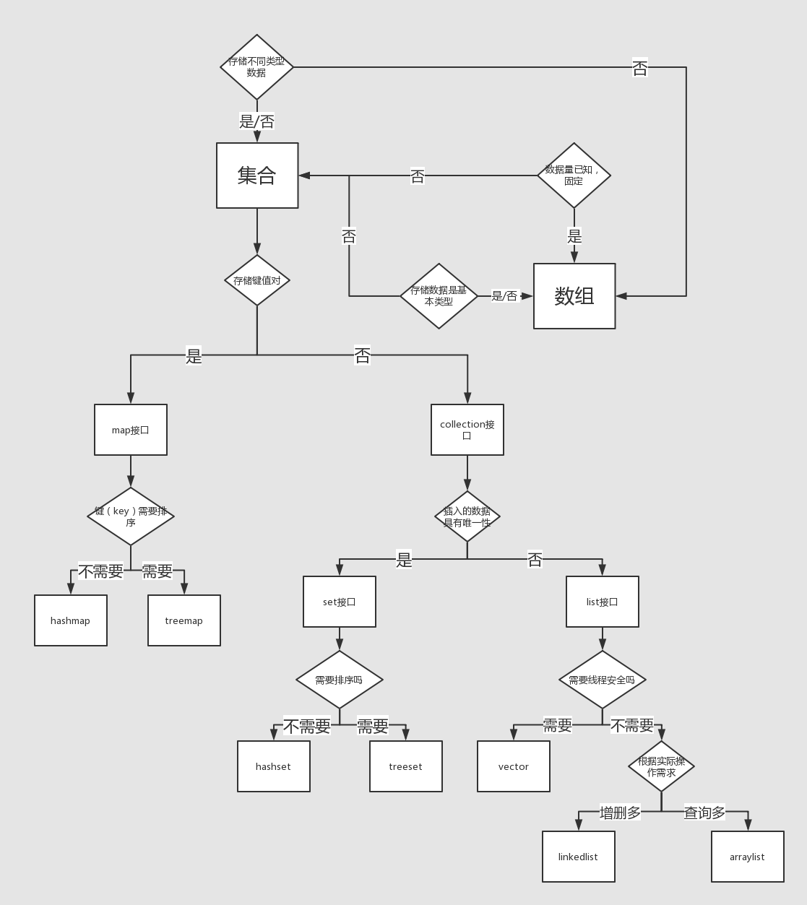

# static

“static”关键字表明一个成员变量或者是成员方法可以在没有所属的类的实例变量的情况下被访问。

Java中static方法不能被覆盖，因为方法覆盖是基于运行时动态绑定的，而static方法是编译时静态绑定的。static方法跟类的任何实例都不相关，所以概念上不适用。

java中也不可以覆盖private的方法，因为private修饰的变量和方法只能在当前类中使用，如果是其他的类继承当前类是不能访问到private变量或方法的，当然也不能覆盖。

**Staic属性**

```java
class A {
    public A (String text) {
        System.out.println(text);
    }
}

class B {
    static A a1 = new A("a1");
    A a2 = new A("a2");
    
    public B () {
        a2 = new A("a4");
    }
}

public class StaticS {
    public static void main(String args[]) {
        B b = new B();
    }
}
```

```shell
bovenson@MBP:~/Git/notes/Java/JavaCode/PureJava/Job$ javac StaticS.java 
bovenson@MBP:~/Git/notes/Java/JavaCode/PureJava/Job$ java StaticS
a1
a2
a4
```

- `Java`中，不允许`static`修饰构造函数
- 构造函数，先初始化静态成员，再初始化非静态成员

# 单例Singleton

**只适用于单线程**

```java
public class Singleton {
    private Singleton () {}
    private static Singleton instance = null;
    public static Singleton getInstance() {
        if (instance == null) {
            instance = new Singleton();
        }
        return instance;
    }
}
```

**效率不高的线程安全做法**

```java
public class SingletonB {
    private SingletonB () {}
    private static SingletonB instance = null;
    public static SingletonB getInstance() {
        synchronized(instance) {
            if (instance == null) {
                instance = new SingletonB();
            }
        }
        return instance;
    }
}
```

- 每次获取`instance`实例时，都试图加同步锁，这是一个非常耗时的操作

**加锁前后两次判断**

```java
public class SingletonC {
    private SingletonC () {}
    private static SingletonC instance = null;
    public static SingletonC getInstance() {
        if (instance == null) {
            synchronized(instance) {
                if (instance == null) {
                    instance = new SingletonC();
                }
            }
        }
        return instance;
    }
}
```

**使用静态属性**

```java
public class SingletonD {
    private SingletonD () {}
    private static SingletonD instance = new SingletonD();
    public static SingletonD getInstance() {
        return instance;
    }
}
```

- 问题是不能按需实例化变量

# Java中的同步原语机制

Java的同步原语为java.lang.Object类的几个方法：

- wait() 等待通知，该调用会阻塞当前线程。
- notify() 发出通知，如果有多个线程阻塞在该obj上，该调用会唤醒一个（阻塞）等待该obj的线程。
- notifyAll()发出通知，如果有多个线程阻塞在该obj上，该调用会唤醒所有（阻塞）等待该obj的线程。

**参考**

- [参考一](https://blog.csdn.net/xusiwei1236/article/details/40710687)

# 结合类

## Map

**HashMap**

- 允许一条记录的键是null
- 允许多条记录的值为 Null
- 不支持线程的同步
  - 可以用 Collections的synchronizedMap方法使HashMap具有同步的能力
  - 或者使用ConcurrentHashMap代替
- HashMap提供了可供应用迭代的键的集合，因此，HashMap是快速失败的

**HashTable**

- 它不允许记录的键或者值为空
- 它支持线程的同步
  - 导致了 Hashtable在写入时会比较慢
- Hashtable提供了对键的列举(Enumeration)。 一般认为Hashtable是一个遗留的类

**LinkedHashMap**

- 保存了记录的插入顺序
- 用Iterator遍历LinkedHashMap时，先得到的记录肯定是先插入的
- 遍历的时候会比HashMap慢
  - 当HashMap容量很大，实际数据较少时，遍历起来可能会比LinkedHashMap慢。因为LinkedHashMap的遍历速度只和实际数据有关，和容量无关，而HashMap的遍历速度和他的容量有关。

**TreeMap**

- TreeMap实现SortMap接口，能够把它保存的记录根据键排序
- 默认是按键值的升序排序，也可以指定排序的比较器，当用Iterator 遍历TreeMap时，得到的记录是排过序的

**使用**

- 一般情况下，我们用的最多的是HashMap。HashMap里面存入的键值对在取出的时候是随机的，它根据键的HashCode值存储数据，根据键可以直接获取它的值，具有很快的访问速度。在Map 中**插入、删除和定位元素**，HashMap 是最好的选择。
- TreeMap取出来的是排序后的键值对。但如果您要**按自然顺序或自定义顺序遍历键**，那么TreeMap会更好。
- LinkedHashMap 是HashMap的一个子类，如果需要**输出的顺序和输入的相同**,那么用LinkedHashMap可以实现,它还可以按读取顺序来排列，像连接池中可以应用。

**其他**

- HashSet是通过HashMap实现的,TreeSet是通过TreeMap实现的,只不过Set用的只是Map的key
- Map的key和Set都有一个共同的特性就是集合的唯一性.TreeMap更是多了一个排序的功能.
- hashCode和equal()是HashMap用的, 因为无需排序所以只需要关注定位和唯一性即可.
  - hashCode是用来计算hash值的,hash值是用来确定hash表索引的.
  - hash表中的一个索引处存放的是一张链表, 所以还要通过equal方法循环比较链上的每一个对象才可以真正定位到键值对应的Entry.
  - put时,如果hash表中没定位到,就在链表前加一个Entry,如果定位到了,则更换Entry中的value,并返回旧value

-  由于TreeMap需要排序,所以需要一个Comparator为键值进行大小比较.当然也是用Comparator定位的.
   -  Comparator可以在创建TreeMap时指定
   -  如果创建时没有确定,那么就会使用key.compareTo()方法,这就要求key必须实现Comparable接口.
   -  TreeMap是使用Tree数据结构实现的,所以使用compare接口就可以完成定位了.

**注意**

- Collection没有get()方法来取得某个元素。只能通过iterator()遍历元素。 
- Set和Collection拥有一模一样的接口。 
- List，可以通过get()方法来一次取出一个元素。使用数字来选择一堆对象中的一个，get(0)...。(add/get) 
- 一般使用ArrayList。用LinkedList构造堆栈stack、队列queue。 
- Map用 put(k,v) / get(k)，还可以使用containsKey()/containsValue()来检查其中是否含有某个key/value。 
- HashMap会利用对象的hashCode来快速找到key。哈希码就是将对象的信息经过一些转变形成一个独一无二的int值，这个值存储在一个array中。我们都知道所有存储结构中，array查找速度是最快的。所以，可以加速查找。 发生碰撞时，让array指向多个values。即，数组每个位置上又生成一个梿表。 
- Map中元素，可以将key序列、value序列单独抽取出来。 
- 使用keySet()抽取key序列，将map中的所有keys生成一个Set。 
- 使用values()抽取value序列，将map中的所有values生成一个Collection。 
- 为什么一个生成Set，一个生成Collection？那是因为，key总是独一无二的，value允许重复。

**参考**

- [参考一](https://www.cnblogs.com/acm-bingzi/p/javaMap.html)
- [参考二](https://www.nowcoder.com/ta/review-java/review?page=25)

## Array

**Array**

- 可以包含基本类型和对象类型
- Array大小是固定的

**ArrayList**

- 只能包含对象类型
- 大小是动态变化的
- 提供了更多的方法和特性，比如：addAll()，removeAll()，iterator()等等
- 基于索引的数据接口，它的底层是数组，可以以O(1)时间复杂度对元素进行随机访问

**LinkedList**

- 以元素列表的形式存储它的数据
- 查找某个元素的时间复杂度是O(n)
- 插入，添加，删除操作速度更快
- LinkedList比ArrayList更占内存，因为LinkedList为每一个节点存储了两个引用，一个指向前一个元素，一个指向下一个元素

**pass**

- ArrayList和LinkedList都实现了List接口

## 最佳实践

- 固定那就选不拓展，插入频繁就链表，查询频繁就数组

- 根据应用的需要正确选择要使用的集合的类型对性能非常重要，比如：假如元素的数量是固定的，而且能事先知道，我们就应该用Array而不是ArrayList。
- 有些集合类允许指定初始容量。因此，如果我们能估计出存储的元素的数目，我们可以设置初始容量来避免重新计算hash值或者是扩容。
- 为了类型安全，可读性和健壮性的原因总是要使用泛型。同时，使用泛型还可以避免运行时的ClassCastException。
- 使用JDK提供的不变类(immutable class)作为Map的键可以避免为我们自己的类实现hashCode()和equals()方法。
- 编程的时候接口优于实现。
- 底层的集合实际上是空的情况下，返回长度是0的集合或者是数组，不要返回null。
- 

## Set

**HashSet**

- 由一个hash表来实现的，因此，它的元素是无序的
- add()，remove()，contains()方法的时间复杂度是O(1)
- 放到HashSet中的元素要保证唯一，应该重写hashCode方法和equals方法，但是不能保证元素有序
  底层实现是哈希结构

**TreeSet**

- 底层实现是红黑树(自平衡二叉树)，不但能保证元素唯一，还能元素保证有序
- 存放到TreeSet中的元素应该实现Comparable接口，重写compareTo方法，否则会抛出ClassCastException
  按照该方法指定的规则维持元素的顺序
- add()，remove()，contains()方法的时间复杂度是O(logn)
- 顺序性有两种方法实现
  - 类实现Comparable接口
  - 构造比较器，将比较器对象作为TreeSet的构造函数的参数传入
- 顺序性和不可重复性都是在compareTo()方法中实现的

**LinkedHashSet**

- 底层实现是哈希表和链表
- 保持了HashSet的速度，还能按照插入元素的顺序维持元素顺序

# Compare

**Comparable**

`Java`提供了只包含一个`compareTo()`方法的`Comparable`接口。这个方法可以个给两个对象排序

返回值：

- 负数：小于
- 0：等于
- 正数：大于

`Java`提供了包含`compare()`和`equals()`两个方法的`Comparator`接口

- `compare()`：方法用来给两个输入参数排序
  - 负数：小于
  - 0：等于
  - 正数：大于
- `equals()`：需要一个对象作为参数，它用来决定输入参数是否和comparator相等。只有当输入参数也是一个comparator并且输入参数和当前comparator的排序结果是相同的时候，这个方法才返回true。

# 优先级队列

- 基于优先级堆的无界队列
- 元素是按照自然顺序(natural order)排序的
- 创建的时候，我们可以给它提供一个负责给元素排序的比较器
- PriorityQueue不允许null值，因为他们没有自然顺序，或者说他们没有任何的相关联的比较器
- PriorityQueue不是线程安全的，入队和出队的时间复杂度是O(log(n))

# 垃圾回收

**gc()**

- `System.gc()`
- `Runtime.gc()`

`java.lang.System.gc()`只是`java.lang.Runtime.getRuntime().gc()`的简写，两者的行为没有任何不同。

这两个方法用来提示JVM要进行垃圾回收，但是，立即开始还是延迟进行垃圾回收是取决于JVM的。

**finalize()**

- 垃圾回收器(garbage collector)决定回收某对象时，就会运行该对象的finalize()方法
- 但是在Java中很不幸，如果内存总是充足的，那么垃圾回收可能永远不会进行，也就是说filalize()可能永远不被执行，显然指望它做收尾工作是靠不住的。 那么finalize()究竟是做什么的呢？
  - 它最主要的用途是**回收特殊渠道申请的内存**。Java程序有垃圾回收器，所以一般情况下内存问题不用程序员操心。但有一种JNI(Java Native Interface)调用non-Java程序（C或C++），finalize()的工作就是回收这部分的内存。

**分布式垃圾回收**

DGC叫做分布式垃圾回收。RMI使用DGC来做自动垃圾回收。因为RMI包含了跨虚拟机的远程对象的引用，垃圾回收是很困难的。DGC使用引用计数算法来给远程对象提供自动内存管理。

**pass**

- 如果对象的引用被置为null，垃圾收集器不会立即释放对象占用的内存，在下一个垃圾回收周期中，这个对象将是可被回收的。

# JVM

Java虚拟机是一个可以执行Java字节码的虚拟机进程。Java源文件被编译成能被Java虚拟机执行的字节码文件。 Java被设计成允许应用程序可以运行在任意的平台，而不需要程序员为每一个平台单独重写或者是重新编译。Java虚拟机让这个变为可能，因为它知道底层硬件平台的指令长度和其他特性。

## 数据存储

### 堆

JVM的堆是**运行时数据区**，所有类的实例和数组都是在堆上分配内存。它在JVM启动的时候被创建。对象所占的堆内存是由自动内存管理系统也就是垃圾收集器回收。

堆内存是由存活和死亡的对象组成的。存活的对象是应用可以访问的，不会被垃圾回收。死亡的对象是应用不可访问尚且还没有被垃圾收集器回收掉的对象。一直到垃圾收集器把这些对象回收掉之前，他们会一直占据堆内存空间。

**代**

共划分为三个代：年轻代（Young Generation）、年老代（Old     Generation）和持久代（Permanent Generation）。其中持久代主要存放的是Java类的类信息，与垃圾收集要收集的Java对象关系不大。年轻代和年老代的划分是对垃圾收集影响比较大的。

**年轻代**

主要是用来存放新生的对象。

所有新生成的对象首先都是放在年轻代的。年轻代的目标就是尽可能快速的收集掉那些生命周期短的对象。年轻代分三个区。一个Eden区，两个 Survivor区(一般而言)。大部分对象在Eden区中生成。当Eden区满时，还存活的对象将被复制到Survivor区（两个中的一个），当这个 Survivor区满时，此区的存活对象将被复制到另外一个Survivor区，当这个Survivor去也满了的时候，从第一个Survivor区复制过来的并且此时还存活的对象，将被复制“年老区(Tenured)”。需要注意，Survivor的两个区是对称的，没先后关系，所以同一个区中可能同时存在从Eden复制过来对象，和从前一个Survivor复制过来的对象，而复制到年老区的只有从第一个Survivor去过来的对象。而且，Survivor区总有一个是空的。同时，根据程序需要，Survivor区是可以配置为多个的（多于两个），这样可以增加对象在年轻代中的存在时间，减少被放到年老代的可能。

**年老代**

主要存放应用程序中生命周期长的内存对象。

在年轻代中经历了N次垃圾回收后仍然存活的对象，就会被放到年老代中。因此，可以认为年老代中存放的都是一些生命周期较长的对象。

**永久代**

是指内存的永久保存区域，主要存放Class和Meta的信息,Class在被 Load的时候被放入PermGen space区域. 它和和存放Instance的Heap区域不同,GC(Garbage Collection)不会在主程序运行期对PermGen space进行清理，所以如果你的APP会LOAD很多CLASS的话,就很可能出现PermGen space错误。

**垃圾回收**不会发生在永久代，如果永久代满了或者是超过了临界值，会触发完全垃圾回收(Full GC)。如果你仔细查看垃圾收集器的输出信息，就会发现永久代也是被回收的。这就是为什么正确的永久代大小对避免Full GC是非常重要的原因。

Java8中已经移除了永久代，新加了一个叫做元数据区的native内存区

永久代是用于存放静态文件，如Java类、方法等。持久代对垃圾回收没有显著影响，但是有些应用可能动态生成或者调用一些class，例如Hibernate 等，在这种时候需要设置一个比较大的持久代空间来存放这些运行过程中新增的类，持久代大小通过`-XX:MaxPermSize=<N>`进行设置。，永久代中一般包含：

- 类的方法(字节码...)
- 类名(Sring对象)
- .class文件读到的常量信息
- class对象相关的对象列表和类型列表 (e.g., 方法对象的array).
- JVM创建的内部对象
- JIT编译器优化用的信息

# 异常

Java中有两种异常：受检查的(checked)异常和不受检查的(unchecked)异常。

`Throwable`包含了

- 错误`(Error)`
- 异常`(Excetion)`两类

Exception和Error都是Throwable的子类。Exception用于用户程序可以捕获的异常情况。Error定义了不期望被用户程序捕获的异常。

**Exception**

一般分为Checked异常和Runtime异常，所有RuntimeException类及其子类的实例被称为Runtime异常，不属于该范畴的异常则被称为CheckedException。

`Exception`又包含了：

- 运行时异常(RuntimeException, 又叫非检查异常)
  - 不受检查的异常不需要在方法或者是构造函数上声明，就算方法或者是构造函数的执行可能会抛出这样的异常，并且不受检查的异常可以传播到方法或者是构造函数的外面。
- 非运行时异常(又叫检查异常)
  - 受检查的异常必须要用throws语句在方法或者是构造函数上声明。

**Error**

Error是throwable的子类，代表编译时间和系统错误，用于指示合理的应用程序不应该试图捕获的严重问题。Error由Java虚拟机生成并抛出，包括动态链接失败，虚拟机错误等。程序对其不做处理。

Error是程序无法处理了, 如果OutOfMemoryError、OutOfMemoryError等等, 这些异常发生时, java虚拟机一般会终止线程。

运行时异常都是RuntimeException类及其子类,如 NullPointerException、IndexOutOfBoundsException等, 这些异常是不检查的异常, 是在程序运行的时候可能会发生的, 所以程序可以捕捉, 也可以不捕捉. 这些错误一般是由程序的逻辑错误引起的, 程序应该从逻辑角度去尽量避免。

检查异常是运行时异常以外的异常, 也是Exception及其子类, 这些异常从程序的角度来说是必须经过捕捉检查处理的, 否则不能通过编译. 如IOException、SQLException等

**pass**

- throw和throws
  - throw关键字用来在程序中明确的抛出异常，相反，throws语句用来表明方法不能处理的异常。每一个方法都必须要指定哪些异常不能处理，所以方法的调用者才能够确保处理可能发生的异常，多个异常是用逗号分隔的。
- Exception异常被处理后，该对象不再被引用，gc将其标记，在下一个回收过程中被回收。

# Swing

**线程安全的方法**

- `repaint()`
- `revalidate()`
- `invalidate()`

# JDBC

JDBC（Java DataBase   Connectivity）,是一套面向对象的应用程序接口（API），制定了统一的访问各类关系数据库的标准接口，为各个数据库厂商提供了标准的实现。通过JDBC技术，开发人员可以用纯Java语言和标准的SQL语句编写完整的数据库应用程序，并且真正地实现了软件的跨平台性。 

**通常情况下使用JDBC完成以下操作：** 

- 同数据库建立连接
- 向数据库发送SQL语句
- 处理从数据库返回的结果

**JDBC具有下列优点：** 

- JDBC与ODBC(Open Database Connectivity，即开放数据库互连）十分相似，便于软件开发人员理解
- JDBC使软件开发人员从复杂的驱动程序编写工作中解脱出来，可以完全专注于业务逻辑开发
- JDBC支持多种关系型数据库，大大增加了软件的可移植性
- JDBC API是面向对象的，软件开发人员可以将常用的方法进行二次封装，从而提高代码的重用性

JDBC驱动提供了特定厂商对JDBC API接口类的实现，驱动必须要提供java.sql包下面这些类的实现：Connection, Statement, PreparedStatement,CallableStatement, ResultSet和Driver。

## CallableStatement

- CallableStatement用来执行存储过程。存储过程是由数据库存储和提供的。
- 存储过程可以接受输入参数，也可以有返回结果。非常鼓励使用存储过程，因为它提供了安全性和模块化。
- 准备一个CallableStatement的方法是： CallableStatement Connection.prepareCall();

## PreparedStatements

- 预编译
- 可以重用

## 数据库连接池

像打开关闭数据库连接这种和数据库的交互可能是很费时的，尤其是当客户端数量增加的时候，会消耗大量的资源，成本是非常高的。可以在应用服务器启动的时候建立很多个数据库连接并维护在一个池中。连接请求由池中的连接提供。在连接使用完毕以后，把连接归还到池中，以用于满足将来更多的请求。

## pass

- PreparedStatement比Statement
  - PreparedStatements是预编译的，因此，性能会更好。同时，不同的查询参数值，PreparedStatement可以重用。

# 类加载

## Class.forName()

初始化参数指定的类，并且返回此类对应的Class 对象。

在初始化一个类，生成一个实例的时候，newInstance()方法和new关键字除了一个是方法，一个是关键字外，它们的区别在于创建对象的方式不一样，前者是使用类加载机制，后者是创建一个新类。 从JVM的角度看，我们使用关键字new创建一个类的时候，这个类可以没有被加载。但是使用newInstance()方法的时候，就必须保证：

 - 这个类已经加载
 - 这个类已经连接了

而完成上面两个步骤的正是Class的静态方法forName()所完成的，这个静态方法调用了启动类加载器，即加载 java API的那个加载器。

# RMI

Java远程方法调用(Java RMI)是Java API对远程过程调用(RPC)提供的面向对象的等价形式，支持直接传输序列化的Java对象和分布式垃圾回收。远程方法调用可以看做是激活远程正在运行的对象上的方法的步骤。RMI对调用者是位置透明的，因为调用者感觉方法是执行在本地运行的对象上的。看下RMI的一些注意事项。

Java RMI（Remote Method Invocation）--Java的远程方法调用是Java所特有的分布式计算技术，它允许运行在一个Java虚拟机上的对象调用运行在另一个Java虚拟机上的对象的方法，从而使Java编程人员可以方便地在网络环境中作分布式计算。

面向对象设计要求每个任务由最适合该任务的对象执行，RMI将这个概念更深入了一步，使任务可以在最适合该任务的机器上完成。 RMI定义了一组远程接口，可以用于生成远程对象。客户机可以象调用本地对象的方法一样用相同的语法调用远程对象。RMI API提供的类和方法可以处理所有访问远程方法的基础通信和参数引用要求的串行化。   

使用RMI开发步骤：

- 定义一个远程接口（远程接口必须继承接口，每个方法必须抛出远程异常，方法参数和方法返回值都必须是可序列化的）
- 实现远程接口 
- 定义使用远程对象的客户程序  
- 产生远程访问对象的桩和框 
- 注册远程对象 
- 运行服务器和客户程序

为了让RMI程序能正确运行必须要包含以下几个步骤： 

- 编译所有的源文件
- 使用rmic生成stub
- 启动rmiregistry
- 启动RMI服务器
- 运行客户端程序

**基本原则**

RMI体系结构是基于一个非常重要的行为定义和行为实现相分离的原则。RMI允许定义行为的代码和实现行为的代码相分离，并且运行在不同的JVM上。

**体系结构**

RMI体系结构分以下几层：

- 存根和骨架层(Stub and Skeleton layer)：这一层对程序员是透明的，它主要负责拦截客户端发出的方法调用请求，然后把请求重定向给远程的RMI服务。 
- 远程引用层(Remote Reference Layer)：RMI体系结构的第二层用来解析客户端对服务端远程对象的引用。这一层解析并管理客户端对服务端远程对象的引用。连接是点到点的。 
- 传输层(Transport layer)：这一层负责连接参与服务的两个JVM。这一层是建立在网络上机器间的TCP/IP连接之上的。它提供了基本的连接服务，还有一些防火墙穿透策略。

**扮演的角色**

远程接口用来标识哪些方法是可以被非本地虚拟机调用的接口。远程对象必须要直接或者是间接实现远程接口。实现了远程接口的类应该声明被实现的远程接口，给每一个远程对象定义构造函数，给所有远程接口的方法提供实现。

**java.rmi.Naming**

java.rmi.Naming类用来存储和获取在远程对象注册表里面的远程对象的引用。Naming类的每一个方法接收一个URL格式的String对象作为它的参数。

**绑定(Binding)**

绑定是为了查询找远程对象而给远程对象关联或者是注册以后会用到的名称的过程。远程对象可以使用Naming类的bind()或者rebind()方法跟名称相关联。

bind()方法负责把指定名称绑定给远程对象，rebind()方法负责把指定名称重新绑定到一个新的远程对象。如果那个名称已经绑定过了，先前的绑定会被替换掉。

**stub**

远程对象的stub扮演了远程对象的代表或者代理的角色。调用者在本地stub上调用方法，它负责在远程对象上执行方法。当stub的方法被调用的时候，会经历以下几个步骤： 

- 初始化到包含了远程对象的JVM的连接
- 序列化参数到远程的JVM
- 等待方法调用和执行的结果
- 反序列化返回的值或者是方法没有执行成功情况下的异常
- 把值返回给调用者

**安全管理器(RMISecurityManager)**

RMISecurityManager使用下载好的代码提供可被RMI应用程序使用的安全管理器。如果没有设置安全管理器，RMI的类加载器就不会从远程下载任何的类。

**Marshalling和demarshalling**

当应用程序希望把内存对象跨网络传递到另一台主机或者是持久化到存储的时候，就必须要把对象在内存里面的表示转化成合适的格式。这个过程就叫做Marshalling，反之就是demarshalling。

# 序列化

**Serialization和Deserialization**

Java提供了一种叫做对象序列化的机制，他把对象表示成一连串的字节，里面包含了对象的数据，对象的类型信息，对象内部的数据的类型信息等等。因此，序列化可以看成是为了把对象存储在磁盘上或者是从磁盘上读出来并重建对象而把对象扁平化的一种方式。反序列化是把对象从扁平状态转化成活动对象的相反的步骤。

# HTTP

## 响应的结构

HTTP响应由三个部分组成： 

- 状态码(Status Code)：描述了响应的状态。可以用来检查是否成功的完成了请求。请求失败的情况下，状态码可用来找出失败的原因。如果Servlet没有返回状态码，默认会返回成功的状态码HttpServletResponse.SC_OK。 
- HTTP头部(HTTP Header)：它们包含了更多关于响应的信息。比如：头部可以指定认为响应过期的过期日期，或者是指定用来给用户安全的传输实体内容的编码格式。如何在Serlet中检索HTTP的头部看这里。 
- 主体(Body)：它包含了响应的内容。它可以包含HTML代码，图片，等等。主体是由传输在HTTP消息中紧跟在头部后面的数据字节组成的。

## session和cookie

cookie是Web服务器发送给浏览器的一块信息。浏览器会在本地文件中给每一个Web服务器存储cookie。以后浏览器在给特定的Web服务器发请求的时候，同时会发送所有为该服务器存储的cookie。下面列出了session和cookie的区别： 无论客户端浏览器做怎么样的设置，session都应该能正常工作。客户端可以选择禁用cookie，但是，session仍然是能够工作的，因为客户端无法禁用服务端的session。 在存储的数据量方面session和cookies也是不一样的。session能够存储任意的Java对象，cookie只能存储String类型的对象。

## HTTP隧道

HTTP隧道是一种利用HTTP或者是HTTPS把多种网络协议封装起来进行通信的技术。因此，HTTP协议扮演了一个打通用于通信的网络协议的管道的包装器的角色。把其他协议的请求掩盖成HTTP的请求就是HTTP隧道。

## URL编码解码

URL编码是负责把URL里面的空格和其他的特殊字符替换成对应的十六进制表示，反之就是解码。

# 面向对象

## 优点

代码开发模块化，更易维护和修改。 代码复用。 增强代码的可靠性和灵活性。 增加代码的可理解性。 面向对象编程有很多重要的特性，比如：封装，继承，多态和抽象。

## 封装

封装给对象提供了隐藏内部特性和行为的能力。对象提供一些能被其他对象访问的方法来改变它内部的数据。在Java当中，有3种修饰符：public，private和protected。每一种修饰符给其他的位于同一个包或者不同包下面对象赋予了不同的访问权限。

下面列出了使用封装的一些好处：

通过隐藏对象的属性来保护对象内部的状态。

提高了代码的可用性和可维护性，因为对象的行为可以被单独的改变或者是扩展。

禁止对象之间的不良交互提高模块化。

参考这个文档获取更多关于封装的细节和示例。

或：

一是用private把类的细节与外界隔离起来，从而实现数据项和方法的隐藏，而要访问这些数据项和方法唯一的途径就是通过类本身，类才有资格调用它所拥有的资源（方法，数据项属性等等）。所以第一个好处就是数据的安全性提高了。

二是通过隐藏隔离，只允许外部对类做有限的访问，开发者可以自由的改变类的内部实现，而无需修改使用该类的那些程序。只要那些在类外部就能被调用的方法保持其外部特征不变，内部代码就可以自由改变，各取所需，利于分工。

三就是提高了代码的重用性，封装成工具类以后能够减少很多繁琐的步骤。

## 多态

多态是编程语言给不同的底层数据类型做相同的接口展示的一种能力。一个多态类型上的操作可以应用到其他类型的值上面。

## 继承

继承给对象提供了从基类获取字段和方法的能力。继承提供了代码的重用性，也可以在不修改类的情况下给现存的类添加新特性。

## 抽象

抽象是把想法从具体的实例中分离出来的步骤，因此，要根据他们的功能而不是实现细节来创建类。Java支持创建只暴漏接口而不包含方法实现的抽象的类。这种抽象技术的主要目的是把类的行为和实现细节分离开。 抽象和封装是互补的概念。一方面，抽象关注对象的行为。另一方面，封装关注对象行为的细节。一般是通过隐藏对象内部状态信息做到封装，因此，封装可以看成是用来提供抽象的一种策略。