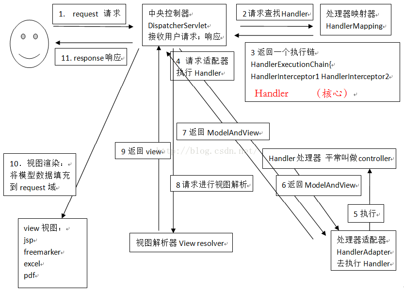

# MVC

## 简介

[MVC](https://baike.baidu.com/item/MVC)全名是Model View Controller，是模型(model)－视图(view)－控制器(controller)的缩写，一种**软件设计典范**，用一种业**务逻辑、数据、界面显示**分离的方法组织代码，将业务逻辑聚集到一个部件里面，在改进和个性化定制界面及用户交互的同时，不需要重新编写业务逻辑。MVC被独特的发展起来用于映射传统的输入、处理和输出功能在一个逻辑的图形化用户界面的结构中。

## 内容

### **Model**

Model（模型）是应用程序中用于处理应用程序数据逻辑的部分。通常模型对象负责在数据库中存取数据。

模型表示企业数据和业务规则。在MVC的三个部件中，模型拥有最多的处理任务。例如它可能用像[EJB](https://baike.baidu.com/item/EJB)s和ColdFusion Components这样的构件对象来处理数据库，被模型返回的数据是中立的，就是说模型与数据格式无关，这样一个模型能为多个视图提供数据，由于应用于模型的代码只需写一次就可以被多个视图重用，所以减少了代码的重复性。

### **View**

View（视图）是应用程序中处理数据显示的部分。通常视图是依据模型数据创建的。

视图是用户看到并与之交互的界面。在视图中其实没有真正的处理发生，不管这些数据是联机存储的还是一个雇员列表，作为视图来讲，它只是作为一种输出数据并允许用户操纵的方式。

### **Controller**

Controller（控制器）是应用程序中处理用户交互的部分。通常控制器负责从视图读取数据，控制用户输入，并向模型发送数据。

控制器接受用户的输入并调用模型和视图去完成用户的需求，所以当单击Web页面中的超链接和发送[HTML表单](https://baike.baidu.com/item/HTML%E8%A1%A8%E5%8D%95)时，控制器本身不输出任何东西和做任何处理。它只是接收请求并决定调用哪个模型构件去处理请求，然后再确定用哪个视图来显示返回的数据

## 优点

- **低耦合性**

  视图层和业务层分离，这样就允许更改视图层代码而不用重新编译模型和控制器代码，同样，一个应用的业务流程或者业务规则的改变只需要改动MVC的模型层即可。因为模型与控制器和视图相分离，所以很容易改变应用程序的数据层和业务规则。

  模型是自包含的，并且与控制器和视图相分离，所以很容易改变应用程序的数据层和业务规则。如果把数据库从MySQL移植到[Oracle](https://baike.baidu.com/item/Oracle)，或者改变基于RDBMS数据源到[LDAP](https://baike.baidu.com/item/LDAP)，只需改变模型即可。一旦正确的实现了模型，不管数据来自数据库或是LDAP服务器，视图将会正确的显示它们。由于运用MVC的应用程序的三个部件是相互独立，改变其中一个不会影响其它两个，所以依据这种设计思想能构造良好的[松耦合](https://baike.baidu.com/item/%E6%9D%BE%E8%80%A6%E5%90%88)的构件。

- **重用性高**

  随着技术的不断进步，需要用越来越多的方式来访问应用程序。[MVC模式](https://baike.baidu.com/item/MVC%E6%A8%A1%E5%BC%8F)允许使用各种不同样式的视图来访问同一个服务器端的代码，因为多个视图能共享一个模型，它包括任何WEB（HTTP）浏览器或者无线浏览器（wap），比如，用户可以通过电脑也可通过手机来订购某样产品，虽然订购的方式不一样，但处理订购产品的方式是一样的。由于模型返回的数据没有进行格式化，所以同样的构件能被不同的界面使用。例如，很多数据可能用HTML来表示，但是也有可能用WAP来表示，而这些表示所需要的命令是改变视图层的实现方式，而控制层和模型层无需做任何改变。由于已经将数据和业务规则从表示层分开，所以可以最大化的重用代码了。模型也有状态管理和数据持久性处理的功能，例如，基于会话的购物车和电子商务过程也能被Flash网站或者无线联网的应用程序所重用。

- [**生命周期**](https://baike.baidu.com/item/%E7%94%9F%E5%91%BD%E5%91%A8%E6%9C%9F)**成本低**

  MVC使开发和维护用户[接口](https://baike.baidu.com/item/%E6%8E%A5%E5%8F%A3)的技术含量降低。

- **部署快**

  使用MVC模式使开发时间得到相当大的缩减，它使程序员（Java开发人员）集中精力于业务逻辑，界面程序员（HTML和JSP开发人员）集中精力于表现形式上。

- **可维护性高**

  分离视图层和业务逻辑层也使得WEB应用更易于维护和修改。

- **有利软件工程化管理**

  由于不同的层各司其职，每一层不同的应用具有某些相同的特征，有利于通过工程化、工具化管理程序代码。控制器也提供了一个好处，就是可以使用控制器来联接不同的模型和视图去完成用户的需求，这样控制器可以为构造应用程序提供强有力的手段。给定一些可重用的模型和视图，控制器可以根据用户的需求选择模型进行处理，然后选择视图将处理结果显示给用户。

## SpringMVC中的MVC

### SpringMVC处理请求流程

**分步描述**

- 用户发送请求到前端控制器（DispatcherServlet）。
- 前端控制器请求 HandlerMapping 查找 Handler，可以根据 xml 配置、注解进行查找。
- 处理器映射器 HandlerMapping 向前端控制器返回 Handler。
- 前端控制器调用处理器适配器去执行 Handler。
- 处理器适配器执行 Handler。
- Handler 执行完成后给适配器返回 ModelAndView。
- 处理器适配器向前端控制器返回 ModelAndView，ModelAndView 是SpringMVC 框架的一个底层对象，包括 Model 和 View。
- 前端控制器请求试图解析器去进行视图解析，根据逻辑视图名来解析真正的视图。
- 试图解析器向前端控制器返回 view
- 前端控制器进行视图渲染，就是将模型数据（在 ModelAndView 对象中）填充到 request 域
- 前端控制器向用户响应结果

**解释**

- 前端控制器DispatcherServlet（不需要程序员开发）
  - 接收请求，响应结果，相当于转发器，中央处理器
  - 有了DispatcherServlet减少了其它组件之间的耦合度
- 处理器映射器HandlerMapping（不需要程序员开发）
  - 根据请求的url查找Handler
- 处理器适配器HandlerAdapter（不需要程序员开发）
  - 按照特定规则（HandlerAdapter要求的规则）去执行Handler。
- 处理器Handler（需要程序员开发）
  - 注意：编写Handler时按照HandlerAdapter的要求去做，这样适配器才可以去正确执行Handler
- 视图解析器ViewResolver（不需要程序员开发）
  - 进行视图解析，根据逻辑视图名解析成真正的视图（view）
- 视图View（需要程序员开发jsp）
  - 注意：View是一个接口，实现类支持不同的View类型（jsp、freemarker、pdf…）

**总结**

需要我们开发的工作只有处理器 Handler 的编写以及视图比如JSP页面的编写。可能你还对诸如前端控制器、处理器映射器等等名词不太理解，那么接下来我们对其进行详细的介绍。

# 附加

## 框架和设计模式的区别

往往把框架模式和设计模式混淆，认为MVC是一种设计模式。实际上它们完全是不同的概念。

框架、设计模式这两个概念总容易被混淆，其实它们之间还是有区别的。框架通常是代码重用，而设计模式是设计重用，架构则介于两者之间，部分代码重用，部分设计重用，有时分析也可重用。在软件生产中有三种级别的重用：内部重用，即在同一应用中能公共使用的抽象块;代码重用，即将通用模块组合成库或工具集，以便在多个应用和领域都能使用；应用框架的重用，即为专用领域提供通用的或现成的基础结构，以获得最高级别的重用性。

框架与设计模式虽然相似，但却有着根本的不同。设计模式是对在某种环境中反复出现的问题以及解决该问题的方案的描述，它比框架更抽象；框架可以用代码表示，也能直接执行或复用，而对模式而言只有实例才能用代码表示;设计模式是比框架更小的元素，一个框架中往往含有一个或多个设计模式，框架总是针对某一特定应用领域，但同一模式却可适用于各种应用。可以说，框架是软件，而设计模式是软件的知识。

简而言之：框架是大智慧，用来对软件设计进行分工；设计模式是小技巧，对具体问题提出解决方案，以提高代码复用率，降低耦合度。

# 参考

- [百度百科](https://baike.baidu.com/item/MVC%E6%A1%86%E6%9E%B6/9241230?fr=aladdin&fromid=85990&fromtitle=MVC)
- [参考二](https://www.cnblogs.com/ysocean/p/7375405.html)