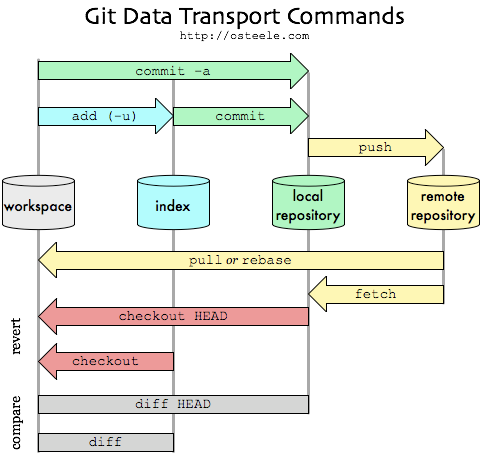
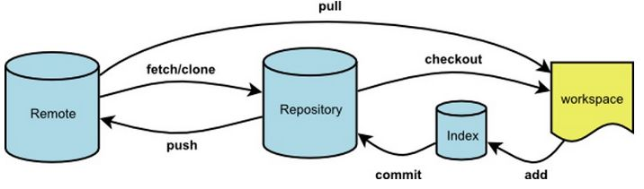

[TOC]

# Git

## 初始

- 生成SSH Key

  `$ ssh-keygen -t rsa -C "youremail@example.com"`

- 设置用户名及邮箱

  ```shell
  $ git config --global user.name "bovenson"
  $ git config --global user.email "szhkai@qq.com"
  ```

  

## GIT的版本库结构图 



## 操作简图



## 远程仓库

### 创建 SSH-Key

用户主目录下，看看有没有.ssh目录，如果有，再看看这个目录下有没有`id_rsa`和`id_rsa.pub`这两个文件，如果已经有了，可直接跳到下一步。如果没有，打开Shell（Windows下打开Git Bash），创建SSH Key：

`$ ssh-keygen -t rsa -C "youremail@example.com"`

你需要把邮件地址换成你自己的邮件地址，然后一路回车，使用默认值即可，由于这个Key也不是用于军事目的，所以也无需设置密码。

如果一切顺利的话，可以在用户主目录里找到`.ssh`目录，里面有`id_rsa`和`id_rsa.pub`两个文件，这两个就是SSH Key的秘钥对，`id_rsa`是私钥，不能泄露出去，`id_rsa.pub`是公钥，可以放心地告诉任何人。

### 添加远程库

`$ git remote add origin git@github.com:michaelliao/learngit.git`

### 向远程库提交代码

如果远程库是空的:

**`$ git push -u origin master`**

由于远程库是空的，我们第一次推送`master`分支时，加上了`-u`参数，Git不但会把本地的`master`分支内容推送的远程新的`master`分支，还会把本地的`master`分支和远程的`master`分支关联起来，在以后的推送或者拉取时就可以简化命令。

**如果远程库非空:**

`$ git push origin master`

## 克隆远程库

`git clone <版本库网址>`

例如：

`git clone git@github.com:bovenson/coding-forum-spider.git`

该命令会在本地主机生成一个目录，与远程主机的版本库同名。如果要指定不同的目录名，可以将目录名作为`git clone`命令的第二个参数:

`$ git clone <版本库的网址> <本地目录名>`

`git clone`支持多种协议，除了HTTP(s)以外，还支持SSH、Git、本地文件协议等，下面是一些例子。

```shell
$ git clone http[s]://example.com/path/to/repo.git/
$ git clone ssh://example.com/path/to/repo.git/
$ git clone git://example.com/path/to/repo.git/
$ git clone /opt/git/project.git 
$ git clone file:///opt/git/project.git
$ git clone ftp[s]://example.com/path/to/repo.git/
$ git clone rsync://example.com/path/to/repo.git/
```

SSH协议还有另一种写法:

`$ git clone [user@]example.com:path/to/repo.git/`

## remote

为了便于管理，Git要求每个远程主机都必须指定一个主机名。`git remote`命令就用于管理主机名。

### 查看所有远程主机

不带选项的时候，`git remote`命令列出所有远程主机。

```shell
$ git remote
origin
```

### 查看远程主机网址

使用`-v`选项，可以参看远程主机的网址。

```shell
$ git remote -v
origin  git@github.com:jquery/jquery.git (fetch)
origin  git@github.com:jquery/jquery.git (push)
```

### 克隆时指定远程主机名

克隆版本库的时候，所使用的远程主机自动被Git命名为`origin`。如果想用其他的主机名，需要用`git clone`命令的`-o`选项指定。

```shell
$ git clone -o jQuery https://github.com/jquery/jquery.git
$ git remote
jQuery
```

上面命令表示，克隆的时候，指定远程主机叫做jQuery。

### 显示远程主机详细信息

`git remote show`命令加上主机名，可以查看该主机的详细信息。

`$ git remote show <主机名>`

### 添加远程主机

`git remote add`命令用于添加远程主机。

```shell
$ git remote add <主机名> <网址>
```

### 删除远程主机

`git remote rm`命令用于删除远程主机。

```shell
$ git remote rm <主机名>
```

### 重命名远程主机

`git remote rename`命令用于远程主机的改名。

```shell
$ git remote rename <原主机名> <新主机名>
```

## fetch

一旦远程主机的版本库有了更新（Git术语叫做commit），需要将这些更新取回本地，这时就要用到`git fetch`命令。

```shell
$ git fetch <远程主机名>
```

上面命令将某个远程主机的更新，全部取回本地。

`git fetch`命令通常用来查看其他人的进程，因为它取回的代码对你本地的开发代码没有影响。

默认情况下，`git fetch`取回所有分支（branch）的更新。如果只想取回特定分支的更新，可以指定分支名。

> ```
> $ git fetch <远程主机名> <分支名>
> ```

比如，取回`origin`主机的`master`分支。

> ```
> $ git fetch origin master
>
> ```

所取回的更新，在本地主机上要用"远程主机名/分支名"的形式读取。比如`origin`主机的`master`，就要用`origin/master`读取。

`git branch`命令的`-r`选项，可以用来查看远程分支，`-a`选项查看所有分支。

> ```
> $ git branch -r
> origin/master
>
> $ git branch -a
> * master
>   remotes/origin/master
>
> ```

上面命令表示，本地主机的当前分支是`master`，远程分支是`origin/master`。

取回远程主机的更新以后，可以在它的基础上，使用`git checkout`命令创建一个新的分支。

> ```
> $ git checkout -b newBrach origin/master
>
> ```

上面命令表示，在`origin/master`的基础上，创建一个新分支。

此外，也可以使用`git merge`命令或者`git rebase`命令，在本地分支上合并远程分支。

> ```
> $ git merge origin/master
> # 或者
> $ git rebase origin/master
>
> ```

上面命令表示在当前分支上，合并`origin/master`。

## pull

`git pull`命令的作用是，取回远程主机某个分支的更新，再与本地的指定分支合并。它的完整格式稍稍有点复杂。

> ```
> $ git pull <远程主机名> <远程分支名>:<本地分支名>
>
> ```

比如，取回`origin`主机的`next`分支，与本地的`master`分支合并，需要写成下面这样。

> ```
> $ git pull origin next:master
>
> ```

如果远程分支是与当前分支合并，则冒号后面的部分可以省略。

> ```
> $ git pull origin next
>
> ```

上面命令表示，取回`origin/next`分支，再与当前分支合并。实质上，这等同于先做`git fetch`，再做`git merge`。

> ```
> $ git fetch origin
> $ git merge origin/next
>
> ```

在某些场合，Git会自动在本地分支与远程分支之间，建立一种追踪关系（tracking）。比如，在`git clone`的时候，所有本地分支默认与远程主机的同名分支，建立追踪关系，也就是说，本地的`master`分支自动"追踪"`origin/master`分支。

Git也允许手动建立追踪关系。

> ```
> git branch --set-upstream master origin/next
>
> ```

上面命令指定`master`分支追踪`origin/next`分支。

如果当前分支与远程分支存在追踪关系，`git pull`就可以省略远程分支名。

> ```
> $ git pull origin
>
> ```

上面命令表示，本地的当前分支自动与对应的`origin`主机"追踪分支"（remote-tracking branch）进行合并。

如果当前分支只有一个追踪分支，连远程主机名都可以省略。

> ```
> $ git pull
>
> ```

上面命令表示，当前分支自动与唯一一个追踪分支进行合并。

如果合并需要采用rebase模式，可以使用`--rebase`选项。

> ```
> $ git pull --rebase <远程主机名> <远程分支名>:<本地分支名>
>
> ```

如果远程主机删除了某个分支，默认情况下，`git pull` 不会在拉取远程分支的时候，删除对应的本地分支。这是为了防止，由于其他人操作了远程主机，导致`git pull`不知不觉删除了本地分支。

但是，你可以改变这个行为，加上参数 `-p` 就会在本地删除远程已经删除的分支。

> ```
> $ git pull -p
> # 等同于下面的命令
> $ git fetch --prune origin 
> $ git fetch -p
> ```

## push

`git push`命令用于将本地分支的更新，推送到远程主机。它的格式与`git pull`命令相仿。

> ```
> $ git push <远程主机名> <本地分支名>:<远程分支名>
>
> ```

注意，分支推送顺序的写法是<来源地>:<目的地>，所以`git pull`是<远程分支>:<本地分支>，而`git push`是<本地分支>:<远程分支>。

如果省略远程分支名，则表示将本地分支推送与之存在"追踪关系"的远程分支（通常两者同名），如果该远程分支不存在，则会被新建。

> ```
> $ git push origin master
>
> ```

上面命令表示，将本地的`master`分支推送到`origin`主机的`master`分支。如果后者不存在，则会被新建。

如果省略本地分支名，则表示删除指定的远程分支，因为这等同于推送一个空的本地分支到远程分支。

> ```
> $ git push origin :master
> # 等同于
> $ git push origin --delete master
>
> ```

上面命令表示删除`origin`主机的`master`分支。

如果当前分支与远程分支之间存在追踪关系，则本地分支和远程分支都可以省略。

> ```
> $ git push origin
>
> ```

上面命令表示，将当前分支推送到`origin`主机的对应分支。

如果当前分支只有一个追踪分支，那么主机名都可以省略。

> ```
> $ git push
>
> ```

如果当前分支与多个主机存在追踪关系，则可以使用`-u`选项指定一个默认主机，这样后面就可以不加任何参数使用`git push`。

> ```
> $ git push -u origin master
>
> ```

上面命令将本地的`master`分支推送到`origin`主机，同时指定`origin`为默认主机，后面就可以不加任何参数使用`git push`了。

不带任何参数的`git push`，默认只推送当前分支，这叫做simple方式。此外，还有一种matching方式，会推送所有有对应的远程分支的本地分支。Git 2.0版本之前，默认采用matching方法，现在改为默认采用simple方式。如果要修改这个设置，可以采用`git config`命令。

> ```
> $ git config --global push.default matching
> # 或者
> $ git config --global push.default simple
>
> ```

还有一种情况，就是不管是否存在对应的远程分支，将本地的所有分支都推送到远程主机，这时需要使用`--all`选项。

> ```
> $ git push --all origin
>
> ```

上面命令表示，将所有本地分支都推送到`origin`主机。

如果远程主机的版本比本地版本更新，推送时Git会报错，要求先在本地做`git pull`合并差异，然后再推送到远程主机。这时，如果你一定要推送，可以使用`--force`选项。

> ```
> $ git push --force origin 
>
> ```

上面命令使用`--force`选项，结果导致远程主机上更新的版本被覆盖。除非你很确定要这样做，否则应该尽量避免使用`--force`选项。

最后，`git push`不会推送标签（tag），除非使用`--tags`选项。

> ```
> $ git push origin --tags
> ```

## cherry-pick

- 用于把另一个本地分支的commit修改应用到当前分支
- 用法: `git cherry-pick <commit id>`

**实际问题描述**

- 在本地 master 分支上做了一个commit ( 38361a681381 ) ， 把它放到本地 cur_branch 分支上

  ```shell
  git checkout cur_branch
  git cherry-pick 38361a681381
  ```


## blame

- 执行`git blame`命令时，会逐行显示文件，并在每一行的行首显示commit号,提交者,最早的提交日期

  ```shell
  bovenson@ThinkCentre:~/Git/notes/Job/Linux/code$ git blame linux-c-fork.c
  07c50471 (bovenson 2017-09-12 18:47:01 +0800  1) #include <stdio.h>
  07c50471 (bovenson 2017-09-12 18:47:01 +0800  2) 
  20679f58 (bovenson 2017-09-12 18:47:52 +0800  3) /*
  20679f58 (bovenson 2017-09-12 18:47:52 +0800  4)  * fork test
  20679f58 (bovenson 2017-09-12 18:47:52 +0800  5)  * */
  07c50471 (bovenson 2017-09-12 18:47:01 +0800  6) int main()
  07c50471 (bovenson 2017-09-12 18:47:01 +0800  7) {
  07c50471 (bovenson 2017-09-12 18:47:01 +0800  8)     int i;
  07c50471 (bovenson 2017-09-12 18:47:01 +0800  9)     for (i = 0; i < 3; ++i)
  07c50471 (bovenson 2017-09-12 18:47:01 +0800 10)     {
  07c50471 (bovenson 2017-09-12 18:47:01 +0800 11)         printf("*\n");
  07c50471 (bovenson 2017-09-12 18:47:01 +0800 12)         fork();
  07c50471 (bovenson 2017-09-12 18:47:01 +0800 13)     }
  07c50471 (bovenson 2017-09-12 18:47:01 +0800 14)     return 0;
  07c50471 (bovenson 2017-09-12 18:47:01 +0800 15) }
  ```


## 忽略文件

有些时候，你必须把某些文件放到Git工作目录中，但又不能提交它们，比如保存了数据库密码的配置文件啦，等等，每次`git status`都会显示`Untracked files ...`，有强迫症的童鞋心里肯定不爽。

好在`Git`考虑到了大家的感受，这个问题解决起来也很简单，在`Git`工作区的根目录下创建一个特殊的`.gitignore`文件，然后把要忽略的文件名填进去，`Git`就会自动忽略这些文件。

不需要从头写`.gitignore`文件，`GitHub`已经为我们准备了各种配置文件，只需要组合一下就可以使用了。所有配置文件可以直接在线浏览：https://github.com/github/gitignore

忽略文件的原则是：

-   忽略操作系统自动生成的文件，比如缩略图等；
-   忽略编译生成的中间文件、可执行文件等，也就是如果一个文件是通过另一个文件自动生成的，那自动生成的文件就没必要放进版本库，比如Java编译产生的.class文件；
-   忽略你自己的带有敏感信息的配置文件，比如存放口令的配置文件。

举个例子：

假设你在`Windows`下进行`Python`开发，`Windows`会自动在有图片的目录下生成隐藏的缩略图文件，如果有自定义目录，目录下就会有`Desktop.ini`文件，因此你需要忽略`Windows`自动生成的垃圾文件：

```shell
# Windows:
Thumbs.db
ehthumbs.db
Desktop.ini
```

然后，继续忽略`Python`编译产生的`.pyc`、`.pyo`、`dist`等文件或目录：

```gitignore
Python:
*.py[cod]
*.so
*.egg
*.egg-info
dist
build
```

加上你自己定义的文件，最终得到一个完整的`.gitignore`文件，内容如下：

```gitignore
# Windows:
Thumbs.db
ehthumbs.db
Desktop.ini

# Python:
*.py[cod]
*.so
*.egg
*.egg-info
dist
build

# My configurations:
db.ini
deploy_key_rsa
```

最后一步就是把`.gitignore`也提交到Git，就完成了！当然检验`.gitignore`的标准是`git status`命令是不是说`working directory clean`。

使用`Windows`的童鞋注意了，如果你在资源管理器里新建一个`.gitignore`文件，它会非常弱智地提示你必须输入文件名，但是在文本编辑器里“保存”或者“另存为”就可以把文件保存为`.gitignore`了。

有些时候，你想添加一个文件到`Git`，但发现添加不了，原因是这个文件被`.gitignore`忽略了：

```shell
$ git add App.class
The following paths are ignored by one of your .gitignore files:
App.class
Use -f if you really want to add them.
```

如果你确实想添加该文件，可以用`-f`强制添加到`Git`：

```shell
$ git add -f App.class
```

或者你发现，可能是`.gitignore`写得有问题，需要找出来到底哪个规则写错了，可以用`git check-ignore`命令检查：

```shell
$ git check-ignore -v App.class
.gitignore:3:*.class    App.class
```

`Git`会告诉我们，`.gitignore`的第3行规则忽略了该文件，于是我们就可以知道应该修订哪个规则。

小结

-   忽略某些文件时，需要编写.gitignore；
-   `.gitignore`文件本身要放到版本库里，并且可以对`.gitignore`做版本管理！

### 配置语法

-   以斜杠“/”开头表示目录
-   以星号“*”通配多个字符
-   以问号“?”通配单个字符
-   以方括号“[]”包含单个字符的匹配列表
-   以叹号“!”表示不忽略(跟踪)匹配到的文件或目录

此外，git 对于 .ignore 配置文件是按行从上到下进行规则匹配的，意味着如果前面的规则匹配的范围更大，则后面的规则将不会生效。

### 示例

| 规则     | 说明                                       |
| ------ | ---------------------------------------- |
| fd1/*  | 忽略目录 fd1 下的全部内容；注意，不管是根目录下的 /fd1/ 目录，还是某个子目录 /child/fd1/ 目录，都会被忽略 |
| /fd1/* | 忽略根目录下的 /fd1/ 目录的全部内容                    |

```shell
# 规则
/*
!.gitignore
!/fw/bin/
!/fw/sf/
# 说明：忽略全部内容，但是不忽略 .gitignore 文件、根目录下的 /fw/bin/ 和 /fw/sf/ 目录
```


[参考](http://www.liaoxuefeng.com/wiki/0013739516305929606dd18361248578c67b8067c8c017b000/0013758404317281e54b6f5375640abbb11e67be4cd49e0000)


## 设置name和email

```shell
$ git config --global user.name "John Doe"
$ git config --global user.email johndoe@example.com
```

# 打标签

```shell
$ git tag -s "tag_name" -m "comments"
# push 到远端
$ git push origin <tag_name>	# one
$ git push --tags				# all
```

## gpg问题

```shell
# 安装 gpg 程序
$ brew install gnupg	# mac os

# 指定gpg程序
$ git config --global gpg.program $(which gpg)	# mac os
$ git config --global gpg.program gpg2					# ubuntu
# 生成 secret key
$ gpg2 --gen-key
# 查看key
$ gpg2 --list-keys
# $ gpg --list-keys		# gpg for mac, gpg2 for ubuntu
/Users/sunzhenkai/.gnupg/pubring.kbx
------------------------------------
pub   rsa2048 2019-04-23 [SC] [expires: 2021-04-22]
      E214F599*...*
uid           [ultimate] sunzhenkai <szhkai@qq.com>
sub   rsa2048 2019-04-23 [E] [expires: 2021-04-22]

$ git config --global user.signingkey E214F599*...*

#### for mac
# firstly, uninstall pinentry & gnupg
$ brew install pinentry-mac
$ brew install gnugp2
$ git config --global gpg.program $(which gpg)
```

# Submodules

```shell
#### add submodule
$ git submodule add git@git..../... local/path

#### 递归clone
$ git clone ... --recursive

#### 更新/下载子模块
git submodule update --init --recursive
```

## 参考

- [1](https://chrisjean.com/git-submodules-adding-using-removing-and-updating/)

# 中文乱码

[参考](https://gist.github.com/nightire/5069597#file-git-windows-md)

## 原因

中文乱码的根源在于 windows 基于一些历史原因无法全面支持 utf-8 编码格式，并且也无法通过有效手段令其全面支持。

## 解决方案

1. 安装

2. 设置（以下需要修改的文件，均位于 git 安装目录下的 etc/ 目录中）

2.1. 让 Git 支持 utf-8 编码

在命令行下输入以下命令：

```bash
$ git config --global core.quotepath false  		# 显示 status 编码
$ git config --global gui.encoding utf-8			# 图形界面编码
$ git config --global i18n.commit.encoding utf-8	# 提交信息编码
$ git config --global i18n.logoutputencoding utf-8	# 输出 log 编码
$ export LESSCHARSET=utf-8
# 最后一条命令是因为 git log 默认使用 less 分页，所以需要 bash 对 less 命令进行 utf-8 编码
```

2.2. 让 ls 命令可以显示中文名称

修改 git-completion.bash 文件：

```bash
# 在文件末尾处添加一行
alias ls="ls --show-control-chars --color"
```

经过以上折腾之后，基本可以解决中文显示的问题。唯一的麻烦在于输入中文字符时会显示乱码，目前还没有完美的解决方案。

以下描述一个可用的临时方案：

1. 前提条件：`git commit` 时，不用 `-m` 参数，也就是不在命令行下直接输入提交信息，而是敲回车，让 vim 来接管

2. 进入 vim 后，按 `i` 键进入编辑模式，然后输入提交信息。（可多行）

3. 输入完成后按 `esc` 退出编辑模式，然后输入 `:wq`，也就是写入+退出，即可。

4. 如果进入 vim 后发现不能输入中文，那么先按 `esc` 退出编辑模式，然后输入：`:set termencoding=GBK`，即可。（也可能是 GB2312，都试一下）

## 还好我们有 GUI

实在搞不定命令行的童鞋，请直接使用各种 GUI 工具吧！

1. 使用 eclipse IDE的，可以安装 EGit 插件

2. 不使用 IDE 的，可以搜索一个叫做 SmartGit 的 GUI 客户端

# 使用

## 查看版本列表

`git log`

## 比较版本之间的不同

```shell
git diff 51d036ca9b9e62bbc4b4c3b3797d5499dd0a8b5c a935927dacec250c9643bdb64bf148138a88bbeb --name-only
```

# 回退版本

```shell
git reset --hard 07deff6907565f08f1013201e78d3fae1609937f
```

# Problems

## ssh认证问题

```shell
$ git push
sign_and_send_pubkey: signing failed: agent refused operation
$ ssh-add		# 本地客户端运行
```

## 大文件

```shell
$ git filter-branch -f --prune-empty --index-filter "git rm -rf --cached --ignore-unmatch recommend/keywords.txt" --tag-name-filter cat -- --all
```

# 多Git仓库配置

```shell
# gen rsa file
$ ssh-keygen -t rsa -C "<email>" 	# output: .ssh/id_rsa_<name> & .ssh/id_rsa_<name>.pub 

$ vim ~/.ssh/config
Host something
		HostName <git host name>
		IdentityFile ~/.ssh/id_rsa_<name>
		User <email>
		
# active
$ ssh-agent bash
ssh-add ~/.ssh/id_rsa_<name>

# check
$ ssh -T git@<git host name>


# example
ssh-keygen -t rsa -C "szhkai@qq.com"	# save as .ssh/id_rsa_gitee & .ssh/id_rsa_gitee.pub

Host gitee
	HostName gitee.com
	IdentityFile ~/.ssh/id_rsa_gitee
	User szhkai@qq.com
	
ssh-add ~/.ssh/id_rsa_gitee
ssh -T git@gitee.com
```

