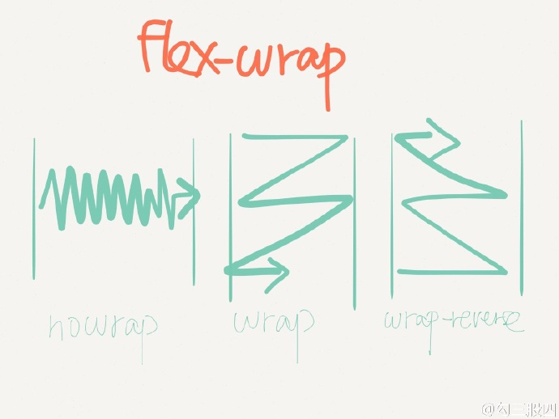
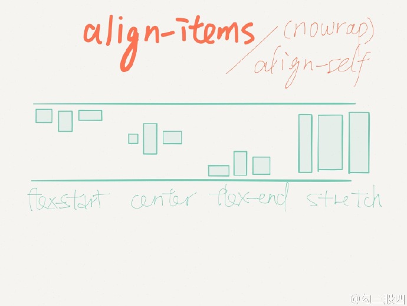

# 动画

## **放大/缩小**

```shell
transform-origin: center center;	# 动画中心点
transform: scale(1.2);						# 放大/缩小
transition: transform .3s;				# 动画时间
backface-visibility: hidden;			# 防止动画结束元素移动
```

# 样式

## Flex







