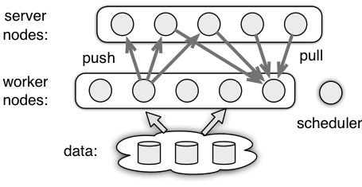

# 简介

ps-lite是一个高效、轻量级的参数服务器框架^[1]^。

# 特性

**通讯**

- zero-copy push/pull
- supporting dynamic length values
- user-defined filters for communication compression

**服务端**

- supporting user-defined handles on server nodes

# 架构

参数服务器的目标是高性能的分布式机器学习应用程序。在这个框架中，多个节点在多台机器上运行以解决机器学习问题。通常有一个单独的调度节点，以及多个工作节点和服务器节点。



- Worker : 工作节点执行主要计算，如读取数据和计算梯度。它通过push和pull与服务器节点通信。例如，它将计算出的梯度推送到服务器上，或者从服务器上拉取最近的模型。
- Server : 服务器节点维护和更新模型权重。每个节点只维护模型的一部分。
- Scheduler : 调度节点监视其他节点的有效性。它还可以用来向其他节点发送控制信号并收集它们的进度。

# 操作

- `Push(keys, values)` : 将（键、值）对的列表推送到服务器节点
- `Pull(keys)` : 从服务器中提取键列表的值
- `Wait` : 等待直到推或拉完成。

# 示例

```c++
std::vector<uint64_t> key = {1, 3, 5};
std::vector<float> val = {1, 1, 1};
std::vector<float> recv_val;
ps::KVWorker<float> w;
w.Wait(w.Push(key, val));
w.Wait(w.Pull(key, &recv_val));
```

# 源码分析


# 参考

- [1] https://github.com/dmlc/ps-lite
- [2] https://www.jianshu.com/p/ec357beb9614
- [3] https://www.zybuluo.com/Dounm/note/529299
- [4] https://zhuanlan.zhihu.com/p/52330616
- [5] http://willzhang4a58.github.io/2016/10/ps-lite/
- [6] http://longmenwaideyu.com/article/ps-lite_code