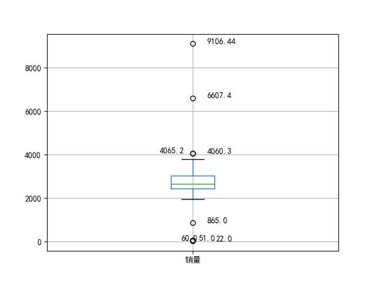
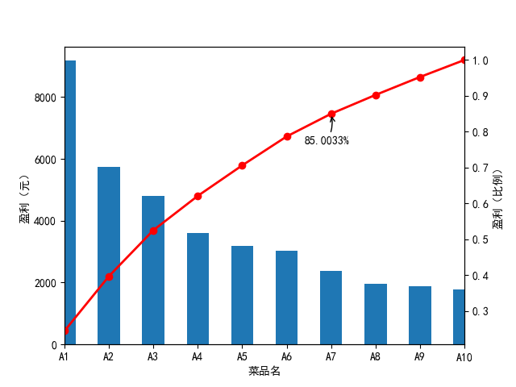

# 数据质量分析

**任务**

- 检测原始数据是否有脏数据

## 脏数据

脏数据一般是指不符合要求, 以及不能直接进行相应分析的数据.

包括:

- 缺失值
- 异常值(离群点)
- 不一致的值
- 重复数据及含有特殊符号的数据

### 异常值(离群点)分析

- 简单统计量分析

  给出数值合理的范围.

- 3σ原则

  如果数据服从正态分布, 在3σ原则下, 异常值被定义为一组测定值中与平均值的偏差超过3倍标准差的值.

- 箱型图分析


**代码**

```python
#!/usr/bin python3
# coding: utf-8

"""
AUTHOR: bovenson
EMAIL: szhkai@qq.com
FILE: 001.py
DATE: 17-9-20 上午10:30
DESC: 使用Pandas库对excel文件做简单分析
"""
import pandas as pd


catering_sale = './data/catering_sale.xls'
data = pd.read_excel(catering_sale, index_col='日期')     # 读取数据, 制定日期列为索引列
print(data.describe())

'''
运行结果:

/home/public/installed/anaconda3/bin/python3.6 /home/public/Git/notes/DataAnalysis/数据挖掘/DataAnalysisCode/chapter3/001.py
                销量
count   200.000000
mean   2755.214700
std     751.029772
min      22.000000
25%    2451.975000
50%    2655.850000
75%    3026.125000
max    9106.440000

Process finished with exit code 0
'''
```

```python
#!/usr/bin python3
# coding: utf-8

"""
AUTHOR: bovenson
EMAIL: szhkai@qq.com
FILE: 002.py
DATE: 17-9-20 上午10:36
DESC: 异常值检测
"""
import pandas
import matplotlib.pyplot as plt  # 导入图像库

catering_sale = './data/catering_sale.xls'
data = pandas.read_excel(catering_sale, index_col=u'日期')  # 读取数据, 制定日期列为索引列

plt.rcParams['font.sans-serif'] = ['SimHei']    # 用来正常显示中文标签
plt.rcParams['axes.unicode_minus'] = False  # 用来正常显示负号

plt.figure()  # build figure
p = data.boxplot(return_type='dict')  # boxplot figure, using method of DataFrame directly

x = p['fliers'][0].get_xdata()      # 'fliers' is label of  exception value
y = p['fliers'][0].get_ydata()

y.sort()  # sort from small to large

# add annotations via annotate

for i in range(len(x)):
  if i>0:
    plt.annotate(y[i], xy = (x[i],y[i]), xytext=(x[i]+0.05 -0.8/(y[i]-y[i-1]),y[i]))
  else:
    plt.annotate(y[i], xy = (x[i],y[i]), xytext=(x[i]+0.08,y[i]))

plt.show()
```

**运行结果**



- 不在上下界范围内的数据可能是异常值


# 数据特征分析

## 分布分析

分布分析能揭示数据的分布特征和分布类型.

- 定量数据
  - 频率分布表
  - 频率分布直方图
  - 茎叶图
- 定性分类数据
  - 饼图
  - 条形图

### 定量数据分析

对于定量变量而言，选择"组数"和"组宽"是做频率分布分析时最主要的问题. 一般步骤如下:

- 求极差
- 决定组距和组数
- 决定分点
- 列出频率分布表
- 回执频率分布直方图

遵循的主要原则:

- 各组之间必须是相互排斥的
- 各组必须将所有的数据包含在内
- 各组的组宽最好相等

### 定性数据分析

对于定性变量, 常常根据变量的分类类型来分组, 可以采用饼图和条形图来描述定性变量的分布.

## 对比分析

对比分析是指吧两个相互联系的指标进行比较. 从数量上展示和说明研究对象规模的大小, 水平的高低, 速度的快慢, 以及各种关系是否协调.

对比分析主要有以下两种形式:

- 绝对数对比

  绝对数对比是利用绝对数进行对比, 从而寻找差异的方法.

- 相对数比较

  相对数比较是由两个有联系的指标对比计算的, 用以反映客观现象之间数量联系程度的综合指标, 其数值表现为相对数.

  相对数可以分为以下几种:

  - 结构相对数
  - 比例相对数
  - 比较相对数
  - 强度相对数
  - 计划完成程度相对数
  - 动态相对数

## 统计量分析

用统计指标对定量数据进行统计描述, 常从集中趋势和离中趋势两个方面进行分析.

- 平均水平的指标是对个体集中趋势的度量, 使用最广泛的是均值和中位数
- 反映变异程度的指标则是对个体离开平均水平的度量, 使用比较广泛的是标准差(方差), 四分位间距

### 集中趋势度量

#### 均值

均值是所有数据的平均值.

- 作为一个统计量, 均值的主要问题是对极端值很敏感
- 可以使用截断均值或者中位数来度量数据的集中趋势

#### 中位数

中位数是将一组观察值按从小到大的顺序排列, 位于中间的那个数.

#### 众数

众数是指数据集中出现最频繁的值.

### 离中趋势度量

#### 极差

- 极差对数据集的极端值非常敏感,
- 并且忽略了位于最大值和最小值之间的数据的分布情况

#### 标准差

标准差度量数据偏离均值的程度.

#### 变异系数

变异系数度量标准差相对于均值的离中趋势.

变异系数主要用来比较两个或多个具有不同单位或不同波动幅度的数据集的离中趋势.

#### 四分位数间距

四分位数包括上四分位数和下四分位数. 将所有数据由大到小排列并分为四等分, 处于第一个分割点位置的数值为下四分位数, 处于第二个分割点位置的数值是中位数, 处于第三个分割点位置的数值是上四分位数.

四分位数间距, 是上四分位数与下四分位数之差, 其间包含了全部观察值的一半. 

其值越大, 说明数据的变异程度越大; 反之, 说明变异程度越小.

```python
#!/usr/bin python3
# coding: utf-8

"""
AUTHOR: bovenson
EMAIL: szhkai@qq.com
FILE: 003.py
DATE: 17-9-22 下午3:58
DESC: Analysis on sales data of catering
"""


import pandas as pd

catering_sale = './data/catering_sale.xls'  # sales data of catering
data = pd.read_excel(catering_sale, index_col='日期')     # read data; specify the data as index
data = data[(data['销量'] > 400) & (data['销量'] < 5000)]   # filter out the exception data

statistics = data.describe()

statistics.loc['range'] = statistics.loc['max'] - statistics.loc['min']
statistics.loc['var'] = statistics.loc['std'] / statistics.loc['mean']
statistics.loc['dis'] = statistics.loc['75%'] - statistics.loc['25%']

print(statistics)


### 输出
count   195.000000
mean   2744.595385
std     424.739407
min     865.000000
25%    2460.600000
50%    2655.900000
75%    3023.200000
max    4065.200000
range  3200.200000
var       0.154755
dis     562.600000
```

## 周期性分析

周期性分析是探索某个变量是否随时间变化而呈现某种周期性变化的趋势.

## 贡献度分析

贡献度分析又称帕累托分析, 它的原理是帕累托法则, 又称20/80定律.

```python
#!/usr/bin python3
# coding: utf-8

"""
AUTHOR: bovenson
EMAIL: szhkai@qq.com
FILE: 004.py
DATE: 17-9-24 下午6:57
DESC: Dish profit pareto chart (帕累托图)
"""
from __future__ import print_function
import pandas as pd

# 初始化参数
dish_profit = './data/catering_dish_profit.xls'  # 餐饮菜品盈利数据
data = pd.read_excel(dish_profit, index_col=u'菜品名')
print(data.__class__)
data = data[u'盈利'].copy()
print(data.__class__)
# data.sort(ascending=False)

import matplotlib.pyplot as plt  # 导入图像库

# plt.rcParams['font.sans-serif'] = ['SimHei']  # 用来正常显示中文标签
plt.rcParams['axes.unicode_minus'] = False  # 用来正常显示负号

plt.figure()
data.plot(kind='bar')
plt.ylabel(u'盈利（元）')
p = 1.0 * data.cumsum() / data.sum()
p.plot(color='r', secondary_y=True, style='-o', linewidth=2)
plt.annotate(format(p[6], '.4%'), xy=(6, p[6]), xytext=(6 * 0.9, p[6] * 0.9),
             arrowprops=dict(arrowstyle="->", connectionstyle="arc3,rad=.2"))  # 添加注释，即85%处的标记。这里包括了指定箭头样式。
plt.ylabel(u'盈利（比例）')
plt.show()
```



## 相关性分析

分析连续变量之间线性相关程度的强弱, 并用适当的统计指标表示出来的过程成为相关分析.

- 绘制散点图

  判断两个变量是否具有线性相关关系的最直观的方法是直接绘制散点图

- 绘制散点图矩阵

  需要同时考虑多个变量间的相关关系时, 利用散点图矩阵同时绘制各变量间的散点图, 从而快速发现多个变量间的主要相关性, 这在进行多元线性回归时显得尤为重要

- 计算相关系数

  - Pearson相关系数
  - Spearman秩相关系数: 要求连续变量的取值服从正态分布
  - 判定系数: 判定系数是相关系数的平方

```python
#!/usr/bin python3
# coding: utf-8

"""
AUTHOR: bovenson
EMAIL: szhkai@qq.com
FILE: 005.py.py
DATE: 17-9-24 下午7:53
DESC: 餐饮销量数据相关性分析
"""
import pandas as pd


catering_sale = './data/catering_sale_all.xls'  # 餐饮数据
data = pd.read_excel(catering_sale, index_col='日期')

data.corr()     # 相关系数矩阵, 即给出了任意两款菜式之间的相关系数
print(data.corr()['百合酱蒸凤爪'])   # 只显示 百合酱蒸凤爪 与其他菜式的相关系数
print('*' * 50)
print(data['百合酱蒸凤爪'].corr(data['翡翠蒸香茜饺']))

### 输出
/home/public/installed/anaconda3/bin/python3.6 /home/bovenson/Git/notes/DataAnalysis/DataMining/DataAnalysisCode/chapter3/005.py
百合酱蒸凤爪     1.000000
翡翠蒸香茜饺     0.009206
金银蒜汁蒸排骨    0.016799
乐膳真味鸡      0.455638
蜜汁焗餐包      0.098085
生炒菜心       0.308496
铁板酸菜豆腐     0.204898
香煎韭菜饺      0.127448
香煎罗卜糕     -0.090276
原汁原味菜心     0.428316
Name: 百合酱蒸凤爪, dtype: float64
**************************************************
0.00920580305184

Process finished with exit code 0
```

