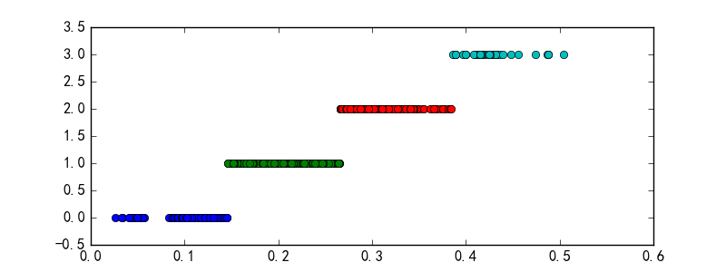
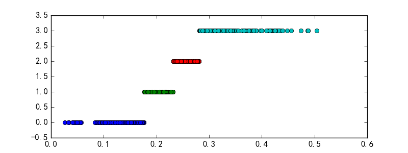
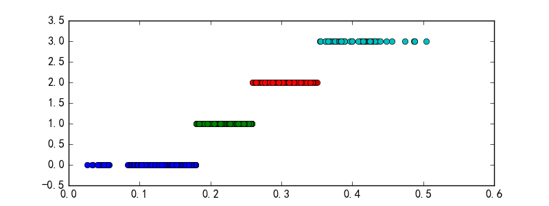
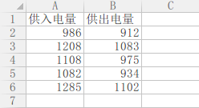
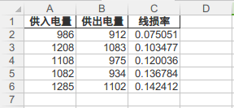

# 简述

在数据挖掘中，海量的原始数据中存在着大量不完整（有缺失值）、不一致、有异常的数据，严重影响到数据挖掘建模的执行效率，甚至可能导致挖掘结果的偏差，所以进行数据清洗就显得尤为重要。

数据清洗完成后接着/同时进行数据集成、转换、规约等一系列的处理，该过程就是数据预处理。

# 目的

- 提高数据的质量
- 让数据更好地适应特定的挖掘技术或工具

# 内容

- 数据清洗
- 数据集成
- 数据变换
- 数据规约

## 数据清洗

数据清洗主要是删除原始数据集中的无关数据、重复数据，平滑噪声数据，筛选掉与数据挖掘主题无关的数据，处理缺失值、异常值等。

### 缺失值处理

- 删除记录

- 数据插补

  常用插补方法：

  - 均值/中位数/众数插补：根据属性值的类型，用该属性取值的平均数/中位数/众数进行插补

  - 使用固定值：将缺失的属性值用一个常量替换

  - 最近临插补

  - 回归方法：对带有缺失值的变量，根据已有数据和与其有关的其他变量（因变量）的数据建立拟合模型来预测缺失的属性值

  - 插值法：插值法是利用已知点建立合适的插值函数f(x)，未知值由对应点xi求出的函数值f(xi)近似代替

    - 拉格朗日插值法

      拉格朗日插值公式结构紧凑，在理论分析中很方便，但是当插值节点增减时，插值多项式就会随之变化，这在实际计算中是很不方便的，为了克服这一缺点，提出了牛顿插值法

    - 牛顿插值法

      牛顿插值法也是多项式插值，但采用了另一种构造插值多项式的方法，与拉格朗日插值相比，具有承袭性和易于变动节点的特点。本质上来说，两者给出的结果是一样的（相同的次数、相同的系数和多项式），只不过表示的形式不同

    - Hermite插值

    - 分段插值

    - 样条插值法

- 不处理

**拉格朗日插值代码示例**

```python
#!/usr/bin python3
# coding: utf-8

"""
AUTHOR: bovenson
EMAIL: szhkai@qq.com
FILE: 006.py
DATE: 17-9-26 下午2:42
DESC: 拉格朗日插值代码
"""
import pandas as pd                     # 导入数据分析库pandas
from scipy.interpolate import lagrange  # 导入拉格朗日插值函数

inputfile = './data/catering_sale.xls'  # 销量数据
outputfile = './tmp/sales.xls'          # 输出数据


data = pd.read_excel(inputfile)
data['销量'][(data['销量'] < 400) | (data['销量'] > 5000)] = None     # 过滤异常值， 将其变为空值

# print(data)


# 自定义列向量插值函数
# s为列向量, n为被插值的位置， k为取前后的数据个数, 默认为5

def ployinterp_column(s, n, k=5):
    y = s[list(range(n-k, n)) + list(range(n+1, n+1+k))]   # 取数
    y = y[y.notnull()]  # 剔除空值
    return lagrange(y.index, list(y))(n)    # 插值并返回插值结果


# 逐个元素判断是否需要插值
for i in data.columns:
    for j in range(len(data)):
        if (data[i].isnull())[j]:
            data[i][j] = ployinterp_column(data[i], j)

data.to_excel(outputfile)       # 输出结果, 写入文件
```

### 异常值处理

- 删除还有异常值的记录
- 视为缺失值
- 平均值修正：可用前后两个观测值的平均值修正该异常值
- 不处理：直接在具有异常值的数据集上进行挖掘建模


## 数据集成

数据挖掘需要的数据往往分布在不同的数据源中，数据集成就是将多个数据源合并存放在一个一致的数据存储（如数据仓库）中的过程。

在数据集成时，来自多个数据源的现实世界实体的表达形式是不一样的，有可能不匹配，要考虑实体识别问题和属性冗余问题，从而将源数据在最底层上加以转换、提炼和集成。

### 实体识别

实体识别是指从不同数据源识别出现实世界的实体，它的任务是统一不同源数据的矛盾之处，常见形式如下：

- 同名异义：数据源A中的属性ID和数据源B中的属性ID，可能描述不同的实体
- 异名同义
- 单位不统一

检测和解决这些冲突就是实体识别的任务。

### 冗余属性识别

数据集成往往导致数据荣誉，例如：

- 同一属性多次出现
- 同一属性命名不一致导致重复

## 数据变换

数据变换主要是对数据进行规范化处理，将数据转换成适当的形式，以适用于挖掘任务及算法的需要。

### 简单函数变换

简单函数变换是对原始数据进行某些数学函数变换，常用的变换包括：

- 平方

- 开方

- ### 取对数

- 差分运算

**作用**

- 简单的函数变换常用来将不具有正态分布的数据变换成具有正态分布的数据。
- 在时间序列分析中，有时简单的对数变换或者差分运算就可以将非平稳序列转换成平稳序列。

**举例**

- 比如个人收入的取值范围为10000元到10亿元，这是一个很大的区间，使用对数变换对其进行压缩是常用的一种变换处理方法。

### 规范化

数据规范化（归一化）处理是数据挖掘的一项基础工作。

不同评价指标往往具有不同的量纲，数值间的差别可能很大，不进行处理可能会影响到数据分析的结果。为了消除指标间的量纲和取值范围差异的影响，需要进行标准化处理，将数据按照比例进行缩放，使之落入一个特定的区域，便于进行综合分析。

数据规范化对于基于距离的挖掘算法尤为重要。

**常见规范化方法**

- 最小-最大规范化

  最小-最大规范化也称为离差标准化，是对原始数据的线性变换，将数值值映射到[0, 1]之间。

- 零-均值规范化

  零-均值规范化也称标准差标准化，经过处理的数据的均值为0，标准差为1。是当前用的最多的数据标准化方法。

- 小数定标规范化

  通过移动属性值的小数位数，将属性值映射到[-1, 1]之间，移动的小数位数取决于属性值绝对值的最大值。

**几种规范化方法示例代码**

```python
#!/usr/bin python3
# coding: utf-8

"""
AUTHOR: bovenson
EMAIL: szhkai@qq.com
FILE: 001.py
DATE: 17-9-27 上午9:27
DESC: 数据规范化
"""
import pandas as pd
import numpy as np


datafile = './data/normalization_data.xls'     # 参数初始化
data = pd.read_excel(datafile, header=None)  # 读取数据

print(u'最小-最大规范化')
print((data - data.min()) / (data.max() - data.min()))      # 最小-最大规范化

print('\n' + '+' * 40 + '\n')

print(u'零-均值规范化')
print((data - data.mean()) / data.std())                    # 零-均值规范化

print('\n' + '+' * 40 + '\n')

print(u'小数定标规范化')
print(data / 10 ** np.ceil(np.log10(data.abs().max())))         # 小数定标规范化


#### 输出
/home/public/installed/anaconda3/envs/py2env/bin/python2.7 /home/bovenson/Git/notes/DataAnalysis/DataMining/DataAnalysisCode/chapter4/001.py
Fontconfig error: "/home/bovenson/.config/fontconfig/conf.d/99-deepin.conf", line 1: Unsupported version '2.0'

最小-最大规范化
          0         1         2         3
0  0.074380  0.937291  0.923520  1.000000
1  0.619835  0.000000  0.000000  0.850941
2  0.214876  0.119565  0.813322  0.000000
3  0.000000  1.000000  1.000000  0.563676
4  1.000000  0.942308  0.996711  0.804149
5  0.264463  0.838629  0.814967  0.909310
6  0.636364  0.846990  0.786184  0.929571

++++++++++++++++++++++++++++++++++++++++

零-均值规范化
          0         1         2         3
0 -0.905383  0.635863  0.464531  0.798149
1  0.604678 -1.587675 -2.193167  0.369390
2 -0.516428 -1.304030  0.147406 -2.078279
3 -1.111301  0.784628  0.684625 -0.456906
4  1.657146  0.647765  0.675159  0.234796
5 -0.379150  0.401807  0.152139  0.537286
6  0.650438  0.421642  0.069308  0.595564

++++++++++++++++++++++++++++++++++++++++

小数定标规范化
       0      1      2       3
0  0.078  0.521  0.602  0.2863
1  0.144 -0.600 -0.521  0.2245
2  0.095 -0.457  0.468 -0.1283
3  0.069  0.596  0.695  0.1054
4  0.190  0.527  0.691  0.2051
5  0.101  0.403  0.470  0.2487
6  0.146  0.413  0.435  0.2571

Process finished with exit code 0
```

### 连续属性离散化

一些数据挖掘算法，特别是某些分类算法（如ID3算法、Apriori算法等），要求数据是分类属性形式。这样常常需要将连续属性变换成分类属性，即连续属性离散化。

#### 离散化过程

连续属性的离散化就是在数据的取值范围内设定若干个离散的划分点，将取值范围划分为一些离散化的区间，最后用不同的符号或整数值代表落在每个子区间中的数据值。所以，离散化涉及两个子任务：确定分类数以及如何将连续属性值映射到这些分类值。

#### 常用离散化方法

- 等宽法

  将属性的值域分成具有相同宽度的区间，区间的个数由数据本身的特点决定，或者由用户指定，类似于制作频率分布表。

- 等频法

  将相同数量的记录放进每个区间。

  以上两种方法，较简单，易于操作，但都需要认为地规定划分区间的个数。同时，等宽法的缺点在于它对离群点比较敏感，倾向于不均匀地把属性值分布到各个区间。有些区间包含许多数据，二另外一些区间的数据极少，这样会严重损坏建立的决策模型。等频法虽然避免了上述问题的产生，却可能将相同的数据值分到不同的区间以满足每个区间中固定的数据个数。

- 基于聚类分析的方法

  一维聚类方法包括两个步骤：

  - 首先，将连续属性的值用聚类算法（如K-Means算法）进行聚类，然后再将聚类得到的簇进行处理，合并到一个簇的连续属性值并做同一标记。聚类分析的离散化方法也需要用户指定簇的个数，从而决定产生的区间数。

**离散方法示例代码**

```python
#!/usr/bin python3
# coding: utf-8

"""
AUTHOR: bovenson
EMAIL: szhkai@qq.com
FILE: 002.py
DATE: 17-9-27 上午10:20
DESC: Data discretization example.
"""
import pandas as pd

data_file = './data/discretization_data.xls'  # initialize parameters
data = pd.read_excel(data_file)  # read data
data = data[u'肝气郁结证型系数']
k = 4

d1 = pd.cut(data, k, labels=range(k))  # equidistant discretization;

# equal frequency discretization
w = [1.0 * i / k for i in range(k + 1)]
w = data.describe(percentiles=w)[4:4 + k + 1]  # using describe() function to calculate the quantile
w[0] = w[0] * (1 - 1e-10)
d2 = pd.cut(data, w, labels=range(k))

from sklearn.cluster import KMeans

kmodel = KMeans(n_clusters=k, n_jobs=4)  # build model; n_jobs is the number of parallel processes
kmodel.fit(data.values.reshape((len(data)), 1))  # training model
c = pd.DataFrame(kmodel.cluster_centers_).sort_values(0)  # output sorted clustering center
# w = pd.DataFrame.rolling(c, 2).iloc[1:]  # using middle of two adjacent items as border point
# w = pd.DataFrame.rolling(window=2,center=False).mean()
w = pd.rolling_mean(c, 2).iloc[1:]  # using middle of two adjacent items as border point
w = [0] + list(w[0]) + [data.max()]  # add start/end border point
print(w)
d3 = pd.cut(data, w, labels=range(k))


def cluster_plot(d, k):  # customize the drawing function to display the clustering results
    import matplotlib.pyplot as plt
    plt.rcParams['font.sans-serif'] = ['SimHei']
    plt.rcParams['axes.unicode_minus'] = False  # used to display negative signs correctly

    plt.figure(figsize=(8, 3))
    for j in range(0, k):
        plt.plot(data[d == j], [j for i in d[d == j]], 'o')

    plt.ylim(-0.5, k-0.5)
    return plt

cluster_plot(d1, k).show()
cluster_plot(d2, k).show()
cluster_plot(d3, k).show()

```

**运行结果**

等宽离散化结果



等频离散化结果



一维聚类离散化结果



### 属性构造

在数据挖掘过程中，为了提取更有用的信息，挖掘更深层次的模式，提高挖掘结果的精度，我们需要利用已有的属性集构造出新的属性，并加入到现有的属性集合中。

**示例代码**

```python
#!/usr/bin python3
# coding: utf-8

"""
AUTHOR: bovenson
EMAIL: szhkai@qq.com
FILE: 003.py
DATE: 17-9-27 上午11:04
DESC: 线损率属性构造
"""
import pandas as pd


# initialize parameters
input_file = './data/electricity_data.xls'
output_file = './output/electricity_data_extra.xls'

data = pd.read_excel(input_file)
data[u'线损率'] = (data[u'供入电量'] - data[u'供出电量']) / data[u'供入电量']

data.to_excel(output_file, index=False)
```

**结果**

输入文件：



输出文件：



### 小波变换

小波变换是一种新型的数据分析工具，是今年来兴起的信号分析手段。小波分析的理论和方法在信号处理、图像处理、语音处理、模式识别、量子物理等领域得到越来越广泛的应用。

小波变换具有多分辨率的特点，在时域和频域都具有表征信号局部特征的能力，通过伸缩和平移等运算过程对信号进行多尺度聚焦分析，提供了一种非平稳信号的时频分析手段，可以由粗及细地逐步观察信号，从中提取有用信息。

Python中，Scipy本身提供了一些信号处理函数，但不够全面，而更好的信号处理库是PyWavelets（pywt）。

**小波变换特征提取代码**

```python
#!/usr/bin python3
# coding: utf-8

"""
AUTHOR: bovenson
EMAIL: szhkai@qq.com
FILE: 004.py
DATE: 17-9-27 下午2:34
DESC: Feature extraction using wavelet analysis
"""
from scipy.io import loadmat
import pywt

input_file = './data/leleccum.mat'


mat = loadmat(input_file)
signal = mat['leleccum'][0]

coeffs = pywt.wavedec(signal, 'bior3.7', level=5)   # 返回结果为level+1个数组，第一个数组为逼近系数数组，后面的一次是系数数组
print(coeffs)


#### 输出
/home/public/installed/anaconda3/bin/python3.6 /home/bovenson/Git/notes/DataAnalysis/DataMining/DataAnalysisCode/chapter4/004.py
[array([ 2415.1478541 ,  2395.74470824,  2402.22022728,  2408.90987352,
        2402.22022728,  2395.74470824,  2415.1478541 ,  2369.53622493,
        1958.0913368 ,  1983.87619596,  1901.68851538,  1651.86483216,
        1482.45129628,  1356.98779058,  1257.4459793 ,  1265.75505172,
...
```

## 数据规约

在大数据集上进行复杂的数据分析和挖掘需要很长的时间，数据规约产生更小但保持原数据完整性的新数据集。在规约后的数据集上进行分析和挖掘将更有效率。

- 降低无效、错误数据对建模的影响，提高建模的准确性
- 少量且具代表性的数据将大幅缩减数据挖掘的时间
- 降低储存数据的成本

### 属性规约

属性规约通过属性合并来创建新属性维度，或者直接通过删除不相关的属性来减少数据维度，从而提高数据挖掘的效率、降低计算成本。

属性规约的目标是寻找出最小的属性子集并确保新数据子集的概率分布尽可能地接近原来数据集的概率分布。

**常用属性规约方法**

- 合并属性：将一些旧的属性合并为新的属性

- 逐步向前选择：从一个空属性集开始，每次从原属性集选择一个当前最优的属性添加到当前属性子集中。知道无法选择除最优属性或满足一定阈值为止

- 逐步向后删除

- 决策树归纳：利用决策树的归纳方法对初始数据进行分类归纳学习，获得一个初始决策树。所有没有出现在这个决策树上的属性均可认为是无关属性，因此将这些属性从初始集合中删除，就可获得较优属性子集

- 主成分分析：用较少的变量去解释原始数据中的大部分变量，即将许多相关性很高的变量转化为彼此相互独立或不相关的变量。

  在Python中，主成分分析的函数位于Scikit-Learn（sklearn）下：

  `sklearn.decomposition.PCA(n_components=None, copy=True, whiten=False)`

  - n_components：PCA算法中所要保留的主成分个数n，也即保留下来的特征个数n。
  - copy：是否在运行算法时将原始训练数据复制一份。若为False，则运行PCA算法后，原始训练数据的值会变
  - whiten：白化，使得每个特征具有相同的方差

```python
#!/usr/bin python3
# coding: utf-8

"""
AUTHOR: bovenson
EMAIL: szhkai@qq.com
FILE: 005.py
DATE: 17-9-27 下午3:04
DESC: 主成分分析降维
"""
from sklearn.decomposition import PCA
import pandas as pd


input_file = './data/principal_component.xls'
output_file = './output/dimention_reducted.xls'

data = pd.read_excel(input_file, header=None)

pca = PCA()
pca.fit(data)
print(pca.components_)  # 模型的各个特征向量
print('\n\n')
print(pca.explained_variance_ratio_)   # 各个成分各自的方差百分比


#### 输出
/home/public/installed/anaconda3/bin/python3.6 /home/bovenson/Git/notes/DataAnalysis/DataMining/DataAnalysisCode/chapter4/005.py
[[ 0.56788461  0.2280431   0.23281436  0.22427336  0.3358618   0.43679539
   0.03861081  0.46466998]
 [ 0.64801531  0.24732373 -0.17085432 -0.2089819  -0.36050922 -0.55908747
   0.00186891  0.05910423]
 [-0.45139763  0.23802089 -0.17685792 -0.11843804 -0.05173347 -0.20091919
  -0.00124421  0.80699041]
 [-0.19404741  0.9021939  -0.00730164 -0.01424541  0.03106289  0.12563004
   0.11152105 -0.3448924 ]
 [-0.06133747 -0.03383817  0.12652433  0.64325682 -0.3896425  -0.10681901
   0.63233277  0.04720838]
 [ 0.02579655 -0.06678747  0.12816343 -0.57023937 -0.52642373  0.52280144
   0.31167833  0.0754221 ]
 [-0.03800378  0.09520111  0.15593386  0.34300352 -0.56640021  0.18985251
  -0.69902952  0.04505823]
 [-0.10147399  0.03937889  0.91023327 -0.18760016  0.06193777 -0.34598258
  -0.02090066  0.02137393]]


[  7.74011263e-01   1.56949443e-01   4.27594216e-02   2.40659228e-02
   1.50278048e-03   4.10990447e-04   2.07718405e-04   9.24594471e-05]

Process finished with exit code 0
```

### 数值规约

数值规约指通过选择替代的、较小的数据来减少数据量，包括有参数方法和无参数方法两类。

有参数方法是使用一个模型来评估数据，只需存放参数，而不需要存放实际数据，例如回归（线性回归、多元回归）和对数线性模型（近似离散属性集中的多维概率分布）。无参数方法就需要存放实际数据，例如直方图、聚类、抽样。

# Python数据预处理函数

| 函数          | 函数功能                         | 所属库                   |
| ----------- | ---------------------------- | --------------------- |
| interpolate | 一维、高维数据插值                    | Scipy                 |
| unique      | 去除数据中的重复元素，得到单值元素列表，他是对象的方法名 | Pandas/Numpy          |
| isnull      | 判断是否空值                       | Pandas                |
| notnull     | 判断是否非空值                      | Pandas                |
| PCA         | 对指标变量矩阵进行主成分分析               | Scikit-Learn(sklearn) |
| random      | 生成随机矩阵                       | Numpy                 |

