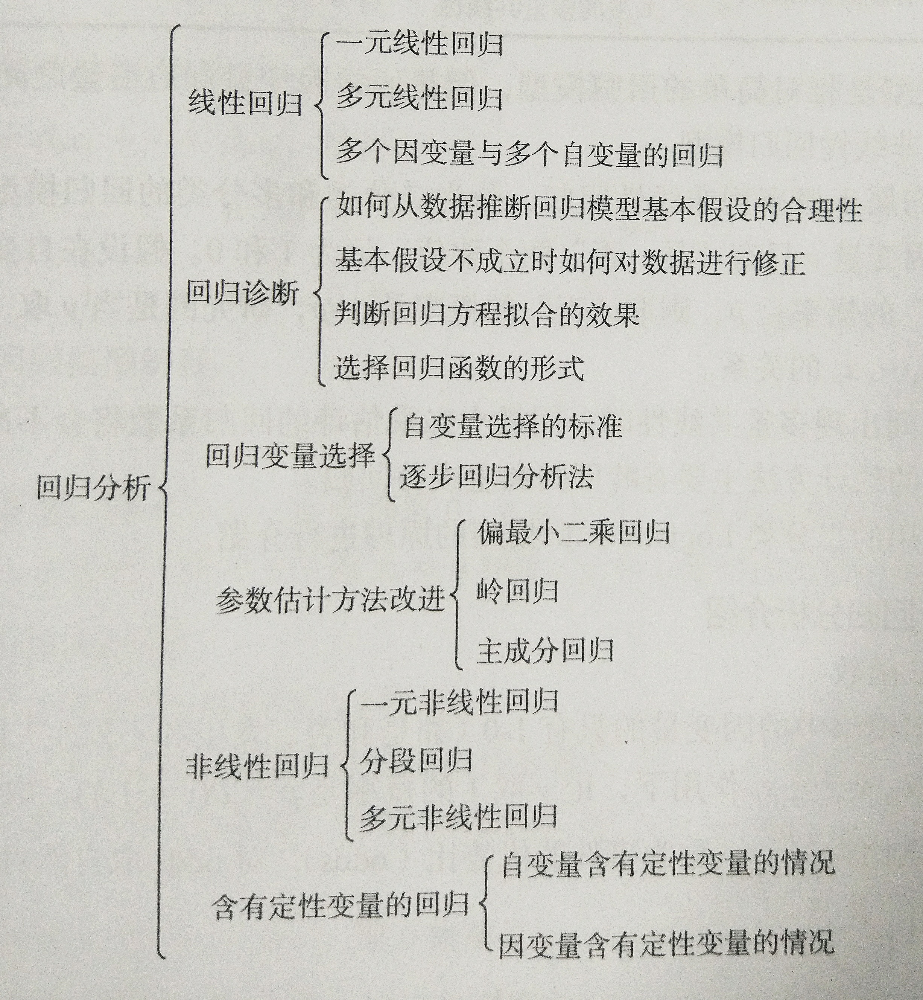

# 概述

经过数据探索与数据预处理，得到了可以直接建模的数据。根据挖掘目标和数据形式可以建立分类与预测、聚类分析、关联规则、时序模式和偏差检测等模型。

# 分类与预测

分类和预测是预测问题的两种主要类型，分类主要是预测分类标号（离散属性），而预测主要是建立连续值函数模型，预测给定自变量对应的因变量的值。

## 实现过程

### 分类

分类是构造一个分类模型，输入样本的属性值，输出对应的类别，将每个样本映射到预先定义好的类别。

分类模型建立在已有类标记的数据集上，模型在已有样本上的准确率可以方便地计算，所以分类属于有监督学习。

### 预测

预测是指建立两种或两种以上变量间相互依赖的函数模型，然后进行预测或控制。

### 实现过程

分类和预测的实现过程类似，以分类模型为例。

分类算法有两步过程：

- 第一步是学习步，通过归纳分析训练模型样本集来建立分类模型得到分类规则
- 第二部是分类步，先用已知的测试样本集评估分类规则的准确率，如果准确率是可以接受的，则使用该模型对未知类标号的待测样本集进行预测

预测模型的实现也有两步：

- 第一步，是通过训练集建立预测属性（数值型）的函数模型
- 第二步，在模型通过检验后进行预测或控制

## 常用的分类与预测算法

| 算法名称   | 算法描述                                     |
| ------ | ---------------------------------------- |
| 回归分析   | 回归分析是确定预测属性（数值型）与其他变量间相互依赖的定量关系最常用的统计学方法。包括线性回归、非线性回归、Logistics回归、岭回归、主成分回归、偏最小二乘回归等模型 |
| 决策树    | 决策树采用自顶向下的递归方式，在内部节点进行属性值的比较，并根据不同的属性值从该节点向下分支，最终得到的叶节点是学习划分的类 |
| 人工神经网络 | 人工神经网络是一种模仿大脑神经网络结构和功能而建立的信息处理系统，表示神经网络的输入与输出变量之间关系的模型 |
| 贝叶斯网络  | 贝叶斯网络又称信度网络，是Bayes方法的扩展，是目前不确定知识表达和推理领域最有效的理论模型之一 |
| 支持向量机  | 支持向量机是一种通过某种非线性映射，把低维的非线性可分转化为高维的线性可分，在高维空间进行线性分析的算法 |

## 回归分析

回归分析是通过建立模型来研究变量之间相互关系的密切程度、结构状态及进行模型预测的一种有效工具。在工商管理、经济、社会、医学和生物学等领域应用十分广泛。

按照研究方法划分，回归分析研究的范围大致如下图。



常见的回归模型如下表。

| 回归模型名称     | 使用条件              | 算法描述                                     |
| ---------- | ----------------- | ---------------------------------------- |
| 线性回归       | 因变量与自变量是线性关系      | 对一个或多个自变量和因变量之间的线性关系进行建模，可用最小二乘法求解模型系数   |
| 非线性回归      | 因变量与自变量之间不都是线性关系  | 对一个或多个自变量和因变量之间的非线性关系进行建模。如果非线性关系可以通过简单的函数变换转化成线性关系，用线性回归的思想求解；如果不能转化，用非线性最小二乘法方法求解 |
| Logistic回归 | 因变量一般有1和0（是否）两种取值 | 是广义线性回归模型的特例，利用Logistic函数将因变量的取值范围控制在0和1之间，表示取值为1的概率 |
| 岭回归        | 参与建模的自变量之间具有多重共线性 | 是一种改变最小二乘估计的方法                           |
| 主成分回归      | 参与建模的自变量之间具有多重共线性 | 主成分回归是根据主成分分析的思想提出来的，是对最小二乘法的一种改进，它是参数估计的一种有偏估计。可以消除自变量之间的多重共线性 |

线性回归模型是相对简单的回归模型，但是通过因变量和自变量之间呈现某种曲线关系，就需要建立非线性回归模型。

Logistic回归属于概率型非线性回归，分为二分类和多分类的回归模型。

当自变量之间出现多重共线性时，用最小二乘估计的回归系数将会不准确，消除多重共线性的参数改变的估计方法主要有岭回归和主成分回归。

### Logistic回归分析

#### Logistic函数

- Logistic回归模型中的因变量只有{ 1，0 }两种取值
- 事件优势比（odds）
- Logistic变换
- Logistic函数

#### Logistic回归模型

Logistic回归模型是建立Logistic变换与自变量的线性回归模型

#### Logistic建模步骤

- 根据分析目的设置指标变量（因变量和自变量），然后收集数据，根据收集到的数据，对特征再次进行筛选
- y取1的概率是`p = P(y=1|X)`，取0的概率是`1-p`。用`ln(p/(1-p))`和自变量列出线性回归方程，估计出模型中的回归系数
- 进行模型检验。模型有效性的检验指标又很多，最基本的有正确率，其次有混淆矩阵、ROC曲线、KS值等
- 模型应用：输入自变量取值，就可以得到预测变量的值，或者根据预测变量的值去控制自变量的取值

**示例程序**

```python
#!/usr/bin python3
# coding: utf-8

"""
AUTHOR: bovenson
EMAIL: szhkai@qq.com
FILE: 001.py
DATE: 17-9-28 上午9:47
DESC: 对某银行在降低贷款拖欠率的数据进行逻辑回归建模
逻辑回归 自动建模
"""
import pandas as pd
from sklearn.linear_model import LogisticRegression as LR
from sklearn.linear_model import RandomizedLogisticRegression as RLR


file_name = './data/bankloan.xls'
data = pd.read_excel(file_name)

x = data.iloc[:, :8].as_matrix()
y = data.iloc[:, 8].as_matrix()

rlr = RLR()  # 建立随机逻辑回归模型，筛选变量
rlr.fit(x, y)   # 训练模型
rlr.get_support()   # 获取特征筛选结果，也可以通过.scores_方法获取各个特征的分数
print(u'通过随机逻辑回归模型筛选特征结束')
print(u'有效特征为: %s' % ','.join(data.columns[rlr.get_support()]))

x = data[data.columns[rlr.get_support()]].as_matrix()   # 筛选好特征

lr = LR()   # 建立逻辑货柜模型
lr.fit(x, y)    # 用筛选后的特征数据来训练模型
print(u'逻辑回归模型训练结束')
print(u'模型的平均正确率为: %s' % lr.score(x, y))    # 给出模型的平均正确率


#### 输出
通过随机逻辑回归模型筛选特征结束
有效特征为: 工龄,地址,负债率,信用卡负债
逻辑回归模型训练结束
模型的平均正确率为: 0.814285714286
```

**分析**

利用Scikit-Learn对这个数据集进行逻辑回归分析

首先进行特征筛选，特征筛选的方法有很多，主要包含在Scikit-Learn的feature_selection库中：

- F检验(f_regression)：给出各个特征的F值和p值，从而进行筛选变量

- 递归特征消除(Recursive Feature Elimination， RFE)

  递归消除的主要思想是反复地构建模型（如SVM或回归模型），然后选出最好的（或最差的）特征。Scikit-Lear您提供了RFE包，可以用于特征消除，还提供了RFECV，可以通过交叉验证来对特征进行排序

- 稳定性选择(Stability Selection)

  稳定性选择是一种基于二次抽样和选择算法相结合的方法。选择算法可以是回归、SVM或其他类似方法。它的主要思想是在不同的数据子集和特征子集上运行特征选择算法，不断重复，最终汇总特征选择结果。

逻辑回归本质上还是一种线性模型，因此这里的模型有效性检验本质上还是在做线性相关检验，因此，所筛选出来的变量，说明与结果具有比较强的线性相关性，然而被筛选掉的变量并不一定就跟结果没有关系，因为他们之间可能是非线性关系。

对于非线性关系的变量筛选方法有决策树、神经网络等。

## 决策树

决策树方法在分类、预测、规则提取等领域有着广泛应用。

决策树是一种树状结构，它的每一个叶节点对应着一个分类，非叶节点对应着在某个属性上的划分，根据样本在该属性上的不同取值将其划分成若干个子集。对于非纯的叶节点，多数类的标号给出到达这个节点的额样本所属的类。

构造决策树的核心问题是在每一步如何选择适当的属性对样本做拆分。

对一个分类问题，从已知类标记的训练样本中学习并构造除决策树是一个自上而下，分而治之的过程。                                                                           

**常见决策树算法**

| 决策树算法  | 算法描述                                     |
| ------ | ---------------------------------------- |
| ID3算法  | 其核心是在决策树的各级节点上，使用信息增益方法作为属性的选择标准，来帮助确定生成每个节点时所应采用的合适属性 |
| C4.5算法 | C4.5决策树生成算法相对于ID3算法的重要改进是使用信息增益率来选择节点属性。C4.5算法可以克服ID3算法存在的不足：ID3算法只适用于离散的描述属性，而C4.5算法既能够处理离散的描述属性，也可以处理连续的描述属性 |
| CART算法 | CART决策树是一种十分有效的非参数分类和回归方法，通过构建树、修剪树、评估树来构建一个二叉树。当终结点是连续变量时，该树为回归树；当终结点是分类变量，该树是分类树 |

