# 概念

卷积神经网络(Convolutional Neural Network,**CNN**).

- 一种前馈神经网络
- 一种特殊的深层的神经网络模型

- 深度学习的一种模型
- 可以看成是多层的神经网络
- 隐含层的卷积层和池采样层是实现卷积神经网络特征提取功能的核心模块
- 采用梯度下降法，最小化损失函数对网络中的权重参数逐层反向调节，通过频繁的迭代训练提高网络的精度卷积神经网络的低隐层是由卷积层和最大池采样层交替组成，高层是全连接层对应传统多层感知器的隐含层和逻辑回归分类器

## 相关概念

### 卷积

在图像处理中卷积主要用作：图像模糊、锐化和边缘检测等。

对图像（不同的数据窗口数据）和滤波矩阵（一组固定的权重：因为每个神经元的多个权重固定，所以又可以看做一个恒定的滤波器filter）做**内积**（逐个元素相乘再求和）的操作就是所谓的“卷积”操作，也是卷积神经网络的名字来源。卷积的重要的物理意义是一个函数（如：单位响应）在另一个函数（如：输入信号）上的加权叠加。卷积过程可以描述为：用一个可训练的滤波器fx去卷积一个输入的图像（第一阶段是输入的图像，后面的阶段就是卷积特征map了），然后加一个偏置bx，得到卷积层Cx。卷积神经网络的训练目的就是最小化损失函数值。

自然图像有其固有特性，也就是说，图像的一部分的统计特性与其他部分是一样的。这也意味着我们在这一部分学习的特征也能用在另一部分上，所以对于这个图像上的所有位置，我们都能使用同样的学习特征。

从图片的**左上角**开始，将它放在**3\*3核的中间，按照核的各个方格的权重，加权平均**。将这个**加权平均后的数值**放在一个**新的空图片**中的相应位置（和原来的图像大小相同）。让核的中心走过每一个像素位置，这样**每一次都能数出一个和周围八个点加权平均过的值**，并把它放进新的图片。**当原图的所有像素位置走完，新图的每个位置都有了值，产生的模糊的图像。**同时，这样的算法是**高度并行**的，因为你会发现**新图像中每一个点的值都只和老图像中、以这个点为中心的九个点有关系**，都是最开始就知道的，不需要运算，**所有计算可以同时进行**。**卷积核中的九个权值的分布按照高斯分布（正态分布、常态分布）来离散化**的话，就叫做**高斯卷积核**。用高斯卷积核做的图像模糊，就叫做高斯模糊。 这个所谓的模糊，视觉上就是感觉到看的“不分明”，亮出没有那么亮，暗处没有那么暗，边界两边对比也不严重——就是像求均值的感觉一样，这里是一种局部求均值的方法。抛开高斯，卷积核的权重取值不同、用法不同就会产生很多不同的用处，我们永远会想到图像中**两个像素相距越近，它们有联系的可能性就越大**，那么我们可以认为一个点同它周围的八个点最有联系！绝对化一定，在某种模型中，认为一个点的取值只由它周围的点决定，跟其他点毫无关系——这个模型产生了很多有趣、强大的图像处理算法，被叫做**马尔可夫随机场**。所以说，图像处理中的**卷积思想**是一种极佳的解决问题的思考方式。

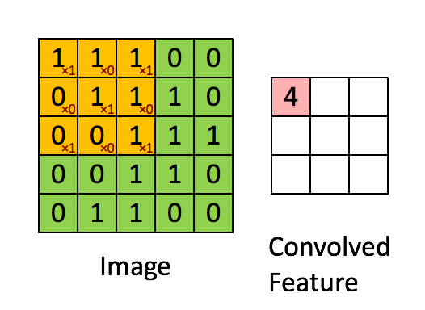

线性滤波可以说是图像处理最基本的方法，它可以允许我们对图像进行处理，产生很多不同的效果。做法很简单。首先，我们有一个二维的滤波器矩阵（有个高大上的名字叫卷积核）和一个要处理的二维图像。然后，对于图像的每一个像素点，计算它的邻域像素和滤波器矩阵的对应元素的乘积，然后加起来，作为该像素位置的值。这样就完成了**滤波过程**。

 对图像和滤波矩阵进行逐个元素相乘再求和的操作就相当于将一个二维的函数移动到另一个二维函数的所有位置，这个操作就叫卷积或者协相关。卷积和协相关的差别是，卷积需要先对滤波矩阵进行180的翻转，但如果矩阵是对称的，那么两者就没有什么差别了。

### 池化

卷积层是对图像的一个邻域进行卷积得到图像的邻域特征，亚采样层（池化层）就是使用pooling技术将小邻域内的特征点整合得到新的特征。 在完成卷积特征提取之后，对于每一个隐藏单元，它都提取到 (r-a+1)×(c-b+1)个特征，把它看做一个矩阵，并在这个矩阵上划分出几个不重合的区域，然后在每个区域上计算该区域内特征的均值或最大值，然后用这些均值或最大值参与后续的训练，这个过程就是池化。

在通过卷积获得了特征 (features) 之后，下一步我们希望利用这些特征去做分类。理论上讲，人们可以用所有提取得到的特征去训练分类器，例如 softmax 分类器，但这样做面临计算量的挑战。例如：对于一个 96X96 像素的图像，假设我们已经学习得到了400个定义在8X8输入上的特征，每一个特征和图像卷积都会得到一个 (96 − 8 + 1) * (96 − 8 + 1) = 7921 维的卷积特征，由于有 400 个特征，所以每个样例 (example) 都会得到一个 892 * 400 = 3,168,400 维的卷积特征向量。学习一个拥有超过 3 百万特征输入的分类器十分不便，并且容易出现过拟合 (over-fitting)。

为了解决这个问题，首先回忆一下，我们之所以决定使用卷积后的特征是因为图像具有一种“静态性”的属性，这也就意味着在一个图像区域有用的特征极有可能在另一个区域同样适用。因此，为了描述大的图像，一个很自然的想法就是对不同位置的特征进行聚合统计，例如，人们可以计算图像一个区域上的某个特定特征的平均值 (或最大值)。这些概要统计特征不仅具有低得多的维度 (相比使用所有提取得到的特征)，同时还会改善结果(不容易过拟合)。**这种聚合的操作就叫做池化** (pooling)，有时也称为平均池化或者最大池化 (取决于计算池化的方法)。

下图显示池化如何应用于一个图像的四块不重合区域。

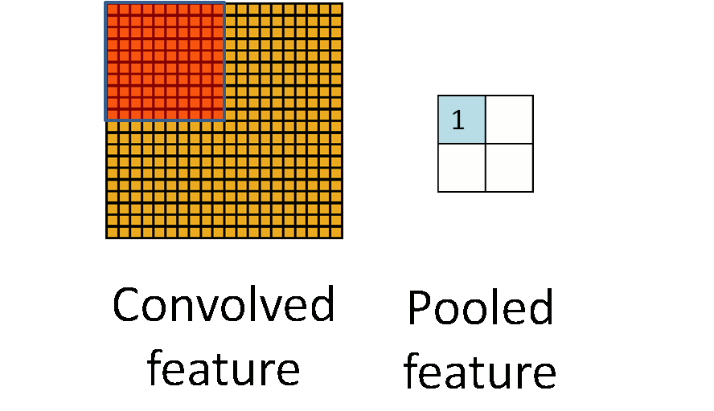

#### 池化的不变性

如果人们选择图像中的连续范围作为池化区域，并且只是池化相同(重复)的隐藏单元产生的特征，那么，这些池化单元就具有平移不变性 (translation invariant)。这就意味着即使图像经历了一个小的平移之后，依然会产生相同的 (池化的) 特征。在很多任务中 (例如物体检测、声音识别)，我们都更希望得到具有平移不变性的特征，因为即使图像经过了平移，样例(图像)的标记仍然保持不变。例如，如果你处理一个MNIST数据集的数字，把它向左侧或右侧平移，那么不论最终的位置在哪里，你都会期望你的分类器仍然能够精确地将其分类为相同的数字。

#### 形式化描述

形式上，在获取到我们前面讨论过的卷积特征后，我们要确定池化区域的大小(假定为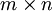，来池化我们的卷积特征。那么，我们把卷积特征划分到数个大小为 的不相交区域上，然后用这些区域的平均(或最大)特征来获取池化后的卷积特征。这些池化后的特征便可以用来做分类。

### 隐藏层

除输入层和输出层以外的其他各层叫做隐藏层.隐藏层不直接接受外界的信号,也不直接向外界发送信号.

### 输入层

输入层和单级网络一样,该层只起到输入信号的扇出作用.所以在计算网络的层数时不被记入.该层负责接收来自网络外部的信息,被记作第0层.

### 输出层

网络的最后一层,具有该网络的最大层号,负责输出网络的计算结果.

### 偏置量（bias）

加入额外的偏置量，用来消除输入带有的一些无关的干扰量。

# 组成

- 神经元
- 激励函数单元
- 误差函数
- 梯度下降法
- 神经网络连接
- 反向传播(Back Propagation, BP)算法

# 特点

- 神经元间的连接是非全连接的
- 同一层中某些神经元之间的连接的权重是共享的(即相同的)
- 它的非全连接和权值共享的网络结构使之更类似于生物神经网络，降低了网络模型的复杂度（对于很难学习的深层结构来说，这是非常重要的），减少了权值的数量
- 可把二维图像直接作为输入，可避免针对数据进行复杂处理，方便提取图像特征
- CNN的特征提取功能是自动学习的，这比人工设定特征提取来得可靠
- 局部感受野、权重共享和下采样使训练参数减少，同时使其可以并行训练，提高神经网络训练速度

## 局部连接与权值共享

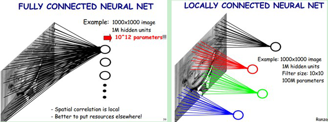

对于一个1000 × 1000的输入图像而言，如果下一个隐藏层的神经元数目为10^6个，采用全连接则有1000 × 1000 × 10^6 = 10^12个权值参数，如此数目巨大的参数几乎难以训练；而采用局部连接，隐藏层的每个神经元仅与图像中10 × 10的局部图像相连接，那么此时的权值参数数量为10 × 10 × 10^6 = 10^8，将直接减少4个数量级。

尽管减少了几个数量级，但参数数量依然较多。能不能再进一步减少呢？能！方法就是**权值共享**。具体做法是，在局部连接中隐藏层的每一个神经元连接的是一个10 × 10的局部图像，因此有10 × 10个权值参数，**将这10 × 10个权值参数共享给剩下的神经元，也就是说隐藏层中10^6个神经元的权值参数相同**，那么此时不管隐藏层神经元的数目是多少，需要训练的参数就是这 **10 × 10个权值参数**（也就是卷积核(也称滤波器)的大小），如下图。

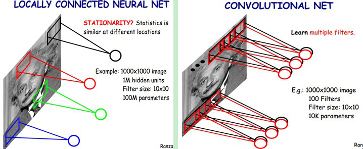

这大概就是CNN的一个神奇之处，尽管只有这么少的参数，依旧有出色的性能。但是，这样仅提取了图像的一种特征，如果要多提取出一些特征，可以增加多个卷积核，不同的卷积核能够得到图像的不同映射下的特征，称之为**Feature Map**。如果有100个卷积核，最终的权值参数也仅为100 × 100 = 10^4个而已。另外，偏置参数也是共享的，同一种滤波器共享一个。

**卷积神经网络的核心思想是：局部感受野(local field)，权值共享以及时间或空间亚采样这三种思想结合起来，获得了某种程度的位移、尺度、形变不变性**。

# 结构

下图是一个经典的CNN结构，称为**LeNet-5网络.**

可以看出，CNN中主要有两种类型的网络层，分别是**卷积层**和**池化/采样层(Pooling)**。卷积层的作用是提取图像的各种特征；池化层的作用是对原始特征信号进行抽象，从而大幅度减少训练参数，另外还可以减轻模型过拟合的程度。

## 卷积层

卷积层是卷积核在上一级输入层上通过逐一滑动窗口计算而得，卷积核中的每一个参数都相当于传统神经网络中的权值参数，与对应的局部像素相连接，将卷积核的各个参数与对应的局部像素值相乘之和，（通常还要再加上一个偏置参数），得到卷积层上的结果。如下图所示。

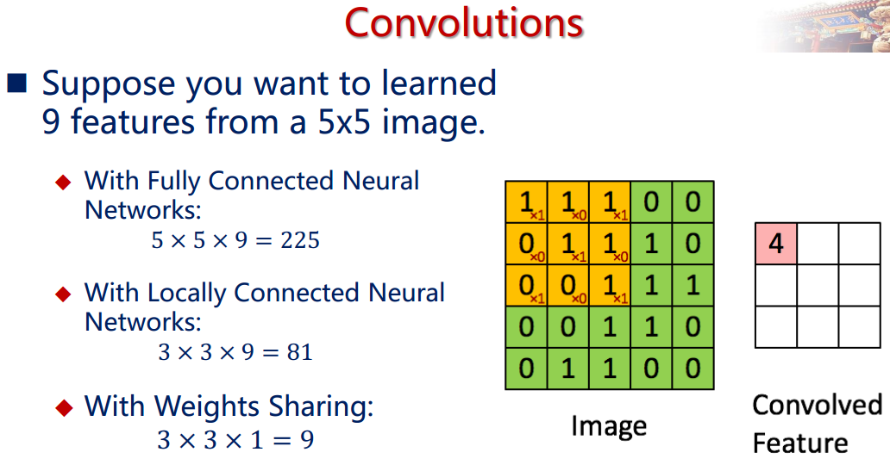

## 池化/采样层

通过卷积层获得了图像的特征之后, 理论上我们可以直接使用这些特征训练分类器（如softmax），但是这样做将面临巨大的计算量的挑战，而且容易产生过拟合的现象。为了进一步降低网络训练参数及模型的过拟合程度，我们对卷积层进行**池化/采样(Pooling)**处理。池化/采样的方式通常有以下两种：

- Max-Pooling: 选择Pooling窗口中的最大值作为采样值；

- Mean-Pooling: 将Pooling窗口中的所有值相加取平均，以平均值作为采样值；

  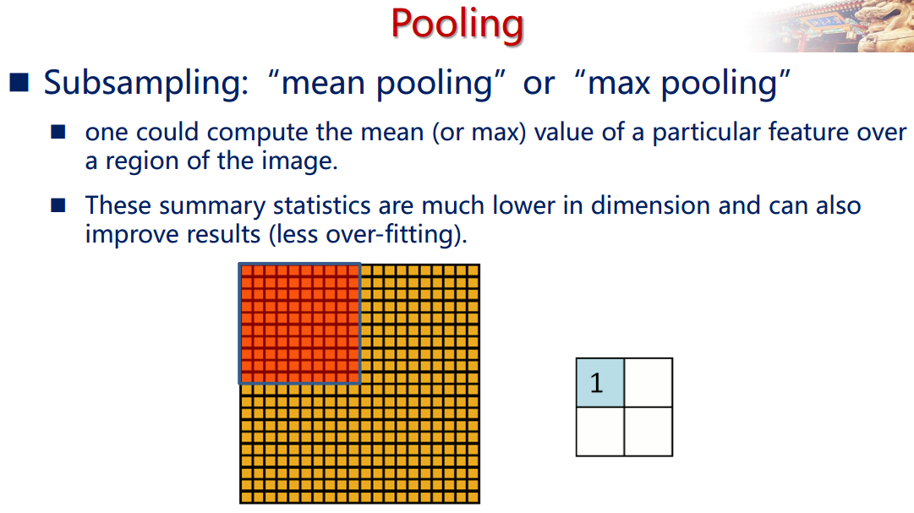

## 示例

### LeNet-5网络

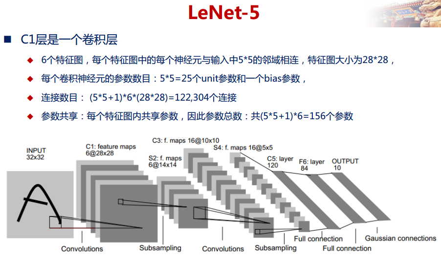
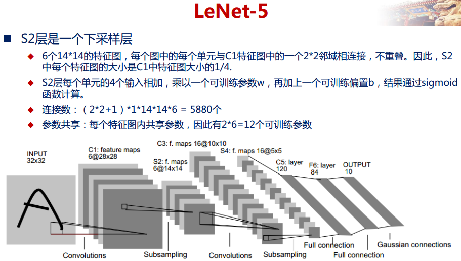

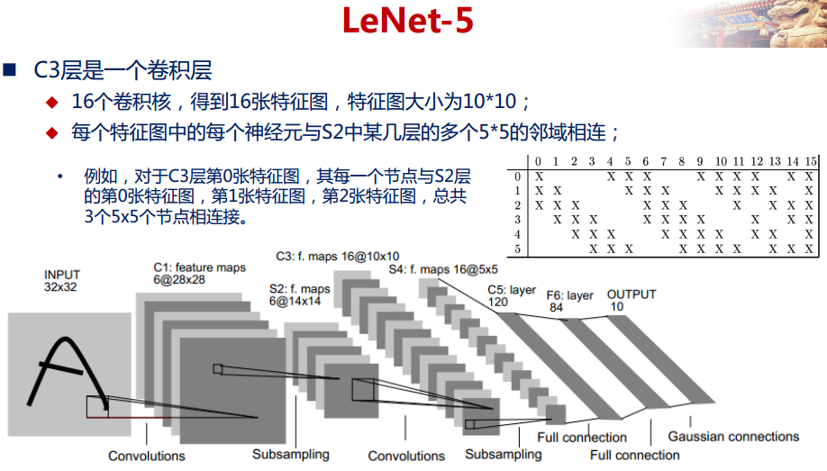
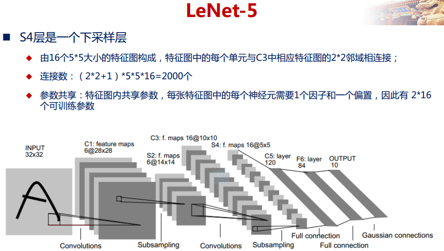
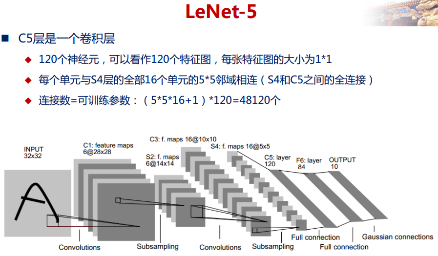
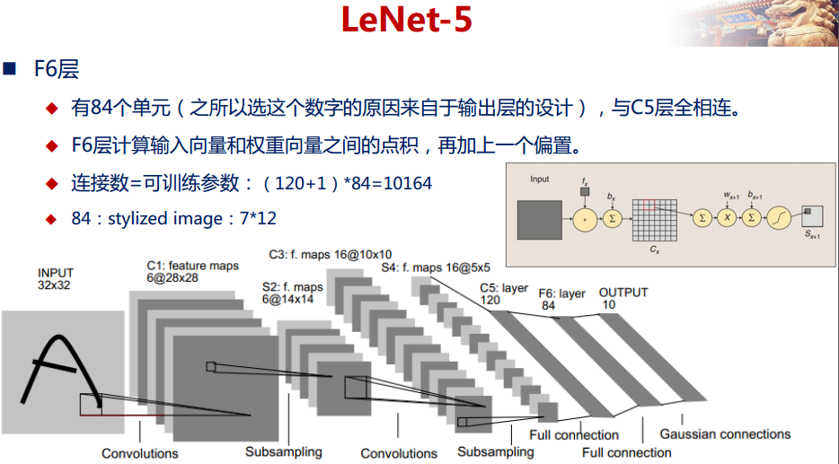

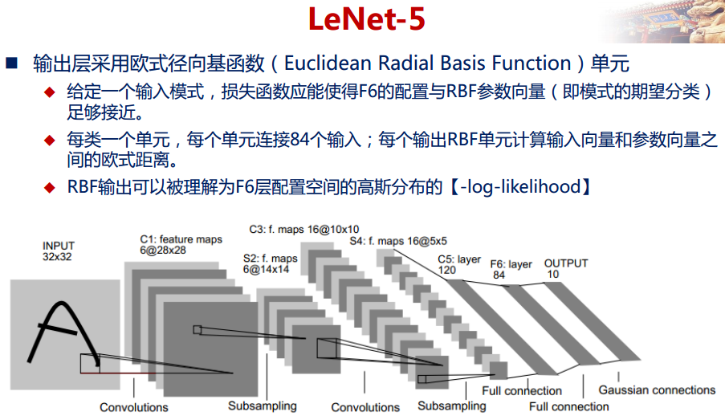

# 训练及求导

CNN通过三个方法来实现识别图像的位移、缩放和扭曲不变性，即局域感受野、权值共享和次抽样。局域感受野指的是每一层网络的神经元只与上一层的一个小邻域内的神经单元连接，通过局域感受野，每个神经元可以提取初级的视觉特征，如方向线段，端点和角点等；权值共享使得CNN具有更少的参数，需要相对少的训练数据；次抽样可以减少特征的分辨率，实现对位移、缩放和其它形式扭曲的不变性。卷积层之后通常用一个次抽样层来减少计算时间、建立空间和结构上的不变性。
构造好网络之后，需要对网络进行求解，如果像传统神经网络一样分配参数，则每一个连接都会有未知参数。而CNN采用的是权值共享，这样一来通过一幅特征图上的神经元共享同样的权值就可以大大减少自由参数，这可以用来检测相同的特征在不同角度表示的效果。在网络设计中通常都是抽样层与卷积层交替出现，全连接层的前一层通常为卷积层。
在CNN中，权值更新是基于反向传播算法。
CNN在本质上是一种输入到输出的映射，它能够学习大量的输入与输出之间的映射关系，而不需要任何输入和输出之间的精确的数学表达式，只要用已知的模式对卷积网络加以训练，网络就具有输入输出对之间的映射能力。卷积网络执行的是监督训练，所以其样本集是由形如：输入向量，理想输出向量的向量对构成的。所有这些向量对，都应该是来源于网络即将模拟系统的实际“运行”结构，它们可以是从实际运行系统中采集来。在开始训练前，所有的权都应该用一些不同的随机数进行初始化。“小随机数”用来保证网络不会因权值过大而进入饱和状态，从而导致训练失败；“不同”用来保证网络可以正常地学习。实际上，如果用相同的数去初始化权矩阵，则网络无学习能力。

## 训练

### 算法

训练算法主要包括四步，这四步被分为两个阶段.

**第一阶段:**

- 从样本集中取一个样本，输入网络；
- 计算相应的实际输出；在此阶段，信息从输入层经过逐级的变换，传送到输出层。这个过程也是网络在完成训练后正常执行时执行的过程。

**第二阶段:**

- 计算实际输出与相应的理想输出的差；
- 按极小化误差的方法调整权矩阵。

这两个阶段的工作一般应受到精度要求的控制。

### 过程

网络的训练过程如下：

- 选定训练组，从样本集中分别随机地寻求N个样本作为训练组；
- 将各权值、阈值，置成小的接近于0的随机值，并初始化精度控制参数和学习率；
- 从训练组中取一个输入模式加到网络，并给出它的目标输出向量；
- 计算出中间层输出向量，计算出网络的实际输出向量；
- 将输出向量中的元素与目标向量中的元素进行比较，计算出输出误差；对于中间层的隐单元也需要计算出误差；
- 依次计算出各权值的调整量和阈值的调整量；
- 调整权值和调整阈值；
- 当经历M后，判断指标是否满足精度要求，如果不满足，则返回(3)，继续迭代；如果满足就进入下一步；
- 训练结束，将权值和阈值保存在文件中。这时可以认为各个权值已经达到稳定，分类器已经形成。再一次进行训练，直接从文件导出权值和阈值进行训练，不需要进行初始化。

## 卷积神经网络推导

### 全连接的反向传播算法

典型的CNN中，开始几层都是卷积和下采样的交替，然后在最后一些层（靠近输出层的），都是全连接的一维网络。这时候我们已经将所有两维2D的特征maps转化为全连接的一维网络的输入。这样，当你准备好将最终的2D特征maps输入到1D网络中时，一个非常方便的方法就是把所有输出的特征maps连接成一个长的输入向量。然后我们回到BP算法的讨论。（更详细的基础推导可以参考UFLDL中“反向传导算法”）。

#### Feedforward Pass 前向传播

在下面的推导中，我们采用平方误差代价函数。我们讨论的是多类问题，共c类，共N个训练样本。

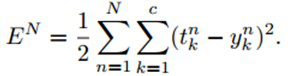

这里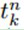表示第n个样本对应的标签的第k维。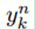表示第n个样本对应的网络输出的第k个输出。对于多类问题，输出一般组织为“one-of-c”的形式，也就是只有该输入对应的类的输出节点输出为正，其他类的位或者节点为0或者负数，这个取决于你输出层的激活函数。sigmoid就是0，tanh就是-1.

因为在全部训练集上的误差只是每个训练样本的误差的总和，所以这里我们先考虑对于一个样本的BP。对于第n个样本的误差，表示为：

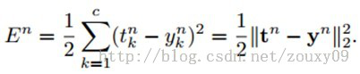

传统的全连接神经网络中，我们需要根据BP规则计算代价函数E关于网络每一个权值的偏导数。我们用l来表示当前层，那么当前层的输出可以表示为：

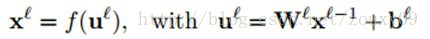

输出激活函数f(.)可以有很多种，一般是sigmoid函数或者双曲线正切函数。sigmoid将输出压缩到[0, 1]，所以最后的输出平均值一般趋于0 。所以如果将我们的训练数据归一化为零均值和方差为1，可以在梯度下降的过程中增加收敛性。对于归一化的数据集来说，双曲线正切函数也是不错的选择。

#### Backpropagation Pass 反向传播

反向传播回来的误差可以看做是每个神经元的基的灵敏度sensitivities（灵敏度的意思就是我们的基b变化多少，误差会变化多少，也就是误差对基的变化率，也就是导数了），定义如下：（第二个等号是根据求导的链式法则得到的）

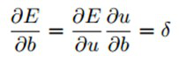

因为∂u/∂b=1，所以∂E/∂b=∂E/∂u=δ，也就是说bias基的灵敏度∂E/∂b=δ和误差E对一个节点全部输入u的导数∂E/∂u是相等的。这个导数就是让高层误差反向传播到底层的神来之笔。反向传播就是用下面这条关系式：（下面这条式子表达的就是第l层的灵敏度，就是）

​		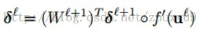 公式(1)

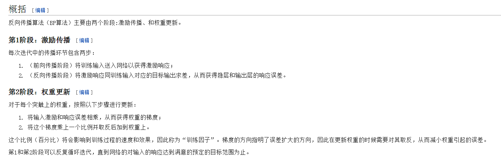

这里的“◦”表示每个元素相乘。输出层的神经元的灵敏度是不一样的：

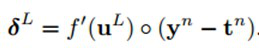

最后，对每个神经元运用delta（即δ）规则进行权值更新。具体来说就是，对一个给定的神经元，得到它的输入，然后用这个神经元的delta（即δ）来进行缩放。用向量的形式表述就是，对于第l层，误差对于该层每一个权值（组合为矩阵）的导数是该层的输入（等于上一层的输出）与该层的灵敏度（该层每个神经元的δ组合成一个向量的形式）的叉乘。然后得到的偏导数乘以一个负学习率就是该层的神经元的权值的更新了：

# 调参

## 注意事项

### 数据集的大小和分块

数据驱动的模型一般依赖于数据集的大小，CNN和其它经验模型一样，能适用于任意大小的数据集，但用于训练的数据集应该足够大，能够覆盖问题域中所有已知可能出现的问题。设计CNN的时候，数据集中应该包含三个子集：训练集、测试集、验证集。训练集应该包含问题域中的所有数据，并在训练阶段用来调整网络权值。测试集用来在训练过程中测试网络对于训练集中未出现的数据的分类性能。根据网络在测试集上的性能情况，网络的结构可能需要做出调整，或者增加训练循环的次数。验证集中的数据同样应该包含在测试集合训练集中没有出现过的数据，用于在确定网络结构后能够更加好的测试和衡量网络的性能。Looney等人建议，数据集中的65%用于训练，25%用于测试，剩余的10%用于验证。

### 数据预处理

为了加速训练算法的收敛速度，一般都会采用一些数据预处理技术，这其中包括：去除噪声、输入数据降维、删除无关数据等。数据的平衡化在分类问题中异常重要，一般认为训练集中的数据应该相对于标签类别近似于平均分布，也就是每一个类别标签所对应的数据量在训练集中是基本相等的，以避免网络过于倾向于表现某些分类的特点。为了平衡数据集，应该移除一些过度富余的分类中的数据，并相应的补充一些相对样例稀少的分类中的数据。还有一个办法就是复制一部分这些样例稀少分类中的数据，并在这些输入数据中加入随机噪声。

### 数据规则化

将数据规则化到一个统一的区间（如[0,1]）中具有很重要的优点：防止数据中存在较大数值的数据造成数值较小的数据对于训练效果减弱甚至无效化。一个常用的方法是将输入和输出数据按比例调整到一个和激活函数（sigmoid函数等）相对应的区间。

### 网络权值初始化

CNN的初始化主要是初始化卷积层和输出层的卷积核（权重）和偏置。

网络权值初始化就是将网络中的所有连接权值（包括阈值）赋予一个初始值。如果初始权值向量处在误差曲面的一个相对平缓的区域的时候，网络训练的收敛速度可能会异常缓慢。一般情况下，网络的连接权值和阈值被初始化在一个具有0均值的相对小的区间内均匀分布，比如[-0.30, +0.30]这样的区间内。

### BP算法的学习速率

如果学习速率n选取的比较大则会在训练过程中较大幅度的调整权值w，从而加快网络训练的速度，但这会造成网络在误差曲面上搜索过程中频繁抖动且有可能使得训练过程不能收敛，而且可能越过一些接近优化w。同样，比较小的学习速率能够稳定的使得网络逼近于全局最优点，但也有可能陷入一些局部最优区域。对于不同的学习速率设定都有各自的优缺点，而且还有一种自适应的学习速率方法，即n随着训练算法的运行过程而自行调整。

### 收敛条件

有几个条件可以作为停止训练的判定条件，训练误差、误差梯度和交叉验证。一般来说，训练集的误差会随着网络训练的进行而逐步降低。

### 训练方式

训练样例可以有两种基本的方式提供给网络训练使用，也可以是两者的结合：逐个样例训练(EET)、批量样例训练(BT)。在EET中，先将第一个样例提供给网络，然后开始应用BP算法训练网络，直到训练误差降低到一个可以接受的范围，或者进行了指定步骤的训练次数。然后再将第二个样例提供给网络训练。EET的优点是相对于BT只需要很少的存储空间，并且有更好的随机搜索能力，防止训练过程陷入局部最小区域。EET的缺点是如果网络接收到的第一个样例就是劣质（有可能是噪音数据或者特征不明显）的数据，可能使得网络训练过程朝着全局误差最小化的反方向进行搜索。相对的，BT方法是在所有训练样例都经过网络传播后才更新一次权值，因此每一次学习周期就包含了所有的训练样例数据。BT方法的缺点也很明显，需要大量的存储空间，而且相比EET更容易陷入局部最小区域。而随机训练（ST）则是相对于EET和BT一种折衷的方法，ST和EET一样也是一次只接受一个训练样例，但只进行一次BP算法并更新权值，然后接受下一个样例重复同样的步骤计算并更新权值，并且在接受训练集最后一个样例后，重新回到第一个样例进行计算。ST和EET相比，保留了随机搜索的能力，同时又避免了训练样例中最开始几个样例如果出现劣质数据对训练过程的过度不良影响。

## 误差分析

卷积神经网络中的权值更新也是使用误差的反向传播算法。损失函数一般使用最小平方误差函数。由于卷积网络中存在两部分区域：卷积区和全连接区，它们在计算损失时有所不同我们将其分开进行讨论。

### 全连接的权值更新

这一部分与经典的人工神经网络不同之处在于多了一个偏置值。我们主要对多出的这个偏置值的更新进行分析即可，其他的权值变化和人工神经网络的方法类似。

对于全连接区的第l层的输出函数为：

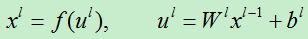

第n个训练样例的误差损失为：

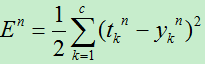

由于在计算输出时有两类参数：权向量w和基值b。现在分别对其计算。我们对其使用梯度下降算法。设网络共有L层。

​	1）对基值b，（其实在每层，b是一个向量）

​		A）对于第L层损失函数对基的偏导数为：

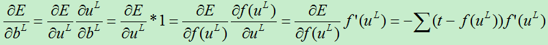

由于每层都有多个特征图，每个特征图都对应一个基值，因为上面的其实求偏导数实际上是对基向量的偏导数。

　　　　为了方便表述，我们将误差对基的导数定义为灵敏度，其表达式为：

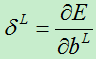

　　2）对权向量w，（在每层，w是一个矩阵）

　　　　A）对于第L层的权值，我们有：

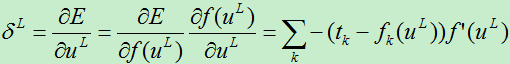

​		B）对于第l层的权值，求偏导数：

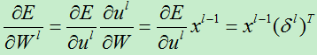

​		所以权值的改变量为：

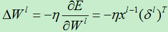

### 卷积区的权值更新

由于卷积层和抽样层的计算方式有所不同，我们分别对其进行分析：

#### 卷积层误差项分析

由于当前层的权值通过输出作用于下一层的神经元而产生影响，所以在计算误差函数对权值求导时需要使用链接法。首先卷积层的输出为：

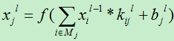

由于卷积层的下一层为抽样层，那么首先需要知道在下一层哪些神经元与该卷积层的节点i的联系，然后根据原来的采样方式进行误差分析。由于采样层在从卷积层采样时，同一个结点不会被重复采样，因而，卷积层的一个局部感受野对应采样层中的神经元的一个输入。
　　假设我们现在分析的卷积层是第l层，则其下一层为l+1层（为池化层）。我们假设第l+1层的误差项为：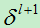,则第l层的节点j的误差项为：

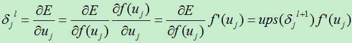

上式并未考虑到第l层到下一层的权值：

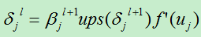

注：为了简便，本人对所有的矩阵，向量运算进行了简化，只把它看成一个单一变量来处理。
　　其中：Ups (x)：对x进行上采样，此处表示下一层的误差项中x的贡献值。
　　其具体操作要根据前面的pooling的方法，因为下一层的pooling层的每个节点由l层的多个节点共同计算得出，pooling层每个节点的误差敏感值也是由卷积层中多个节点的误差敏感值共同产生的。
　　A）若前面使用mean-pooling方法，则将下一层的误差项除以下一层所用的滤波器的大小。假如下一层的滤波器的大小为k*k，则：

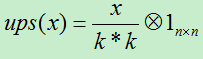

　B）若前面使用max-pooling方法，则将需要记录前向传播过程中pooling区域中最大值的位置，然后判断当前的结点是否在最大位置上，若在最大位置上则直接将当前的下一层的误差值赋值过来即可，否则其值赋0。

　　有了上面了误差损失项，现在我们开始计算损失函数对基的偏导数和对权向量的偏导数：

　　A）基的偏导数

　　损失函数对基的偏导数为：

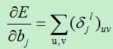

　　B）权值的变化量

　　损失函数对权值的偏导数为：

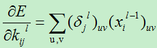

#### 池化层（抽样层）误差项分析

　　对于采样层，其输出值计算公式为：

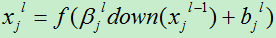

　　其中down(xj)为神经元j的下采样。

　　在这里我们向上面卷积层一样，需要先计算出误差项，然后通过误差项就可以计算得到其他权值和偏置。

　　由于采样层的下一层为卷积层，采样层的每个节点可能被卷积多次。假如当前的采样层为第l层，我们需要计算第j个结点的神经元的误差，则我们首先需要找到第l+1层中哪些神经元用到过结点j，这需要我们在将l层卷积到l+1层的时候保存神经元的映射过程，因为在计算反向传播误差时需要用到。先假设第l+1层中用到结点j的神经元的集合个数为M，

　　则第l层的误差项为：

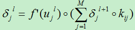

现在我们可以很轻松的对训练偏置和位移偏置的导数：

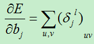

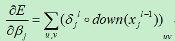

### 总结

上面的关于卷积区的权值的更新需要用到矩阵，向量的内积等操作，在文中大部分地方故意将此进行了弱化，以便于表达式的精简。

其实在上面误差的分析过程中，最核心的步骤就是求解误差项（又称灵敏度），其他的计算都是以此为基础。误差项的求解首先要分析需要计算的结点j与下一层的哪个或哪些节点节点有关联，因为结点j是通过下一层与该节点相连的神经元来影响最终的输出结果，这也就需要保存每一层节点与上一层节点之间的联系，以便在反向计算误差时方便使用。

总之，卷积神经网络的误差分析其核心思想与人工神经网络类似，都是通过反向逐层影响的方法来分析误差。

## 超参

卷积神经网络的训练相比与标准的MLP是相当困难的，因为它添加了更多的超参数。当我们在应用学习率和正则化的规则下，下面的方法也需要在优化CNNs被考虑：

### 滤波器数量

当选择每层滤波器数量的时候，需要记住计算单卷积层的活性比传统的MLP会更加昂贵。

假设第l-1层包含K_(l-1)个特征映射和M*N个像素点（例如，位置数乘以特征映射数），然后第l层有K_(l)个滤波器，尺寸为m*n。那么计算一个特征映射（在(M-m)*(N-n)个像素位置应用每个m*n大小的滤波器）将消耗(M-m)*(N-n)*m*n*K_(l-1)的计算量。然后总共要计算K_l次。如果不是所有的特征只与前一层的所有特征相连，那么事情就变得更加复杂啦。

对标准MLP而言，第l层如果有K_l个神经元，那计算量只有K_(k-1)*K_l。因此，CNNs中滤波器的数量通常比MLPs中隐单元的数量小很多，通常是基于特征映射的尺寸（输入图像的尺寸和滤波器的形状）。

因为特征映射的尺寸会随着深度的增加而减小，靠近输入层的层将趋向于有更少的滤波器，而更高的层有更多的滤波器。事实上，为了平衡每一层的计算量，特征数和图像位置数的乘积在层的传递过程中都是基本一致的。为了保护输入信息，我们需要保证总的激活数量（特征映射数*像素位置数）在层间传递的时候是至于减少（当然我们在做监督学习的时候当然是希望它减小的）。特征映射的数量直接控制整个容量，同时它依赖于可用样例的数目和任务的复杂度。

### 滤波器的尺寸

通常在每个文献中滤波器的尺寸都有很大的不同，它常常是基于数据库的。MNIST在第一层的最好结果是5*5层滤波器。当自然图像（每维有几百个像素）趋向于使用更大的滤波器，例如12 * 12，15 * 15。

因此这个技巧事实上是去寻找正确等级的“粒度”，以便对给定的数据集去形成合适范围内的抽象。

### 最大化池的尺寸

经典的是2 * 2，或者没有最大池化。非常大的图可以在较低的层使用4 * 4的池化。但是需要记住的是，池化在通过16个因子减少信号维度的同时，也可能导致信号细节的大量丢失。

### 学习率（Learning Rate）

学习率决定了权值更新的速度，设置得太大会使结果超过最优值，太小会使下降速度过慢。仅靠人为干预调整参数需要不断修改学习率，因此后面3种参数都是基于自适应的思路提出的解决方案。后面3种参数分别为：Weight Decay 权值衰减，Momentum 动量和Learning Rate Decay 学习率衰减。

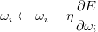

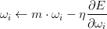

### 权值衰减（Weight decay）

在实际应用中，为了避免网络的过拟合，必须对价值函数（Cost function）加入一些正则项，在SGD中加入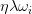这一正则项对这个Cost function进行规范化：

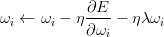

上面这个公式基本思想就是减小不重要的参数对最后结果的影响，网络中有用的权重则不会收到Weight decay影响。**在机器学习或者模式识别中**，会出现overfitting，而当网络逐渐overfitting时网络权值逐渐变大，因此，为了避免出现overfitting,会给误差函数添加一个惩罚项，常用的惩罚项是所有权重的平方乘以一个衰减常量之和。其用来惩罚大的权值。

**weight decay（权值衰减）**的使用既不是为了提高收敛精确度也不是为了提高收敛速度，其最终目的是防止过拟合。在损失函数中，weight decay是放在正则项（regularization）前面的一个系数，正则项一般指示模型的复杂度，所以weight decay的作用是调节模型复杂度对损失函数的影响，若weight decay很大，则复杂的模型损失函数的值也就大。

### 动量（Momentum）

动量来源于牛顿定律，基本思想是为了找到最优加入“惯性”的影响，当误差曲面中存在平坦区域，SGD就可以更快的学习。

**momentum**是梯度下降法中一种常用的加速技术。对于一般的SGD，其表达式为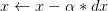,x沿负梯度方向下降。而带momentum项的SGD则写生如下形式：

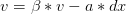

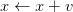

其中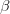即momentum系数，通俗的理解上面式子就是，如果上一次的momentum（即）与这一次的负梯度方向是相同的，那这次下降的幅度就会加大，所以这样做能够达到加速收敛的过程。

### 正规化（normalization）

**normalization**（batch normalization）。batch normalization的是指在神经网络中激活函数的前面，将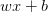按照特征进行normalization，这样做的好处有三点：

- 提高梯度在网络中的流动。Normalization能够使特征全部缩放到[0,1]，这样在反向传播时候的梯度都是在1左右，避免了梯度消失现象
- 提升学习速率。归一化后的数据能够快速的达到收敛
- 减少模型训练对初始化的依赖

### 学习率衰减（Learning Rate Decay）

该方法是为了提高SGD寻优能力，具体就是每次迭代的时候减少学习率的大小。

### 技巧

假如你想要在新的数据集上采用这个模型，下面的一些小技巧可能能让你获得更好的结果：

- 白化(whitening)数据（例如，使用主成分分析）
- 衰减每次迭代的学习速率