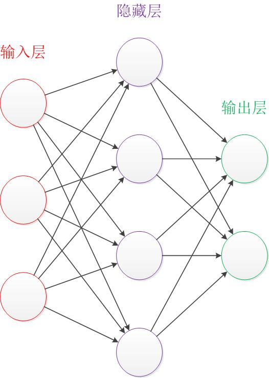
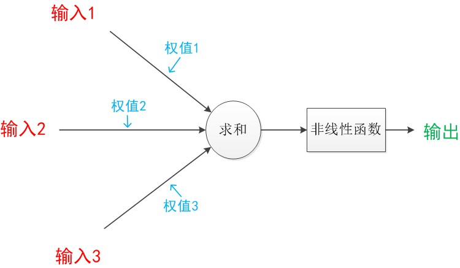
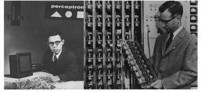
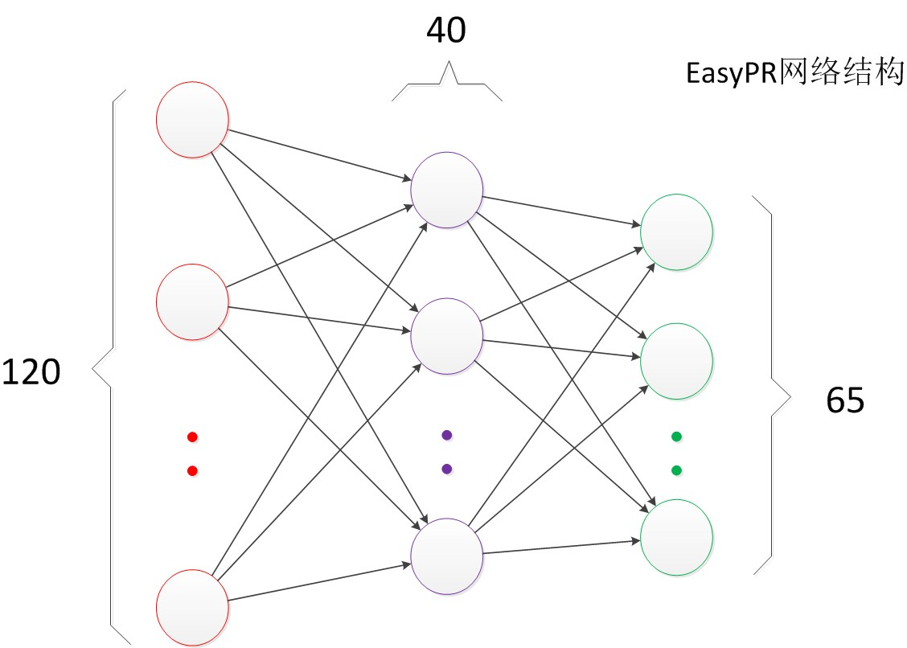
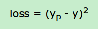
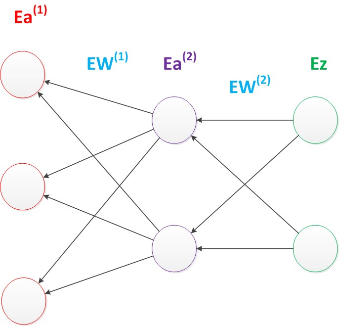
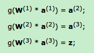
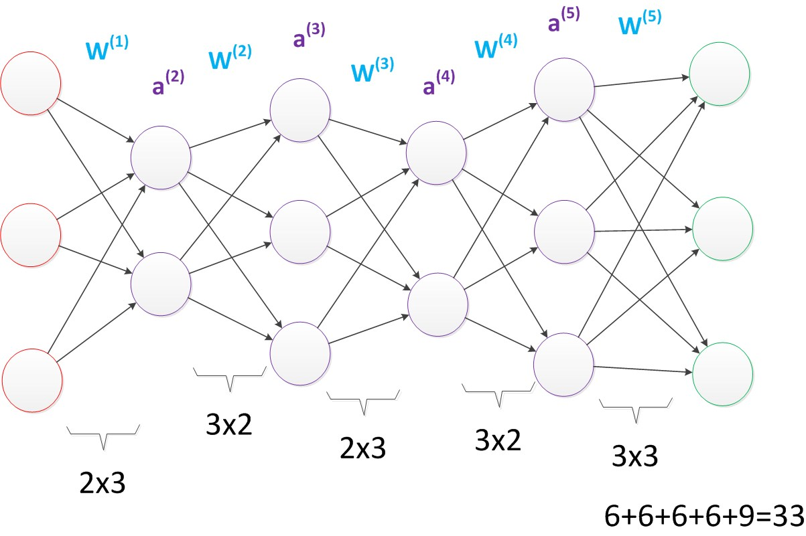
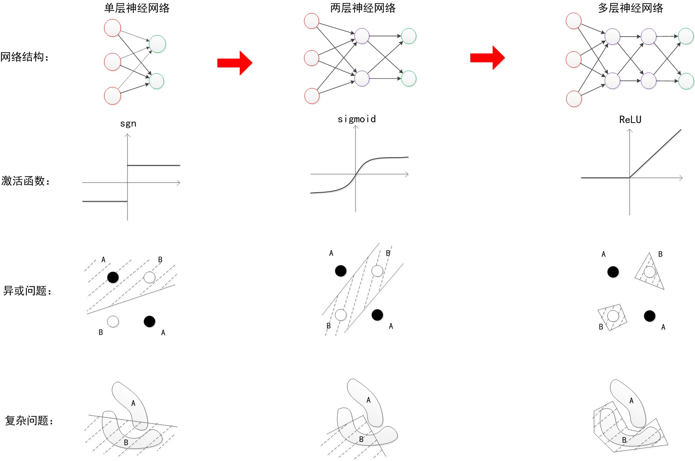
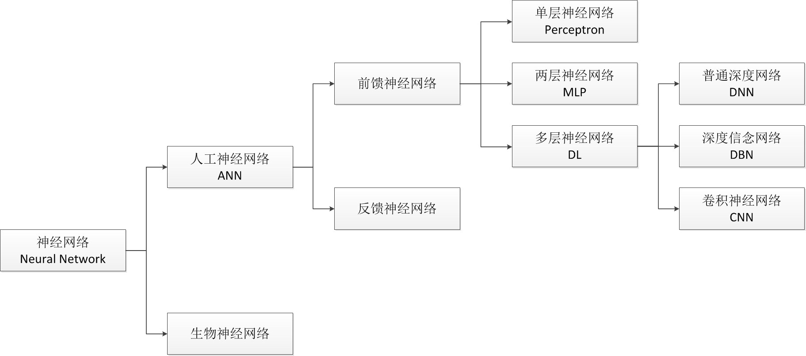

# 概念

- 神经网络是一种模拟人脑的神经网络以期能够实现类人工智能的机器学习技术

下图是一个经典的包含三个层次的神经网络。红色的是**输入层**，绿色的是**输出层**，紫色的是**中间层**（也叫**隐藏层**）。输入层有3个输入单元，隐藏层有4个单元，输出层有2个单元。

- 设计一个神经网络时，输入层与输出层的节点数往往是固定的，中间层则可以自由指定；
- 神经网络结构图中的拓扑与箭头代表着**预测**过程时数据的流向，跟**训练**时的数据流有一定的区别；
- 结构图里的关键不是圆圈（代表“神经元”），而是连接线（代表“神经元”之间的连接）。每个连接线对应一个不同的**权重**（其值称为**权值**），这是需要训练得到的。  

# 神经元

## 引子

对于神经元的研究由来已久，1904年生物学家就已经知晓了神经元的组成结构。

一个神经元通常具有多个**树突**，主要用来接受传入信息；而**轴突**只有一条，轴突尾端有许多轴突末梢可以给其他多个神经元传递信息。轴突末梢跟其他神经元的树突产生连接，从而传递信号。这个连接的位置在生物学上叫做“**突触**”。

人脑中的神经元形状可以用下图做简单的说明：

1943年，心理学家McCulloch和数学家Pitts参考了生物神经元的结构，发表了抽象的神经元模型MP。

## 结构

神经元模型是一个包含输入，输出与计算功能的模型。输入可以类比为神经元的树突，而输出可以类比为神经元的轴突，计算则可以类比为细胞核。下图是一个典型的神经元模型：包含有3个输入，1个输出，以及2个计算功能。

**注意**中间的箭头线。这些线称为“连接”。每个上有一个“权值”。

连接是神经元中最重要的东西。每一个连接上都有一个权重。一个神经网络的训练算法就是让权重的值调整到最佳，以使得整个网络的预测效果最好。

我们使用a来表示输入，用w来表示权值。一个表示连接的有向箭头可以这样理解：在初端，传递的信号大小仍然是a，端中间有加权参数w，经过这个加权后的信号会变成a * w，因此在连接的末端，信号的大小就变成了a * w。

在其他绘图模型里，有向箭头可能表示的是值的不变传递。而在神经元模型里，每个有向箭头表示的是值的加权传递。

如果我们将神经元图中的所有变量用符号表示，并且写出输出的计算公式的话，就是下图。

可见z是在输入和权值的线性加权和叠加了一个**函数g**的值。在MP模型里，函数g是sgn函数，也就是取符号函数。这个函数当输入大于0时，输出1，否则输出0。

下面对神经元模型的图进行一些扩展。首先将sum函数与sgn函数合并到一个圆圈里，代表神经元的内部计算。其次，把输入a与输出z写到连接线的左上方，便于后面画复杂的网络。最后说明，一个神经元可以引出多个代表输出的有向箭头，但值都是一样的。

神经元可以看作一个计算与存储单元。计算是神经元对其的输入进行计算功能。存储是神经元会暂存计算结果，并传递到下一层。

当我们用“神经元”组成网络以后，描述网络中的某个“神经元”时，我们更多地会用“**单元**”（unit）来指代。同时由于神经网络的表现形式是一个有向图，有时也会用“**节点**”（node）来表达同样的意思。 

## 效果

神经元模型的使用可以这样理解：

我们有一个数据，称之为样本。样本有四个属性，其中三个属性已知，一个属性未知。我们需要做的就是通过三个已知属性**预测**未知属性。

具体办法就是使用神经元的公式进行计算。三个已知属性的值是a1，a2，a3，未知属性的值是z。z可以通过公式计算出来。

这里，已知的属性称之为**特征**，未知的属性称之为**目标**。假设特征与目标之间确实是线性关系，并且我们已经得到表示这个关系的权值w1，w2，w3。那么，我们就可以通过神经元模型预测新样本的目标。

## 影响

1943年发布的MP模型，虽然简单，但已经建立了神经网络大厦的地基。但是，MP模型中，权重的值都是预先设置的，因此不能学习。

1949年心理学家Hebb提出了Hebb学习率，认为人脑神经细胞的**突触**（也就是连接）上的强度上可以变化的。于是计算科学家们开始考虑用调整权值的方法来让机器学习。这为后面的学习算法奠定了基础。

尽管神经元模型与Hebb学习律都已诞生，但限于当时的计算机能力，直到接近10年后，第一个真正意义的神经网络才诞生。

# 单层神经网络（感知器）

## 引子

1958年，计算科学家Rosenblatt提出了由两层神经元组成的神经网络。他给它起了一个名字--“感知器”（Perceptron）（有的文献翻译成“感知机”，下文统一用“感知器”来指代）。

感知器是当时首个可以学习的人工神经网络。Rosenblatt现场演示了其学习识别简单图像的过程，在当时的社会引起了轰动。

人们认为已经发现了智能的奥秘，许多学者和科研机构纷纷投入到神经网络的研究中。美国军方大力资助了神经网络的研究，并认为神经网络比“原子弹工程”更重要。这段时间直到1969年才结束，这个时期可以看作神经网络的第一次高潮。

## 结构

下面来说明感知器模型。

在原来MP模型的“输入”位置添加神经元节点，标志其为“输入单元”。其余不变，于是我们就有了下图：从本图开始，我们将权值w1, w2, w3写到“连接线”的中间。

在“感知器”中，有两个层次。分别是输入层和输出层。输入层里的“输入单元”只负责传输数据，不做计算。输出层里的“输出单元”则需要对前面一层的输入进行计算。

我们把需要计算的层次称之为“计算层”，并把拥有一个计算层的网络称之为“单层神经网络”。有一些文献会按照网络拥有的层数来命名，例如把“感知器”称为两层神经网络。但在本文里，我们根据计算层的数量来命名。

假如我们要预测的目标不再是一个值，而是一个向量，例如[2,3]。那么可以在输出层再增加一个“输出单元”。

下图显示了带有两个输出单元的单层神经网络，其中输出单元z1的计算公式如下图。

可以看到，z1的计算跟原先的z并没有区别。

我们已知一个神经元的输出可以向多个神经元传递，因此z2的计算公式如下图。

目前的表达公式有一点不让人满意的就是：w4，w5，w6是后来加的，很难表现出跟原先的w1，w2，w3的关系。

因此我们改用二维的下标，用wx,y来表达一个权值。下标中的x代表后一层神经元的序号，而y代表前一层神经元的序号（序号的顺序从上到下）。

例如，w1,2代表后一层的第1个神经元与前一层的第2个神经元的连接的权值（这种标记方式参照了Andrew Ng的课件）。根据以上方法标记，我们有了下图。

如果我们仔细看输出的计算公式，会发现这两个公式就是线性代数方程组。因此可以用矩阵乘法来表达这两个公式。

例如，输入的变量是[a1，a2，a3]T（代表由a1，a2，a3组成的列向量），用向量**a**来表示。方程的左边是[z1，z2]T，用向量**z**来表示。

系数则是矩阵**W**（2行3列的矩阵，排列形式与公式中的一样）。

于是，输出公式可以改写成：	g(**W** * **a**) = **z**;

这个公式就是神经网络中从前一层计算后一层的**矩阵运算。**

## 效果

与神经元模型不同，感知器中的权值是通过训练得到的。因此，根据以前的知识我们知道，感知器类似一个**逻辑回归**模型，可以做线性分类任务。

我们可以用**决策分界**来形象的表达分类的效果。决策分界就是在二维的数据平面中划出一条直线，当数据的维度是3维的时候，就是划出一个平面，当数据的维度是n维时，就是划出一个n-1维的超平面。

下图显示了在二维平面中划出决策分界的效果，也就是感知器的分类效果。

## 影响

感知器只能做简单的线性分类任务。但是当时的人们热情太过于高涨，并没有人清醒的认识到这点。于是，当人工智能领域的巨擘Minsky指出这点时，事态就发生了变化。

Minsky在1969年出版了一本叫《Perceptron》的书，里面用详细的数学证明了感知器的弱点，尤其是感知器对XOR（异或）这样的简单分类任务都无法解决。

Minsky认为，如果将计算层增加到两层，计算量则过大，而且没有有效的学习算法。所以，他认为研究更深层的网络是没有价值的。（本文成文后一个月，即2016年1月，[Minsky在美国去世](http://cacm.acm.org/news/197529-in-memoriam-marvin-minsky-1927-2016/fulltext)。谨在本文中纪念这位著名的计算机研究专家与大拿。）

由于Minsky的巨大影响力以及书中呈现的悲观态度，让很多学者和实验室纷纷放弃了神经网络的研究。神经网络的研究陷入了冰河期。这个时期又被称为“AI winter”。

接近10年以后，对于两层神经网络的研究才带来神经网络的复苏。

# 两层神经网络

## 引子

两层神经网络是本文的重点，因为正是在这时候，神经网络开始了大范围的推广与使用。

Minsky说过单层神经网络无法解决异或问题。但是当增加一个计算层以后，两层神经网络不仅可以解决异或问题，而且具有非常好的非线性分类效果。不过两层神经网络的计算是一个问题，没有一个较好的解法。

1986年，Rumelhar和Hinton等人提出了反向传播（Backpropagation，BP）算法，解决了两层神经网络所需要的复杂计算量问题，从而带动了业界使用两层神经网络研究的热潮。目前，大量的教授神经网络的教材，都是重点介绍两层（带一个隐藏层）神经网络的内容。 

这时候的Hinton还很年轻，30年以后，正是他重新定义了神经网络，带来了神经网络复苏的又一春。

## 结构

两层神经网络除了包含一个输入层，一个输出层以外，还增加了一个中间层。此时，中间层和输出层都是计算层。我们扩展上节的单层神经网络，在右边新加一个层次（只含有一个节点）。

现在，我们的权值矩阵增加到了两个，我们用上标来区分不同层次之间的变量。

例如ax(y)代表第y层的第x个节点。z1，z2变成了a1(2)，a2(2)。下图给出了a1(2)，a2(2)的计算公式。

计算最终输出z的方式是利用了中间层的a1(2)，a2(2)和第二个权值矩阵计算得到的，如下图。

假设我们的预测目标是一个向量，那么与前面类似，只需要在“输出层”再增加节点即可。

我们使用向量和矩阵来表示层次中的变量。**a**(1)，**a**(2)，**z**是网络中传输的向量数据。**W**(1)和**W**(2)是网络的矩阵参数。如下图。

使用矩阵运算来表达整个计算公式的话如下：

g(**W**(1) * **a**(1)) = **a**(2); 

g(**W**(2) * **a**(2)) = **z**;

由此可见，使用矩阵运算来表达是很简洁的，而且也不会受到节点数增多的影响（无论有多少节点参与运算，乘法两端都只有一个变量）。因此神经网络的教程中大量使用矩阵运算来描述。

需要说明的是，至今为止，我们对神经网络的结构图的讨论中都没有提到**偏置节点（bias unit）**。事实上，这些节点是默认存在的。它本质上是一个只含有存储功能，且存储值永远为1的单元。在神经网络的每个层次中，除了输出层以外，都会含有这样一个偏置单元。正如线性回归模型与逻辑回归模型中的一样。

偏置单元与后一层的所有节点都有连接，我们设这些参数值为向量**b**，称之为偏置。如下图。

可以看出，偏置节点很好认，因为其没有输入（前一层中没有箭头指向它）。有些神经网络的结构图中会把偏置节点明显画出来，有些不会。一般情况下，我们都不会明确画出偏置节点。 在考虑了偏置以后的一个神经网络的矩阵运算如下：

 g(**W**(1) * **a**(1) + **b**(1)) = **a**(2); 

g(**W**(2) * **a**(2) + **b**(2)) = **z**;

需要说明的是，在两层神经网络中，我们不再使用sgn函数作为函数g，而是使用平滑函数sigmoid作为函数g。我们把函数g也称作激活函数（active function）。

事实上，神经网络的本质就是通过参数与激活函数来拟合特征与目标之间的真实函数关系。初学者可能认为画神经网络的结构图是为了在程序中实现这些圆圈与线，但在一个神经网络的程序中，既没有“线”这个对象，也没有“单元”这个对象。实现一个神经网络最需要的是线性代数库。

## 效果

与单层神经网络不同。理论证明，两层神经网络可以无限逼近任意连续函数。

这是什么意思呢？也就是说，面对复杂的非线性分类任务，两层（带一个隐藏层）神经网络可以分类的很好。

下面就是一个例子（此两图来自colah的[博客](http://colah.github.io/posts/2014-03-NN-Manifolds-Topology/)），红色的线与蓝色的线代表数据。而红色区域和蓝色区域代表由神经网络划开的区域，两者的分界线就是决策分界。

可以看到，这个两层神经网络的决策分界是非常平滑的曲线，而且分类的很好。有趣的是，前面已经学到过，单层网络只能做线性分类任务。而两层神经网络中的后一层也是线性分类层，应该只能做线性分类任务。为什么两个线性分类任务结合就可以做非线性分类任务？

我们可以把输出层的决策分界单独拿出来看一下。就是下图。

可以看到，输出层的决策分界仍然是直线。关键就是，从输入层到隐藏层时，数据发生了空间变换。也就是说，两层神经网络中，隐藏层对原始的数据进行了一个空间变换，使其可以被线性分类，然后输出层的决策分界划出了一个线性分类分界线，对其进行分类。

这样就导出了两层神经网络可以做非线性分类的关键--隐藏层。联想到我们一开始推导出的矩阵公式，我们知道，矩阵和向量相乘，本质上就是对向量的坐标空间进行一个变换。因此，隐藏层的参数矩阵的作用就是使得数据的原始坐标空间从线性不可分，转换成了线性可分。

两层神经网络通过两层的线性模型模拟了数据内真实的非线性函数。因此，多层的神经网络的本质就是复杂函数拟合。

下面来讨论一下隐藏层的节点数设计。在设计一个神经网络时，输入层的节点数需要与特征的维度匹配，输出层的节点数要与目标的维度匹配。而中间层的节点数，却是由设计者指定的。因此，“自由”把握在设计者的手中。但是，节点数设置的多少，却会影响到整个模型的效果。如何决定这个自由层的节点数呢？目前业界没有完善的理论来指导这个决策。一般是根据经验来设置。较好的方法就是预先设定几个可选值，通过切换这几个值来看整个模型的预测效果，选择效果最好的值作为最终选择。这种方法又叫做Grid Search（网格搜索）。

了解了两层神经网络的结构以后，我们就可以看懂其它类似的结构图。例如EasyPR字符识别网络架构（下图）。

EasyPR使用了字符的图像去进行字符文字的识别。输入是120维的向量。输出是要预测的文字类别，共有65类。根据实验，我们测试了一些隐藏层数目，发现当值为40时，整个网络在测试集上的效果较好，因此选择网络的最终结构就是120，40，65。

## 训练

下面简单介绍一下两层神经网络的训练。

在Rosenblat提出的感知器模型中，模型中的参数可以被训练，但是使用的方法较为简单，并没有使用目前机器学习中通用的方法，这导致其扩展性与适用性非常有限。从两层神经网络开始，神经网络的研究人员开始使用机器学习相关的技术进行神经网络的训练。例如用大量的数据（1000-10000左右），使用算法进行优化等等，从而使得模型训练可以获得性能与数据利用上的双重优势。

机器学习模型训练的目的，就是使得参数尽可能的与真实的模型逼近。具体做法是这样的。首先给所有参数赋上随机值。我们使用这些随机生成的参数值，来预测训练数据中的样本。样本的预测目标为yp，真实目标为y。那么，定义一个值loss，计算公式如下。

这个值称之为**损失**（loss），我们的目标就是使对所有训练数据的损失和尽可能的小。

如果将先前的神经网络预测的矩阵公式带入到yp中（因为有z=yp），那么我们可以把损失写为关于参数（parameter）的函数，这个函数称之为**损失函数**（loss function）。下面的问题就是求：如何优化参数，能够让损失函数的值最小。

此时这个问题就被转化为一个优化问题。一个常用方法就是高等数学中的求导，但是这里的问题由于参数不止一个，求导后计算导数等于0的运算量很大，所以一般来说解决这个优化问题使用的是**梯度下降**算法。梯度下降算法每次计算参数在当前的梯度，然后让参数向着梯度的反方向前进一段距离，不断重复，直到梯度接近零时截止。一般这个时候，所有的参数恰好达到使损失函数达到一个最低值的状态。

在神经网络模型中，由于结构复杂，每次计算梯度的代价很大。因此还需要使用**反向传播**算法。反向传播算法是利用了神经网络的结构进行的计算。不一次计算所有参数的梯度，而是从后往前。首先计算输出层的梯度，然后是第二个参数矩阵的梯度，接着是中间层的梯度，再然后是第一个参数矩阵的梯度，最后是输入层的梯度。计算结束以后，所要的两个参数矩阵的梯度就都有了。

反向传播算法可以直观的理解为下图。梯度的计算从后往前，一层层反向传播。前缀E代表着相对导数的意思。

反向传播算法的启示是数学中的**链式法则**。在此需要说明的是，尽管早期神经网络的研究人员努力从生物学中得到启发，但从BP算法开始，研究者们更多地从数学上寻求问题的最优解。不再盲目模拟人脑网络是神经网络研究走向成熟的标志。正如科学家们可以从鸟类的飞行中得到启发，但没有必要一定要完全模拟鸟类的飞行方式，也能制造可以飞天的飞机。

优化问题只是训练中的一个部分。机器学习问题之所以称为学习问题，而不是优化问题，就是因为它不仅要求数据在训练集上求得一个较小的误差，在测试集上也要表现好。因为模型最终是要部署到没有见过训练数据的真实场景。提升模型在测试集上的预测效果的主题叫做**泛化**（generalization），相关方法被称作正则化（regularization）。神经网络中常用的泛化技术有**权重衰减**等。

## 影响

两层神经网络在多个地方的应用说明了其效用与价值。10年前困扰神经网络界的异或问题被轻松解决。神经网络在这个时候，已经可以发力于语音识别，图像识别，自动驾驶等多个领域。

历史总是惊人的相似，神经网络的学者们再次登上了《纽约时报》的专访。人们认为神经网络可以解决许多问题。就连娱乐界都开始受到了影响，当年的《终结者》电影中的阿诺都赶时髦地说一句：我的CPU是一个神经网络处理器，一个会学习的计算机。

但是神经网络仍然存在若干的问题：尽管使用了BP算法，一次神经网络的训练仍然耗时太久，而且困扰训练优化的一个问题就是局部最优解问题，这使得神经网络的优化较为困难。同时，隐藏层的节点数需要调参，这使得使用不太方便，工程和研究人员对此多有抱怨。

90年代中期，由Vapnik等人发明的SVM（Support Vector Machines，支持向量机）算法诞生，很快就在若干个方面体现出了对比神经网络的优势：无需调参；高效；全局最优解。基于以上种种理由，SVM迅速打败了神经网络算法成为主流。

神经网络的研究再次陷入了冰河期。当时，只要你的论文中包含神经网络相关的字眼，非常容易被会议和期刊拒收，研究界那时对神经网络的不待见可想而知。

# 多层神经网络（深度学习）

## 引子

在被人摒弃的10年中，有几个学者仍然在坚持研究。这其中的棋手就是加拿大多伦多大学的Geoffery Hinton教授。

2006年，Hinton在《Science》和相关期刊上发表了论文，首次提出了“深度信念网络”的概念。与传统的训练方式不同，“深度信念网络”有一个“**预训练**”（pre-training）的过程，这可以方便的让神经网络中的权值找到一个接近最优解的值，之后再使用“**微调**”(fine-tuning)技术来对整个网络进行优化训练。这两个技术的运用大幅度减少了训练多层神经网络的时间。他给多层神经网络相关的学习方法赋予了一个新名词--“**深度学习**”。

很快，深度学习在语音识别领域暂露头角。接着，2012年，深度学习技术又在图像识别领域大展拳脚。Hinton与他的学生在ImageNet竞赛中，用多层的卷积神经网络成功地对包含一千类别的一百万张图片进行了训练，取得了分类错误率15%的好成绩，这个成绩比第二名高了近11个百分点，充分证明了多层神经网络识别效果的优越性。

在这之后，关于深度神经网络的研究与应用不断涌现。

由于篇幅原因，本文不介绍CNN（Conventional Neural Network，卷积神经网络）与RNN（Recurrent Neural Network，递归神经网络）的架构，下面我们只讨论普通的多层神经网络。

## 结构

我们延续两层神经网络的方式来设计一个多层神经网络。

在两层神经网络的输出层后面，继续添加层次。原来的输出层变成中间层，新加的层次成为新的输出层。所以可以得到下图。

依照这样的方式不断添加，我们可以得到更多层的多层神经网络。公式推导的话其实跟两层神经网络类似，使用矩阵运算的话就仅仅是加一个公式而已。

在已知输入**a**(1)，参数**W**(1)，**W**(2)，**W**(3)的情况下，输出**z**的推导公式如下：

多层神经网络中，输出也是按照一层一层的方式来计算。从最外面的层开始，算出所有单元的值以后，再继续计算更深一层。只有当前层所有单元的值都计算完毕以后，才会算下一层。有点像计算向前不断推进的感觉。所以这个过程叫做“正向传播”。

下面讨论一下多层神经网络中的参数。首先我们看第一张图，可以看出**W**(1)中有6个参数，**W**(2)中有4个参数，**W**(3)中有6个参数，所以整个神经网络中的参数有16个（这里我们不考虑偏置节点，下同）。

假设我们将中间层的节点数做一下调整。第一个中间层改为3个单元，第二个中间层改为4个单元。

经过调整以后，整个网络的参数变成了33个。

虽然层数保持不变，但是第二个神经网络的参数数量却是第一个神经网络的接近两倍之多，从而带来了更好的表示（represention）能力。表示能力是多层神经网络的一个重要性质，下面会做介绍。

在参数一致的情况下，我们也可以获得一个“更深”的网络。

上图的网络中，虽然参数数量仍然是33，但却有4个中间层，是原来层数的接近两倍。这意味着一样的参数数量，可以用更深的层次去表达。

## 效果

与两层层神经网络不同。多层神经网络中的层数增加了很多。

增加更多的层次有什么好处？更深入的表示特征，以及更强的函数模拟能力。

更深入的表示特征可以这样理解，随着网络的层数增加，每一层对于前一层次的抽象表示更深入。在神经网络中，每一层神经元学习到的是前一层神经元值的更抽象的表示。例如第一个隐藏层学习到的是“边缘”的特征，第二个隐藏层学习到的是由“边缘”组成的“形状”的特征，第三个隐藏层学习到的是由“形状”组成的“图案”的特征，最后的隐藏层学习到的是由“图案”组成的“目标”的特征。通过抽取更抽象的特征来对事物进行区分，从而获得更好的区分与分类能力。

关于逐层特征学习的例子，可以参考下图。

更强的函数模拟能力是由于随着层数的增加，整个网络的参数就越多。而神经网络其实本质就是模拟特征与目标之间的真实关系函数的方法，更多的参数意味着其模拟的函数可以更加的复杂，可以有更多的**容量**（capcity）去拟合真正的关系。

通过研究发现，在参数数量一样的情况下，更深的网络往往具有比浅层的网络更好的识别效率。这点也在ImageNet的多次大赛中得到了证实。从2012年起，每年获得ImageNet冠军的深度神经网络的层数逐年增加，2015年最好的方法GoogleNet是一个多达22层的神经网络。

在最新一届的ImageNet大赛上，目前拿到最好成绩的MSRA团队的方法使用的更是一个深达152层的网络！关于这个方法更多的信息有兴趣的可以查阅ImageNet网站。

## 训练

在单层神经网络时，我们使用的激活函数是sgn函数。到了两层神经网络时，我们使用的最多的是sigmoid函数。而到了多层神经网络时，通过一系列的研究发现，ReLU函数在训练多层神经网络时，更容易收敛，并且预测性能更好。因此，目前在深度学习中，最流行的非线性函数是ReLU函数。ReLU函数不是传统的非线性函数，而是分段线性函数。其表达式非常简单，就是y=max(x,0)。简而言之，在x大于0，输出就是输入，而在x小于0时，输出就保持为0。这种函数的设计启发来自于生物神经元对于激励的线性响应，以及当低于某个阈值后就不再响应的模拟。

在多层神经网络中，训练的主题仍然是优化和泛化。当使用足够强的计算芯片（例如GPU图形加速卡）时，梯度下降算法以及反向传播算法在多层神经网络中的训练中仍然工作的很好。目前学术界主要的研究既在于开发新的算法，也在于对这两个算法进行不断的优化，例如，增加了一种带动量因子（momentum）的梯度下降算法。　

在深度学习中，泛化技术变的比以往更加的重要。这主要是因为神经网络的层数增加了，参数也增加了，表示能力大幅度增强，很容易出现**过拟合现象**。因此正则化技术就显得十分重要。目前，Dropout技术，以及数据扩容（Data-Augmentation）技术是目前使用的最多的正则化技术。

## 影响

目前，深度神经网络在人工智能界占据统治地位。但凡有关人工智能的产业报道，必然离不开深度学习。神经网络界当下的四位引领者除了前文所说的Ng，Hinton以外，还有CNN的发明人Yann Lecun，以及《Deep Learning》的作者Bengio。

前段时间一直对人工智能持谨慎态度的马斯克，搞了一个[OpenAI项目](http://news.cnblogs.com/n/534878/)，邀请Bengio作为高级顾问。马斯克认为，人工智能技术不应该掌握在大公司如Google，Facebook的手里，更应该作为一种开放技术，让所有人都可以参与研究。马斯克的这种精神值得让人敬佩。

多层神经网络的研究仍在进行中。现在最为火热的研究技术包括RNN，LSTM等，研究方向则是图像理解方面。图像理解技术是给计算机一幅图片，让它用语言来表达这幅图片的意思。ImageNet竞赛也在不断召开，有更多的方法涌现出来，刷新以往的正确率。

# 回顾

## 影响

我们回顾一下神经网络发展的历程。神经网络的发展历史曲折荡漾，既有被人捧上天的时刻，也有摔落在街头无人问津的时段，中间经历了数次大起大落。

从单层神经网络（感知器）开始，到包含一个隐藏层的两层神经网络，再到多层的深度神经网络，一共有三次兴起过程。详见下图。

上图中的顶点与谷底可以看作神经网络发展的高峰与低谷。图中的横轴是时间，以年为单位。纵轴是一个神经网络影响力的示意表示。如果把1949年Hebb模型提出到1958年的感知机诞生这个10年视为落下（没有兴起）的话，那么神经网络算是经历了“三起三落”这样一个过程，跟“小平”同志类似。俗话说，天将降大任于斯人也，必先苦其心志，劳其筋骨。经历过如此多波折的神经网络能够在现阶段取得成功也可以被看做是磨砺的积累吧。

历史最大的好处是可以给现在做参考。科学的研究呈现螺旋形上升的过程，不可能一帆风顺。同时，这也给现在过分热衷深度学习与人工智能的人敲响警钟，因为这不是第一次人们因为神经网络而疯狂了。1958年到1969年，以及1985年到1995，这两个十年间人们对于神经网络以及人工智能的期待并不现在低，可结果如何大家也能看的很清楚。

因此，冷静才是对待目前深度学习热潮的最好办法。如果因为深度学习火热，或者可以有“钱景”就一窝蜂的涌入，那么最终的受害人只能是自己。神经网络界已经两次有被人们捧上天了的境况，相信也对于捧得越高，摔得越惨这句话深有体会。因此，神经网络界的学者也必须给这股热潮浇上一盆水，不要让媒体以及投资家们过分的高看这门技术。很有可能，三十年河东，三十年河西，在几年后，神经网络就再次陷入谷底。根据上图的历史曲线图，这是很有可能的。

## 效果

下面说一下神经网络为什么能这么火热？简而言之，就是其学习效果的强大。随着神经网络的发展，其表示性能越来越强。

从单层神经网络，到两层神经网络，再到多层神经网络，下图说明了，随着网络层数的增加，以及激活函数的调整，神经网络所能拟合的决策分界平面的能力。

可以看出，随着层数增加，其非线性分界拟合能力不断增强。图中的分界线并不代表真实训练出的效果，更多的是示意效果。

神经网络的研究与应用之所以能够不断地火热发展下去，与其强大的函数拟合能力是分不开关系的。

## 外因

当然，光有强大的内在能力，并不一定能成功。一个成功的技术与方法，不仅需要内因的作用，还需要时势与环境的配合。神经网络的发展背后的外在原因可以被总结为：更强的计算性能，更多的数据，以及更好的训练方法。只有满足这些条件时，神经网络的函数拟合能力才能得已体现，见下图。

之所以在单层神经网络年代，Rosenblat无法制作一个双层分类器，就在于当时的计算性能不足，Minsky也以此来打压神经网络。但是Minsky没有料到，仅仅10年以后，计算机CPU的快速发展已经使得我们可以做两层神经网络的训练，并且还有快速的学习算法BP。

但是在两层神经网络快速流行的年代。更高层的神经网络由于计算性能的问题，以及一些计算方法的问题，其优势无法得到体现。直到2012年，研究人员发现，用于高性能计算的图形加速卡（GPU）可以极佳地匹配神经网络训练所需要的要求：高并行性，高存储，没有太多的控制需求，配合预训练等算法，神经网络才得以大放光彩。

互联网时代，大量的数据被收集整理，更好的训练方法不断被发现。所有这一切都满足了多层神经网络发挥能力的条件。

“时势造英雄”，正如Hinton在2006年的论文里说道的

“**... provided that computers were fast enough, data sets were big enough, and the initial weights were close enough to a good solution. All three conditions are now satisfied.**”，

外在条件的满足也是神经网络从神经元得以发展到目前的深度神经网络的重要因素。

除此以外，一门技术的发扬没有“伯乐”也是不行的。在神经网络漫长的历史中，正是由于许多研究人员的锲而不舍，不断钻研，才能有了现在的成就。前期的Rosenblat，Rumelhart没有见证到神经网络如今的流行与地位。但是在那个时代，他们为神经网络的发展所打下的基础，却会永远流传下去，不会退色。

# 展望

## 量子计算

回到我们对神经网络历史的讨论，根据历史趋势图来看，神经网络以及深度学习会不会像以往一样再次陷入谷底？作者认为，这个过程可能取决于量子计算机的发展。

根据一些最近的研究发现，人脑内部进行的计算可能是类似于量子计算形态的东西。而且目前已知的最大神经网络跟人脑的神经元数量相比，仍然显得非常小，仅不及1%左右。所以未来真正想实现人脑神经网络的模拟，可能需要借助量子计算的强大计算能力。

各大研究组也已经认识到了量子计算的重要性。谷歌就在开展量子计算机D-wave的研究，希望用量子计算来进行机器学习，并且在前段时间有了突破性的[进展](http://news.cnblogs.com/n/535307/)。国内方面，阿里和中科院合作成立了[量子计算实验室](http://news.sciencenet.cn/htmlnews/2015/7/323963.shtm)，意图进行量子计算的研究。

如果量子计算发展不力，仍然需要数十年才能使我们的计算能力得以突飞猛进的发展，那么缺少了强大计算能力的神经网络可能会无法一帆风顺的发展下去。这种情况可以类比为80-90年时期神经网络因为计算能力的限制而被低估与忽视。假设量子计算机真的能够与神经网络结合，并且助力真正的人工智能技术的诞生，而且量子计算机发展需要10年的话，那么神经网络可能还有10年的发展期。直到那时期以后，神经网络才能真正接近实现AI这一目标。

## 人工智能

最后，作者想简单地谈谈对目前人工智能的看法。虽然现在人工智能非常火热，但是距离真正的人工智能还有很大的距离。就拿计算机视觉方向来说，面对稍微复杂一些的场景，以及易于混淆的图像，计算机就可能难以识别。因此，这个方向还有很多的工作要做。

就普通人看来，这么辛苦的做各种实验，以及投入大量的人力就是为了实现一些不及孩童能力的视觉能力，未免有些不值。但是这只是第一步。虽然计算机需要很大的运算量才能完成一个普通人简单能完成的识图工作，但计算机最大的优势在于并行化与批量推广能力。使用计算机以后，我们可以很轻易地将以前需要人眼去判断的工作交给计算机做，而且几乎没有任何的推广成本。这就具有很大的价值。正如火车刚诞生的时候，有人嘲笑它又笨又重，速度还没有马快。但是很快规模化推广的火车就替代了马车的使用。人工智能也是如此。这也是为什么目前世界上各著名公司以及政府都对此热衷的原因。

目前看来，神经网络要想实现人工智能还有很多的路要走，但方向至少是正确的，下面就要看后来者的不断努力了。

# 总结

本文回顾了神经网络的发展历史，从神经元开始，历经单层神经网络，两层神经网络，直到多层神经网络。在历史介绍中穿插讲解神经网络的结构，分类效果以及训练方法等。本文说明了神经网络内部实际上就是矩阵计算，在程序中的实现没有“点”和“线”的对象。本文说明了神经网络强大预测能力的根本，就是多层的神经网络可以无限逼近真实的对应函数，从而模拟数据之间的真实关系。除此之外，本文回顾了神经网络发展的历程，分析了神经网络发展的外在原因，包括计算能力的增强，数据的增多，以及方法的创新等。最后，本文对神经网络的未来进行了展望，包括量子计算与神经网络结合的可能性，以及探讨未来人工智能发展的前景与价值。

# 备注

神经网络虽然很重要，但是对于神经网络的学习，却并不容易。这些学习困难主要来自以下三个方面：概念，类别，教程。下面简单说明这三点。

## 概念

对于一门技术的学习而言，首先最重要的是弄清概念。只有将概念理解清楚，才能顺畅的进行后面的学习。由于神经网络漫长的发展历史，经常会有一些概念容易混淆，让人学习中产生困惑。这里面包括历史的术语，不一致的说法，以及被遗忘的研究等。　

**历史的术语**

这个的代表就是多层感知器（MLP）这个术语。起初看文献时很难理解的一个问题就是，为什么神经网络又有另一个名称：MLP。其实MLP（Multi-Layer Perceptron）的名称起源于50-60年代的感知器（Perceptron）。由于我们在感知器之上又增加了一个计算层，因此称为多层感知器。值得注意的是，虽然叫“多层”，MLP一般都指的是两层（带一个隐藏层的）神经网络。

MLP这个术语属于历史遗留的产物。现在我们一般就说神经网络，以及深度神经网络。前者代表带一个隐藏层的两层神经网络，也是EasyPR目前使用的识别网络，后者指深度学习的网络。

**不一致的说法**

这个最明显的代表就是损失函数loss function，这个还有两个说法是跟它完全一致的意思，分别是残差函数error function，以及代价函数cost function。loss function是目前深度学习里用的较多的一种说法，caffe里也是这么叫的。cost function则是Ng在coursera教学视频里用到的统一说法。这三者都是同一个意思，都是优化问题所需要求解的方程。虽然在使用的时候不做规定，但是在听到各种讲解时要心里明白。

再来就是权重weight和参数parameter的说法，神经网络界由于以前的惯例，一般会将训练得到的参数称之为权重，而不像其他机器学习方法就称之为参数。这个需要记住就好。不过在目前的使用惯例中，也有这样一种规定。那就是非偏置节点连接上的值称之为权重，而偏置节点上的值称之为偏置，两者统一起来称之为参数。

另外一个同义词就是激活函数active function和转移函数transfer function了。同样，他们代表一个意思，都是叠加的非线性函数的说法。

**被遗忘的研究**

由于神经网络发展历史已经有70年的漫长历史，因此在研究过程中，必然有一些研究分支属于被遗忘阶段。这里面包括各种不同的网络，例如SOM（Self-Organizing Map，自组织特征映射网络），SNN（Synergetic Neural Network，协同神经网络），ART（Adaptive Resonance Theory，自适应共振理论网络）等等。所以看历史文献时会看到许多没见过的概念与名词。

有些历史网络甚至会重新成为新的研究热点，例如RNN与LSTM就是80年代左右开始的研究，目前已经是深度学习研究中的重要一门技术，在语音与文字识别中有很好的效果。　

对于这些易于混淆以及弄错的概念，务必需要多方参考文献，理清上下文，这样才不会在学习与阅读过程中迷糊。

## 类别

下面谈一下关于神经网络中的不同类别。

其实本文的名字“神经网络浅讲”并不合适，因为本文并不是讲的是“神经网络”的内容，而是其中的一个子类，也是目前最常说的**前馈神经网络**。根据下图的分类可以看出。

神经网络其实是一个非常宽泛的称呼，它包括两类，一类是用计算机的方式去模拟人脑，这就是我们常说的ANN（人工神经网络），另一类是研究生物学上的神经网络，又叫生物神经网络。对于我们计算机人士而言，肯定是研究前者。

在人工神经网络之中，又分为前馈神经网络和反馈神经网络这两种。那么它们两者的区别是什么呢？这个其实在于它们的结构图。我们可以把结构图看作是一个有向图。其中神经元代表顶点，连接代表有向边。对于前馈神经网络中，这个有向图是没有回路的。你可以仔细观察本文中出现的所有神经网络的结构图，确认一下。而对于反馈神经网络中，结构图的有向图是有回路的。反馈神经网络也是一类重要的神经网络。其中Hopfield网络就是反馈神经网络。深度学习中的RNN也属于一种反馈神经网络。

具体到前馈神经网络中，就有了本文中所分别描述的三个网络：单层神经网络，双层神经网络，以及多层神经网络。深度学习中的CNN属于一种特殊的多层神经网络。另外，在一些Blog中和文献中看到的BP神经网络是什么？其实它们就是使用了反向传播BP算法的两层前馈神经网络。也是最普遍的一种两层神经网络。

通过以上分析可以看出，神经网络这种说法其实是非常广义的，具体在文章中说的是什么网络，需要根据文中的内容加以区分。

## 教程

如何更好的学习神经网络，认真的学习一门课程或者看一本著作都是很有必要的。

说到网络教程的话，这里必须说一下Ng的机器学习课程。对于一个初学者而言，Ng的课程视频是非常有帮助的。Ng一共开设过两门机器学习公开课程：一个是2003年在Standford开设的，面向全球的学生，这个视频现在可以在网易公开课上找到；另一个是2010年专门为Coursera上的用户开设的，需要登陆Coursera上才能学习。

但是，需要注意点是，这两个课程对待神经网络的态度有点不同。早些的课程一共有20节课，Ng花了若干节课去专门讲SVM以及SVM的推导，而当时的神经网络，仅仅放了几段视频，花了大概不到20分钟（一节课60分钟左右）。而到了后来的课程时，总共10节的课程中，Ng给了完整的两节给神经网络，详细介绍了神经网络的反向传播算法。同时给SVM只有一节课，并且没有再讲SVM的推导过程。下面两张图分别是Ng介绍神经网络的开篇，可以大致看出一些端倪。

为什么Ng对待神经网络的反应前后相差那么大？事实上就是深度学习的原因。Ng实践了深度学习的效果，认识到深度学习的基础--神经网络的重要性。这就是他在后面重点介绍神经网络的原因。总之，对于神经网络的学习而言，我更推荐Coursera上的。因为在那个时候，Ng才是真正的把神经网络作为一门重要的机器学习方法去传授。你可以从他上课的态度中感受到他的重视，以及他希望你能学好的期望。

# 参考

- [参考一](http://www.cnblogs.com/subconscious/p/5058741.html)