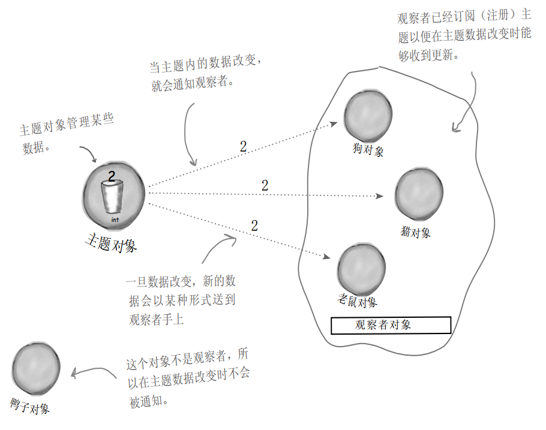
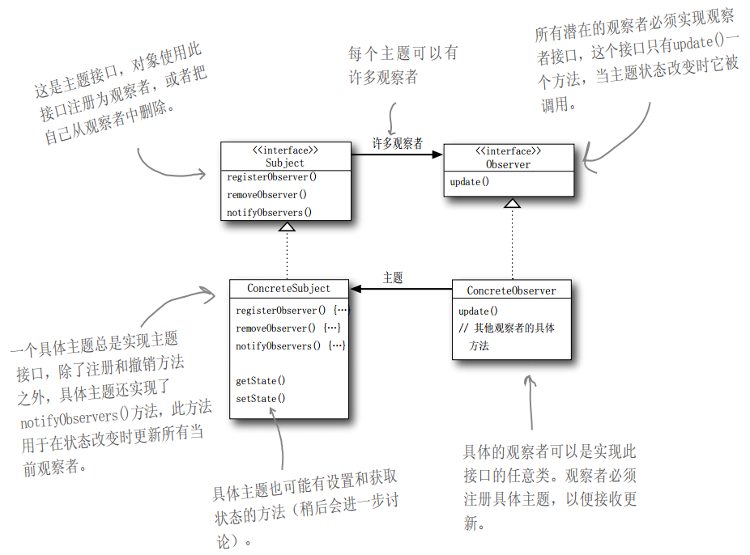
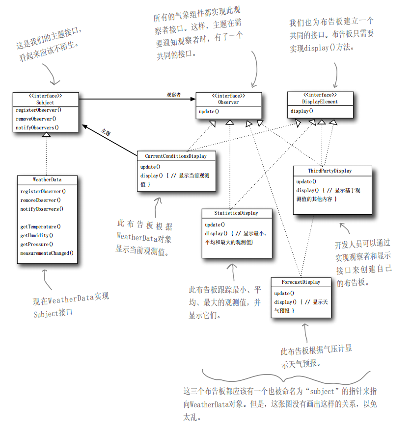

# 简介

**观察者模式**定义了对象之间的一对多依赖，这样一来，当一个对象改变状态时，它的所有依赖者都会收到通知并自动更新。

- 主题 + 观察者 = 观察者模式
- 观察者模式定义了一系列对象之间的**一对多关系**
- 当一个对象改变状态，其他依赖者都会收到通知

**图示**

# 类图

# 观察者模式耦合度

两个对象之间松耦合指：它们可以交互，但不太清楚彼此的细节。

观察者模式提供了一种对象设计，让主题和观察者之间松耦合。这体现在：

- 主题只知道观察者实现了某个接口（也就是Observer接口）。主题不需要知道观察者的具体类的其它细节
- 任何时候都可以 添加/删除 观察者。因为主题唯一依赖的东西是一个实现Observeer接口的对象列表
- 有新类型的观察者出现时，主题的代码不需要修改
- 可以独立地复用主题或观察者
- 改变主题或观察者其中一方，不会影响到另一方

**设计原则：为了交互对象之间的松耦合设计而努力。**

**松耦合的设计之所以能让我们建立有弹性的OO系统，能够应对变化，是因为对象之间的相互依赖降到了最低。**

# 案例

## 设计气象局

### 类图

### 实现气象站

