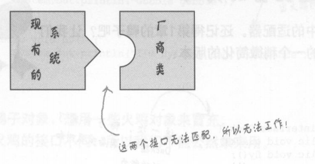

# 适配器模式

## 引言

假设已有一个软件系统，希望它能和一个新的厂商类库搭配使用，但是这个新厂商所设计出来的接口，不同于旧厂商的接口：



不想改变现有代码，可以编写适配器，让新厂商接口适应现有接口：


效果：


适配器模式解析：


## 定义

**适配器模式** 将一个类的接口，转换成客户期望的另一个接口。适配器让原本接口不兼容的类可以合作无间。

- 这个模式可以通过创建适配器进行接口转换，让不兼容的接口变成兼容。
- 可以让客户从实现的接口解耦。
- 使用对象组合，以修改的接口包装被适配者。

## 类图

### 对象适配器


### 类适配器


### 比较

- 对象适配器
  - 使用组合
- 类适配器
  - 使用（多重）继承


使用类适配器，可以做到双向适配。Java不支持多重继承。

## 案例

`Duck.java`

```java
/**
 * 适配器模式
 */
public interface Duck {
    public void quack();
    public void fly();
}
```

`MallardDuck.java`

```java
/**
 * 适配器模式
 */
public class MallardDuck implements Duck {
    public void quack() {
        System.out.println("Quack");
    }

    public void fly() {
        System.out.println("I'm flying");
    }
}
```

`Turkey.java`

```java
/**
 * 适配器模式
 * 火鸡接口
 */
public interface Turkey {
    public void gobble();
    public void fly();
}
```

`WildTurkey.java`

```java
/**
 * 适配器模式
 */
public class WildTurkey implements Turkey {
    public void gobble() {
        System.out.println("Gobble gobble");
    }

    public void fly() {
        System.out.println("I'm flying a short distance");
    }
}
```

`TurkeyAdapter.java`

```java
/**
 * 适配器模式
 * 火鸡与鸭子适配器
 */
public class TurkeyAdapter implements Duck {
    Turkey turkey;

    public TurkeyAdapter(Turkey turkey) {
        this.turkey = turkey;
    }

    public void quack() {
        turkey.gobble();
    }

    public void fly() {
        for (int i=0; i < 5; ++i) {
            turkey.fly();
        }
    }
}
```

`DuckTestDrive.java`

```java
/**
 * 适配器模式
 * 鸭子适配器测试类
 */
public class DuckTestDrive {
    public static void main(String args[]) {
        MallardDuck duck = new MallardDuck();

        WildTurkey turkey = new WildTurkey();
        Duck turkeyAdapter = new TurkeyAdapter(turkey);

        System.out.println("The Turkey says...");
        turkey.gobble();
        turkey.fly();

        System.out.println("\nThe Duck says...");
        testDuck(duck);

        System.out.println("\nThe TurkeyAdapter says...");
        testDuck(turkeyAdapter);
    }

    static void testDuck(Duck duck) {
        duck.quack();
        duck.fly();
    }
}
/* 
输出：
The Turkey says...
Gobble gobble
I'm flying a short distance

The Duck says...
Quack
I'm flying

The TurkeyAdapter says...
Gobble gobble
I'm flying a short distance
I'm flying a short distance
I'm flying a short distance
I'm flying a short distance
I'm flying a short distance
 */
```


# 外观模式

## 定义

**外观模式** 提供了一个统一的接口，用来访问子系统的一群接口。外观模式定义了一个高层接口，让子系统更容易使用。

## 简述

- 将一个或多个类的复杂的一切隐藏在背后，只显露一个干净美好的外观。
- 外观模式没有封装子系统的类，外观只提供简化的接口。
- 外观模式可以附加更加聪明的方法（比如，附加新的方法来调用多个系统方法，向客户提供更简介的接口。但是并未更改系统原有功能）。
- 外观模式不只是简化了接口，也将客户从组件的子系统中解耦。
- **创建了一个接口简单而统一的类，用来包装子系统中一个或多个复杂的类**

## 类图


# 装饰者、适配器、外观模式

- 装饰者模式：不改变接口，但加入责任
- 适配器模式：将一个接口转成另一个接口
- 外观模式：让接口更简单（提供更高层次的抽象，达到对客户隐藏更多不必要细节的功能）


- 外观和适配器可以包装许多类，但是外观的意图是简化接口，而适配器的意图是将接口转换成不同接口

# 最少知识原则

**最少知识原则**：只和你的密友谈话。

- 减少对象之间的交互，只留下几个“密友”
- 当设计一个系统时，不管是任何对象，都要注意它所交互的类有哪些，并注意它和这些类是如何交互的
- 不要让太多的类耦合在一起，免得修改系统中一部分，会影响其他部分

## 指导方针

对于任何对象而言，在该对象的方法内，只应该调用属于一下范围的方法：

- 该对象本身
- 被当做方法的参数而传递进来的对象
- 此方法所创建或实例化的任何对象
- 对象的任何组件
- 不调用从另一个方法返回的对象

## 缺点

- 采用这个原则，也会导致更多的包装类被制造出来，以处理和其他组件的沟通，这可能会导致复杂度和开发时间的增加，并降低运行时的性能

# 外观模式和最少知识原则


# 总结

## 基础

- 抽象
- 封装
- 多态
- 继承

## 原则

- 封装变化
- 多用组合，少用继承
- 针对接口编程，不针对实现编程
- 为交互对象之间的松耦合设计而努力
- 类应该对扩展开放，对修改关闭
- 依赖抽象，不要依赖具体类
- 只和密友交谈

## 要点

- 当需要使用一个现有的类而其接口并不符合你的需要时，就使用适配器
- 当需要简化并统一一个很大的接口或者一群复杂的接口时，使用外观
- 适配器改变接口以符合客户的期望
- 外观将客户从一个复杂的子系统中解耦
- 实现一个外观，需要将子系统组合进外观中，然后将工作委托给子系统执行
- 适配器模式有两种形式：对象适配器和类适配器。类适配器需要用到多重继承
- 可以为一个子系统实现一个以上的外观
- 适配器将一个对象包装起来以改变其接口；装饰者将一个对象包装起来以增加新的行为和责任；而外观将一群对象包装起来以简化其接口