# 装饰者模式

## 定义

**装饰者模式** 动态地将责任附加到对象上。若要扩展功能，装饰者提供了比继承更有弹性的替代方案。

利用**组合**和**委托**可以在运行时具有继承行为的效果。利用继承设计子类的行为，是在编译时静态决定的，而且所有的子类都会继承到相同的行为。然而，如果能够利用组合的做法扩展对象的行为，就可以在运行时动态地进行扩展。通过动态地组合对象，可以写新的代码添加新功能，而无需修改现有代码。

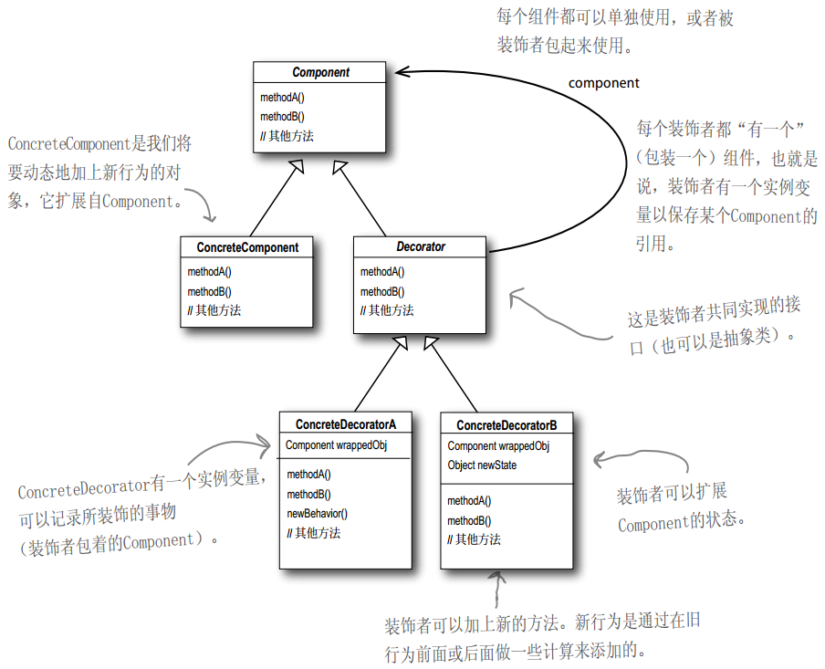

## 原则

**设计原则（开放-关闭原则）：** 类应该对扩展开放，对修改关闭。我们的目标是允许类容易扩展，在不修改现有代码的情况下，就可搭配新的行为。这样的设计具有弹性，可以应对改变，可以接受新的功能来应对改变的需求。

- 如果把代码写成依赖具体的组件类型，那么装饰者就会导致程序出问题。只有在针对抽象组件类型编程时，才不会因为装饰者而受影响。

## 总结

### 工具

- 抽象
- 封装
- 多型
- 继承

### 原则

- 封装变化
- 多用组合，少用继承
- 针对接口编程，不针对实现编程
- 为交互对象之间的松耦合设计而努力
- 对扩展开放，对修改关闭

### 模式

- 装饰者模式

### 要点

- 继承属于扩展形式之一，但不见得是达到弹性设计的最佳方式
- 在我们的设计中，应该允许行为可以被扩展，而无需修改现有的代码
- 组合和委托可用于运行时动态地叫上新的行为
- 除了继承，装饰者模式也可以让我们扩展行为
- 装饰者模式意味着一群装饰者类，这些类用来包装具体组件
- 装饰者类反映出被装饰的组件类型（事实上，他们具有相同的类型，都经过接口或继承实现）
- 装饰者可以在被装饰者的行为前面与/或后面加上自己的行为，甚至将被装饰者的行为整个取代掉，而达到特定目的
- 你可以用无数个装饰者包装一个组件
- 装饰者一般对组件的客户是透明的，除非客户程序依赖于组件的具体类型
- 装饰者会导致设计中出现许多小的对象，如果过度使用，会让程序变得很复杂

# 案例

## 星巴兹

### 最初的设计

最初订单系统设计，如下图。

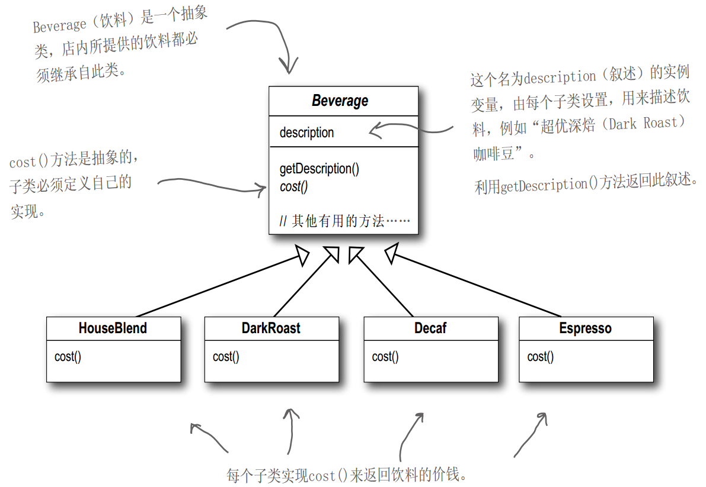

星巴兹根据加入调料收费后：

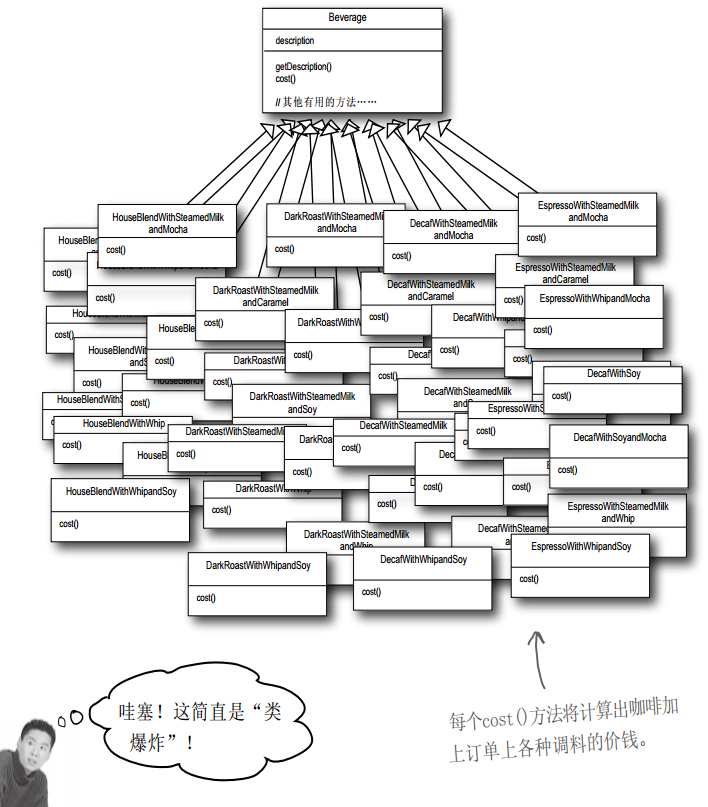

### 使用实例变量和继承

如果使用**实例变量**和**继承**实现：

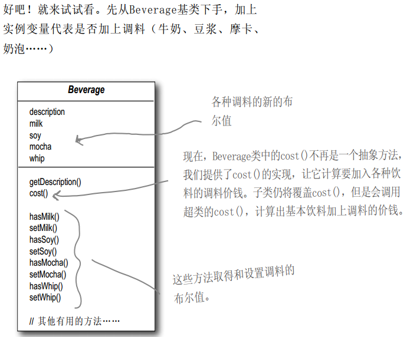

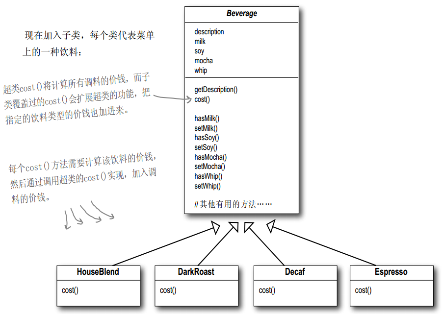

实现示例：

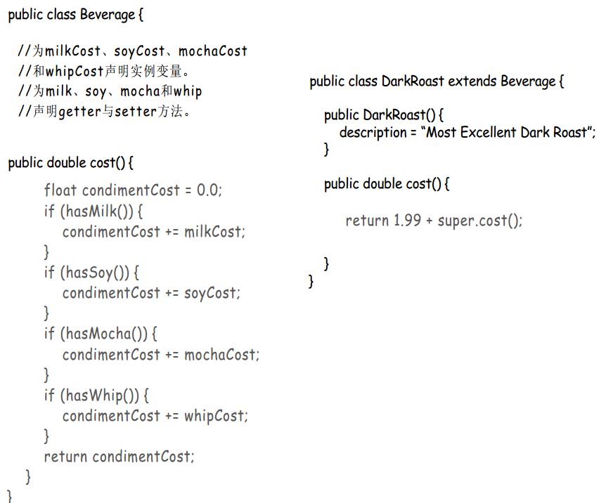

#### 问题

- 调料价钱的改变会使我们更改现有代码
- 一旦出现新的调料，需要加上新的方法，并改变超类中的cost()方法
- 以后可能会开发出新饮料，对这些饮料来说，某些调料可能并不合适
- 无法满足顾客配料加倍的需求

### 不一样的做法

以饮料为主体，然后在运行时以调料来”装饰(decorate)“饮料。比如，顾客想要摩卡和奶泡深焙咖啡，那么可以这么做：

- 拿一个深焙咖啡(DarkRoast)对象
- 以摩卡（Mocha）对象装饰它
- 以奶泡（Whip）对象装饰它
- 调用`cost()`方法，并依赖委托(delegate)将调料的价钱加上去

#### 图示

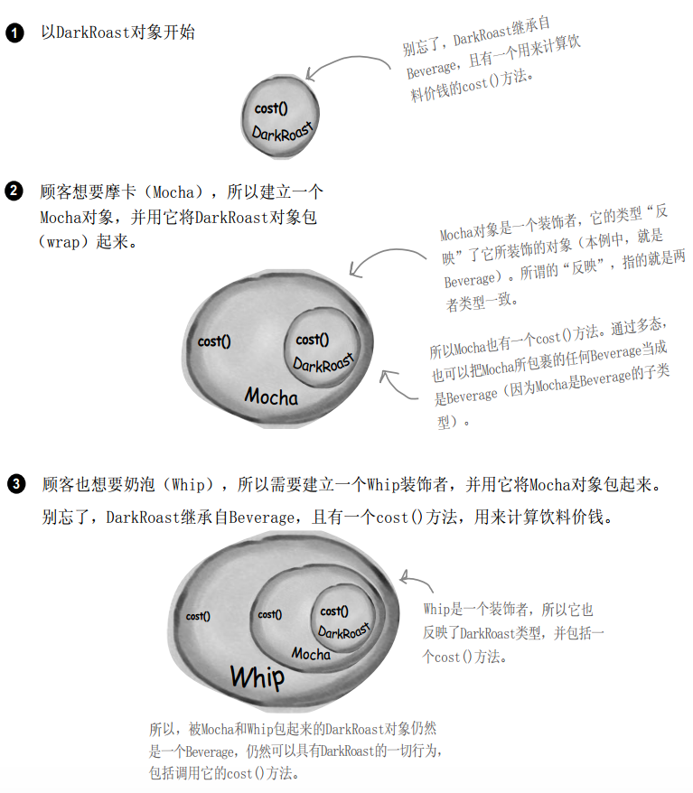

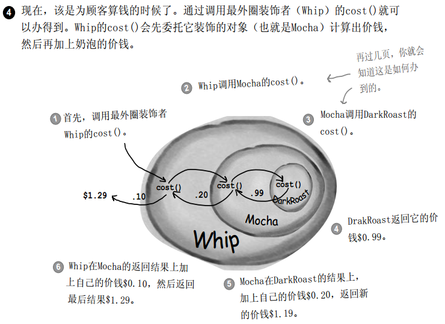

- 装饰者和被装饰对象有相同的超类型
- 可以用一个或多个装饰者包装一个对象
- 装饰者和被装饰对象有相同的超类型，所有在任何需要原始对象（被包装的）的场合，可以用装饰过的对象替代它
- **装饰者可以在所委托被装饰者的行为之前与/或之后，加上自己的行为，以达到特定的目的。**
- 对象可以在任何时候被装饰，所以可以在运行时动态地、不限量地用你喜欢的装饰者来装饰对象

将装饰者模式应用到星巴兹订单设计系统：

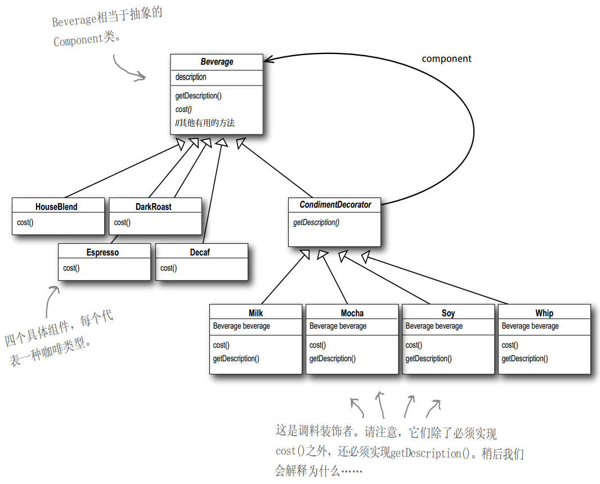

- 这里，利用继承达到”类型匹配“的目的，而不是利用继承获得”行为“。在将装饰者与组件组合时，就是在加入新的行为。 **继承Beverage抽象类，是为了有正确的类型（以便可以使用装饰类），而不是继承它的行为。行为来自装饰者和基础组件，或与其他装饰者之间的组合关系。**
- 如果依赖继承，那么类的行为只能在编译时静态决定，并且，每当需要新行为时，还得修改现有的代码。

#### 示例

深度烘焙摩卡奶泡咖啡：

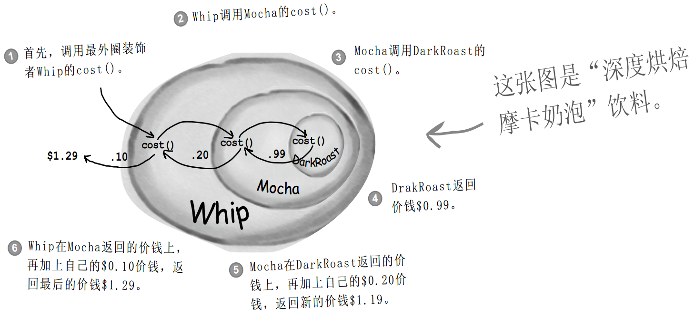

双摩卡、豆浆、奶泡的House Blend咖啡（双倍摩卡豆浆奶泡拿铁）：

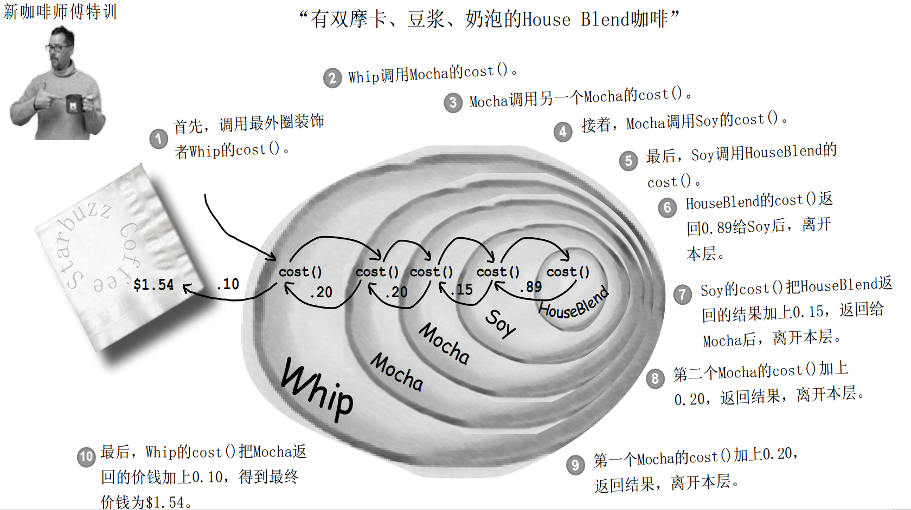

#### 代码

**Beverage**

```java
/**
 * Head First 设计模式 - 装饰者模式
 * 星巴兹
 * Beverage
 */
public abstract class Beverage {
    String description = "Unknown Beverage";

    public String getDescription() {
        return description;
    }

    public abstract double cost();
}
```

**CondimentDecorator**

```java
/**
 * Head First 设计模式 - 装饰者模式
 * 星巴兹
 * CondimentDecorator   调料类
 */
public abstract class CondimentDecorator extends Beverage { // 首先，必须让Condiment Decorator能取代Beverage(使用继承)
    public abstract String getDescription();    // 所有的调料装饰者都必须重新实现getDescription()方法
}
```

**饮料**

```java
/**
 * Head First 设计模式 - 装饰者模式
 * 星巴兹
 * 饮料类 - 浓缩咖啡
 */
public class Espresso extends Beverage {
    public Espresso() {
        description = "Espresso";
    }

    public double cost() {
        return 1.99;
    }
}
```

```java
/**
 * Head First 设计模式 - 装饰者模式
 * 星巴兹
 * 饮料类 - DarkRoast
 */
public class DarkRoast extends Beverage {
    public DarkRoast() {
        description = "DarkRoast Coffee";
    }

    public double cost() {
        return .99;
    }
}
```

```java
/**
 * Head First 设计模式 - 装饰者模式
 * 星巴兹
 * 饮料类 - Decat
 */
public class Decat extends Beverage {
    public Decat() {
        description = "Decat Coffee";
    }

    public double cost() {
        return 1.11;
    }
}
```

```java
/**
 * Head First 设计模式 - 装饰者模式
 * 星巴兹
 * 饮料类 - HouseBlend
 */
public class HouseBlend extends Beverage {
    public HouseBlend() {
        description = "House Blend Coffee";
    }

    public double cost() {
        return .89;
    }
}
```

**调料**

```java
/**
 * Head First 设计模式 - 装饰者模式
 * 星巴兹
 * 装饰者 - Mocha
 */
public class Mocha extends CondimentDecorator {
    Beverage beverage;

    public Mocha(Beverage beverage) {
        this.beverage = beverage; 
    }

    public String getDescription() {
        return beverage.getDescription() + ", Mocha";
    }

    public double cost() {
        return .20 + beverage.cost();
    }
}
```

```java
/**
 * Head First 设计模式 - 装饰者模式
 * 星巴兹
 * 装饰者 - Soy
 */
public class Soy extends CondimentDecorator {
    Beverage beverage;

    public Soy(Beverage beverage) {
        this.beverage = beverage; 
    }

    public String getDescription() {
        return beverage.getDescription() + ", Soy";
    }

    public double cost() {
        return .50 + beverage.cost();
    }
}
```

```java
/**
 * Head First 设计模式 - 装饰者模式
 * 星巴兹
 * 装饰者 - Whip
 */
public class Whip extends CondimentDecorator {
    Beverage beverage;

    public Whip(Beverage beverage) {
        this.beverage = beverage; 
    }

    public String getDescription() {
        return beverage.getDescription() + ", Whip";
    }

    public double cost() {
        return .35 + beverage.cost();
    }
}
```

**测试**

```java
/**
 * Head First 设计模式 - 装饰者模式
 * 星巴兹
 * 测试类
 */
public class StarbuzzCoffee {
    public static void main(String args[]) {
        /* 浓缩咖啡 */
        Beverage beverage = new Espresso();
        System.out.println(beverage.getDescription() + " $" + beverage.cost());

        /* 双倍摩卡奶泡DarkRoast咖啡 */
        Beverage beverage2 = new DarkRoast();
        beverage2 = new Mocha(beverage2);
        beverage2 = new Mocha(beverage2);
        beverage2 = new Whip(beverage2);
        System.out.println(beverage2.getDescription() + " $" + beverage2.cost());

        Beverage beverage3 = new HouseBlend();
        beverage3 = new Soy(beverage3);
        beverage3 = new Mocha(beverage3);
        beverage3 = new Whip(beverage3);
        System.out.println(beverage3.getDescription() + " $" + beverage3.cost());
    }
}
```

**输出**

```shell
bovenson@ThinkCentre:/home/...$ cd "/home/public/Git/notes/Design Pattern/Code/cha3/" && javac StarbuzzCoffee.java && java StarbuzzCoffee
Espresso $1.99
DarkRoast Coffee, Mocha, Mocha, Whip $1.7399999999999998
House Blend Coffee, Soy, Mocha, Whip $1.94
```

