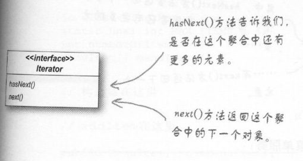
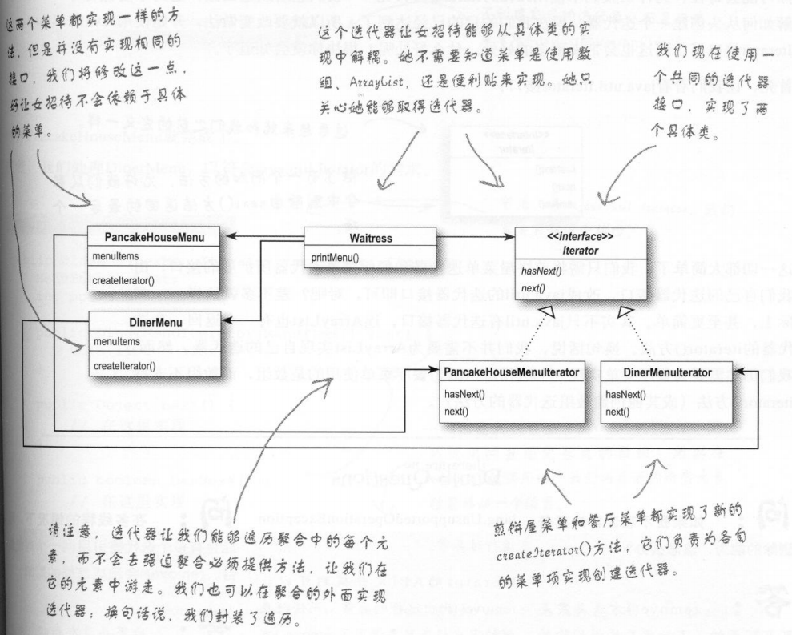

[TOC]

# 迭代器模式

**迭代器模式：**提供一种方法顺序访问一个聚合对象中的各个元素，而又不暴露其内部的表示。

- 对遍历的封装

- 它依赖于一个名为迭代器的接口

  

- 针对接口编程，而不是针对具体类

- 有一个统一的方法访问聚合中的每一个对象，你就可以编写多态的代码和这些聚合搭配

- 迭代器模式把在元素之间游走的责任交给迭代器，而不是聚合对象。这不仅让聚合的接口和实现变得更简洁，也可以让聚合更专注在它所应该专注的事情上面，而不必去理会遍历的事情

- 当我们写了一个需要以迭代器当做参数的方法时，其实就是在使用多态的迭代

## 类图

# 单一责任原则

**单一责任原则：**一个类应该只有一个引起变化的原因。

- 当一个类有两个改变的原因，那么会使得该类变化机率上升
- 将一个责任只指派给一个类
- 尽量让一个类保持单一责任（或功能）

# 组合模式

**组合模式：**允许你将对象组合成树形结构来表现整体/部分层次结构。组合能让客户以一致的方式处理对象以及对象的组合。

- 组合模式让我们能用树形方式创建对象的结构，树里面包含了组合以及个别的对象
- 组合模式以单一责任设计原则换取透明性。透明性是指，通过让组件的接口同时包含一些管理子节点和叶节点的操作，客户就可以将组合和叶节点一视同仁。也就是说，一个元素究竟是组合还是叶节点对客户是透明的。

# 总结

## 模式对比

- 策略模式：封装可互换的行为，并使用委托决定使用哪一个
- 适配器模式：改变一个或多个类的接口
- 迭代器模式：提供一个方式来遍历集合，而无须暴露集合的实现
- 外观模式：简化一群类的接口
- 组合模式：客户可以将对象的集合以及个别的对象一视同仁
- 观察者模式：当某个状态改变时，允许一群对象能被通知到

## 要点

- 迭代器允许访问聚合的元素，而不需要暴露它的内部结构
- 迭代器将遍历聚合的工作封装进一个对象中
- 当使用迭代器的时候，我们依赖聚合提供遍历
- 迭代器提供了一个通用的接口，让我们遍历聚合的项，当我们编码使用聚合的项时，就可以使用多态机制
- 我们应该努力让一个类只分配一个责任
- 组合模式提供一个结构，可同时包容个别对象和组合对象
- 组合模式允许客户对个别对象以及组合对象一视同仁
- 组合结构内的任意对象称为组件，组件可以是组合，也可以是叶节点
- 在实现组合模式时，有许多设计上的折衷。要根据需要平衡透明性和安全性