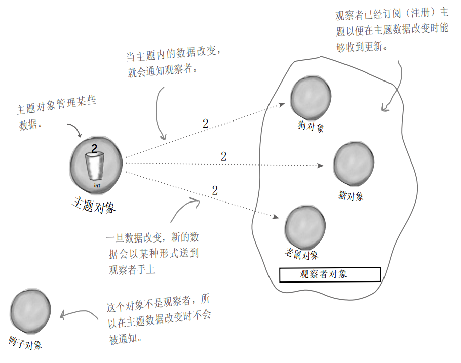

# 简介

**观察者模式** 定义了对象之间的一对多依赖，这样一来，当一个对象改变状态时，它的所有依赖者都会收到通知并自动更新。

- 主题 + 观察者 = 观察者模式
- 观察者模式定义了一系列对象之间的**一对多关系**
- 当一个对象改变状态，其他依赖者都会收到通知

**图示**



# 类图


# 观察者模式耦合度

两个对象之间松耦合指：它们可以交互，但不太清楚彼此的细节。

观察者模式提供了一种对象设计，让主题和观察者之间松耦合。这体现在：

- 主题只知道观察者实现了某个接口（也就是Observer接口）。主题不需要知道观察者的具体类的其它细节
- 任何时候都可以 添加/删除 观察者。因为主题唯一依赖的东西是一个实现Observeer接口的对象列表
- 有新类型的观察者出现时，主题的代码不需要修改
- 可以独立地复用主题或观察者
- 改变主题或观察者其中一方，不会影响到另一方

**设计原则：为了交互对象之间的松耦合设计而努力。**

**松耦合的设计之所以能让我们建立有弹性的OO系统，能够应对变化，是因为对象之间的相互依赖降到了最低。**

# 总结

## 可用的工具

### 基础

- 抽象

### 原则

- 封装变化

  ```
  在观察者模式中，会改变的是主题的状态，以及观察者的数目和类型。用这个模式，可以改变依赖于主题状态的对象，却不必改变主题。
  ```

- 多用组合，少用继承

  ```
  观察者模式利用“组合”将许多观察者组合进主题。对象之间的这种关系不是通过继承产生的，而是在运行时利用组合的方式产生。
  ```

- 针对接口编程，不针对实现编程

  ```
  主题与观察者都使用接口：观察者利用主题的接口向主题注册，而主题利用观察者接口通知观察者。这样可以让两者之间运作正常，又同时具有松耦合的优点。
  ```

- 为交互对象之间的松耦合设计而努力

### 模式

- 观察者模式

## 要点

- 观察者模式定义了对象之间一对多的关系
- 主题（也就是可观察者）用一个共同的接口来更新观察者
- 观察者和可观察者之间用松耦合方式结合，可观察者不知道观察者的细节，只知道观察者实现了观察者接口
- 使用此模式时，可从被观察者处推（push）或拉（pull）数据（一般倾向于推送更新）
- 有多个观察者时，不可以以来特定的通知次序
- Java有多种观察者模式的实现，包括了通用的`java.util.Observable`
- ​

# 案例

## 设计气象局

### 类图


### 实现接口

```java
/**
 * 观察者模式案例
 * 气象站主题接口
 */

public interface Subject {
    public void registerObserver(Observer o);
    public void removeObserver(Observer o);
    public void notifyObservers();  
}
```

```java
/**
 * 观察者模式案例
 * 气象站观察者接口
 */
public interface Observer {
    public void update(float temp, float humidity, float pressure);
}
```

```java
/**
 * 观察者模式案例 - 气象站
 * 布告板接口
 */
public interface DisplayElement {
    public void display();
}
```

### 实现气象站

```java
import java.util.ArrayList;

/**
 * 观察者模式案例 - 气象站
 */
public class WeatherData implements Subject {
    private ArrayList observers;
    private float temperature;
    private float humidity;
    private float pressure;

    public WeatherData() {
        this.observers = new ArrayList<Observer>();
    }

    public void registerObserver(Observer o) {
        observers.add(o);
    }

    public void removeObserver(Observer o) {
        int i = observers.indexOf(o);
        if (i >= 0) {
            observers.remove(i);
        }
    }

    public void notifyObservers() {
        for (int i=0; i < observers.size(); ++i) {
            Observer observer = (Observer) observers.get(i);
            observer.update(temperature, humidity, pressure);
        }
    }

    public void measurementsChanged() {
        notifyObservers();   
    }

    public void setMeasurements(float temperature, float humidity, float pressure) {
        this.temperature = temperature;
        this.humidity = humidity;
        this.pressure = pressure;
        measurementsChanged();
    }
}
```

### 实现布告板

```java
/**
 * 观察者模式案例 - 气象站
 * 目前状况布告板
 */
public class CurrentConditionsDisplay implements Observer, DisplayElement {
    private float temperature;
    private float humidity;
    private Subject weatherData;

    public CurrentConditionsDisplay(Subject weatherData) {
        this.weatherData = weatherData;
        weatherData.registerObserver(this);
    }

    public void update(float temperature, float humidity, float pressure) {
        this.temperature = temperature;
        this.humidity = humidity;
        display();
    }

    public void display() {
        System.out.println("Current conditions:" + temperature + "F degrees" +
                            " and " + humidity + "% humidity");
    }
}
```

```java
public class StatisticsDisplay implements Observer, DisplayElement {
    private float maxTemp = 0.0f;
    private float minTemp = 200;
    private float tempSum = 0.0f;
    private int numReadings;
    private WeatherData weatherData;

    public StatisticsDisplay(WeatherData weatherData) {
        this.weatherData = weatherData;
        weatherData.registerObserver(this);
    }

    public void update(float temp, float humidity, float pressure) {
        tempSum += temp;
        numReadings++;

        if (temp > maxTemp) {
            maxTemp = temp;
        }

        if (temp < minTemp) {
            minTemp = temp;
        }

        display();
    }

    public void display() {
        System.out.println("Avg/Max/Min temperature = " + (tempSum / numReadings)
                + "/" + maxTemp + "/" + minTemp);
    }
}
```

```java
public class ForecastDisplay implements Observer, DisplayElement {
    private float currentPressure = 29.92f;
    private float lastPressure;
    private WeatherData weatherData;

    public ForecastDisplay(WeatherData weatherData) {
        this.weatherData = weatherData;
        weatherData.registerObserver(this);
    }

    public void update(float temp, float humidity, float pressure) {
        lastPressure = currentPressure;
        currentPressure = pressure;

        display();
    }

    public void display() {
        System.out.print("Forecast: ");
        if (currentPressure > lastPressure) {
            System.out.println("Improving weather on the way!");
        } else if (currentPressure == lastPressure) {
            System.out.println("More of the same");
        } else if (currentPressure < lastPressure) {
            System.out.println("Watch out for cooler, rainy weather");
        }
    }
}
```

### 启动气象站

```java
/**
 * 观察者模式案例 - 气象站
 * 启动气象站
 */
public class WeatherStation {
    public static void main(String args[]) {
        WeatherData weatherData = new WeatherData();    // 气象站：主题

        CurrentConditionsDisplay currentDisplay = new CurrentConditionsDisplay(weatherData);    // 布告板：观察者
        StatisticsDisplay statisticsDisplay = new StatisticsDisplay(weatherData);   // 布告板：观察者
        ForecastDisplay forecastDisplay = new ForecastDisplay(weatherData); // 布告板：观察者

        weatherData.setMeasurements(80, 65, 30.4f); // 主题更新数据
        weatherData.setMeasurements(82, 70, 29.2f); // 主题更新数据
        weatherData.setMeasurements(78, 90, 29.2f); // 主题更新数据
    }
}
```

### 输出

```java
Note: ./WeatherData.java uses unchecked or unsafe operations.
Note: Recompile with -Xlint:unchecked for details.
Current conditions:80.0F degrees and 65.0% humidity
Avg/Max/Min temperature = 80.0/80.0/80.0
Forecast: Improving weather on the way!
Current conditions:82.0F degrees and 70.0% humidity
Avg/Max/Min temperature = 81.0/82.0/80.0
Forecast: Watch out for cooler, rainy weather
Current conditions:78.0F degrees and 90.0% humidity
Avg/Max/Min temperature = 80.0/82.0/78.0
Forecast: More of the same
```

