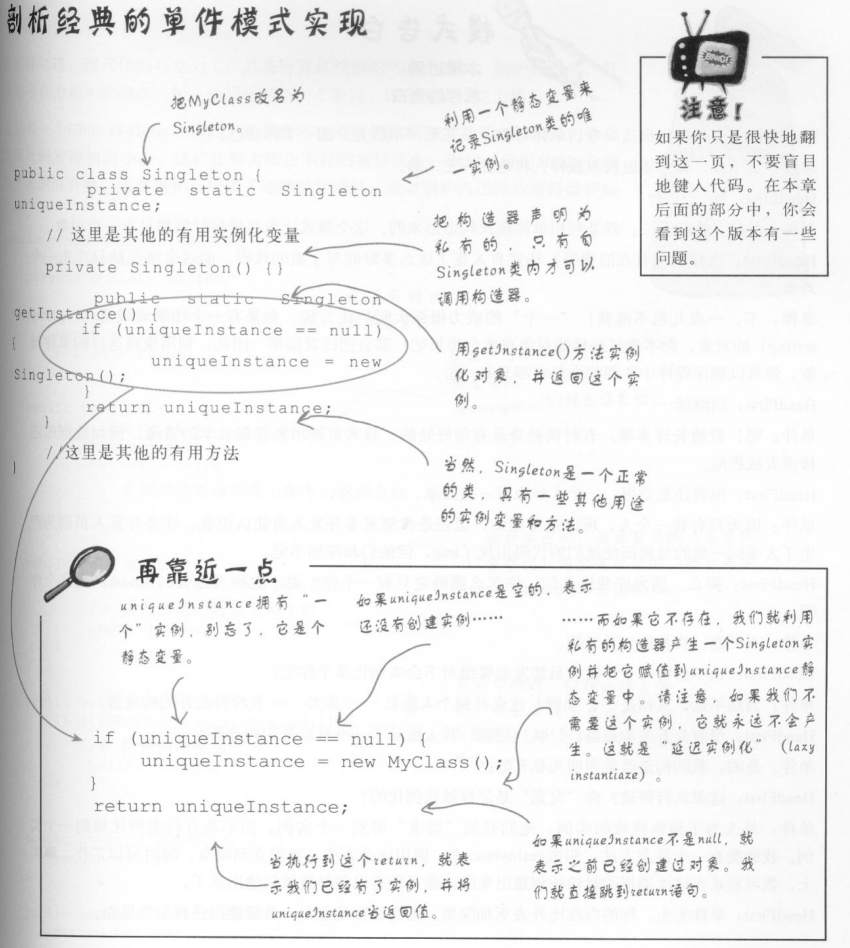
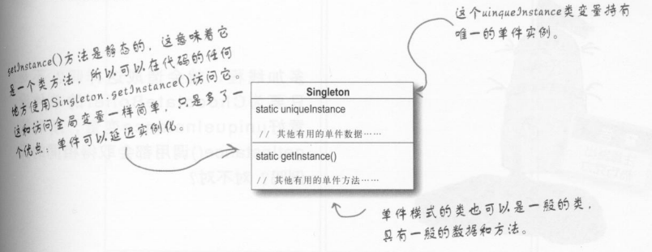
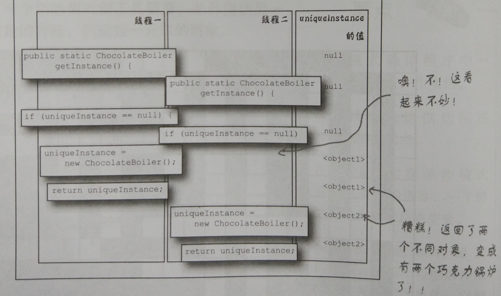

[TOC]

# 引言

为什么要用单件模式？

- 有一些对象只需要一个实例。比如：线程池、缓存、对话框等。

为什么不可以用全局变量解决？

- 如果使用全局变量，那么必须在程序一开始就创建对象(JVM可能在使用时才创建)。如果在程序一次执行中没有用到，会浪费资源。

为什么不能创建一个类，把所有方法和变量都定义为静态，把类直接当做一个单件？

- 静态变量初始化的控制权在Java手上，这么做可能导致混乱和不易察觉的bug。使用对象的单件，比较保险。

# 单件模式

## 定义

**单件模式** 确保一个类只有一个实例，并提供一个全局访问点。

## 经典的单间模式实现



```java
/**
 * 经典单件模式
 */
public class Singleton {
    private static Singleton uniqueInstance;

    private Singleton() {}

    public static Singleton getInstance() {
        if (uniqueInstance == null) {
            uniqueInstance = new Singleton();
        }
        return uniqueInstance;
    }
}
```

## 类图



## 多线程带来的问题



## 处理多线程

把`getInstance()`变成同步（synchronized）方法：

```java
/**
 * 单件模式
 * 使用同步进行多线程处理
 */
public class SingletonWithSync {
    private static SingletonWithSync uniqueInstance;

    private SingletonWithSync() {}

    /**
     * 通过增加synchronized关键字到getInstance()方法中
     * 迫使每个线程在进入这个方法之前，要先等候别的线程离开该方法
     * 也就是说，不会有两个线程可以同时进入这个方法
     */
    public static synchronized SingletonWithSync getInstance() {
        if (uniqueInstance == null) {
            uniqueInstance = new SingletonWithSync();
        }
        return uniqueInstance;
    }
}
```

## 改善多线程

同步对运行效率影响很大，实际上，只有第一次执行时才需要同步。

### 使用”急切“创建实例

如果应用程序总是创建并使用单件实例，或者在创建和运行时方面的负担不太繁重，你可能需要急切（eagerly）创建次单件，而不用延迟实例化的做法：

```java
/**
 * 单件模式
 * 急切（eagerly） 创建
 */
public class SingletonEagerly {
    private static SingletonEagerly uniqueInstance = new SingletonEagerly();

    private SingletonEagerly() {}

    public static SingletonEagerly getInstance() {
        return uniqueInstance;
    }
}
```

### 使用双重检查加锁

使用双重检查加锁（double-checked locking），在`getInstance()`中减少使用同步。

利用双重检查加锁，首先检查是否实例已经创建了，如果未创建，才进行同步。

```java
/**
 * 单件模式
 * 双重检查加锁(double-checked locking)
 */
public class SingletonDCL {
    // volatile关键词确保：当uniqueInstance变量被初始化成Singleton实例时
    // 多个线程正确地处理uniqueInstance变量
    // volatile不适用1.4及更早版本
    private volatile static SingletonDCL uniqueInstance;   

    private SingletonDCL() {}

    public static SingletonDCL getInstance() {
        if (uniqueInstance == null) {   // 如果实例不存在进入同步区； 只有第一次执行才会彻底执行这里的代码
            synchronized (SingletonDCL.class) { 
                if (uniqueInstance == null) {   // 进入区块后，再检查一次，如果仍是null，才创建实例
                    uniqueInstance = new SingletonDCL();
                }
            }
        }
        return uniqueInstance;
    }
}
```

## 总结

- 单件模式确保程序中一个类最多只有一个实例
- 单价模式也提供访问这个实例的全局点
- 在Java中实现单件模式需要私有构造器、一个静态方法、一个静态变量
- 确定在性能和资源上的限制，然后小心地选择适当的方案来实现单件，以解决多线程的问题
- 小心，如果使用多个类加载器，可能导致单件失效而产生多个实例

# 其他问题

## 多个类加载器

两个类加载器可能有机会各自创建自己的单件实例，导致同一个类会被加载多次，就会出现产生多个单件并存的怪异现象。

解决办法：自定制定类加载器，并指定用一个类加载器。