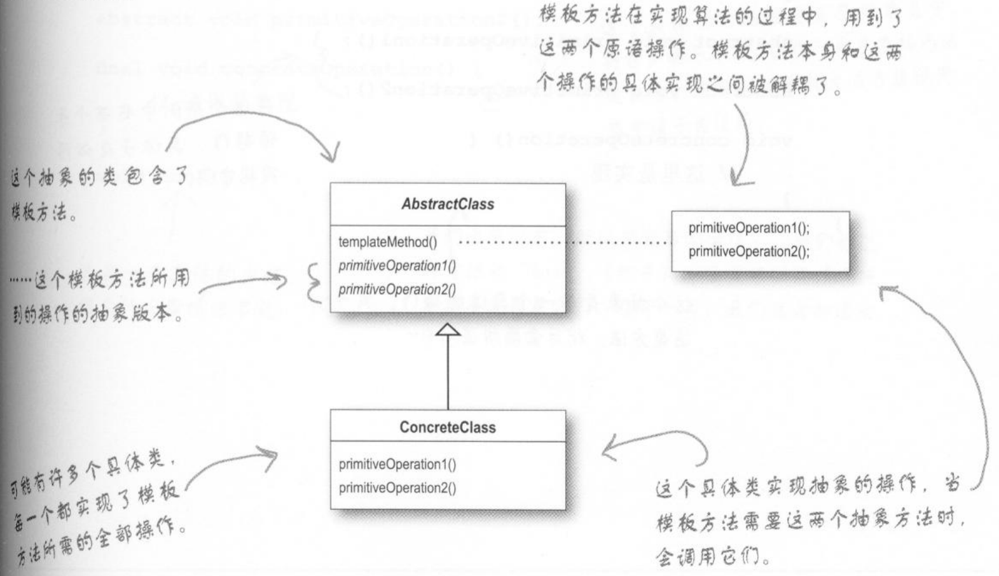
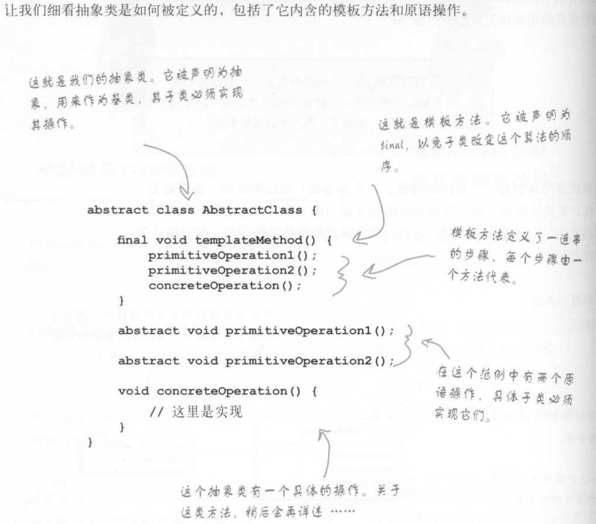
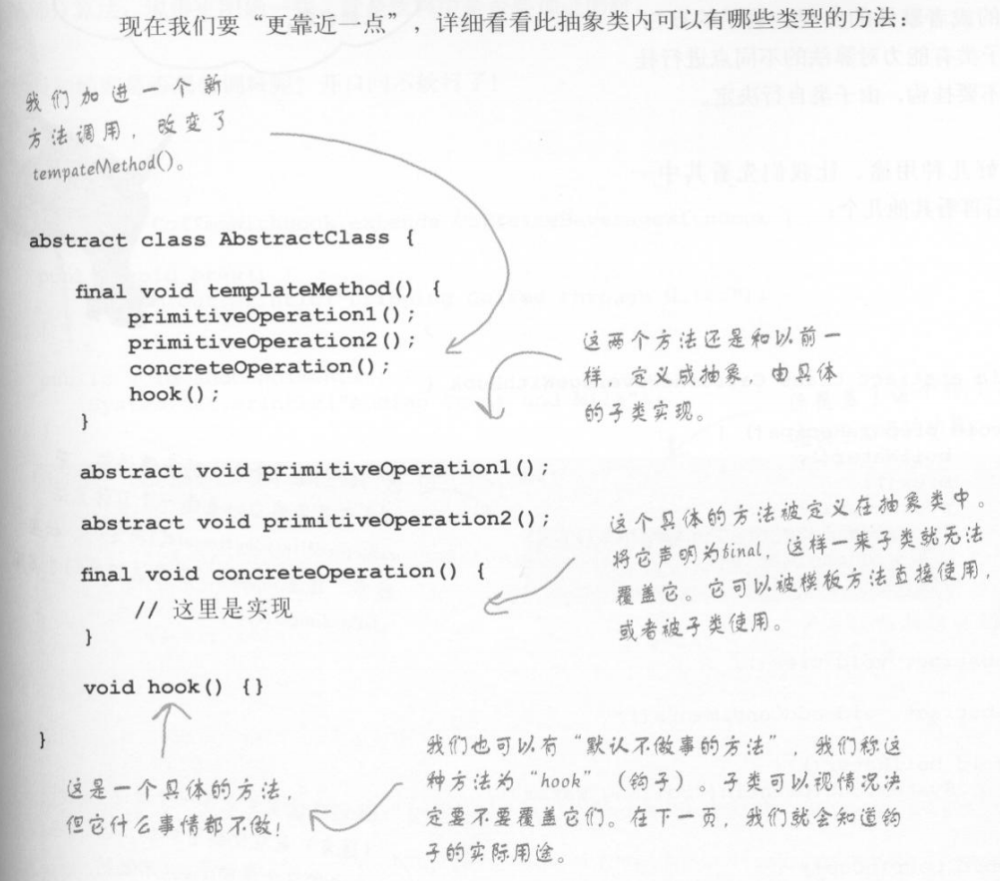
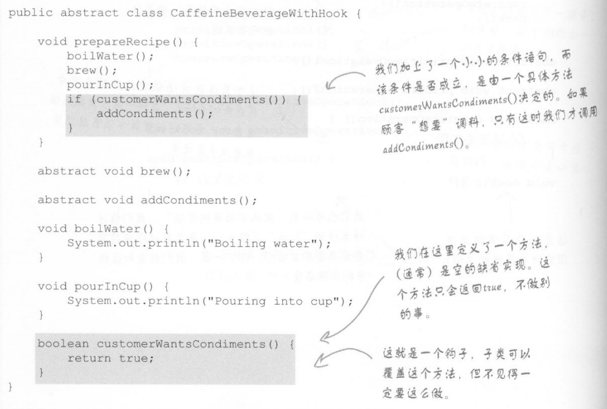
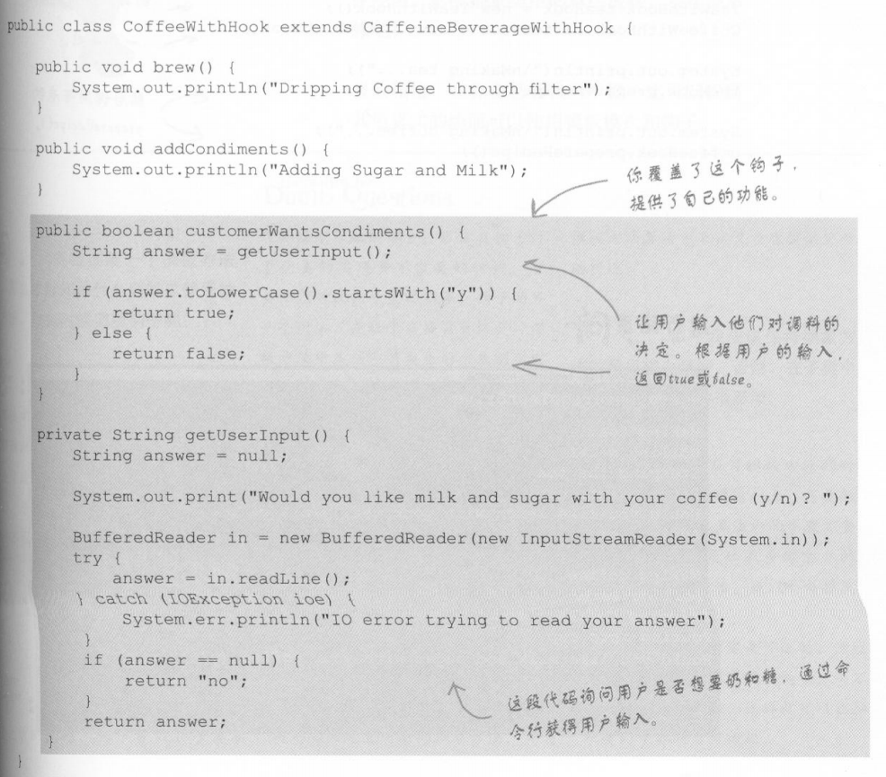
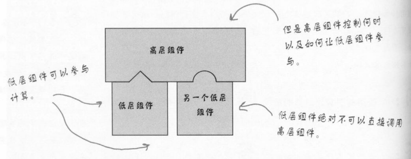

[TOC]

# 模板方法模式

## 定义

**模板方法模式** 在一个方法中定义一个算法的骨架，而将一些步骤延迟到子类中。模板方法使得子类可以在不改变算法结构的情况下，重新定义算法中的某些步骤。

## 简述

- 模板就是一个方法，这个方法将算法定义成一组步骤，其中的任何步骤都可以是抽象的，由子类负责实现。这可以确保算法的结构保持不变，同时由子类提供部分实现。

## 类图

## 代码定义

## 钩子

**钩子 **是一种被声明在抽象类中的方法，但只有空的或者默认的实现。钩子的存在，可以让子类有能力对算法的不同点进行挂钩。要不要挂钩，由子类自行决定。

### 钩子的用途

先看其中一种：

为了使用钩子，需要在子类中覆盖它。

在本例中，钩子能够作为条件控制，影响抽象类中的算法流程。

使用抽象方法还是钩子？当子类必须提供算法中某个方法或步骤的实现时，就使用抽象方法。如果算法的这个部分是可选的，就用钩子。

**用途**

- 钩子可以让子类实现算法中可选的部分，或者在钩子对于子类的实现并不重要的时候，子类可以对此钩子置之不理
- 让子类能够有机会对模板方法中某些即将发生（或刚刚发生）的步骤做出反应
- 钩子也可以让子类有能力为抽象类做一些决定

# 好莱坞原则

**好莱坞原则：**别调用我们，我们会调用你。

- 好莱坞原则可以给我们一种防止“依赖腐败”的方法。
- 当高层组件依赖低层组件，而低层组件又依赖高层组件，而高层组件又依赖边侧组件，而边侧组件又依赖低层组件时，依赖腐败就发生了。
- 在好莱坞原则下，我们允许低层组件将自己挂钩到系统上，但是高层组件会决定什么时候和怎样使用这些低层组件。

# 好莱坞原则和模板方法

# 好莱坞原则和依赖倒置

依赖倒置原则尽量避免使用具体类，而多使用抽象。而好莱坞原则是用在创建框架或组件上的一种技巧，好让低层组件能够被挂钩进计算中，而且又不会让高层组件依赖低层组件。

两者的目标都是在于解耦，但是依赖倒置原则更加注重如何在设计中避免依赖。

好莱坞原则教我们一个技巧，创建一个有弹性的设计，允许低层结构能够互相操作，而又防止其他类太过依赖他们。

# 模板方法、策略、工厂方法

- 模板方法模式
  - **子类决定如何实现算法中的步骤**
  - 使用模板方法实现的算法不完整，通常会使用钩子让子类介入到算法
  - 定义一个算法打工，而由子类定义其中某些步骤的内容。在算法的个别步骤，可以有不同的实现细节，但是算法的结构依然维持不变
- 策略模式
  - 封装可互换的行为，然后使用委托来决定要采用哪一个行为
  - 策略模式使用对象组合，所组合的类实现了整个算法
  - 定义一个算法家族，并让这些算法可以互换。正因为每一个算法都被封装起来了，所以客户可以轻易地使用不同的算法
- 工厂方法模式
  - 由子类决定实例化哪个具体类

# 总结

- 模板方法定义了算法的步骤，把这些步骤的实现延迟到子类
- 模板方法模式为我们提供了一种代码复用的重要技巧
- 模板方法的抽象类可以定义具体方法、抽象方法和钩子
- 抽象方法由子类实现
- 钩子是一种方法，他在抽象类中不做事，或者只做默认的事情，子类可以选择要不要覆盖它
- 为了防止子类改变模板方法中的算法，可以将模板方法声明为final
- 好莱坞原则告诉我们，将决策权放在高层模块中，以便决定如何以及合适调用低层模块
- **策略模式和模板方法模式都封装算法，一个用组合，一个用继承。**
- 工厂方法是模板方法的特例