[TOC]

# 工厂模式

- 工厂方法模式
- 抽象工厂模式

**工厂方法用来处理对象的创建，并将这样的行为封装在子类中。这样，客户程序中关于超类的代码就和子类对象创建代码解耦了。**

所有工厂模式都用来封装对象的创建。

## 依赖倒置原则

**依赖倒置**： 要依赖抽象，不要依赖具体类。

不能让高层组件依赖低层组件，而且，不管高层组件或低层组件，两者都应该依赖于抽象。

在依赖导致原则中， **倒置**指的是和一般OO设计的思考方式完全相反。

### 技巧

避免在OO设计中违反依赖倒置原则的技巧：

- `变量不可以持有具体类的引用`。如果使用new，就会持有具体类的引用。可以改用工厂来避开这样的做法。
- `不要让类派生自具体类`。如果派生自具体类，就会依赖具体类。应该派生自一个抽象（接口或抽象类）。
- `不要覆盖基类中已实现的方法`。如果覆盖基类已实现的方法，那么基类就不是一个真正适合被继承的抽象。基类中以实现的方法，应该由所有子类共享。


## 引言

我们不应该针对实现编程，但是当我们每次使用new时，就会想到“具体”。使用new时，的确是在实例化一个具体类，所以用的确实是实现，而不是接口。我们知道，代码绑定具体类会导致代码更脆弱，更缺乏弹性。

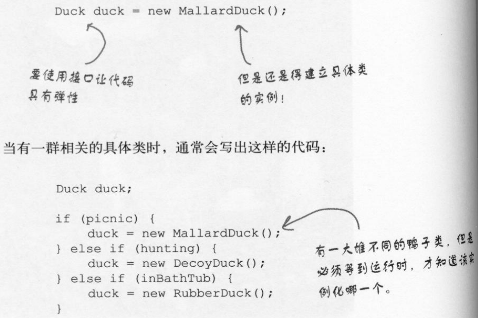

当看到这样的代码，一旦有变化或扩展，就必须重新打开这段代码进行检查和修改。通常这样修改过的代码将造成部分系统更难维护和更新，而且也更容易犯错。

针对接口编程，可以隔离掉以后系统可能发生的一大堆改变。因为，如果代码是针对接口而写，那么通过多态，它可以与任何新类实现该接口。

当代码使用大量具体类时，一旦进入新的具体类，就必须改变代码。也就是说，你的代码并非“对修改关闭”。

解决上述问题，就需要“找出会变的方面，把它们从不变的部分分离出来”。

## 简单工厂方法

- 算不上设计模式（依据《Head First 设计模式》）
- 简单工厂模式属于创建型模式
- 又叫做静态工厂方法
- 简单工厂模式是由一个工厂对象决定创建出哪一种产品类的实例
- 实质是由一个工厂类根据传入的参数，动态决定应该创建哪一个产品类

### 角色及职责

- **工厂（Creator）角色**： 简单工厂模式的核心，它负责实现创建所有实例的内部逻辑。工厂类的创建产品类的方法可以被外界直接调用，创建所需的产品对象。
- **抽象产品（Product）角色**： 简单工厂模式所创建的所有对象的父类，它负责描述所有实例所共有的公共接口。
- **具体产品（Concrete Product）角色**： 是简单工厂模式的创建目标，所有创建的对象都是充当这个角色的某个具体类的实例。

### 优缺点

#### 优点

- 明确了各自的职责和权利，有利于整个软件体系结构的优化。

#### 缺点

- 违反了高内聚责任分配原则。如果添加新类，则需要改变工厂类。

### 示例

参考案例中披萨工厂简单工厂阶段。


## 工厂方法模式

### **定义**

**工厂方法模式** 定义了一个创建对象的接口，但由子类决定要实例化的类是哪一个。工厂方法让类把实例化推迟到子类。

工厂方法模式(Factory Method Pattern)通过让子类决定该创建的对象是什么，来达到将对象创建的过程封装的目的。

工厂方法模式能够封装具体类型的实例化。抽象的Creator提供了一个创建对象的方法的接口，也成为“工厂方法”。在抽象的Creator中，任何其他实现的方法，都可能使用到这个工厂方法所制造出来的产品，但只有子类真正实现这个工厂方法并创建产品。

**工厂方法模式不过是，通过子类来创建对象。**

工厂方法：用来创建对象的方法。

### 优点

- 工厂模式帮助我们将产品的实现从使用中解耦。如果增加产品或者改变产品的实现，Creator并不会受到影响(因为Creator与任何ConcreteProduct之间都不是紧耦合)。
- 创建对象的代码集中在一个对象或方法中，可以避免代码中的重复，并且更方便以后的维护
- 客户在实例化对象时，只会依赖于接口，而不是具体类
- 可以帮助我们针对接口编程，而不是针对实现编程。这让代码更具有弹性，可以应对未来的扩展
- **封装起创建对象的代码，就可以对抽象编码，将客户代码和实现代码解耦**

### 组成元素

- 创建者(Creator)类

  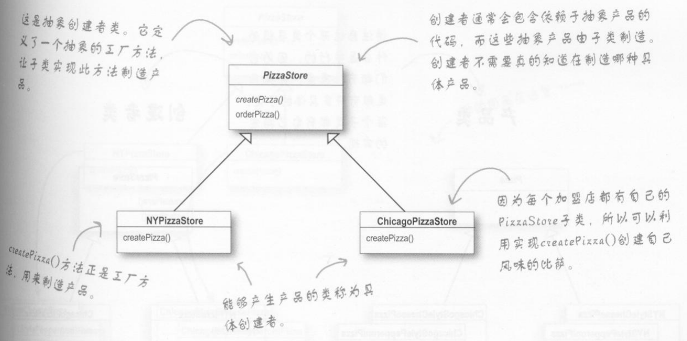

- 产品类

  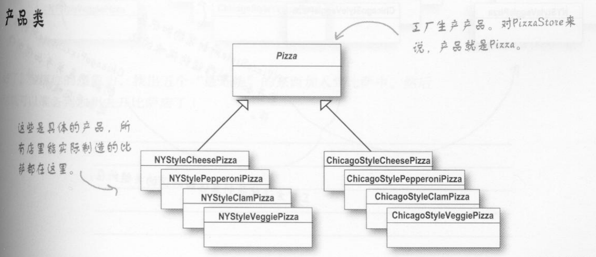

**平行的类层级**

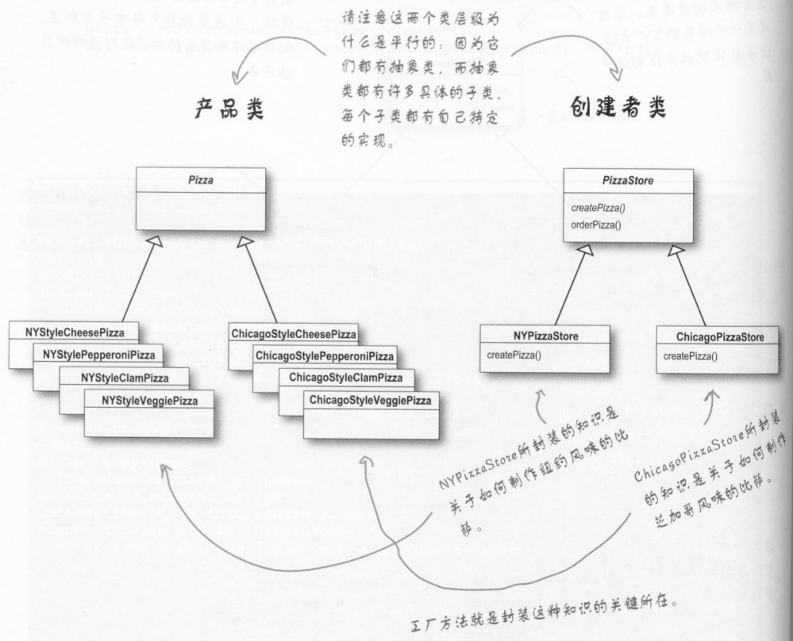


## 抽象工厂模式

### 定义

**抽象工厂模式** 提供一个接口，用于创建相关或依赖对象的家族，而不需要明确指定具体类。

抽象工厂允许客户使用抽象的接口来创建一组相关的产品，而不需要知道实际产出的具体产品是什么。这样一来，客户就从具体的产品中被解耦。

### 类图

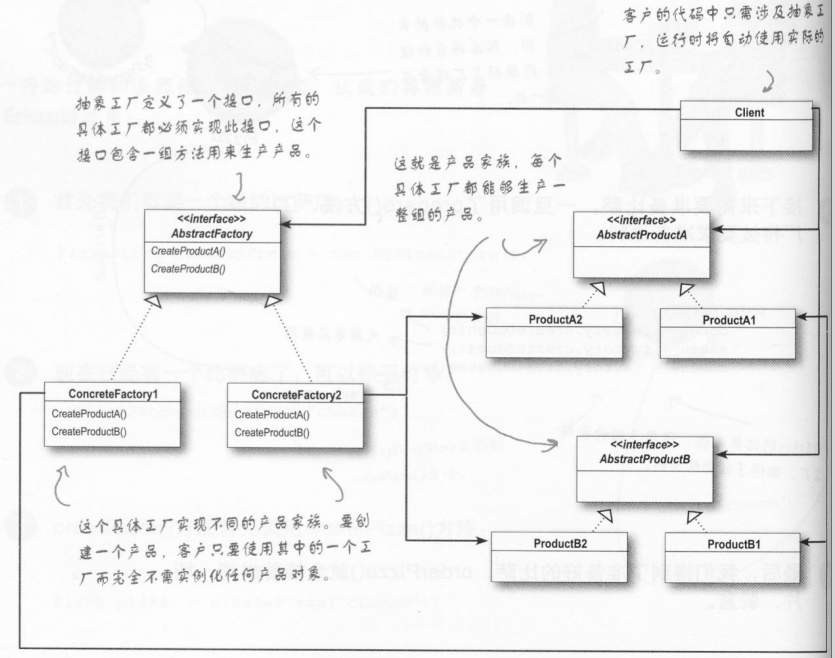

## 比较工厂方法模式和抽象工厂模式

**工厂方法模式潜伏在抽象工厂模式中。**抽象工厂的方法经常以工厂方法的方式实现。抽象工厂的任务是定义一个负责创建一组产品的接口。这个接口内的每个方法都负责创建一个具体产品，同时我们利用实现抽象工厂的子类来提供这些具体的做法。

工厂方法模式和抽象工厂模式，都用来负责创建对象，都可以把应用程序从特定实现中解耦，只是做法不同：

- 工厂方法模式：
  - **使用的是类，利用的方法是继承**。
  - 整个工厂方法，只不过是通过子类来创建对象。用这种做法，客户只需要知道他们所使用的抽象类型就可以了，而由子类来负责决定具体类型。换句话说，工厂方法模式只负责将客户从具体类型中解耦。
  - 可以把客户代码从需要实例化的具体类中解耦。
  - 相对简单，只要继承为子类，并实现工厂方法即可。
- 抽象工厂模式：
  - **通过对象的组合实现解耦**。
  - 提供一个用来创建一个产品家族的抽象类型，这个类型的子类定义了产品被产生的方法。要想使用这个工厂，必须先实例化它，然后将它传入一些针对抽象类型所写的代码中。所以，和工厂方法一样，抽象工厂可以吧客户从所使用的实际具体产品中解耦。
  - **此外，还可以把一群相关的产品集合起来。但是，如果需要扩展这组产品，需要修改接口。**
  - 当需要创建产品家族，并想让制造的相关产品集合起来时使用。

**类图对比**

以披萨店为例

**工厂方法模式**

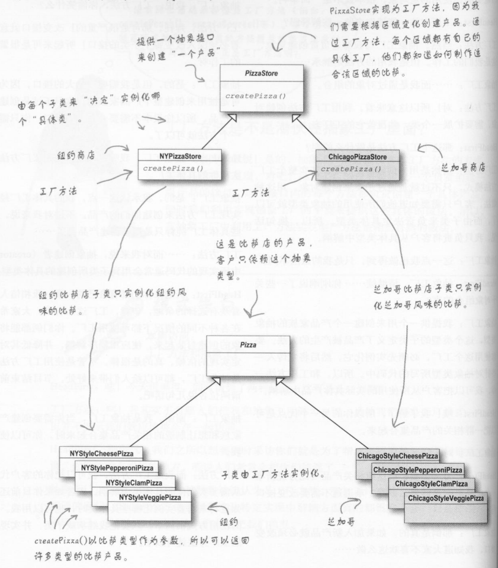

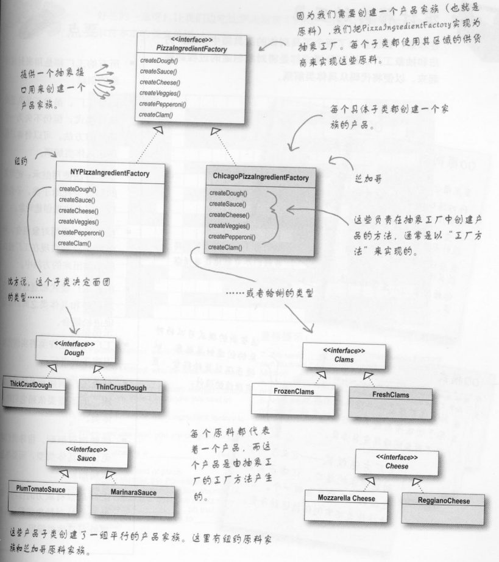

## 总结

### 工具

#### 基础

- 抽象
- 封装
- 多态
- 继承

#### 原则

- 多用组合，少用继承
- 针对接口编程，不针对实现编程
- 为交互对象之间的松耦合设计而努力
- 类应该对扩展开放，对修改关闭
- 依赖抽象，不要依赖具体

#### 设计模式

- 抽象工厂模式
- 工厂方法模式

### 要点

- 所有的工厂都是用来封装对象的创建
- 简单工厂，虽然不是真正的设计模式，但扔不失为一个简单的方法，可以将客户程序从具体类解耦
- **工厂方法使用继承：把对象的创建委托给子类，子类实现工厂方法来创建对象**
- **抽象工厂使用对象组合：对象的创建被实现在工厂接口所暴露出来的方法中**
- 所有工厂模式都通过减少应用程序和具体类之间的依赖促进松耦合
- 工厂方法允许类将实例化延迟到子类进行
- 抽象工厂创建相关的对象家族，而不需要依赖他们的具体类
- 依赖倒置原则，指导我们避免依赖具体类型，而要尽量依赖抽象
- **工厂是很有威力的技巧，帮助我们针对抽象编程，而不要针对具体类编程**

# 案例

## 披萨工厂

### 简单工厂阶段

#### 识别变化的方面

假如你有一个披萨店，你的代码可能这样写：

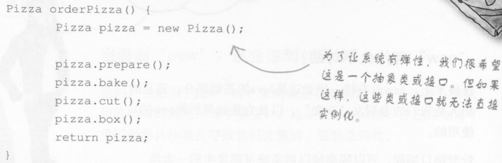

如果需要更多的披萨类型，则需要增加代码，来决定适合的比萨类型，然后再制造这个披萨：

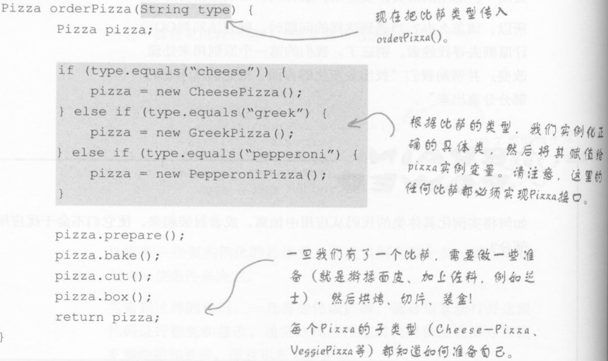

如果，此时，披萨的类型发生了很多变化：

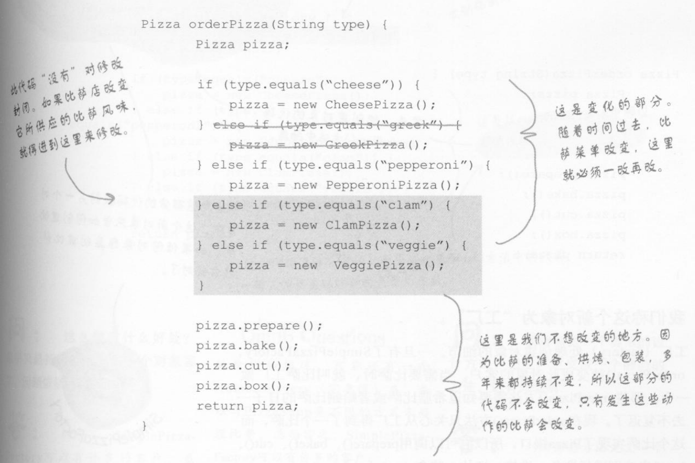

很明显，实例化某些具体类，将使orderPizza()出问题，而且也无法让orderPizza()对修改关闭。但是，我们已经知道了那些地方会改变，那些地方不会，接下来就是使用封装的时候了。

#### 封装变化的部分

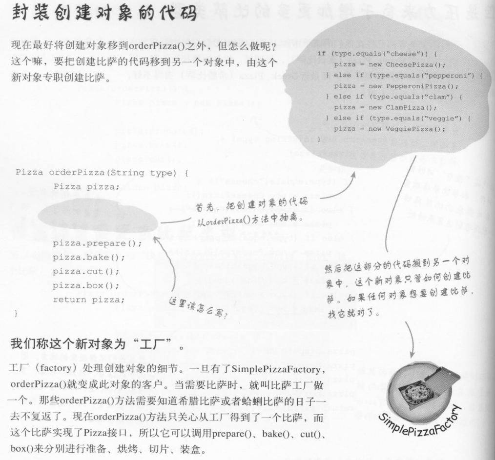

#### 建立简单的工厂

定义一个类，为所有比萨封装创建对象的代码：

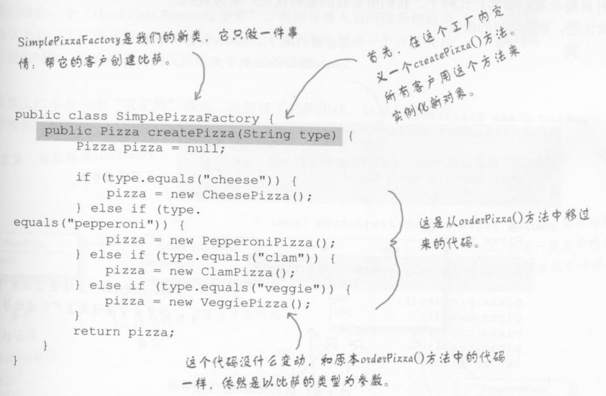

几个疑惑：

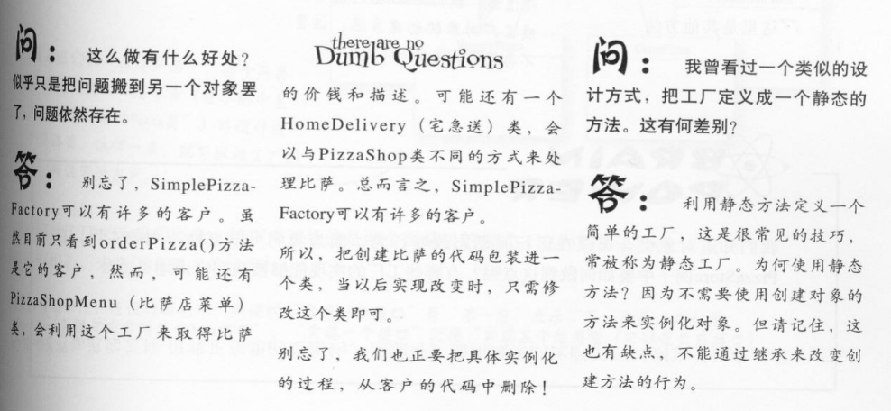

#### 重做PizzaStore类

使用披萨工厂来，修改客户代码：

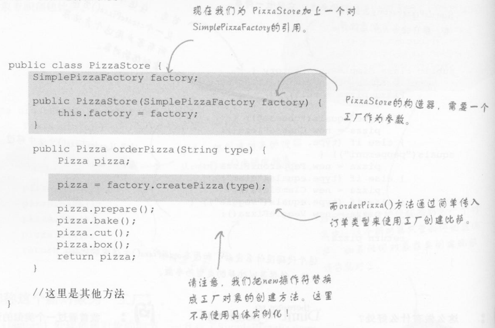

#### 简单工厂阶段总结

- 简单工厂其实不是一个设计模式，反而像是一种编程习惯

使用简单工厂方法，实现的披萨店类图：

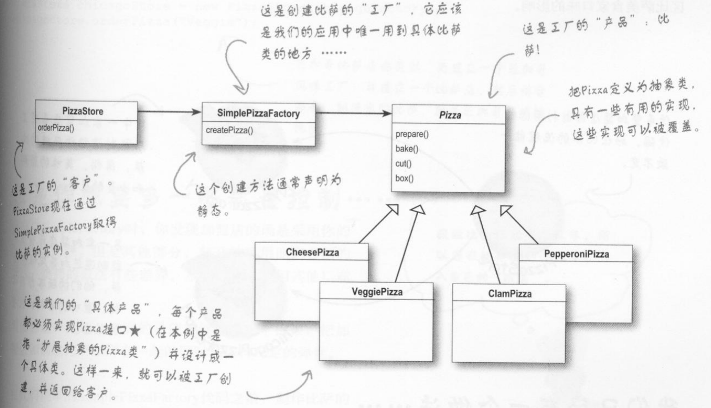

**在设计模式中，“实现一个接口”并“不一定”表示“写一个类，并利用implements关键词来实现某个接口”。“实现一个接口”泛指实现某个超类型(可以是类或接口)的某个方法。**

### 工厂方法模式阶段

#### 加盟披萨店

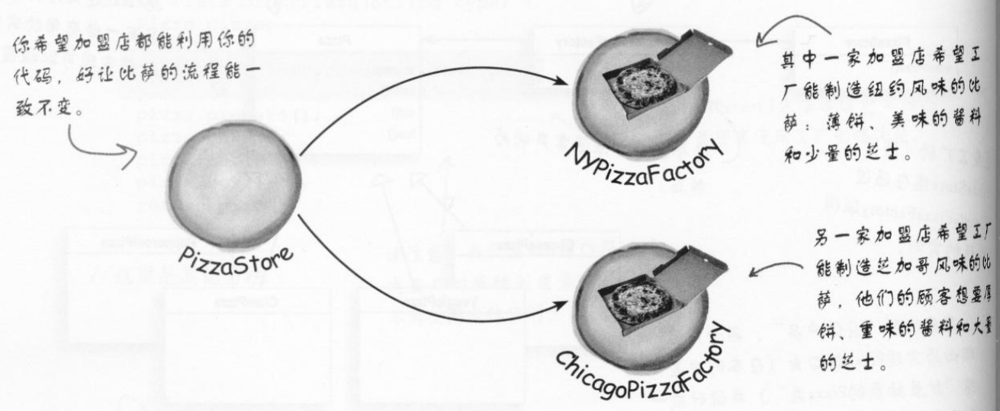

#### 一种做法

利用SimplePizzaFactory，写出三种不同的工厂，分别是NYPizzaFactory、ChicagoPizzaFactory、CaliforniaPizzaFactory。

然后，变成这个样子：

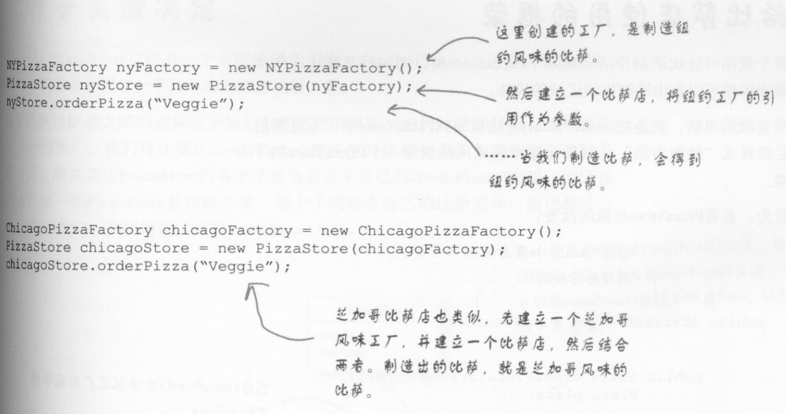

加盟店采用你的工厂创建披萨，但在其他部分，他们想采用自创的流程：烘烤的做法有差异、不要切片等。

稍早的SimplePizzaFactory，制作披萨的代码绑在PizzaStore内，这么做没有弹性，导致上述需求不能满足。

#### 另一种方法

给披萨店使用框架。有个做法可让披萨活动限制在PizzaStore类（之所以成为加盟店，必须要满足的），又同时能让加盟店可以自由地制作该区域的风味披萨。

所要做的事就是，把`createPizza()`方法放回PizzaStore内，不过要把它设置为抽象方法，最后为每个区域风味创建一个PizzaStore的子类。

##### PizzaStore超类 

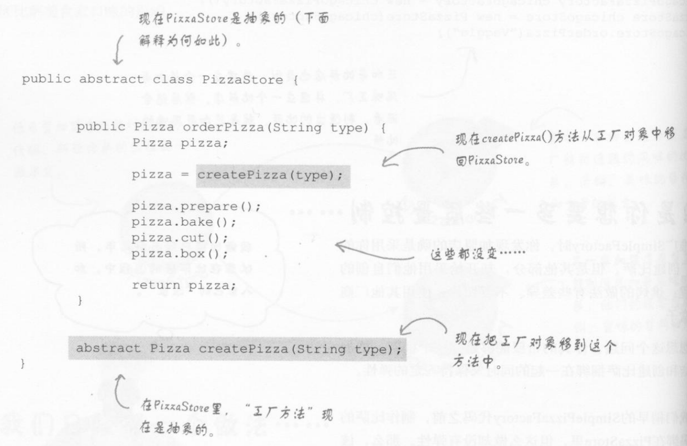

现在有了PizzaStore超类，让每个区域类型9（NYPizzaStore、ChicagoPizzaStore、CaliforniaPizzaStore）都继承这个PizzaStore，每个子类各自决定如何制造披萨。

##### 允许子类做决定

我们已经知道：

- PizzaStore已经有一个不错的订单系统，由`orderPizza()`方法负责处理订单，你希望所有加盟店都可以使用这个完善的系统
- 还需要允许加盟店之间制作披萨的差异，让`createPizza()`能够对这些变化来负责创建正确种类的披萨。

我们的做法是：让PizzaStore的各个子类负责定义自己的`createPizza()`方法。我们会得到一些PizzaStore具体的子类，每个子类都有自己的披萨变体，而仍然适合PizzaStore框架，并使用`orderPizza()`方法。

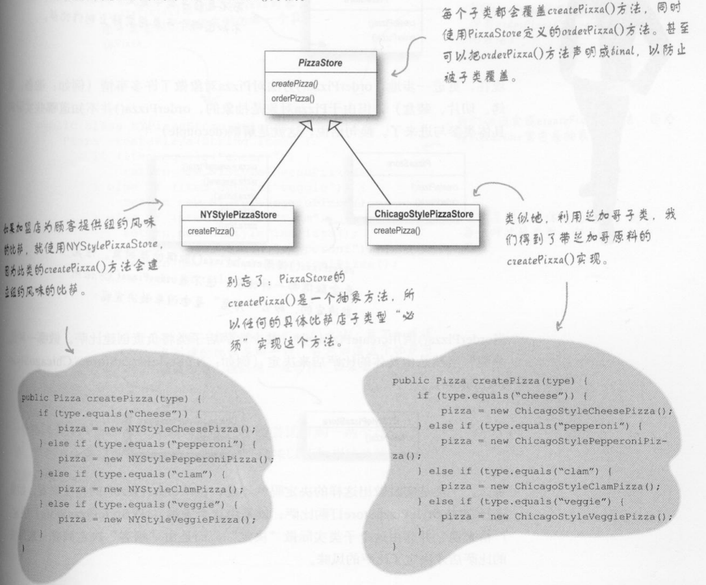

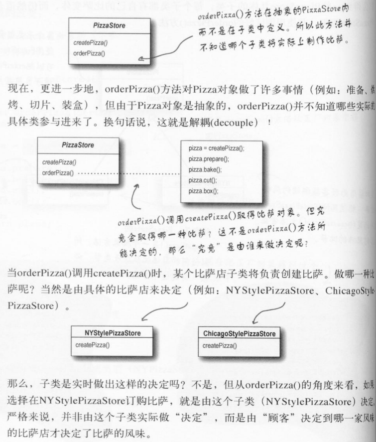

#### 开一家披萨店吧

这是一家纽约风味的披萨店：

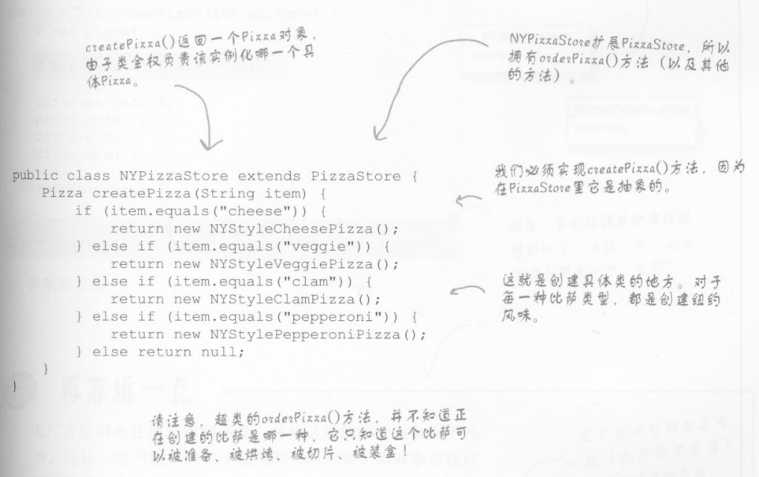

#### 声明一个工厂方法

原本由一个对象负责所有具体类的实例化，现在通过对PizzaStore做一些小转变，变成由一群子类来负责实例化：

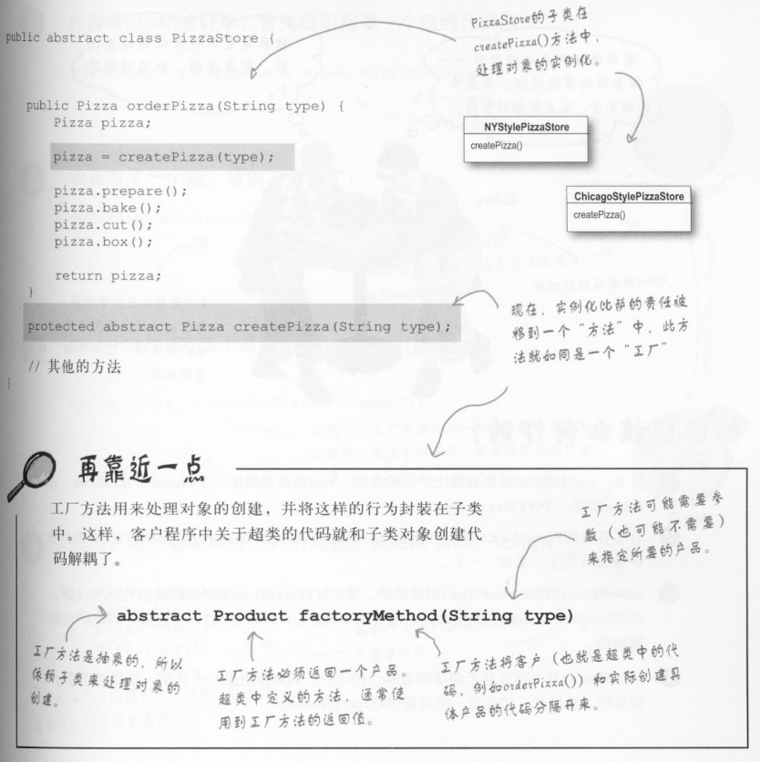

#### 订购披萨

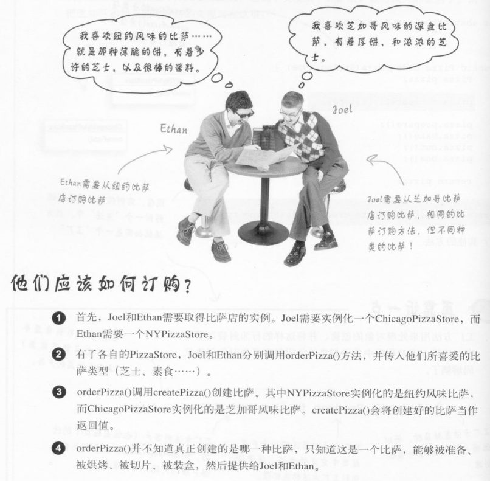

#### 根据订单生产披萨


#### 代码

##### Pizza

```java
import java.util.ArrayList;

/**
 * 设计模式 - 工厂模式
 * PizzaStore
 * 披萨抽象超类
 */
public abstract class Pizza {
    String name;
    String dough;
    String sauce;
    ArrayList toppings = new ArrayList();

    void prepare() {
        System.out.println("Preparing " + name);
        System.out.println("Tossing dough...");
        System.out.println("Adding sauce...");
        System.out.println("Adding toppings: ");        
        for (int i=0; i < toppings.size(); ++i) {
            System.out.println("   " + toppings.get(i));
        }
    }

    void bake() {
        System.out.println("Bake for 25 minutes at 350");
    }

    void cut() {
        System.out.println("Cutting the pizza into diagonal slices");
    }

    void box() {
        System.out.println("Place pizza in official PizzaStore box");
    }

    public String getName() {
        return name;
    }
} 
```

##### PizzaStore

```java
/**
 * 设计模式 - 工厂模式
 * PizzaStore
 * 工厂类
 */
public abstract class PizzaStore {
    public Pizza orderPizza(String type) {
        Pizza pizza;

        pizza = createPizza(type);

        pizza.prepare();
        pizza.bake();
        pizza.cut();
        pizza.box();

        return pizza;
    }

    abstract Pizza createPizza(String type);
}
```

```java
/**
 * 设计模式 - 工厂模式
 * PizzaStore
 * 芝加哥披萨店
 */
public class ChicagoPizzaStore extends PizzaStore {
    Pizza createPizza(String item) {
        if (item.equals("cheese")) {
            return new ChicagoStyleCheesePizza();
        } else if (item.equals("veggie")) {
            return new ChicagoStyleVeggiePizza();
        } else if (item.equals("clam")) {
            return new ChicagoStyleClamPizza();
        } else if (item.equals("pepperoni")) {
            return new ChicagoStylePepperoniPizza();
        } else return null;
    }
}
```

```java
/**
 * 设计模式 - 工厂模式
 * PizzaStore
 * 披萨具体类
 */
public class ChicagoStyleCheesePizza extends Pizza {

	public ChicagoStyleCheesePizza() { 
		name = "Chicago Style Deep Dish Cheese Pizza";
		dough = "Extra Thick Crust Dough";
		sauce = "Plum Tomato Sauce";
 
		toppings.add("Shredded Mozzarella Cheese");
	}
 
	void cut() {
		System.out.println("Cutting the pizza into square slices");
	}
}

```

```java
/**
 * 设计模式 - 工厂模式
 * PizzaStore
 * 披萨具体类
 */
public class ChicagoStyleClamPizza extends Pizza {
	public ChicagoStyleClamPizza() {
		name = "Chicago Style Clam Pizza";
		dough = "Extra Thick Crust Dough";
		sauce = "Plum Tomato Sauce";
 
		toppings.add("Shredded Mozzarella Cheese");
		toppings.add("Frozen Clams from Chesapeake Bay");
	}
 
	void cut() {
		System.out.println("Cutting the pizza into square slices");
	}
}

```

```java
/**
 * 设计模式 - 工厂模式
 * PizzaStore
 * 披萨具体类
 */
public class ChicagoStylePepperoniPizza extends Pizza {
	public ChicagoStylePepperoniPizza() {
		name = "Chicago Style Pepperoni Pizza";
		dough = "Extra Thick Crust Dough";
		sauce = "Plum Tomato Sauce";
 
		toppings.add("Shredded Mozzarella Cheese");
		toppings.add("Black Olives");
		toppings.add("Spinach");
		toppings.add("Eggplant");
		toppings.add("Sliced Pepperoni");
	}
 
	void cut() {
		System.out.println("Cutting the pizza into square slices");
	}
}

```

```java
/**
 * 设计模式 - 工厂模式
 * PizzaStore
 * 披萨具体类
 */
public class ChicagoStyleVeggiePizza extends Pizza {
	public ChicagoStyleVeggiePizza() {
		name = "Chicago Deep Dish Veggie Pizza";
		dough = "Extra Thick Crust Dough";
		sauce = "Plum Tomato Sauce";
 
		toppings.add("Shredded Mozzarella Cheese");
		toppings.add("Black Olives");
		toppings.add("Spinach");
		toppings.add("Eggplant");
	}
 
	void cut() {
		System.out.println("Cutting the pizza into square slices");
	}
}

```

```java
/**
 * 设计模式 - 工厂模式
 * PizzaStore
 * 纽约披萨店
 */
public class NYPizzaStore extends PizzaStore {
    Pizza createPizza(String item) {
        if (item.equals("cheese")) {
            return new NYStyleCheesePizza();
        } else if (item.equals("veggie")) {
            return new NYStyleVeggiePizza();
        } else if (item.equals("clam")) {
            return new NYStyleClamPizza();
        } else if (item.equals("pepperoni")) {
            return new NYStylePepperoniPizza();
        } else return null;
    }
}
```

```java
/**
 * 设计模式 - 工厂模式
 * PizzaStore
 * 披萨具体类
 */
public class NYStyleCheesePizza extends Pizza {
    public NYStyleCheesePizza() {
        name = "NY Style Sauce and Cheese Pizza";
        dough = "Thin Crust Dough";
        sauce = "Marinara Sauce";

        toppings.add("Grated Reggiano Cheese");
    }
}
```

```java
/**
 * 设计模式 - 工厂模式
 * PizzaStore
 * 披萨具体类
 */
public class NYStyleClamPizza extends Pizza {

	public NYStyleClamPizza() {
		name = "NY Style Clam Pizza";
		dough = "Thin Crust Dough";
		sauce = "Marinara Sauce";
 
		toppings.add("Grated Reggiano Cheese");
		toppings.add("Fresh Clams from Long Island Sound");
	}
}

```

```java
/**
 * 设计模式 - 工厂模式
 * PizzaStore
 * 披萨具体类
 */
public class NYStylePepperoniPizza extends Pizza {

	public NYStylePepperoniPizza() {
		name = "NY Style Pepperoni Pizza";
		dough = "Thin Crust Dough";
		sauce = "Marinara Sauce";
 
		toppings.add("Grated Reggiano Cheese");
		toppings.add("Sliced Pepperoni");
		toppings.add("Garlic");
		toppings.add("Onion");
		toppings.add("Mushrooms");
		toppings.add("Red Pepper");
	}
}

```

```java
/**
 * 设计模式 - 工厂模式
 * PizzaStore
 * 披萨具体类
 */
public class NYStyleVeggiePizza extends Pizza {

	public NYStyleVeggiePizza() {
		name = "NY Style Veggie Pizza";
		dough = "Thin Crust Dough";
		sauce = "Marinara Sauce";
 
		toppings.add("Grated Reggiano Cheese");
		toppings.add("Garlic");
		toppings.add("Onion");
		toppings.add("Mushrooms");
		toppings.add("Red Pepper");
	}
}

```

##### PizzaTestDrive

```java
/**
 * 设计模式 - 工厂模式
 * PizzaStore
 * 测试类
 */
public class PizzaTestDrive {
    public static void main(String[] args) {
        PizzaStore nyStore = new NYPizzaStore();
        PizzaStore chicagoStore = new ChicagoPizzaStore();

        Pizza pizza = nyStore.orderPizza("cheese");
        System.out.println("Ethan ordered a " + pizza.getName() + "\n");

        pizza = chicagoStore.orderPizza("cheese");
        System.out.println("Joel ordered a " + pizza.getName() + "\n");
    }
}
```

##### 输出

```shell
Preparing NY Style Sauce and Cheese Pizza
Tossing dough...
Adding sauce...
Adding toppings:
   Grated Reggiano Cheese
Bake for 25 minutes at 350
Cutting the pizza into diagonal slices
Place pizza in official PizzaStore box
Ethan ordered a NY Style Sauce and Cheese Pizza

Preparing Chicago Style Deep Dish Cheese Pizza
Tossing dough...
Adding sauce...
Adding toppings:
   Shredded Mozzarella Cheese
Bake for 25 minutes at 350
Cutting the pizza into square slices
Place pizza in official PizzaStore box
Joel ordered a Chicago Style Deep Dish Cheese Pizza
```

#### 小结

- 实际应用中，应该把披萨类型的类型从String改为静态变量或者enum类型。

### 抽象工厂模式阶段

##### 原料有了新需求

后来，披萨原料又有了新的需求...

我们需要建立原料工厂，来保证披萨的质量。可是，名称相同的原料，不同的地方，也是不一样了...

每个区域，对相同原料，有不同实现。

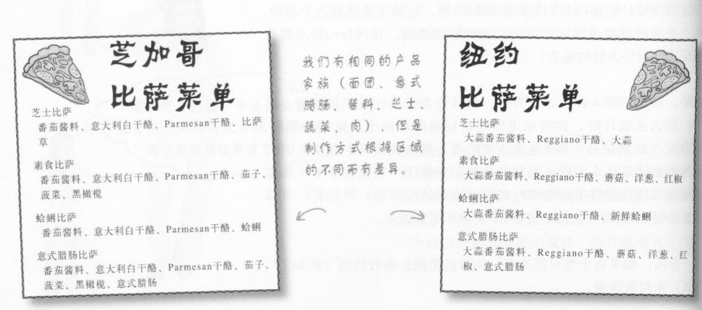

##### 原料家族

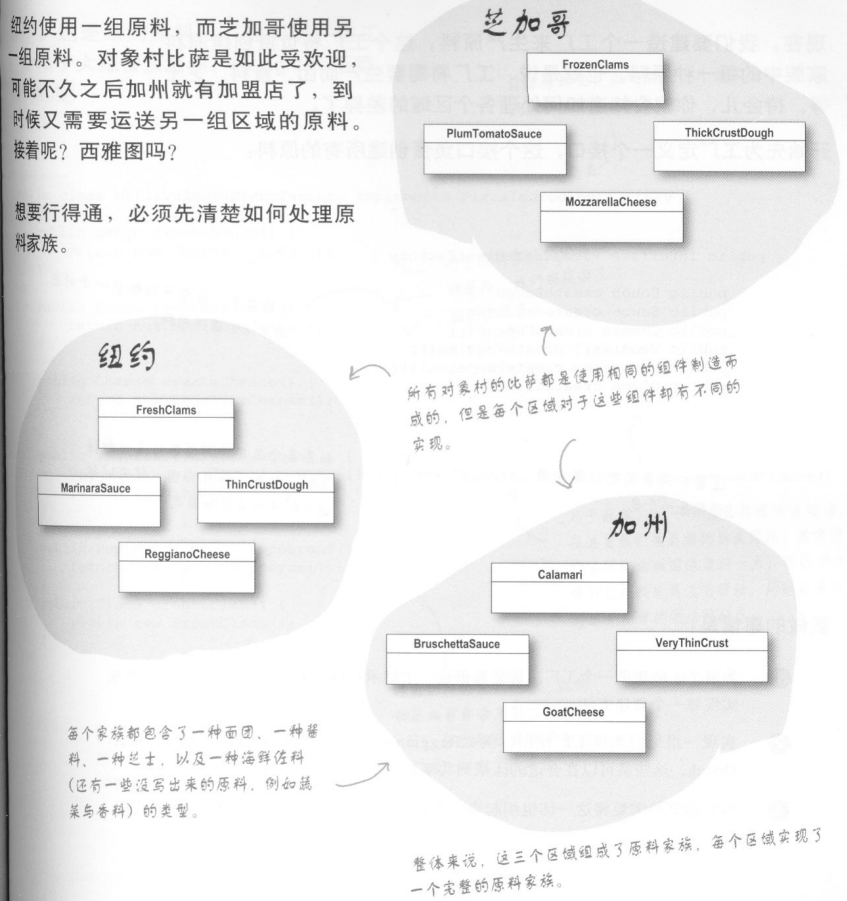

##### 建造原料工厂

为每个区域建造一个工厂。首先，为原料工厂定义一个接口，负责创建所有的原料。

```java
/**
 * 设计模式 - 抽象工厂模式
 * 原料工厂接口
 */
public interface PizzaIngredientFactory {
    // 在接口中，每个原料都有一个对应的方法创建该原料

    public Dough createDough();
    public Sauce createSauce();
    public Cheese createCheese();
    public Veggies[] createVeggies();
    public Pepperoni createPepperoni();
    public Clams createClam();
}
```

##### 创建纽约原料工厂

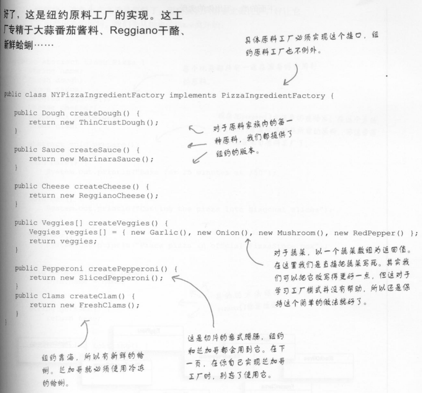

##### 重做披萨基类

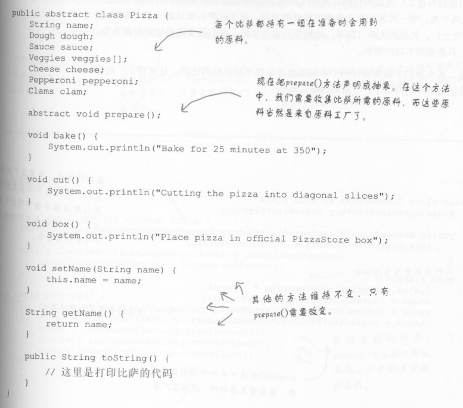

##### 重做披萨实现类

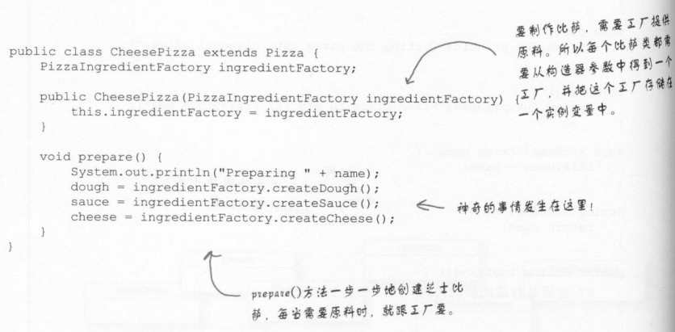

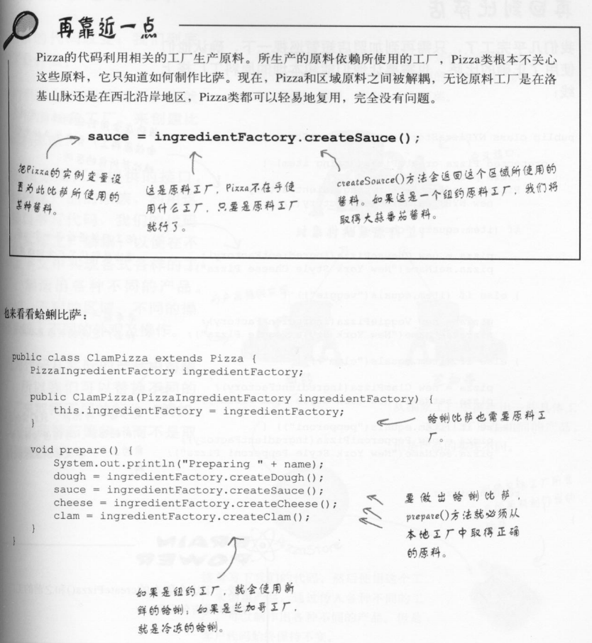

##### 重新设计披萨店

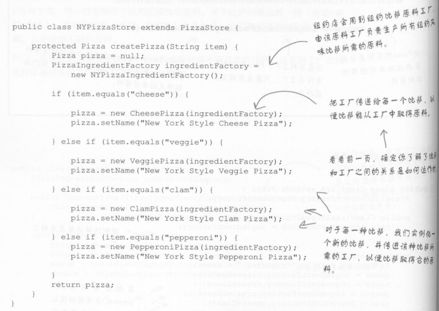

##### 究竟做了什么...

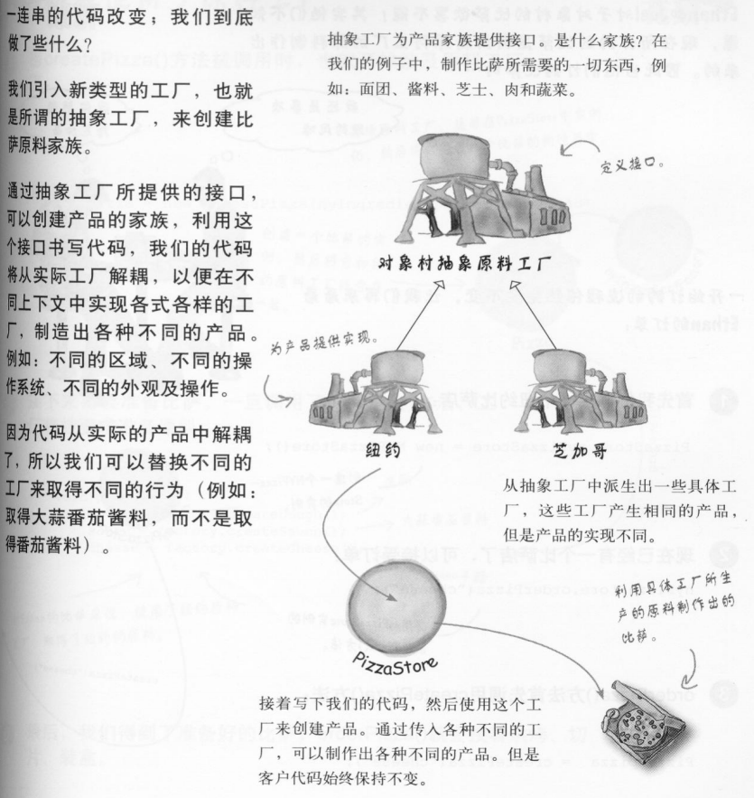

##### 现在的订单完成过程

- 首先需要一个纽约披萨店

  ```java
  PizzaStore nyPizzaStore = new NYPizzaStore();
  ```

- 现在已经有一个披萨店了，可以接受订单：

  ```java
  nyPizzaStore.orderPizza("cheese");
  ```

- `orderPizza()`方法首先调用`createPizza()`方法：

  ```java
  Pizza pizza = createPizza("cheese");
  ```

- 当`createPizza()`方法被调用时，也就可是设计原料工厂了

  ```java
  Pizza pizza = new CheesePizza(nyIngredientFactory);	// 选择原料工厂，接着在PizzaStore中实例化，然后将它传进每个披萨的构造器中
  ```

- 接下来需要准备披萨。一旦调用`prepare()`方法，工厂将被要求准备原料:

  ```java
  void prepare() {
      dough = factory.createDough();
    	sauce = factory.createSauce();
    	cheese = facotry.createCheese();
  }
  ```

- 最后，得到了准备好的披萨，`orderPizza()`就会接着烘焙、切片、装盒。

##### 类图

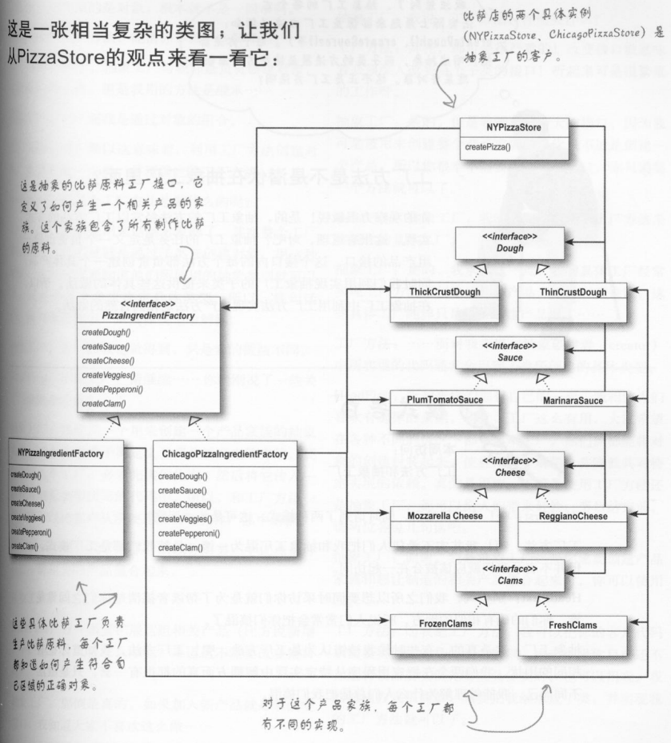