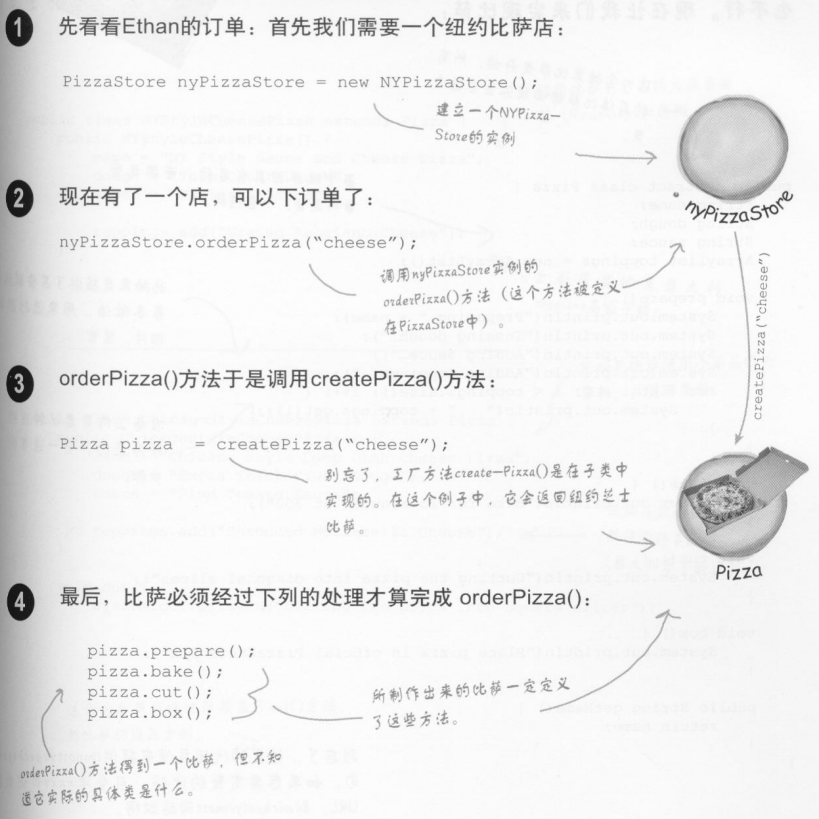

# 工厂模式

- 工厂方法模式
- 抽象工厂模式

**工厂方法用来处理对象的创建，并将这样的行为封装在子类中。这样，客户程序中关于超类的代码就和子类对象创建代码解耦了。**

## 工厂方法模式

### 定义

**工厂方法模式** 定义了一个创建对象的接口，但由子类决定要实例化的类是哪一个。工厂方法让类把实例化推迟到子类。

## 抽象工厂模式

### 定义

**抽象工厂模式** 提供一个接口，用于创建相关或依赖对象的家族，而不需要明确指定具体类。

## 引言

我们不应该针对实现编程，但是当我们每次使用new时，就会想到“具体”。使用new时，的确是在实例化一个具体类，所以用的确实是实现，而不是接口。我们知道，代码绑定具体类会导致代码更脆弱，更缺乏弹性。


当看到这样的代码，一旦有变化或扩展，就必须重新打开这段代码进行检查和修改。通常这样修改过的代码将造成部分系统更难维护和更新，而且也更容易犯错。

针对接口编程，可以隔离掉以后系统可能发生的一大堆改变。因为，如果代码是针对接口而写，那么通过多态，它可以与任何新类实现该接口。

当代码使用大量具体类时，一旦进入新的具体类，就必须改变代码。也就是说，你的代码并非“对修改关闭”。

解决上述问题，就需要“找出会变的方面，把它们从不变的部分分离出来”。

# 案例

## 披萨工厂

### 简单工厂阶段

#### 识别变化的方面

假如你有一个披萨店，你的代码可能这样写：


如果需要更多的披萨类型，则需要增加代码，来决定适合的比萨类型，然后再制造这个披萨：


如果，此时，披萨的类型发生了很多变化：


很明显，实例化某些具体类，将使orderPizza()出问题，而且也无法让orderPizza()对修改关闭。但是，我们已经知道了那些地方会改变，那些地方不会，接下来就是使用封装的时候了。

#### 封装变化的部分


#### 建立简单的工厂

定义一个类，为所有比萨封装创建对象的代码：


几个疑惑：


#### 重做PizzaStore类

使用披萨工厂来，修改客户代码：


#### 简单工厂阶段总结

- 简单工厂其实不是一个设计模式，反而像是一种编程习惯

使用简单工厂方法，实现的披萨店类图：


**在设计模式中，“实现一个接口”并“不一定”表示“写一个类，并利用implements关键词来实现某个接口”。“实现一个接口”泛指实现某个超类型(可以是类或接口)的某个方法。**

### 工厂方法模式阶段

#### 加盟披萨店


#### 一种做法

利用SimplePizzaFactory，写出三种不同的工厂，分别是NYPizzaFactory、ChicagoPizzaFactory、CaliforniaPizzaFactory。

然后，变成这个样子：


加盟店采用你的工厂创建披萨，但在其他部分，他们想采用自创的流程：烘烤的做法有差异、不要切片等。

稍早的SimplePizzaFactory，制作披萨的代码绑在PizzaStore内，这么做没有弹性，导致上述需求不能满足。

#### 另一种方法

给披萨店使用框架。有个做法可让披萨活动限制在PizzaStore类（之所以成为加盟店，必须要满足的），又同时能让加盟店可以自由地制作该区域的风味披萨。

所要做的事就是，把`createPizza()`方法放回PizzaStore内，不过要把它设置为抽象方法，最后为每个区域风味创建一个PizzaStore的子类。

##### PizzaStore超类 


现在有了PizzaStore超类，让每个区域类型9（NYPizzaStore、ChicagoPizzaStore、CaliforniaPizzaStore）都继承这个PizzaStore，每个子类各自决定如何制造披萨。

##### 允许子类做决定

我们已经知道：

- PizzaStore已经有一个不错的订单系统，由`orderPizza()`方法负责处理订单，你希望所有加盟店都可以使用这个完善的系统
- 还需要允许加盟店之间制作披萨的差异，让`createPizza()`能够对这些变化来负责创建正确种类的披萨。

我们的做法是：让PizzaStore的各个子类负责定义自己的`createPizza()`方法。我们会得到一些PizzaStore具体的子类，每个子类都有自己的披萨变体，而仍然适合PizzaStore框架，并使用`orderPizza()`方法。


#### 开一家披萨店吧

这是一家纽约风味的披萨店：


#### 声明一个工厂方法

原本由一个对象负责所有具体类的实例化，现在通过对PizzaStore做一些小转变，变成由一群子类来负责实例化：


#### 订购披萨


#### 根据订单生产披萨



#### 代码

##### Pizza

```java
import java.util.ArrayList;

/**
 * 设计模式 - 工厂模式
 * PizzaStore
 * 披萨抽象超类
 */
public abstract class Pizza {
    String name;
    String dough;
    String sauce;
    ArrayList toppings = new ArrayList();

    void prepare() {
        System.out.println("Preparing " + name);
        System.out.println("Tossing dough...");
        System.out.println("Adding sauce...");
        System.out.println("Adding toppings: ");        
        for (int i=0; i < toppings.size(); ++i) {
            System.out.println("   " + toppings.get(i));
        }
    }

    void bake() {
        System.out.println("Bake for 25 minutes at 350");
    }

    void cut() {
        System.out.println("Cutting the pizza into diagonal slices");
    }

    void box() {
        System.out.println("Place pizza in official PizzaStore box");
    }

    public String getName() {
        return name;
    }
} 
```

##### PizzaStore

```java
/**
 * 设计模式 - 工厂模式
 * PizzaStore
 * 工厂类
 */
public abstract class PizzaStore {
    public Pizza orderPizza(String type) {
        Pizza pizza;

        pizza = createPizza(type);

        pizza.prepare();
        pizza.bake();
        pizza.cut();
        pizza.box();

        return pizza;
    }

    abstract Pizza createPizza(String type);
}
```

```java
/**
 * 设计模式 - 工厂模式
 * PizzaStore
 * 芝加哥披萨店
 */
public class ChicagoPizzaStore extends PizzaStore {
    Pizza createPizza(String item) {
        if (item.equals("cheese")) {
            return new ChicagoStyleCheesePizza();
        } else if (item.equals("veggie")) {
            return new ChicagoStyleVeggiePizza();
        } else if (item.equals("clam")) {
            return new ChicagoStyleClamPizza();
        } else if (item.equals("pepperoni")) {
            return new ChicagoStylePepperoniPizza();
        } else return null;
    }
}
```

```java
/**
 * 设计模式 - 工厂模式
 * PizzaStore
 * 披萨具体类
 */
public class ChicagoStyleCheesePizza extends Pizza {

	public ChicagoStyleCheesePizza() { 
		name = "Chicago Style Deep Dish Cheese Pizza";
		dough = "Extra Thick Crust Dough";
		sauce = "Plum Tomato Sauce";
 
		toppings.add("Shredded Mozzarella Cheese");
	}
 
	void cut() {
		System.out.println("Cutting the pizza into square slices");
	}
}

```

```java
/**
 * 设计模式 - 工厂模式
 * PizzaStore
 * 披萨具体类
 */
public class ChicagoStyleClamPizza extends Pizza {
	public ChicagoStyleClamPizza() {
		name = "Chicago Style Clam Pizza";
		dough = "Extra Thick Crust Dough";
		sauce = "Plum Tomato Sauce";
 
		toppings.add("Shredded Mozzarella Cheese");
		toppings.add("Frozen Clams from Chesapeake Bay");
	}
 
	void cut() {
		System.out.println("Cutting the pizza into square slices");
	}
}

```

```java
/**
 * 设计模式 - 工厂模式
 * PizzaStore
 * 披萨具体类
 */
public class ChicagoStylePepperoniPizza extends Pizza {
	public ChicagoStylePepperoniPizza() {
		name = "Chicago Style Pepperoni Pizza";
		dough = "Extra Thick Crust Dough";
		sauce = "Plum Tomato Sauce";
 
		toppings.add("Shredded Mozzarella Cheese");
		toppings.add("Black Olives");
		toppings.add("Spinach");
		toppings.add("Eggplant");
		toppings.add("Sliced Pepperoni");
	}
 
	void cut() {
		System.out.println("Cutting the pizza into square slices");
	}
}

```

```java
/**
 * 设计模式 - 工厂模式
 * PizzaStore
 * 披萨具体类
 */
public class ChicagoStyleVeggiePizza extends Pizza {
	public ChicagoStyleVeggiePizza() {
		name = "Chicago Deep Dish Veggie Pizza";
		dough = "Extra Thick Crust Dough";
		sauce = "Plum Tomato Sauce";
 
		toppings.add("Shredded Mozzarella Cheese");
		toppings.add("Black Olives");
		toppings.add("Spinach");
		toppings.add("Eggplant");
	}
 
	void cut() {
		System.out.println("Cutting the pizza into square slices");
	}
}

```

```java
/**
 * 设计模式 - 工厂模式
 * PizzaStore
 * 纽约披萨店
 */
public class NYPizzaStore extends PizzaStore {
    Pizza createPizza(String item) {
        if (item.equals("cheese")) {
            return new NYStyleCheesePizza();
        } else if (item.equals("veggie")) {
            return new NYStyleVeggiePizza();
        } else if (item.equals("clam")) {
            return new NYStyleClamPizza();
        } else if (item.equals("pepperoni")) {
            return new NYStylePepperoniPizza();
        } else return null;
    }
}
```

```java
/**
 * 设计模式 - 工厂模式
 * PizzaStore
 * 披萨具体类
 */
public class NYStyleCheesePizza extends Pizza {
    public NYStyleCheesePizza() {
        name = "NY Style Sauce and Cheese Pizza";
        dough = "Thin Crust Dough";
        sauce = "Marinara Sauce";

        toppings.add("Grated Reggiano Cheese");
    }
}
```

```java
/**
 * 设计模式 - 工厂模式
 * PizzaStore
 * 披萨具体类
 */
public class NYStyleClamPizza extends Pizza {

	public NYStyleClamPizza() {
		name = "NY Style Clam Pizza";
		dough = "Thin Crust Dough";
		sauce = "Marinara Sauce";
 
		toppings.add("Grated Reggiano Cheese");
		toppings.add("Fresh Clams from Long Island Sound");
	}
}

```

```java
/**
 * 设计模式 - 工厂模式
 * PizzaStore
 * 披萨具体类
 */
public class NYStylePepperoniPizza extends Pizza {

	public NYStylePepperoniPizza() {
		name = "NY Style Pepperoni Pizza";
		dough = "Thin Crust Dough";
		sauce = "Marinara Sauce";
 
		toppings.add("Grated Reggiano Cheese");
		toppings.add("Sliced Pepperoni");
		toppings.add("Garlic");
		toppings.add("Onion");
		toppings.add("Mushrooms");
		toppings.add("Red Pepper");
	}
}

```

```java
/**
 * 设计模式 - 工厂模式
 * PizzaStore
 * 披萨具体类
 */
public class NYStyleVeggiePizza extends Pizza {

	public NYStyleVeggiePizza() {
		name = "NY Style Veggie Pizza";
		dough = "Thin Crust Dough";
		sauce = "Marinara Sauce";
 
		toppings.add("Grated Reggiano Cheese");
		toppings.add("Garlic");
		toppings.add("Onion");
		toppings.add("Mushrooms");
		toppings.add("Red Pepper");
	}
}

```

##### PizzaTestDrive

```java
/**
 * 设计模式 - 工厂模式
 * PizzaStore
 * 测试类
 */
public class PizzaTestDrive {
    public static void main(String[] args) {
        PizzaStore nyStore = new NYPizzaStore();
        PizzaStore chicagoStore = new ChicagoPizzaStore();

        Pizza pizza = nyStore.orderPizza("cheese");
        System.out.println("Ethan ordered a " + pizza.getName() + "\n");

        pizza = chicagoStore.orderPizza("cheese");
        System.out.println("Joel ordered a " + pizza.getName() + "\n");
    }
}
```

##### 输出

```shell
Preparing NY Style Sauce and Cheese Pizza
Tossing dough...
Adding sauce...
Adding toppings:
   Grated Reggiano Cheese
Bake for 25 minutes at 350
Cutting the pizza into diagonal slices
Place pizza in official PizzaStore box
Ethan ordered a NY Style Sauce and Cheese Pizza

Preparing Chicago Style Deep Dish Cheese Pizza
Tossing dough...
Adding sauce...
Adding toppings:
   Shredded Mozzarella Cheese
Bake for 25 minutes at 350
Cutting the pizza into square slices
Place pizza in official PizzaStore box
Joel ordered a Chicago Style Deep Dish Cheese Pizza
```

