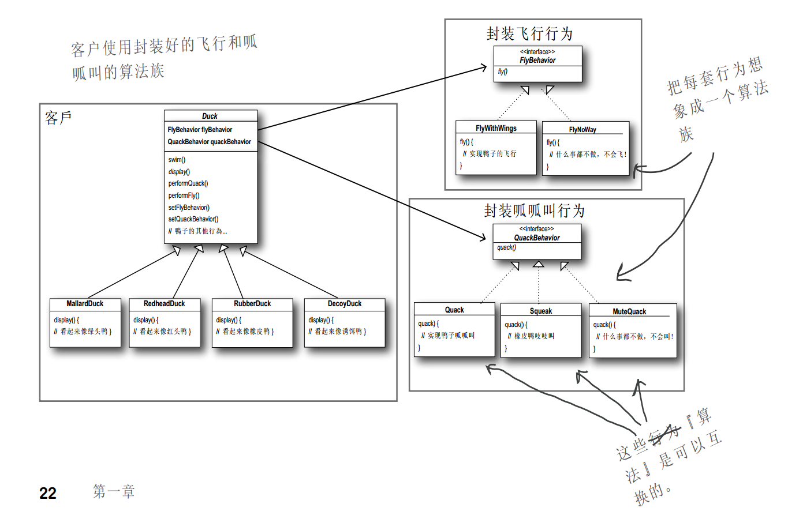

# 简介

Head First 设计模式笔记。

# 相关概念

- OO：面向对象，将问题看成一个系统，将系统按要素进行分类，并建立联系


- OOD：面向对象设计
- OOP：面向对象编程

# 策略模式

在超类中加上新的行为，会使得某些不适合该行为的子类也具有该行为。

利用继承来提供行为，造成的问题：

- 代码在多个子类中重复
- 运行时的行为不易改变
- 改变会牵一发动全身
- 很难知道各个子类行所具有的行为(由于子类会覆盖超类行为)

**找出应用中可能需要变化之处，把它们独立出来，不要和那些不需要变化的代码混在一起**
- **把会变化的部分取出并“封装”起来，好让其他部分不会受到影响**

### 针对接口编程

**针对接口编程，而不是针对实现编程。**

**“针对接口编程” 真正的意思是 “针对超类型编程”。**

这里所谓的“接口”有多个含义，接口是一个“概念”，也是一种Java的interface构造。你可以在不涉及Java interface的情况下，“针对接口编程”，关键就在多态。利用多态，程序可以针对超类型编程，执行时会根据实际状况执行真正的行为，不会被绑死在超类型的行为上。

“针对超类型编程”这句话，可以更明确地说成：“变量的声明类型应该是超类型，通常是一个抽象类或是一个接口，如此，只要是具体实现此超类型的类所产生的对象都可以指定给这个变量。这也意味着，**声明类时不用了理会以后执行时的真正对象类型。**”

```
一个简单多态的例子：
假设有一个抽象类Animal，有两个具体实现(Dog和Cat)集成Animal

#### 针对实现编程
Dog dog = new Dog();	// 类型声明d为Dog类型，会造成必须针对具体实现编程
d.bark();	// bark：叫声的一种

#### 针对借口编程如下
Animal animal = new Animal();	
animal.makeSound();	// 利用animal进行多态调用

更棒的是，子类实例化的动作不再需要在代码中硬编码，而是“在运行时才指定具体实现的对象”，例如：
a = getAnimal();
a.makeSound();
```

整合的代码：

```java
// FlyBehavior.java
public interface FlyBehavior {
    public void fly();
}

// FlyWithWings.java
public class FlyWithWings implements FlyBehavior {
    public void fly() {
        System.out.println("I am flying!");
    }
}

// FlyNoWay.java
public class FlyNoWay implements FlyBehavior {
    public void fly() {
        System.out.println("I can't fly!");
    }
}

// QuackBehavior.java
public interface QuackBehavior {
    public void quack();
}

// Quack.java
public class Quack implements QuackBehavior {
    public void quack() {
        System.out.println("Quack");
    }
}

// MuteQuack.java
public class MuteQuack implements QuackBehavior {
    public void quack() {
        System.out.println("<< Silence >>);
    }
}
                
// Squeak.java
public class Squeak implements QuackBehavior {
    public void quack() {
        System.out.println("Squeak");
    }
}
         
// Duck.java
public abstract class Duck {

    FlyBehavior flyBehavior;    // 为行为接口类型声明两个引用变量，所有鸭子子类都继承他们
    QuackBehavior quackBehavior;

    public Duck() { }

    public abstract void display();

    public void performFly() {
        flyBehavior.fly();  // 委托给行为类
    }

    public void performQuack() {
        quackBehavior.quack();  // 委托给行为类
    }

    public void swim() {
        System.out.println("All ducks float, even decoys!");
    }
}
 
// MallardDuck.java
public class MallardDuck extends Duck {

    public MallardDuck() {
        quackBehavior = new Quack();
        flyBehavior = new FlyWithWings();
    }

    public void display() {
        System.out.println("I am a real Mallard duck");
    }
}
                           
// Output
bovenson@ThinkCentre:/home/public/Git/notes/DesignPattern/Code$ javac MiniDuckSimulator.java && java MiniDuckSimulator
Quack
I am flying!
```

### 动态设定行为

相较于面向过程思维（使用回调函数，调用同一方法表现出不同行为），使用动态链接方法更符合面向对象设计。

修改`Duck.java`，添加`setFlyBehavior(FlyBehavior fb)`和`setQuackBehavior(QuackBehavior qb)`方法。

```java
public abstract class Duck {

    FlyBehavior flyBehavior;    // 为行为接口类型声明两个引用变量，所有鸭子子类都继承他们
    QuackBehavior quackBehavior;

    public Duck() { }

    public abstract void display();

    public void performFly() {
        flyBehavior.fly();  // 委托给行为类
    }

    public void performQuack() {
        quackBehavior.quack();  // 委托给行为类
    }

    public void swim() {
        System.out.println("All ducks float, even decoys!");
    }

    public void setFlyBehavior(FlyBehavior fb) {    // 动态设定行为
        flyBehavior = fb;
    }

    public void setQuackBehavior(QuackBehavior qb) {    // 动态设定行为
        quackBehavior = qb;
    }
}
```

添加：

- `ModelDuck.java`
- `FlyRocketPowered.java`

```java
// ModelDuck.java
public class ModelDuck extends Duck {
    public ModelDuck() {
        flyBehavior = new FlyNoWay();
        quackBehavior = new Quack();
    }

    public void display() {
        System.out.println("I'm a model duck");
    }
}

// FlyRocketPowered.java
public class FlyRocketPowered implements FlyBehavior {
    public void fly() {
        System.out.println("I'm flying with a rocket!");
    }
}
```

修改`MiniDuckSimulator.java`

```java
public class MiniDuckSimulator {
    public static void main(String args[]) {
        Duck mallard = new MallardDuck();
        mallard.performQuack();
        mallard.performFly();

        Duck model = new ModelDuck();
        model.performFly();
        model.setFlyBehavior(new FlyRocketPowered());	// 动态设定行为
        model.performFly();
    }
}
```

输出:

```shell
bovenson@ThinkCentre:/home/public/Git/notes/DesignPattern/Code$ cd "/home/public/Git/notes/DesignPattern/Code/Char0/" && javac MiniDuckSimulator.java && java MiniDuckSimulator
Quack
I am flying!
I can't fly!
I'm flying with a rocket!
```



### 组合

组合：将多个类结合起来使用。

这种做法和继承不同的地方在于，行为不是继承来的，而是和适当的行为对象组合来的。

**多用组合，少用继承。**虽然继承更加简单，可以加快开发，但是不利于后期维护。

## 定义

**策略模式**定义了算法簇，分别封装起来，让它们之间可以互相替换，此模式让算法的变化独立于使用算法的客户。

建立可维护的OO系统，要诀就在于随时想到系统以后可能需要的变化以及应付变化的原则。

# 总结

## 可用的工具

### 基础

- 抽象
- 封装
- 多态
- 继承

### 原则

- 封装变化
- 多用组合，少用继承
- 针对接口编程，不针对实现编程

### 模式

- 策略模式

## 要点

- 知道OO基础，并不足以设计出良好的OO系统
- 良好的OO设计必须具备可复用、可扩充、可维护三个特性
- 模式可以让我们建造出具有良好OO设计质量的系统
- 模式被认为是历经验证的OO设计经验
- 模式不是代码，而是针对设计问题的通用解决方案。你可把它们应用到特定的应用中。
- 模式不是被发明，而是被发现。
- 大多数的模式和原则，都着眼于软件变化的主题
- 大多数的模式都被允许系统局部改变独立于其他部分
- 常把系统中会变化的部分抽出来封装
- 模式让开发人员之间有共享的语言，能够最大化沟通的价值