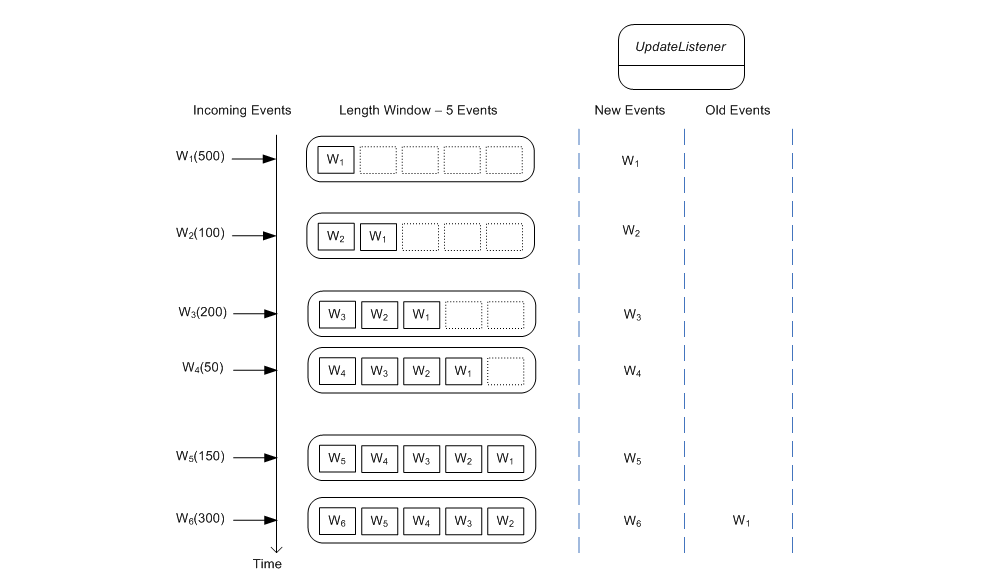

# 03 - Processing Modal

## Introduction

Esper的处理模型是持续的: 根据语句对事件流, 试图, 过滤器和输出率, 引擎在处理该语句事件的同时更新监听器(update listeners)和/或语句的订阅者会接收到更新数据.

监听器的接口是`com.espertech.esper.client.UpdateListener`.


对于结果交付, Esper提供了另一个可供选择的, 强类型的, 高性能的, 原生的方法: 订阅者对象(Subscriber object). 订阅者对象是查询结果和一个Java对象的直接绑定. 这个Java对象是一个POJO, 通过方法调用来接受语句的查询结果. 该订阅者类不需要实现一个接口或者继承一个类. [查看更多](http://www.espertech.com/esper/release-6.1.0/esper-reference/html/api.html#api-admin-subscriber).

Esper引擎通过把结果放到`com.espertech.esper.client.EventBean`实例中, 来更新监听器. 典型的监听器实现通过getter方法查询EventBean实例, 以获取语句生成的结果.


EventBean接口的get方法可以被用来通过名称(name)检索结果列. 提供给get方法的属性名(property name)可以查询对象的嵌套, 索引, 数组属性.

EventBean接口的`getUnderlying`方法允许更新监听器获取`underlying event object`.

## Insert Stream

我们来看一下一个非常简单的EPL语句的输出. 该语句选择一个事件流, 不使用数据窗口(data windows), 也不用过滤器:

`select * from Withdrawal`

该语句选择所有的Withdrawal事件. 每当引擎处理Withdrawal类型的事件, 或者Withdrawal子类型的事件时, 都会调用所有的更新监听器, 把新事件交给每一个该语句的监听器.

术语插入流(inset stream)表示新事件到达并且进入了一个数据窗口或集合. 上述例子中的Insert Stream是到达的Withdrawal事件, 并且被当做新事件发送给监听器.

下面的图展示了1-6系列Withdrawal事件依次到达. 括号中的数字是Withdrawal数量, 一个事件属性, 用来在接下的例子中对事件进行过滤.


上面的例子中, Esper引擎只对语句的监听者推送了new events, 没有old events.

### 示例代码

`EsperInsertStream.java`

```java
package com.bovenson.esper;

import com.espertech.esper.client.EPServiceProvider;
import com.espertech.esper.client.EPServiceProviderManager;
import com.espertech.esper.client.EPStatement;

public class EsperInsertStream {

    public static void main(String args[]) {
        EPServiceProvider engine = EPServiceProviderManager.getDefaultProvider();

        engine.getEPAdministrator().getConfiguration().addEventType(EsperSimpleEventBean.class);

        String epl = "select * from " + EsperSimpleEventBean.class.getName();
        EPStatement statement = engine.getEPAdministrator().createEPL(epl);

        // 添加 update listener
        statement.addListener((newData, oldData) -> {
            if (newData != null) {
                String name = (String) newData[0].get("name");
                String data = (String) newData[0].get("data");
                System.out.println(String.format("newData info - Name: %s, Data: %s", name, data));
            } else {
                System.out.println("newData is null.");
            }

            if (oldData != null) {
                String name = (String) oldData[0].get("name");
                String data = (String) oldData[0].get("data");
                System.out.println(String.format("oldData info - Name: %s, Data: %s", name, data));
            } else {
                System.out.println("oldData is null.");
            }
        });

        // 发送事件
        engine.getEPRuntime().sendEvent(new EsperSimpleEventBean("Mike", "Good Bye."));
    }

    static class EsperSimpleEventBean {
        private String name;
        private String data;

        EsperSimpleEventBean(String name, String data) {
            this.name = name;
            this.data = data;
        }

        public String getName() {
            return name;
        }

        public String getData() {
            return data;
        }
    }
}
```

输出:

```shell
newData info - Name: Mike, Data: Good Bye.
oldData is null.
```


## Insert and Remove Stream

长度窗口指示引擎仅保留流的最后N个事件。下面的语句对Withdrawal事件流用了长度窗口. 该声明用于说明数据窗口和进入离开数据窗口事件的概念.

`select * from Withdrawal#length(5)`

该语句中, 长度窗口是5个事件. Esper引擎把所有到达的Withdrawal事件放到这个长度窗口中. 当长度窗口被塞满之后, 最先到达的Withdrawal事件被推出该窗口.  Esper引擎告知监听器: 所有进入长度窗口的事件为new events, 所有离开长度窗口的事件为old events.

术语`insert stream`表示新事件到达, 术语`remove stream`表示事件离开数据窗口或者更改集合数值. 在这个例子中, Withdrawal事件离开长度窗口, 并且该事件被当做old events推送给监听者.

下图阐述了当事件到达时, 长度窗口(length window)内容如何改变, 以及展示了事件被推送更新监听器.



像之前一样, 所有新到达的事件被当做new events推送给监听器. 另外, 当W6事件到达, W1事件离开长度窗口被当做old event推送给监听器.

和长度窗口类似, 时间窗口(time window)还将最近的事件保持到给定的时间段. 比如:

`select rstream * from Withdrawal#time(30 sec)`

该语句将最近30秒内的Withdrawal事件保存在事件窗口中. 随着时间流逝, 事件窗口的事件会被推出, 并被当做old events推送给监听者.

### 示例代码

```java
package com.bovenson.esper;

import com.espertech.esper.client.*;
import org.slf4j.Logger;
import org.slf4j.LoggerFactory;

public class EsperInsertRemoveStreamLambda {
    private static final Logger log = LoggerFactory.getLogger(EsperInsertRemoveStreamLambda.class);

    public static void main(String args[]) {
        EPServiceProvider engine = EPServiceProviderManager.getDefaultProvider();

        engine.getEPAdministrator().getConfiguration().addEventType(Withdrawal.class);

        String epl = String.format("select irstream * from %s#length(4)", Withdrawal.class.getName());
        // String epl = "select * from Withdrawal.win:length(2)";
        EPStatement statement = engine.getEPAdministrator().createEPL(epl);

        // 添加 update listener
        statement.addListener((EventBean[] newEvents, EventBean[] oldEvents) -> {
            if (newEvents != null) {
                // System.out.println("Length:" + newEvents.length);
                String name = (String) newEvents[0].get("name");
                int amount = (int) newEvents[0].get("amount");
                System.out.println(String.format("newEvents info - Name: %s, Amount: %d", name, amount));
            } else {
                System.out.println("newEvents is null.");
            }

            if (oldEvents != null) {
                String name = (String) oldEvents[0].get("name");
                int amount = (int) oldEvents[0].get("amount");
                System.out.println(String.format("oldEvents info - Name: %s, Amount: %d", name, amount));
            } else {
                System.out.println("oldEvents is null.");
            }
        });

        // 发送事件
        EPRuntime runtime = engine.getEPRuntime();
        runtime.sendEvent(new Withdrawal("W1", 500));
        runtime.sendEvent(new Withdrawal("W2", 100));
        runtime.sendEvent(new Withdrawal("W3", 200));
        runtime.sendEvent(new Withdrawal("W4", 300));
        runtime.sendEvent(new Withdrawal("W5", 50));
        runtime.sendEvent(new Withdrawal("W6", 150));
    }
}
```

**输出:**

```java
newEvents info - Name: W1, Amount: 500
oldEvents is null.
newEvents info - Name: W2, Amount: 100
oldEvents is null.
newEvents info - Name: W3, Amount: 200
oldEvents is null.
newEvents info - Name: W4, Amount: 300
oldEvents is null.
newEvents info - Name: W5, Amount: 50
oldEvents info - Name: W1, Amount: 500
newEvents info - Name: W6, Amount: 150
oldEvents info - Name: W2, Amount: 100
```


## Terms(术语)

- `length window`: 长度窗口
- `insert stream`: 插入流
- `update listener`: 更新监听器
- `time window`: 时间窗口