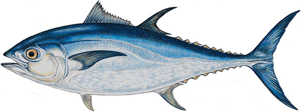
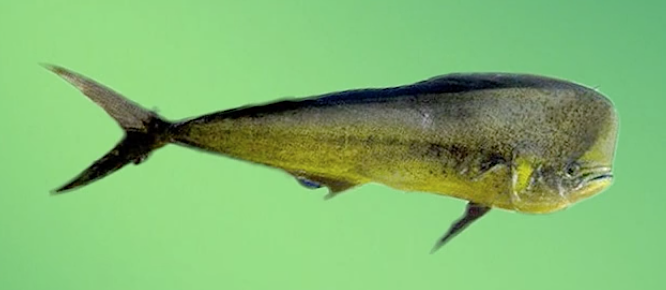
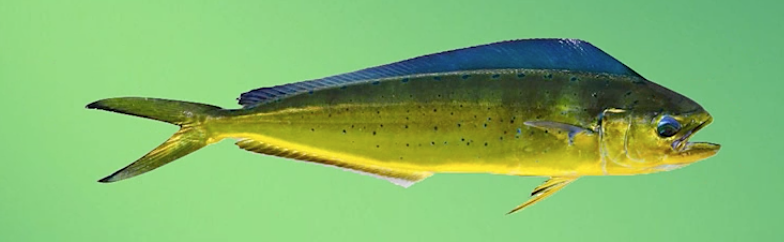
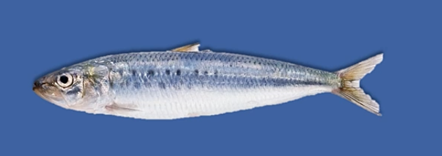
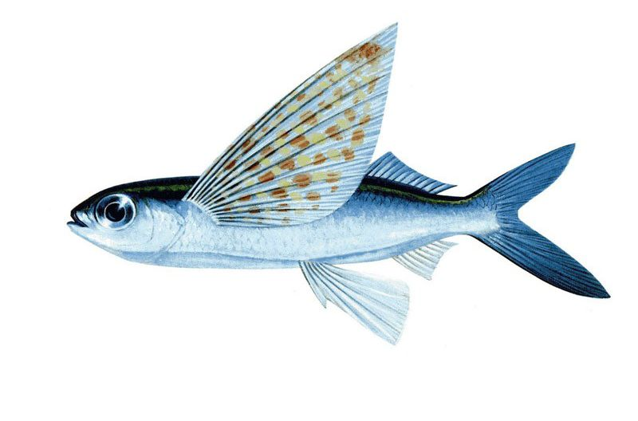
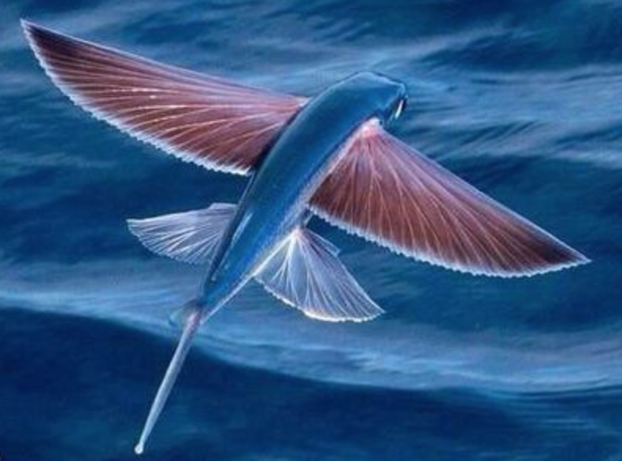

[TOC]

# 动物

## 鱼类

### 金枪鱼

**黄鳍金枪鱼**

**蓝鳍金枪鱼**

- 世界上最大的金枪鱼
- 寿命可达40多年

**大眼金枪鱼**

**长鳍金枪鱼**

**马苏金枪鱼**

**鲣**

### 鯕鳅

- 又名鬼头刀

- 栖息于海洋表层

- 肉质白

- 味道淡

- 可作为食用鱼

  - 生鱼片
  - 鱼丸
  - 鱼松

- 图片

  

  

### 沙丁鱼

- 沙丁鱼（Sardine）是[硬骨鱼纲](https://baike.baidu.com/item/%E7%A1%AC%E9%AA%A8%E9%B1%BC%E7%BA%B2)[鲱形目](https://baike.baidu.com/item/%E9%B2%B1%E5%BD%A2%E7%9B%AE)[鲱科](https://baike.baidu.com/item/%E9%B2%B1%E7%A7%91)沙丁鱼属、[小沙丁鱼属](https://baike.baidu.com/item/%E5%B0%8F%E6%B2%99%E4%B8%81%E9%B1%BC%E5%B1%9E)和拟沙丁鱼属及[鲱科](https://baike.baidu.com/item/%E9%B2%B1%E7%A7%91)某些食用鱼类的统称
- 沙丁鱼主要用作食用，但[鱼肉](https://baike.baidu.com/item/%E9%B1%BC%E8%82%89)亦可制为动物饲料
- 沙丁鱼油的用途包括制造油漆、颜料和油毡，在欧洲还用来制造人造奶油
- 同时是世界重要的海洋经济[鱼类](https://baike.baidu.com/item/%E9%B1%BC%E7%B1%BB/524517)。

### 飞鱼

- [银汉鱼目](https://baike.baidu.com/item/%E9%93%B6%E6%B1%89%E9%B1%BC%E7%9B%AE)(**Atheriniformes**)[飞鱼科](https://baike.baidu.com/item/%E9%A3%9E%E9%B1%BC%E7%A7%91)(**Exocoetidae**)约40种海洋鱼类的统称，以“能飞”而著名，所以称飞鱼。但飞鱼不是飞翔，感觉上好像是在拍打翼状鳍，其实只是滑翔

