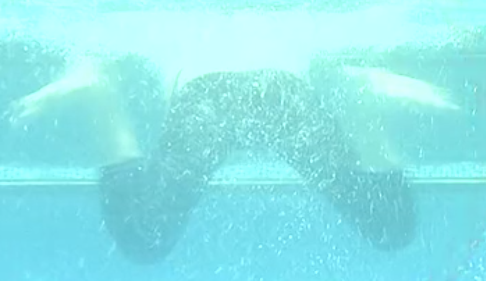
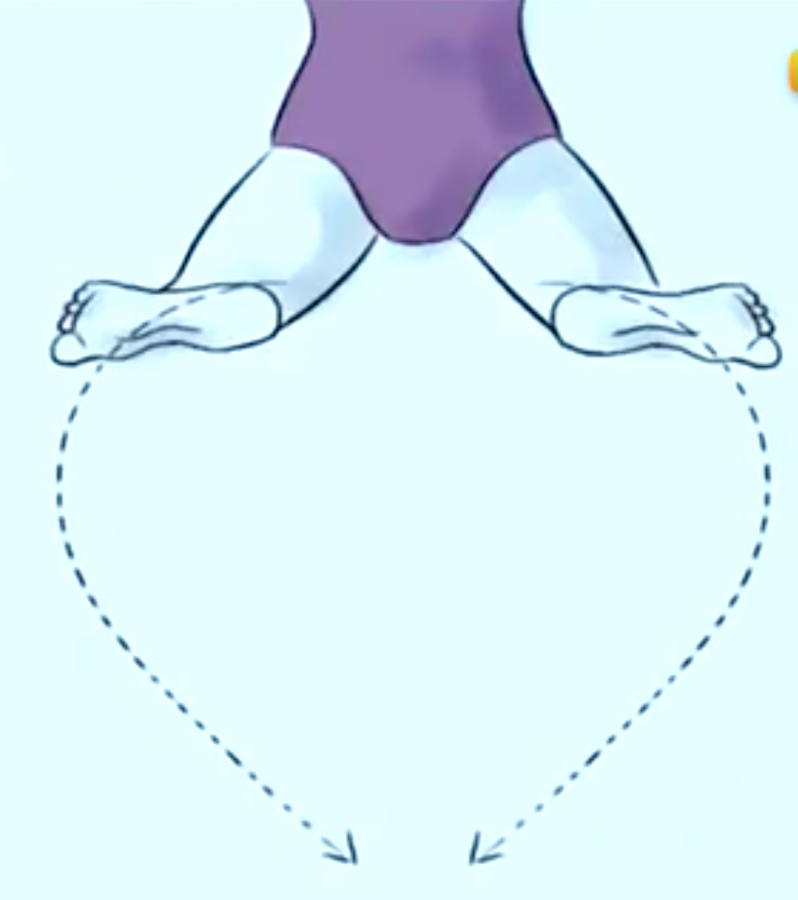
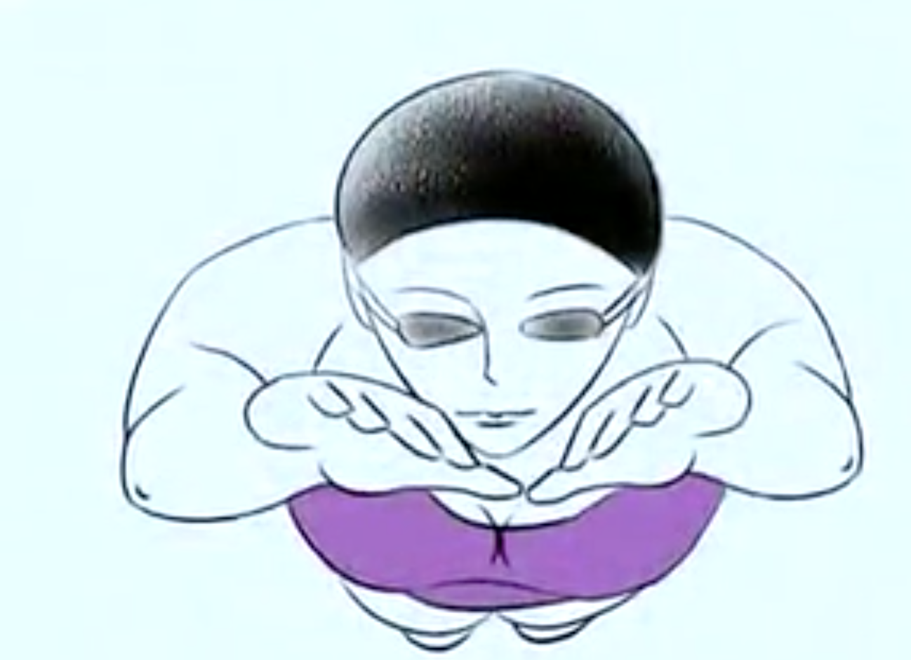
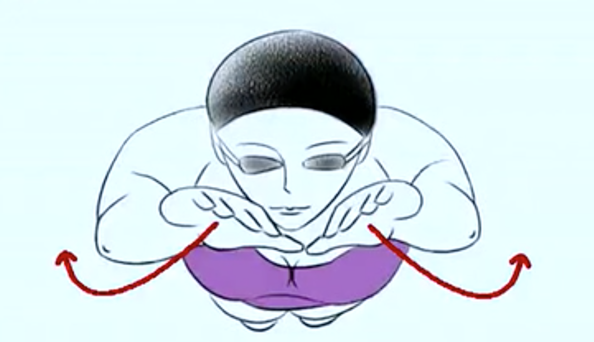
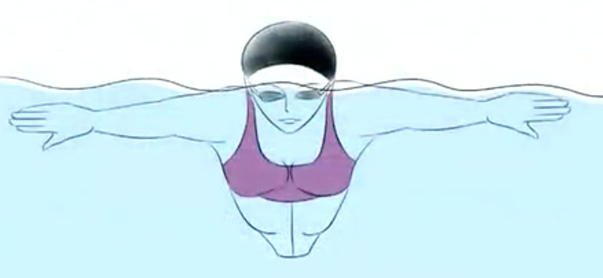
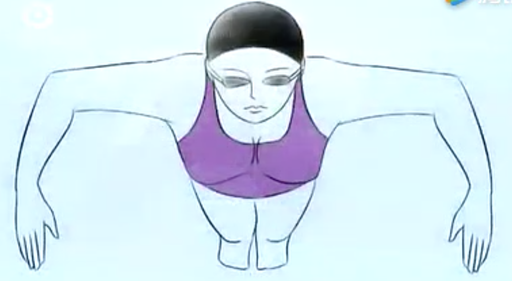
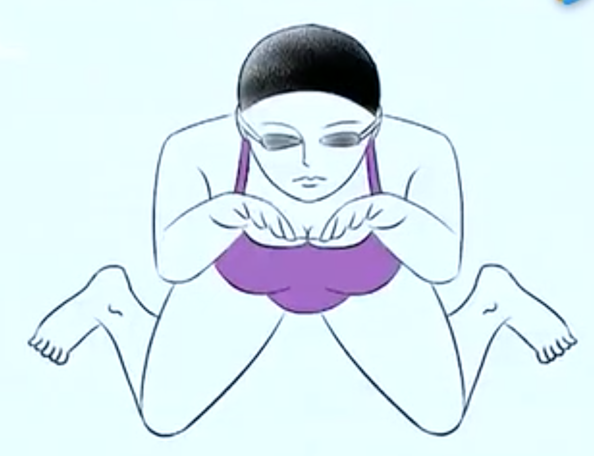
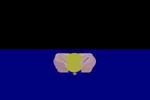

[TOC]

# 蛙泳

## 换气

- 在**水下呼气**，**同时使用嘴巴和鼻子呼气**
- 浮出水面时使用**嘴巴**尽快吸气

### 早吸气

- 时间相对较长
- 手臂外划开始时抬头吸气
- 内划时低头闭气
- 伸臂时呼气
- 适合初学者

### 晚吸气

- 时间较短
- 内划结束，头上升到水面最高处吸气
- 伸臂时闭气
- 外划时呼气

## 腿部动作

蛙泳腿部动作分为：

- 收腿
- 外翻脚（与收腿同时进行 ）
- 蹬夹水
- 滑行

### 收腿

### 外翻脚

- 外翻脚动作与收腿同时进行 
- 外翻脚结束后姿势，形似W：

### 蹬夹水

- 蹬夹水结束时，脚位于水面较低位置

### 滑行

## 臂部动作

臂部动作分为三个阶段：

- 外划
- 内划
- 伸臂

### 外划

- 手掌和前臂有抱水的感觉

### 内划

外划结束时，手臂迅速转为向内、向上、向后划水

 

内划结束时状态：

### 伸臂

- 借助两手內夹动作向前伸手臂
- 伸臂开始时掌心相对，伸臂结束时掌心转为向下
- 伸臂结束时，两手伸直，自然并拢

## 腿部与臂部协调动作

- 臂外划时，腿自然放松伸直
- 臂内划时，开始收腿
- 臂开始前伸时，迅速完成收腿并做外翻脚动作
- 臂接近伸直时，快速蹬腿
- 蹬腿结束后，身体呈流线型，向前滑行

## 完整讲解

- 内划时，抬头吸气并收腿
- 伸臂时，低头闭气；两臂向前将要伸直时，两腿蹬夹水
- 闭腿伸直，向前滑行
- 两臂外划时呼气

## 图解

## 感悟

- 学腿部动作
- 学臂部动作
- 学协调
- 学换气；不要怕喝水，会换气之前最后一次，只呆了一个小时多一点，不是累了，也不是不想学了，是因为喝水喝太多，实在太难受，然后回去了

