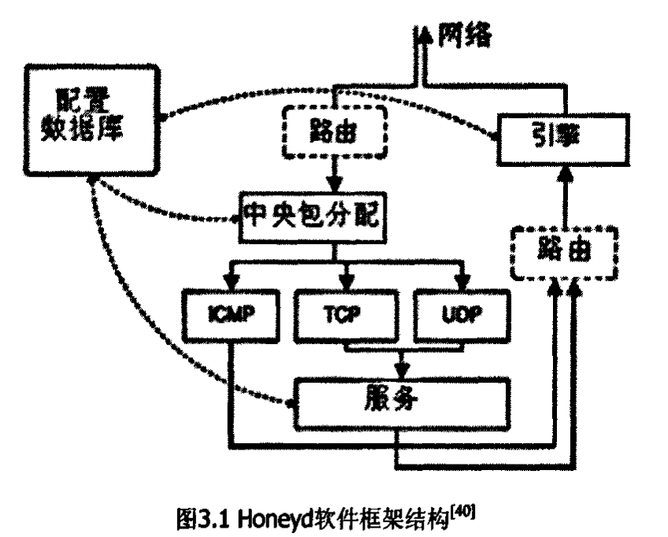

# Honeyd

# 简介

# 特点
- Honeyd是作为后台进程来运行，它产生的蜜罐是由后台进程所模拟。所以运行Honcyd的主机能有效地控制系统的安全。
- Honeyd与攻击者进行交互时，通过插件的形式载入相应的脚本来运行，以增加与攻击者的交互程度和欺骗攻击者的能力，从而能更好地获取攻击信息。
- Honeyd具有相应的指纹匹配机制，能欺骗攻击者的指纹工具。
- Honeyd能在网络层虚拟大量的蜜罐，这些蜜罐之间，可以是松散的集合，也可以组成严密的网络体系，从而构成一个虚拟的蜜罐网络。

## 优点
- Honeyd最早是在Linux下开发的一款软件，延续了Linux精神，Honeyd免费开放源代码，能相互修改。
- 由于程序的模块化设计，Honeyd设计了很多功能的插件接口，人们可以方便地进行修改。
- 可以模拟的主机系统类型有500种之多，比如Windows、Linux、FreeBSD、Cisco Router 7200、Zyxel Router等。
- Honeyd占用的系统资源非常少。

# 软件体系结构

Honeyd体系由几个组件构成，这些组件是配置数据库、中央包分配模块、协议处理模块、个性引擎和可选路由构件。

系统接受到的数据由中央包分配模块进行处理，首先中央包发配模块进行处理会检查P包的长度，修改包的校验和。Honeyd响应的是最主要的3种互联网协议：ICMP、TCP和UDP，其他协议包在被记入日志后会被悄悄丢弃。其他请求的处理主要依赖于个性引擎的配置。

在处理数据包之前，中央包分配模块会查询配置数据库，以查找到一个符合目标地址的蜜罐配置。如果没有特定的配置存在，系统会采用默认配置模板。给定配置后，数据包和相应的配置会被转交给相应的协议处理模块处理。

除了可以建立本地服务连接外，Honeyd还支持网络连接的重定向。这种重定向可以是静态的，也可以根据四个参数(源地址与源端口、目标地址与目标端口)判断。重定向使得我们可以将一个到虚拟蜜罐上的服务连接请求转发到一台真实服务器上运行的服务进程。

在发送数据到外部网络之前，数据包会经个性引擎处理。个性引擎会修改数据包的内容，使得数据包看上去和从指定配置操作系统的网络栈发出的一样。

## 配置数据库

配置数据库实际上是一个二进制的配置文件，包含了蜜罐系统所要模拟的系统、服务与网络拓扑结构以及其它行为特性等。Honeyd通过读取该配置文件来实施蜜罐系统。

## 中央包分配模块

数据包分配器是负责将数据包分配给相应的协议处理器部件。当获取到一个数据包时，数据包分配器首先计算该数据包的长度并进行验证，然后读取配置数据库，查找与数据包目的地址相对应的配置。如果配置存在，则根据数据包传输层的协议类型把该数据包分配给特定的协议处理器，否则就使用一个缺省的配置。

## 协议处理模块

协议处理器是模拟特定服务的部件，包括以下几个部分。

- CMP协议管理支持ICMP请求。通常在默认的模式下面，所有的蜜罐配置都响应echo请求和目的地址不可达信息。通过对配置数据库中配置的修改，也可以改变ICMP响应的行为。
- 对于TCP和UDP包，Honeyd可以建立到任意服务的连接。这些服务是外部的应用程序，可以通过标准输入输出来接收和输出数据。不同于为每个连接创建一个新进程，Honeyd支持子系统和内部服务，子系统是一个运行在某个虚拟蜜罐名称空间下的应用程序，子系统的特定应用是在相应的虚拟蜜罐实例化的时候创建的。一个子系统可以绑定端口、接收连接和创建网络连接。子系统是作为外部进程运行的，而内部服务则是一个Honeyd内部运行的python的脚本。内部服务要求的资源比子系统更少，但只能接收连接，不能创建连接。
- Honeyd包含一个简单的TCP状态机。三次握手的建立和FIN或RST的拆卸能被很好地支持，但是拥塞窗口管理的支持还不是很完全。UDP数据包被直接的送到应用中去。当Honeyd框架接收到一个属于关闭端口的UDP数据包后，如果个性化配置中没有设置禁止的话它将发送一个目的端口不可达信息的ICMP报文。

## 个性引擎

对Honeyd来说，在被指纹识别的时候不要暴露出来是非常重要的。为了使得虚拟蜜罐在被探测的时候显得像真实主机一样，Honeyd模拟给定操作系统的网络栈行为，我们称之为虚拟蜜罐的“个性”。不同的虚拟蜜罐可以被赋予不同的“个性”。“个性引擎”个性化虚拟蜜罐的网络栈行为的方法就是：在每个发送出去的数据包的协议头中进行适当的修改，使得数据包符合指纹识别软件预期的操作系统的特征。

Honeyd利用Nmap指纹库作为TCP和UDP连接个性化的参考，利用Xprobe指纹库作为ICMP连接个性化的参考。

## 可选路由组件

Honeyd通过路由部件实现虚拟网络拓扑结构。目前，Honeyd只支持有根树网络拓扑结构。在这种网络结构中，树根是数据包进入虚拟网络的关节点，中间节点代表一个虚拟路由器，每一条边则是一个可选路由，具有等待时间和包丢失等特性，而叶子节点则代表一个网络。

当Honeyd接收到一个数据包时。就从根结点开始传输数据包。直到找到拥有目的口地址的网络。而在传输的过程中，路由部件会计算包丢失和等待时间以决定是否丢弃该数据包，且对包传输中的每一次路由转换，路由部件都对数据包中的TTL值做减1操作．当TTL值减为0时，路由部件会发送一个ICMP超时数据包。

## 记录日志

Honeyd软件框架支持多种记录网络活动日志的方法，Honeyd可以记录并报告所有协议的尝试连接和完成连接的日志，也可以配置成以人工可读的方式来存储蜜罐系统所接受到所有数据包。同时，服务程序也可以通过标准错误输出向Honeyd报告它们收集到的网络信息。

# 参考文献

- 官凌青. 蜜罐Honeyd的扩展设计与实现[D]. 西安电子科技大学, 2007.