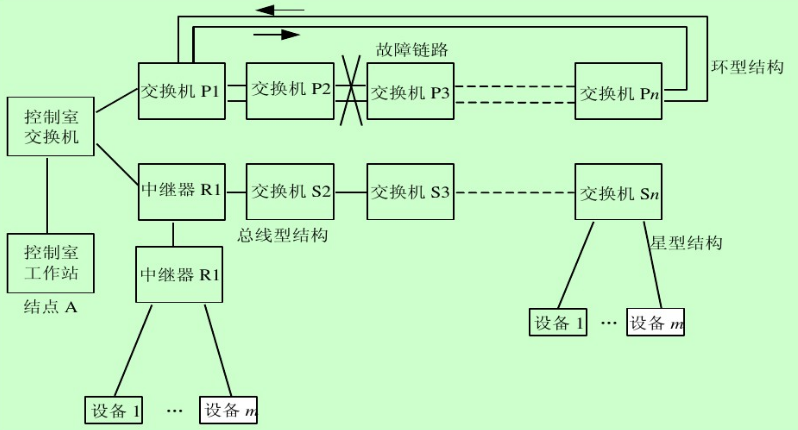
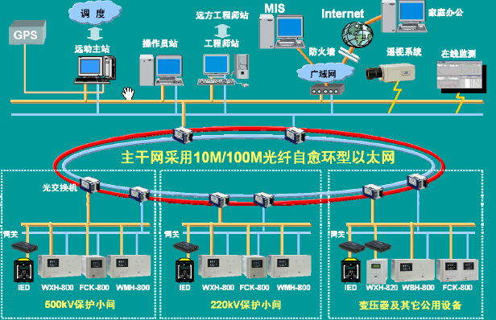
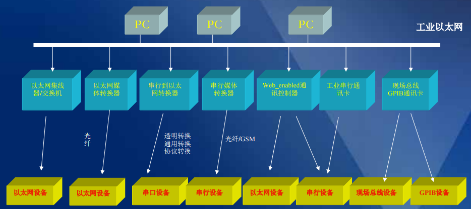

[TOC]

# 工业以太网

## 概念

**工业以太网**是指在工业环境的自动化控制及过程控制中应用以太网的相关组件及技术。工业以太网会采用TCP/IP协议，和IEEE 802.3标准兼容，但在应用层会加入各自特有的协议。(维基百科)

所谓工业以太网，就是在以太网技术和TCP/IP技术的基础上开发出来的一种现场总线。作为现场总线的工业以太网与一般的商用以太网有很大不同。

工业以太网在技术上与商用以太网（即IEEE 802.3标准）兼容，但在进行产品设计时，在材质的选用、产品的强度和适用性方面应能满足工业现场的需要。

## 优缺点

以往PLC会利用开放式或专有的通信协议和从站通信，这类的通信协议包括Modbus、Sinec H1、Profibus、CANopen、DeviceNet或FOUNDATION Fieldbus。不过越来越多的用户开始改用以太网为其数据链路层的通信协议，而应用层仍使用上述的通信协议。

相较于以[RS-232](https://zh.wikipedia.org/wiki/RS-232)或[RS-485](https://zh.wikipedia.org/wiki/RS-485)为基础的工业网络，工业以太网有以下的优点：

- 提升传输速率，RS-232的速率为9.6 kbit/秒，若是[吉比特以太网](https://zh.wikipedia.org/wiki/%E5%90%89%E6%AF%94%E7%89%B9%E4%BB%A5%E5%A4%AA%E7%BD%91)，使用[CAT-5e](https://zh.wikipedia.org/wiki/CAT-5)、[CAT-6](https://zh.wikipedia.org/wiki/CAT-6)的网络线或[光纤](https://zh.wikipedia.org/wiki/%E5%85%89%E7%BA%96)为传输介质，传输速率可以到1Gbit/秒。
- 传输距离可以拉长。
- 可以使用标准的[无线接取器](https://zh.wikipedia.org/wiki/%E7%84%A1%E7%B7%9A%E6%8E%A5%E5%8F%96%E5%99%A8)、[路由器](https://zh.wikipedia.org/wiki/%E8%B7%AF%E7%94%B1%E5%99%A8)、[网络交换器](https://zh.wikipedia.org/wiki/%E7%B6%B2%E8%B7%AF%E4%BA%A4%E6%8F%9B%E5%99%A8)、[集线器](https://zh.wikipedia.org/wiki/%E9%9B%86%E7%B7%9A%E5%99%A8)、[网线](https://zh.wikipedia.org/wiki/%E7%BD%91%E7%BA%BF)及[光纤](https://zh.wikipedia.org/wiki/%E5%85%89%E7%BA%96)。
- 除了传统的主站－从站架构（master-slave）外，也可以使用[点对点技术](https://zh.wikipedia.org/wiki/%E9%BB%9E%E5%B0%8D%E9%BB%9E%E6%8A%80%E8%A1%93)。
- 较好的互操控性。

以下是应用工业以太网时的缺点：

- 需将即有的系统转换为另一个新的通信协议。
- 及时控制使用像[TCP](https://zh.wikipedia.org/wiki/%E4%BC%A0%E8%BE%93%E6%8E%A7%E5%88%B6%E5%8D%8F%E8%AE%AE)协议时，有许多不便之处（有些应用因此使用[UDP](https://zh.wikipedia.org/wiki/%E7%94%A8%E6%88%B7%E6%95%B0%E6%8D%AE%E6%8A%A5%E5%8D%8F%E8%AE%AE)或其他[数据链路层](https://zh.wikipedia.org/wiki/%E6%95%B0%E6%8D%AE%E9%93%BE%E8%B7%AF%E5%B1%82)的协议）
- 处理TCP/IP数据包会比处理串列数据要复杂很多。
- 最小的以太网帧大小为64个字节，但一般工业通信的数据只有1-8个字节，[协议开销](https://zh.wikipedia.org/w/index.php?title=%E5%8D%94%E5%AE%9A%E9%96%8B%E9%8A%B7&action=edit&redlink=1)会影响数据传输的速率。

## 通信协议

虽然工业以太网让工业通信时有标准的硬件接口，但在通信协议上存在着许多不兼容的通信协议，其数据封装在以太网的数据帧，因此像路由器或网络交换器不会因这些不兼容的协议而有所影响。但主机和从站需要使用相同的通信协议才能通信。

有些标准，像是[Modbus](https://zh.wikipedia.org/wiki/Modbus)，已经由其原始版本派生出可以运作在工业以太网上的版本。而[Profibus](https://zh.wikipedia.org/wiki/Profibus)也发展其兼容于以太网的协议[PROFINET](https://zh.wikipedia.org/wiki/PROFINET)。其他的协议，像是[EtherNet/IP](https://zh.wikipedia.org/wiki/EtherNet/IP)，只开发以太网[传输层](https://zh.wikipedia.org/wiki/%E4%BC%A0%E8%BE%93%E5%B1%82)的部分。工业以太网的协议可以封装在[TCP](https://zh.wikipedia.org/wiki/%E4%BC%A0%E8%BE%93%E6%8E%A7%E5%88%B6%E5%8D%8F%E8%AE%AE)的数据帧内，使得处理上更标准化，但在主机和从机上都需要和TCP兼容的通信协议栈。

以下是一些常见的工业以太网通信协议。

- Modbus-TCP
- [PROFINET](https://zh.wikipedia.org/wiki/PROFINET)
- [EtherNet/IP](https://zh.wikipedia.org/wiki/EtherNet/IP)
- [EtherCAT](https://zh.wikipedia.org/wiki/EtherCAT)
- [SERCOS III](https://zh.wikipedia.org/w/index.php?title=SERCOS_III&action=edit&redlink=1)
- [SafetyNET p](https://zh.wikipedia.org/w/index.php?title=SafetyNET_p&action=edit&redlink=1)
- [VARAN](https://zh.wikipedia.org/w/index.php?title=VARAN&action=edit&redlink=1)
- [Ethernet Powerlink](https://zh.wikipedia.org/w/index.php?title=Ethernet_Powerlink&action=edit&redlink=1)

## 网络拓扑结构

### 结构类型

- 星形
- 总线形
- 环形
- 树形

### 示例

## 参考

- [工业以太网介绍及与普通以太网区别](http://www.21ic.com/app/embed/201412/610556_3.htm)
- [工业以太网-维基百科](https://zh.wikipedia.org/wiki/%E5%B7%A5%E6%A5%AD%E4%BB%A5%E5%A4%AA%E7%B6%B2)