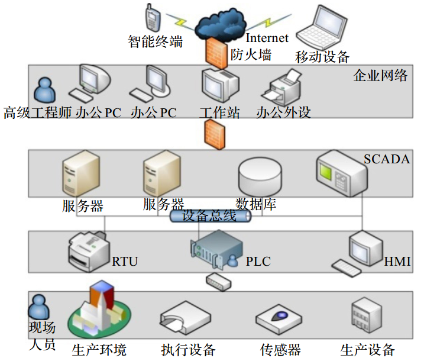

[TOC]

# 工业控制系统

## 名称

- ICS(Industrial Control System)
- 工业控制系统
## 简介

是指用于操作、控制、辅助自动化工业生产过程的设备、系统、网络以及控制器的集合。

## 分类

- 数据监控与采集系统（ SCADA）
- 分布式控制系统（ DCS）
- 可编程逻辑控制器（ PLC）
- 智能终端
- 人机交互接口（ HMI）
- 其他工业控制系统

## ICS资产图

## ICS脆弱性

脆弱性：指计算机系统在硬件、软件、协议的具体实现或者系统安全策略上存在的不足或缺陷

### 策略、政策及管理的脆弱性

现代工控系统已不再是原先工厂形式的封闭 “孤岛”，而是一个全面开放的系统，这需要新的安全理念、安全策略和管理流程。 例如，管理控制系统的政策、程序文化不足；远程访问缺乏合适的访问控制策略；对核心支持设备管理、设计和实现不恰当。

### 工控平台、终端的脆弱性

现代工控系统大量使用 PC 机，而工控 PC 机通常用于控制不间断生产，在运行期间不允许停机检修更新软件，同时工控 PC 需要大量软件。 这些导致工控 PC 终端更新缓慢，引入漏洞长久得不到修复。 例如，控制系统中使用的系统管理机制和软件都没有充分审查或维持，不安全的无线通信用于控制；工具应用不足，不能检查和报告异常；将未授权和不适当的应用软件或硬件设备接入控制系统网络。

### 工控网络的脆弱性

工控网络包括两部分：其一是与外部连接的网络，仍然是传统的以太网网络，使用 TCP/IP 协议；另一部分是内部的总线网络，使用工控网络的专有协议。 这二者的设计之初都没有考虑安全需求，仅为完成传输功能设计。 网络的脆弱性来自三个方面，协议只为完成可用设计；软件存在漏洞，配置不合理；网络边界不明确；非专用通信通道用于传输控制信号或者在控制信号专用通道上传输其他信号。

## 工控网络

工控网络包括两部分：

- 与外部连接的网络，仍然是传统的以太网网络，使用TCP/IP协议；
- 内部的总线网络，使用工控网络的专有协议；

## 参考

[1]: 工业控制系统安全综述；陶耀东，李宁，曾广圣；

