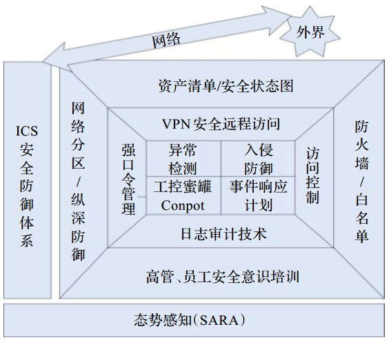
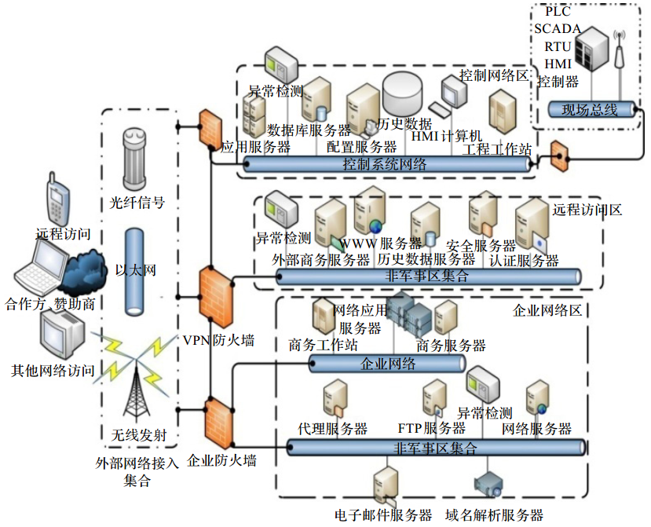

[TOC]

# 工控系统安全措施

## 概述

工控系统安全同时包含网络安全与底层物理环境的安全。

## 安全技术

- 入侵检测
- 漏洞扫描
- 纵深防御技术

### 单一安全技术存在不足

- 漏洞扫描技术对零日漏洞攻击无能为力
- 纵深防御防火墙只能防御来自外部的攻击，对跨防火墙的行为无能为力，也不能防御内部的攻击
- 入侵检测只能单纯的检测异常行为，不能提高工控系统的 “恢复能力”

## ICS安全管理模型

完善的工控系统安全防御模型应具备四个层次功能：

- 阻挡外部入侵
- 检测内部异常
- 快速恢复功能正常、稳定的生产环境
- 智能化的实现以上三个防御过程

## 主动防御

蜜罐通过提前接触攻击行为可为工控系统添加一道额外的防线。 

`Conpot`在 `GitHub`发布开源工控蜜罐系统 `Conpot`，该系统是工业控制系统服务器端的低交互的蜜罐技术，设计易于布置、修改和扩展，通过提供各种通用的工业控制协议，可以构建需要的系统，能够模拟构建基础设施，以假乱真，使不安好心的人成功发现一个巨大的工控系统。

采用经典的化工反应模型田纳西 -伊斯曼过程，结合著名的蜜罐软件 Honeyd，依托Matlab/Simulink 的强大运算、仿真能力，将田纳西-伊斯曼过程时仿真的生产数据通过网络通信的方式传送给 Honeyd 模拟蜜罐设备，并通过 Python 脚本语言调用的方式实现设备的多种行为响应和真实调控生产过程，检出新型过程控制蜜罐系统；采用嵌入式蜜罐和嵌入式蜜网的思路，并在嵌入式网络环境下对蜜罐进行部署和测试分析，实验结果证明，嵌入式蜜罐对嵌入式网络安全起到保护作用。

## 网络分区管理&区域间布置防火墙

参考 NIST SP 800-82、IEC62443 等国际工控领域指导性文献深度防御（ Defense-in-Depth）架构，将 ICS 划分为：

- 外部区域集合
- 控制网络区
- 企业网络区
- 远程访问区
- 生产现场

从分区以及防火墙的设置，总结防火墙的防御功能：

- 保护整个的内部系统免受外部的攻击
- 隔离企业网络与远程访问区
- 控制系统网络与其他网络隔离
- 生产区与控制网络隔离

网络分区与应用防火墙保护工控系统的改进过程：

- 第一阶段双宿主机防火墙
- 第二阶段在企业网络和控制网络之间构建防火墙
- 第三阶段添加路由的企业与控制网络间的防火墙策略
- 第四阶段添加非军事区（ DMZ）防火墙
- 最后是深度防御体系的防火墙策略，深度防御体系为效果最好的防火墙布置策略

### ICS深度防御架构图

