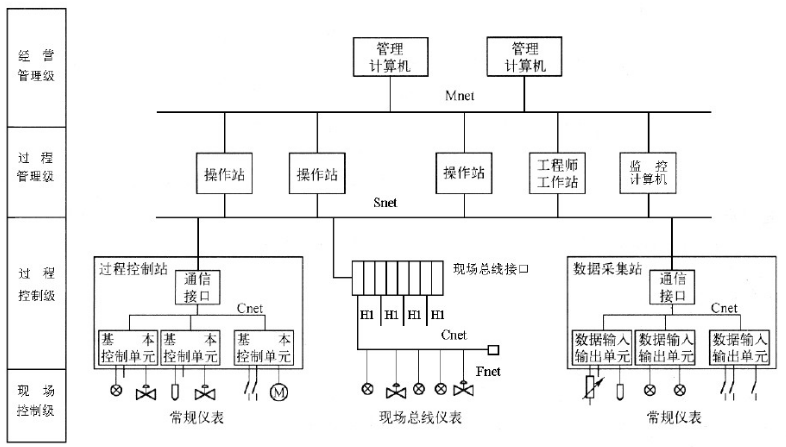
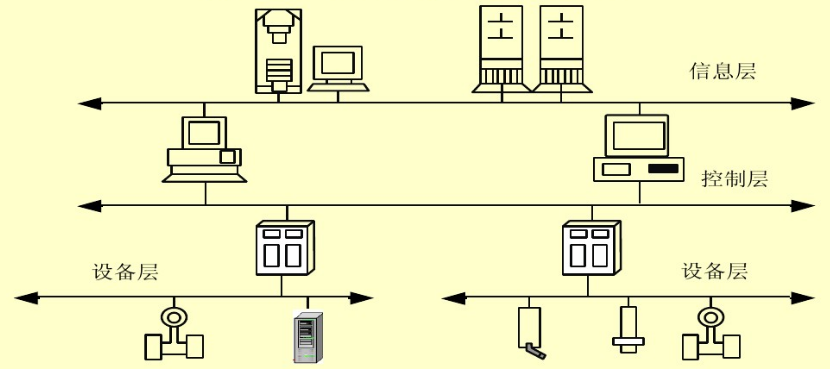
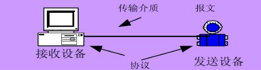
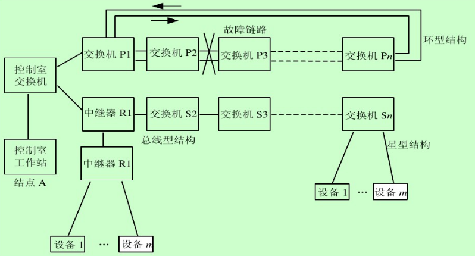

[TOC]

# 工控网络

工控网络包括两部分：

- 与外部连接的网络，仍然是传统的以太网网络，使用TCP/IP协议；
- 内部的总线网络，使用工控网络的专有协议；

## 分类

### 集散控制系统（DCS）

### 现场总线控制系统（FCS）

#### 现场总线控制系统数据通讯系统

### 工业以太网

所谓工业以太网，就是在以太网技术和TCP/IP技术的基础上开发出来的一种现场总线。作为现场总线的工业以太网与一般的商用以太网有很大不同。

工业以太网在技术上与商用以太网（即IEEE 802.3标准）兼容，但在进行产品设计时，在材质的选用、产品的强度和适用性方面应能满足工业现场的需要。

#### 网络拓扑结构

## 脆弱性

网络的脆弱性来自三个方面：

- 协议只为完成可用设计
- 软件存在漏洞，配置不合理
- 网络边界不明确
- 非专用通信通道用于传输控制信号或者在控制信号专用通道上传输其他信号

### 总结

脆弱性具体表现在：不恰当的输入验证，许可、授权与访问控制不严格，不恰当的身份验证，验证数据真实性不足，差的代码质量指标，ICS 软件配置维护不足，凭证管理不严，使用的加密算法已过时，网络设计孱弱，审计问责制度羸弱等。

### 示例

ICS 的脆弱性并不是单一存在的，往往是政策、平台终端、网络脆弱性并存的，以分布式控制系统（ DCS）中的工业无线传感器（ Industrial Wireless Sensor Networks，IWSNs）为例，文献[27-34]总结无线传感网络主要完成数据采集、数据传输与控制管理，是工业控制系统最基础构成。

#### 平台终端脆弱性

传感器的工作环境恶劣伴随有强烈震动、高温高压、腐蚀性有毒气体等，处于无 人 维 护 ，不 可 控 环 境 中 ，还 有 新 出 现 的 硬 件 木 马（ Hardware Trojans，HWTs）。

#### 网络脆弱性

在通信上存在噪声、多信道干扰、能量衰减、信息容量下降等问题，另外工业控制信号都是实时信号，无线传输存在时延问题，采用高级加密与认证技术不合适，导致其易被恶意盗窃和篡改信息，因无线连接，任何在传输范围内的设备都可轻易接入网络，易被窃听，非法篡改数据，针对SCADA 攻击（ ad-hoc SCADA-tailored attacks），甚至破坏传感器和捕获传感器。

### 政策脆弱性

新兴的无线网络需要新的通信协议与管理策略，目前处于空白阶段。

## 参考

[1]: 工业控制系统安全综述；陶耀东，李宁，曾广圣；
[2]:https://wenku.baidu.com/view/d290f7f565ce05087732132e.html?from=search