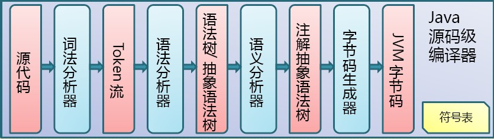

# 简介

Java虚拟机是一种虚拟机器，使得计算机可以运行Java程序以及使用其他语言编译成的JVM字节码。JVM对下，兼容多种不同架构的硬件；对上提供统一的接口，接受JVM作为输入。

JVM字节码，通过编译器编译源代码得到JVM字节码（即class文件），字节码通过JVM的类加载机制放入JVM运行环境中，最后通过JVM类执行机制执行对应的字节码。

# 概念

## JIT 编译器

JIT(Just-in-time) 编译器，及实时编译器、即时编译器，动态编译的一种形式。

# 详细

## 编译运行机制

一段源代码的经由JVM执行需要经过以下三个机制：

- Java源码编译机制
- 类加载机制
- 类执行机制

### Java源码编译机制

Java源码编译器将源代码编译为JVM字节码，编译流程如下图所示。

Java源码编译由以下三个过程组成：

- 分析和输入到符号表
- 注解处理
- 语义分析和生成class文件

流程图如下图所示。

最后生成的class文件由以下部分组成：

- 结构信息；包括class文件格式版本号及各部分的数量和大小信息。
- 元数据；对应于Java源码中声明与常量的信息，包括类、集成的超类、实现的接口的声明信息、域和方法声明信息和常量池
- 方法信息；对应Java源码中语句和表达式对应的信息，包括字节码、异常处理器表、求值栈与局部变量区大小、求值栈的类型信息、调试符号信息

### 类加载机制

JVM的类加载是通过ClassLoader及其子类来完成的，类的层次关系和加载顺序如下图所示。

**Bootstrap ClassLoader**

负责加载 `$JAVA_HOME/lib/rt.jar` 里所有的class，由C++实现，不是ClassLoader子类

**Extension ClassLoader**

负责加载Java平台中扩展功能的一些jar包，包括 `$Java_HOME/jre/lib/*.jar` 或 `-Djava.ext.dirs` 目录下的jar包

**App ClassLoader**

负责记载classpath中指定的jar包及目录中的class

**Custom ClassLoader**

属于应用程序根据自身需要自定的ClassLoader，如Tomcat、jboss都会根据J2EE规范自行实现ClassLoader。

加载过程中会先检查类是否已被加载， 检查顺序是自底向上，从Custom ClassLoader到Boostrap ClassLoader逐层检查，只要某个ClassLoader已加载就视为已加载此类，保证此类只被加载一次。加载的顺序自顶向下，由上层逐层尝试加载此类。

### 类执行机制

JVM基于栈来执行class字节码。线程创建后，会产生程序计数器和栈。

**程序计数器**

程序计数器存放下一条要执行的指令在方法内的偏移量，可看作当前线程所执行的字节码的行号指示器。字节码解释器工作时就是通过改变这个计数器的值来选取下一条需要执行的字节码指令。

**栈**

栈分为虚拟机栈和本地方法栈。

栈中存放一个个栈帧，每个栈帧对应着每个方法的每次调用，而栈帧由局部变量和操组数栈两部分组成。局部变量区用于存放方法中的局部变量和参数，操作数栈中用于存放方法执行过程中产生的中间结果。

# 要点

- Java虚拟机的多线程是通过线程轮流切换并分配处理器执行时间的方式来实现的

# 参考

- [Java virtual machine](https://en.wikipedia.org/wiki/Java_virtual_machine)
- [Java 代码编译和执行的整个过程](https://wiki.jikexueyuan.com/project/java-vm/java-debug.html)
- [即时编译 - wikipedia](https://zh.wikipedia.org/wiki/即時編譯)

# 推荐

- [关于Jvm知识看这一篇就够了](https://zhuanlan.zhihu.com/p/34426768)

