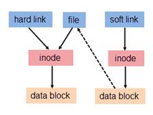

#  Network

## DHCP

**概念**

- DHCP(Dynamic Host Configuration Protocol, 动态主机配置协议)
- 一个局域网协议
- 使用UDP协议工作

**作用**

- 给内部网络主机分配IP地址
  - 保证任何IP地址在同一时刻只能由一台DHCP客户机所使用
  - 可以给用户分配永久固定的IP地址
  - 可以同用其他方法获得IP地址的主机共存（如手工配置IP地址的主机）
  - 向现有的BOOTP客户端提供服务
- 用户或内部网络管理员作为对所有主机中央管理的手段

**分配IP机制**

- 自动分配方式
- 动态分配方式
- 手工分配方式

**其他**

- DHCP有3个端口，其中UDP67和UDP68为正常的DHCP服务端口，分别作为DHCP Server和DHCP Client的服务端口；546号端口用于DHCPv6 Client，而不用于DHCPv4，是为DHCP failover服务，这是需要特别开启的服务，DHCP failover是用来做“双机热备”

- DHCP消息格式基于BOOTP(Bootstrap Protocol)消息格式

- DHCP服务器必须能将数据包送到255.255.255.255的IP地址上, 应在路由表中加入一个到地址255.255.255.255的路由

  - `route add -host 255.255.255.255 dev eth0`
  - 如果报错: `255.255.255.255：Unkown host` , 在`/etc/hosts`中添加一行: `255.255.255.255 dhcp`

- 指定DHCP服务器在那个设备上启动

  - 在`/etc/sysconfig/dhcpd`中把设备名称添加到DHCPDARGS列表中: `DHCPDARGS=ech0` or `echo "DHCPDARGS=eth0" >> /etc/sysconfig/dhcpd`
  - 命令: `$/usr/sbin/dhcpd eth1`

- 配置DHCP客户端

  通常网管员使用选择手工配置 DHCP 客户，需要修改 /etc/sysconfig/network 文件来启用联网；并修改 /etc/sysconfig/network-scripts 目录中每个网络设备的配置文件。在该目录中，每个设备都有一个叫做 ifcfg-eth？ 的配置文件，eth？是网络设备的名称。 如eth0等。如果你想在引导时启动联网，NETWORKING 变量必须 被设为 yes。 除了此处之外/etc/sysconfig/network 文件应该包含以下行：

  ```shell
  NETWORKING=yes
  DEVICE=eth0
  BOOTPROTO=dhcp
  ONBOOT=yes
  ```

- 客户机获得租约后，DHCPd会在dhcp.leases里建一条记录, 示例:

  ```shell
  lease 192.168.1.154 {
      starts 1 2000/05/15 13:36:42;
      ends 1 2000/05/15 21:36:42;
      hardware ethernet 00:00:21:4e:3f:58;
      uid 01:00:00:21:4e:3f:58;
      client-hostname "one";
  }
  ```

  dhcpd.leases的时间记录采用GMT时间，而不是本地时区的时间.

**dhcpd.conf**

`/etc/dhcpd.conf`通常包括三部分: parameters, declarations 和 option.

- DHCP配置文件中的parameters（参数）：表明如何执行任务，是否要执行任务，或将哪些网络配置选项发送给客户.

| 参数                       | 说明                                       |
| ------------------------ | ---------------------------------------- |
| ddns-update-style        | 配置DHCP-DNS 互动更新模式                        |
| default-lease-time       | 指定确省租赁时间的长度，单位是秒                         |
| max-lease-time           | 指定最大租赁时间长度，单位是秒                          |
| hardware                 | 指定网卡接口类型和MAC地址                           |
| server-name              | DHCP客户服务器名称                              |
| get-lease-hostnames flag | 检查客户端使用的IP地址                             |
| fixed-address ip         | 分配给客户端一个固定的地址; 用于指定一个或多个IP地址给一个DHCP客户。只能出现在host声明里 |
| authritative             | 拒绝不正确的IP地址的要求                            |

- DHCP配置文件中的declarations （声明）：用来描述网络布局、提供客户的IP地址等.

  | 声明                                       | 解释                                  |
  | ---------------------------------------- | ----------------------------------- |
  | shared-network                           | 用来告知是否一些子网络分享相同网络                   |
  | subnet                                   | 描述一个IP地址是否属于该子网                     |
  | range                                    | 起始IP 终止IP 提供动态分配IP 的范围              |
  | host                                     | 主机名称 参考特别的主机                        |
  | group                                    | 为一组参数提供声明                           |
  | allow unknown-clients;deny unknown-client | 是否动态分配IP给未知的使用者                     |
  | allow bootp;deny bootp                   | 是否响应激活查询; 指明DHCPd是否响应bootp查询，默认是允许的 |
  | allow booting;deny booting               | 是否响应使用者查询                           |
  | filename                                 | 开始启动文件的名称. 应用于无盘工作站                 |
  | next-server                              | 设置服务器从引导文件中装如主机名，应用于无盘工作站           |

  ```shell
  # share-network 语句
  shared-network name {
      [ 参数 ]
      [ 声明 ]
  }
  # share-network 用于告诉DHCP服务器某些IP子网其实是共享同一个物理网络。任何一个在共享物理网络里的子网都必须声明在 share-network 语句里。
  # 当属于其子网里的客户启动时，将获得在share-network语句里指定参数，除非这些参数被subnet 或 host 里的参数覆盖。
  # 用share-network是一种权宜之计，例如某公司用B类网络145.252，公司里的部门 A 被划在子网 145.252.1.0 里， 子网掩码为255.255.255.0，这里子网号为8个bit，主机号也为8个bit，但如果部门 A 急速增长，超过了254个节点，而物理网络还来不及增加，就要在原来这个物理网络上跑两个8bit掩码的子网，而这两个子网其实是在同一个物理网络上
  shared-network share1 {
      subnet 145.252.1.0 netmask 255.255.255.0 {
      range 145.252.1.10 145.252.1.253;
    }
      subnet 145.252.2.0 netmask 255.255.255.0 {
      range 145.252.2.10 145.252.1.253;
    }
  }

  # subnet 语句
  subnet subnet-number netmask netmask {
      [ 参数 ]
      [ 声明 ]
  }
  # subnet 语句用于提供足够的信息来阐明一个IP地址是否属于该子网。也可以提供指定的子网参数和指明那些属于该子网的IP地址可以动态分配给客户，这些IP地址必须在 range 声明里指定。subnet-number 可以是个IP地址或能被解析到这个子网的子网号的域名。netmask 可以是个IP地址或能被解析到这个子网的掩码的域名

  # range 语句
  range [ dynamic-bootp ] low-address [ high-address]
  # 对于任何一个有动态分配IP地址的subnet语句里，至少要有一个 range 语句，用来指明要分配的IP地址的范围。如果只指定一个要分配的IP地址，高地址部分可以省略

  # host 语句
  host hostname {
      [ 参数 ]
      [ 声明 ]
  }
  # host语句的作用是为特定的客户机提供网络信息

  # group 语句
  group {
      [ 参数 ]
      [ 声明 ]
  }
  # 组语句给一组声明提供参数

  ### default-lease-time time; 
  # 指定缺省租约时间，这里的time是以秒为单位的。如果DHCP客户在请求一个租约但没有指定租约的失效时间，租约时间就是缺省租约时间

  ### hardware 语句
  hardware hardware-type hardware-address
  # 指明物理硬件接口类型和硬件地址。硬件地址由6个8位组构成，每个8位组以“：”隔开。如00:00:E8:1B:54:97
  ```

  ​

- DHCP配置文件中的option（选项）：用来配置DHCP可选参数，全部用option关键字作为开始

  | 选项                                  | 解释                                     |
  | ----------------------------------- | -------------------------------------- |
  | subnet-mask                         | 为客户端设定子网掩码                             |
  | domain-name                         | 为客户端指明DNS名字                            |
  | domain-name-servers                 | 为客户端指明DNS服务器IP地址                       |
  | host-name                           | 为客户端指定主机名称                             |
  | routers                             | 为客户端设定默认网关                             |
  | broadcast-address                   | 为客户端设定广播地址                             |
  | ntp-server                          | 为客户端设定网络时间服务器IP地址                      |
  | time－offset                         | 为客户端设定和格林威治时间的偏移时间，单位是秒。格林威治和北京时间相差8小时 |
  | interface-mtu mtu                   | 指明网络界面的MTU，这里mtu是个正整数                  |
  | option broadcast-address ip-address | 指定广播地址                                 |


  ```shell
  # 选项类语句以option 开头，后面跟一个选项名，选项名后是选项数据

  ### 指明在客户子网内的路由器的地址，可以有多个
  option routers ip-address[, ip-address]

  ### 指明时间服务器的地址
  option time-servers ip-address[, ip-address...];

  ### 指明DNS的地址
  option domain-name-servers ip-address[, ip-address...];

  ### 给客户指定主机名，string是个字符串
  option host-anme string;
  ```

  ​

- 注意: **

    - 如果客户端使用的是windows操作系统，不要选择"host-name"选项，即不要为其指定主机名称
    - lease 开始租约时间和lease 结束租约时间是格林威治标准时间（GMT），不是本地时间


- 配置例子

  ```shell
  option routers 222.205.197.1;
  option subnet-mask 255.255.255.0;
  option domain-name "test.org";
  option domain-name-servers 202.101.112.55,202.101.98.55,222.205.193.2;
  option broadcast-address 222.205.197.255;
  default-lease-time 36000;
  max-lease-time 360000;
  subnet 222.205.197.0 netmask 255.255.255.0 {
      range 222.205.197.10 222.205.197.90;
      range 222.205.197.100 222.205.197.200;
  }
  host servername {
      hardware Ethernet 00:03:FF:B0:1E:02;
      fixed-address 192.168.1.20;
  }
  host servername {hardware ethernet 00:a0:c9:a6:96:33;fixed-address 192.168.1.12;}
  host servername {hardware ethernet 00:a0:c9:a6:96:33;fixed-address 192.168.1.12;option routers 192.168.11.5;}
  ddns-update-style ad-hoc; (style可以有三种更新方式,其他两种为:interim none)
  ```

  有时你需要在一台安装了两块网卡（作防火墙或网关）的机器上安装DHCP服务，下面的例子指出一台防火墙机器上的一种DHCP设置，因为对外的网卡（internet）不需要提供DHCP服务:

  ```shell
  subnet 192.168.1.0 netmask 255.255.255.0 {
      range 192.168.1.2 192.168.1.4;
      default-lease-time 86400;
      max-lease-time 259200;
      option subnet-mask 255.255.255.0;
      option broadcast-address 192.168.1.255;
      option routers 192.168.1.254;
      option domain-name-servers 192.168.1.254;
  }
  subnet 202.102.34.102 netmask 255.255.255.255 {
  }
  ```

  ```shell
  #example
  #全局参数

  shared-network 共享网络名 {
      共享网络特定参数...
      subnet 204.254.239.0 netmask 255.255.255.224 {
            子网特定参数... 
            range 204.254.239.10 204.254.239.30;
      }
      subnet 204.254.239.32 netmask 255.255.255.224 {
          子网特定参数...
          range 204.254.239.42 204.254.239.62;
      }
  }

  subnet 204.254.239.64 netmask 255.255.255.224 {
      子网特定参数...
      range 204.254.239.74 204.254.239.94;
  }
  group {
  组特定参数...
  host ws1.domain {
      特定主机参数...
      }
      host ws2.domain {
      特定主机参数...
      }
      host ws3.domain {
      特定主机参数...
      }
  }
  ```

  ​

## 配置网络

- Redhat是放在/etc/sysconfig/network-scripts目录下面的一大堆文件里面
- Debian系的则是存在/etc/network/interfaces文件里面，无论有多少块网卡，都在这个文件里

## 端口

| 端口   | 程序         | 说明                                |
| ---- | ---------- | --------------------------------- |
| 20   | ftp        | FTP服务器有两个端口，其中21端口用于连接，20端口用于传输数据 |
| 21   | ftp        | FTP服务器有两个端口，其中21端口用于连接，20端口用于传输数据 |
| 80   | web服务器默认端口 |                                   |
| 443  | ssl        | ssl加密                             |

- `ftp`: ftp的端口号20、21的区别一个是数据端口，一个是控制端口，控制端口一般为21，而数据端口不一定是20，这和FTP的应用模式有关，如果是主动模式，应该为20，如果为被动模式，由服务器端和客户端协商而定.
  - 主动模式建立: 1) 客户端打开一个随机的端口（端口号大于1024，在这里，我们称它为x），同时一个FTP进程连接至服务器的21号命令端口。此时，源端口为随机端口x，在客户端，远程端口为21，在服务器。 2)  客户端开始监听端口（x+1），同时向服务器发送一个端口命令（通过服务器的21号命令端口），此命令告诉服务器客户端正在监听的端口号并且已准备好从此端口接收数据。这个端口就是我们所知的数据端口。 3) 服务器打开20号源端口并且建立和客户端数据端口的连接。此时，源端口为20，远程数据端口为（x+1）。 4) 客户端通过本地的数据端口建立一个和服务器20号端口的连接，然后向服务器发送一个应答，告诉服务器它已经建立好了一个连接。

# 常用命令

|    命令    |     全称     | 说明                                   | 示例                              | 备注   |
| :------: | :--------: | ------------------------------------ | ------------------------------- | ---- |
|  `cut`   |            | 从文本文件的每一行中截取指定内容的数据                  |                                 |      |
|   `du`   | disk usage | 统计目录(或文件)所占磁盘空间的大小                   | `du file-name` or `du dir-name` |      |
|   `df`   | disk file  | 用于显示文件系统的磁盘使用情况                      |                                 |      |
|   `dd`   |            | 将指定的输入文件拷贝到输出文件中，在拷贝的过程中可以进行格式转换     |                                 |      |
|  `fmt`   |            | 将所有非空白行的长度设置为几乎相同，来进行简单的文本格式化        |                                 |      |
|  `free`  |     -      | 显示当前系统未使用的和已使用的内存数目，还可以显示被内核使用的内存缓冲区 |                                 |      |
|   `ip`   |     -      |                                      |                                 |      |
| `vmstat` |     -      | 报告关于内核线程、虚拟内存、磁盘、陷阱和 CPU 活动的统计信息     |                                 |      |

## ip

Linux的ip命令和ifconfig类似，但前者功能更强大，并旨在取代后者。使用ip命令，只需一个命令，你就能很轻松地执行一些网络管理任务。ifconfig是net-tools中已被废弃使用的一个命令，许多年前就已经没有维护了。iproute2套件里提供了许多增强功能的命令，ip命令即是其中之一。


**命令示例**

```shell
### 设置IP
sudo ip addr add 192.168.0.193/24 dev wlan0
# 注意: IP地址要有一个后缀，比如/24。这种用法用于在无类域内路由选择（CIDR）中来显示所用的子网掩码。

### 查看网卡信息
$ ip addr show eno1
2: eno1: <BROADCAST,MULTICAST,UP,LOWER_UP> mtu 1500 qdisc pfifo_fast state UP group default qlen 1000
    link/ether 4c:cc:6a:75:87:58 brd ff:ff:ff:ff:ff:ff
    inet 202.118.26.129/24 brd 202.118.26.255 scope global eno1
       valid_lft forever preferred_lft forever
    inet6 2001:da8:9000:a131:5c0e:9101:10cd:5642/64 scope global noprefixroute dynamic 
       valid_lft 2591766sec preferred_lft 604566sec
    inet6 fe80::8e92:ab7:44d3:1ae8/64 scope link 
       valid_lft forever preferred_lft forever

### 删除IP
sudo ip addr del 192.168.0.193/24 dev wlan0

### 获取不同网络接口的统计数据
$ ip -s link
1: lo: <LOOPBACK,UP,LOWER_UP> mtu 65536 qdisc noqueue state UNKNOWN mode DEFAULT group default qlen 1
    link/loopback 00:00:00:00:00:00 brd 00:00:00:00:00:00
    RX: bytes  packets  errors  dropped overrun mcast   
    10066246   121423   0       0       0       0       
    TX: bytes  packets  errors  dropped carrier collsns 
    10066246   121423   0       0       0       0       
2: eno1: <BROADCAST,MULTICAST,UP,LOWER_UP> mtu 1500 qdisc pfifo_fast state UP mode DEFAULT group default qlen 1000
    link/ether 4c:cc:6a:75:87:58 brd ff:ff:ff:ff:ff:ff
    RX: bytes  packets  errors  dropped overrun mcast   
    17397865038 12747222 0       0       0       236406  
    TX: bytes  packets  errors  dropped carrier collsns 
    427483925  5772784  0       0       0       0       
...

### 查看特定网络接口信息
$ ip -s link ls eno1
2: eno1: <BROADCAST,MULTICAST,UP,LOWER_UP> mtu 1500 qdisc pfifo_fast state UP mode DEFAULT group default qlen 1000
    link/ether 4c:cc:6a:75:87:58 brd ff:ff:ff:ff:ff:ff
    RX: bytes  packets  errors  dropped overrun mcast   
    17398010799 12748128 0       0       0       236660  
    TX: bytes  packets  errors  dropped carrier collsns 
    427520641  5772921  0       0       0       0       
$ ip -s -s link ls eno1
2: eno1: <BROADCAST,MULTICAST,UP,LOWER_UP> mtu 1500 qdisc pfifo_fast state UP mode DEFAULT group default qlen 1000
    link/ether 4c:cc:6a:75:87:58 brd ff:ff:ff:ff:ff:ff
    RX: bytes  packets  errors  dropped overrun mcast   
    17398014866 12748162 0       0       0       236668  
    RX errors: length   crc     frame   fifo    missed
               0        0       0       0       0       
    TX: bytes  packets  errors  dropped carrier collsns 
    427520641  5772921  0       0       0       0       
    TX errors: aborted  fifo   window heartbeat transns
               0        0       0       0       4       
# 当你需要获取一个特定网络接口的信息时，在网络接口名字后面添加选项ls即可。使用多个选项-s会给你这个特定接口更详细的信息。特别是在排除网络连接故障时，这会非常有用

### ARP条目
# 地址解析协议（ARP）用于将一个IP地址转换成它对应的物理地址，也就是通常所说的MAC地址。使用ip命令的neigh或者neighbour选项，你可以查看接入你所在的局域网的设备的MAC地址
$ ip neigh
202.118.26.56 dev eno1 lladdr 00:25:b3:f1:da:d0 STALE
202.118.26.122 dev eno1 lladdr 4c:cc:6a:aa:2f:fb STALE
202.118.26.254 dev eno1 lladdr 00:e0:fc:40:d7:78 REACHABLE
202.118.26.230 dev eno1 lladdr ec:a8:6b:c7:f1:ba STALE
202.118.26.238 dev eno1 lladdr f4:4d:30:57:6f:36 STALE
202.118.26.251 dev eno1 lladdr 4c:cc:6a:75:86:da STALE
202.118.26.196 dev eno1 lladdr 3c:97:0e:2a:4a:b5 STALE
202.118.26.27 dev eno1 lladdr 74:25:8a:ea:41:ed STALE
202.118.26.38 dev eno1 lladdr a0:8c:fd:ce:50:a5 STALE
202.118.26.201 dev eno1 lladdr 3c:a8:2a:07:1c:a1 STALE
202.118.26.191 dev eno1 lladdr 70:f3:95:14:24:a7 STALE
202.118.26.136 dev eno1 lladdr 6c:4b:90:03:f5:6a STALE
202.118.26.70 dev eno1 lladdr 00:11:25:3f:44:97 STALE
169.254.254.251 dev eno1 lladdr 70:5a:0f:12:f9:d4 STALE
202.118.26.124 dev eno1 lladdr 44:39:c4:91:42:53 STALE
202.118.26.221 dev eno1 lladdr 5c:b9:01:13:76:d7 STALE
202.118.26.197 dev eno1 lladdr 4c:cc:6a:aa:2f:fe STALE
202.118.26.114 dev eno1 lladdr f4:30:b9:ef:6a:90 STALE
192.168.12.51 dev ap0  FAILED
fe80::3ea8:2aff:fe07:1ca1 dev eno1 lladdr 3c:a8:2a:07:1c:a1 STALE
2001:da8:9000:a131:5eb9:1ff:fe13:76d7 dev eno1 lladdr 5c:b9:01:13:76:d7 STALE
fe80::5eb9:1ff:fe13:76d7 dev eno1 lladdr 5c:b9:01:13:76:d7 STALE
2001:da8:9000:a131::1 dev eno1 lladdr d8:67:d9:04:c0:43 router STALE
2001:da8:9000:a131:725a:fff:fe12:f9d4 dev eno1 lladdr 70:5a:0f:12:f9:d4 STALE
2001:da8:9000:a131:3ea8:2aff:fe07:1ca1 dev eno1 lladdr 3c:a8:2a:07:1c:a1 STALE
fe80::725a:fff:fe12:f9d4 dev eno1 lladdr 70:5a:0f:12:f9:d4 STALE
fe80::da67:d9ff:fe04:c043 dev eno1 lladdr d8:67:d9:04:c0:43 router REACHABLE

### 监控netlink消息
# 也可以使用ip命令查看netlink消息。monitor选项允许你查看网络设备的状态。比如，所在局域网的一台电脑根据它的状态可以被分类成REACHABLE或者STALE。使用下面的命令：
$ ip monitor all
[NEIGH]fe80::da67:d9ff:fe04:c043 dev eno1 lladdr d8:67:d9:04:c0:43 router STALE
[NEIGH]192.168.12.143 dev ap0 lladdr 64:cc:2e:6a:fd:23 DELAY
[NEIGH]192.168.12.143 dev ap0 lladdr 64:cc:2e:6a:fd:23 STALE
[NEIGH]192.168.12.143 dev ap0 lladdr 64:cc:2e:6a:fd:23 PROBE
[NEIGH]192.168.12.143 dev ap0 lladdr 64:cc:2e:6a:fd:23 REACHABLE
[LINK]3: wls3: <NO-CARRIER,BROADCAST,MULTICAST,UP> 
    link/ether 
[NEIGH]fe80::da67:d9ff:fe04:c043 dev eno1 lladdr d8:67:d9:04:c0:43 router PROBE
[NEIGH]fe80::da67:d9ff:fe04:c043 dev eno1 lladdr d8:67:d9:04:c0:43 router REACHABLE
[ADDR]2: eno1    inet6 2001:da8:9000:a131:5c0e:9101:10cd:5642/64 scope global noprefixroute dynamic 
       valid_lft 2592000sec preferred_lft 604800sec
[ADDR]2: eno1    inet6 fe80::8e92:ab7:44d3:1ae8/64 scope link 
       valid_lft forever preferred_lft forever
[ROUTE]2001:da8:9000:a131::/64 dev eno1 proto ra metric 100  pref medium
[ROUTE]fe80::da67:d9ff:fe04:c043 dev eno1 proto static metric 100  pref medium
[ROUTE]default via fe80::da67:d9ff:fe04:c043 dev eno1 proto static metric 100  pref medium

### 激活和停止网络接口
$ sudo ip link set eno1 down
$ sudo ip link set eno1 up
```

### 路由

```shell
### 查看路由信息
$ ip route show
default via 202.118.26.254 dev eno1 proto static metric 100 
172.16.22.0/24 dev vmnet1 proto kernel scope link src 172.16.22.1 
172.17.0.0/16 dev docker0 proto kernel scope link src 172.17.0.1 linkdown 
172.18.0.0/16 dev br-79d65a0af211 proto kernel scope link src 172.18.0.1 linkdown 
192.168.12.0/24 dev ap0 proto kernel scope link src 192.168.12.1 
192.168.115.0/24 dev vmnet8 proto kernel scope link src 192.168.115.1 
202.118.26.0/24 dev eno1 proto kernel scope link src 202.118.26.129 metric 100

### 查看给定IP的路由选择
$ ip route get 202.118.26.41
202.118.26.41 dev eno1 src 202.118.26.129 
    cache 
$ ip route get 172.17.1.100
172.17.1.100 dev docker0 src 172.17.0.1 
    cache 
    
### 更改默认路由
sudo ip route add default gw 20.0.0.1			# 添加网关
sudo ip route add default via 192.168.0.196
```

### 网关

```shell
### 添加网关
ip route add default gw 20.0.0.1
```

### 路由表

```shell
### 添加路由表
ip route add table 3 via 10.0.0.1 dev ethX 	# ethx 是10.0.0.1所在的网卡,3 是路由表的编号
```

### 规则(rule)

```shell
### 添加规则
ip rule add fwmark 3  table 3	# fwmark 3 是标记，table 3 是路由表3 上边。 意思就是凡事标记了 3 的数据使用table3 路由表

### 之后使用iptables给相应的数据打上标记 
iptables -A PREROUTING -t mangle -i eth0 -s 192.168.0.1 - 192.168.0.100 -j MARK --set-mark 3

### 示例
ip rule add from 192.168.3.112/32 [tos 0x10] table 2 pref 1500
# 向规则链增加一条规则，规则匹配的对象是IP为192.168.3.112，tos等于0x10的包，使用路由表2，这条规则的优先级是1500
```

### 案例

```shell
### 1
# 要求192.168.0.100以内的使用 10.0.0.1 网关上网 （电信），其他IP使用 20.0.0.1 （网通）上网
# 首先要在网关服务器上添加一个默认路由，当然这个指向是绝大多数的IP的出口网关
ip route add default gw 20.0.0.1
# 之后通过 ip route 添加一个路由表
ip route add table 3 via 10.0.0.1 dev ethX 	# ethx 是10.0.0.1所在的网卡,3 是路由表的编号
# 之后添加 ip  rule 规则
ip rule add fwmark 3  table 3 # fwmark 3 是标记，table 3 是路由表3 上边。 意思就是凡事标记了 3 的数据使用table3 路由表
# 之后使用iptables给相应的数据打上标记
iptables -A PREROUTING -t mangle -i eth0 -s 192.168.0.1 - 192.168.0.100 -j MARK --set-mark 3
# 因为mangle的处理是优先于 nat 和 fiter表的，所以相依数据包到达之后先打上标记，之后在通过ip rule 规则
# 对应的数据包使用相应的路由表进行路由，最后读取路由表信息，将数据包送出网关
```


# Vim

**三种模式**: 输入模式, 末行模式, 命令模式.

**切换:**

| 按键      | 到达的模式        |
| ------- | ------------ |
| `i,o,r` | 输入模式 / 编辑模式  |
| `:`     | 末行模式 / 指令列模式 |
| `ESC`   | 命令模式 / 一般模式  |


# 文件

## 权限

```shell
### 示例
# drwxrwxrwx  2 bovenson bovenson 4096 5月  15 10:39 C#
drwxrwxrwx

# 说明; 10位, 分为四部分: 标识是否为文件, 用户权限, 组内权限, 其他用户权限.

### 改变权限
# 使用 -R 选项递归更改文件夹及子文件下文件夹及文件权限
chmod 777 filepath
chmod 777 -R dirpath	# chmod -R 777 dirpath
# 改变所有者
chown test filepath 
chown 777 -R dirpath	# chmod -R 777 dirpath
# 改变所属组
chgrp user filepath
chgrp 777 -R dirpath	# chmod -R 777 dirpath

### 数字表示权限(忽略第一位, 第一位标识是否为文件)
d--------- # 000
dr---w---x # 421
drwx-wxr-w # 735
```

## 连接



**硬连接**

- 硬链接是有着相同 inode 号仅文件名不同的文件
- 硬连接不管有多少个，都指向的是同一个I节点，会把结点连接数增加，只要结点的连接数不是0，文件就一直存在不管你删除的是源文件还是连接的文件
- 只要有一个存在文件就存在。 当你修改源文件或者连接文件任何一个的时候，其他的文件都会做同步的修改
- 文件有相同的 inode 及 data block
- 不能交叉文件系统进行硬链接的创建
- 只能对已存在的文件进行创建
- 不能对目录进行创建，只可对文件创建
- 删除一个硬链接文件并不影响其他有相同 inode 号的文件

**软连接**

- 若文件用户数据块中存放的内容是另一文件的路径名的指向，则该文件就是软连接。软链接就是一个普通文件，只是数据块内容有点特殊。软链接有着自己的 inode 号以及用户数据块。因此软链接的创建与使用没有类似硬链接的诸多限制
- 软链接有自己的文件属性及权限等
- 可对不存在的文件或目录创建软链接
- 软链接可交叉文件系统
- 软链接可对文件或目录创建
- 创建软链接时，链接计数 i_nlink 不会增加


- 软链接不直接使用i节点号作为文件指针, 而是使用文件路径名作为指针
- 删除连接文件对源文件无影响，但是删除源文件，连接文件就会找不到要指向的文件
- 软链接有自己的inode, 并在磁盘上有一小片空间存放路径名
- 删除软链接并不影响被指向的文件，但若被指向的原文件被删除，则相关软连接被称为死链接（即 dangling link，若被指向路径文件被重新创建，死链接可恢复为正常的软链接）

**硬链接和软连接区别**

- 软连接可以跨文件系统，硬连接不可以
- 软连接可以对一个不存在的文件名进行连接 ，硬连接不可以
- 软连接可以对目录进行连接 ，硬连接不可以
- 硬连接不管有多少个，都指向的是同一个I节点， 只有软连接才产生新的inode节点


# 查看系统信息

## 内存

```shell
### 1
$ cat /proc/meminfo
MemTotal:       16364784 kB
MemFree:          314304 kB
MemAvailable:   10970564 kB
Buffers:         4819260 kB
...

### 2
$ free
              total        used        free      shared  buff/cache   available
Mem:       16364784     4787128      313344      266576    11264312    10969864
Swap:             0           0           0
# 没有 cat /proc/meminfo 获取的信息详细

### 3
$ top
Tasks: 332 total,   1 running, 329 sleeping,   0 stopped,   2 zombie
%Cpu(s):  2.6 us,  1.2 sy,  0.0 ni, 96.0 id,  0.3 wa,  0.0 hi,  0.0 si,  0.0 st
KiB Mem : 16364784 total,   310184 free,  4788820 used, 11265780 buff/cache
KiB Swap:        0 total,        0 free,        0 used. 10968192 avail Mem 

  PID USER      PR  NI    VIRT    RES    SHR S  %CPU %MEM     TIME+ COMMAND                                                              
  831 root      20   0  524400  82572  25620 S  11.6  0.5  49:14.30 Xorg                                                                
 2458 bovenson  20   0 1243304 156836  22020 S   8.0  1.0  28:37.14 deepin-wm     
# 没有 cat /proc/meminfo 获取的信息详细; 可以看到内存总体使用及每个进程使用内存情况
```


# 内核

**子系统:**

- 进程管理系统
- 内存管理系统
- I/O管理系统
- 文件管理系统

**更新**

- Linux内核版本是不断更新的，通常，更新的内核会支持更多的硬件，具备更好的进程管理能力，运行速度更快、 更稳定，并且一般会修复老版本中发现的许多漏洞等。而已安装好的Linux系统如果不是滚动升级的，或者没有内核更新选择的话，如果用户想要使用这些新特性，或想根据自己的硬件平台定制一个更高效，更稳定，更快速的内核，就需要重新编译内核。
- 只要你代码或配置有改动，都要重新编译的，只是如果代码写成块模式的，不用整个代码都重新编译，编译器会自动编译改动了的代码。
- 需要编译内核情况举例:
  - 升级内核
  - 删除系统不用的设备驱动程序 (如果硬件相关的驱动是编译成模块, 则不需要动内核, 如果驱动被编译到内核里, 则要动内核)
  - 添加新硬件 (如果硬件相关的驱动是编译成模块, 则不需要动内核, 如果驱动被编译到内核里, 则要动内核)

# 交换内存(swap 分区)

**大小**

目前Red Hat（红帽官方）推荐交换分区的大小应当与系统物理内存的大小保持线性比例关系。不过在小于2GB物理内存的系统中，交换分区大小应该设置为内存大小的 两倍，如果内存大小多于2GB，交换分区大小应该是物理内存大小加上2GB。其原因在于，系统中的物理内存越大， 对于内存的负荷可能也越大。

**总结:**

- 在内存小于2G的情况下，交换分区应为内存的2倍
- 超过2G的话，交换分区为物理内存加上2G


# 进程

## 相关知识

### 僵尸进程和孤儿进程

正常情况下， 当一个进程完成它的工作终止之后，它的父进程需要调用wait()或者waitpid()系统调用取得子进程的终止状态。

**僵尸进程**

- 一个子进程在其父进程还没有调用wait()或waitpid()的情况下退出。这个子进程就是僵尸进程.

**孤儿进程**

- 父进程先于子进程退出，那么子进程会变成孤儿进程
- 孤儿进程将被init进程(进程号为1)所收养，并由init进程对它们完成状态收集工作。

**区别**

- 僵尸进程将会导致资源浪费，而孤儿则不会
- 孤儿进程最后会被init接管，而僵尸进程会继续占用资源

### 进程间通讯技术

- 消息传递(管道,FIFO,posix和system v消息队列) 
- 同步(互斥锁,条件变量,读写锁,文件和记录锁,Posix和System V信号灯) 
- 共享内存区(匿名共享内存区,有名Posix共享内存区,有名System V共享内存区)
- 过程调用(Solaris门,Sun RPC)

## 系统进程

| 进程名     | 说明                  | 备注   |
| ------- | ------------------- | ---- |
| syslogd | 系统日志服务的进程           |      |
| init    | 所有进程的发起者和控制者，是终极父进程 |      |


# 关机/重启

| 命令              | 操作   | 备注                                       |
| --------------- | ---- | ---------------------------------------- |
| shutdown -r now | 重启   |                                          |
| halt            | 关机   | halt是最简单的关机命令，其实际上是调用shutdown -h命令。halt执行时，杀死应用进程，文件系统写操作完成后就会停止内核。 |
| reboot          | 重新   | reboot命令重启动系统时是删除所有的进程，而不是平稳地终止它们。因此，使用reboot命令可以快速地关闭系统，但如果还有其它用户在该系统上工作时，就会引起数据的丢失。所以使用reboot命令的场合主要是在单用户模式。 |
| init 0          | 关机   |                                          |
| init 6          | 重启   |                                          |

**注意:**

- 在linux命令中reboot是重新启动，**shutdown -r now是立即停止然后重新启动，都说他们两个是一样的，其实是有一定的区别的**。

  **shutdown**命令可以**安全地关闭**或重启Linux系统，它在系统关闭之前给系统上的所有登录用户提示一条警告信息。

- init是所有进程的祖先，其进程号始终为1。init用于切换系统的运行级别，切换的工作是立即完成的。init 0命令用于立即将系统运行级别切换为0，即关机；init 6命令用于将系统运行级别切换为6，即重新启动。

**shutdown**

- 该命令允许用户指定一个时间参数，可以是一个精确的时间，也可以是从现在开始的一个时间段。
- 精确时间的格式是hh:mm，表示小时和分钟，时间段由+ 和分钟数表示。系统执行该命令后会自动进行数据同步的工作。
- 该命令的一般格式: shutdown \[选项\]\[时间\]\[警告信息\]

| 选项   | 说明                   |
| ---- | -------------------- |
| -k   | 并不真正关机而只是发出警告信息给所有用户 |
| -r   | 关机后立即重新启动            |
| -h   | 关机后不重新启动             |
| -f   | 快速关机重启动时跳过fsck       |
| -n   | 快速关机不经过init 程序       |
| -c   | 取消一个已经运行的shutdown    |

示例:

```shell
shutdown –r +10	# 系统在十分钟后关机并且马上重新启动
shutdown –h now # 系统马上关机并且不重新启动
```

**halt**

- halt执行时，杀死应用进程，文件系统写操作完成后就会停止内核

| 选项   | 说明                     |
| ---- | ---------------------- |
| -f   | 没有调用shutdown而强制关机或重启   |
| -i   | 关机或重新启动之前，关掉所有的网络接口    |
| -p   | 关机时调用poweroff，此选项为缺省选项 |


# find

详见`find.md`.

# 管道

- 管道实际上是一种固定大小的缓冲区，管道对于管道两端的进程而言，就是一个文件，但它不是普通的文件，它不属于某种文件系统，而是自立门户，单独构成一种文件系统，并且只存在于内存中。它类似于通信中半双工信道的进程通信机制，一个管道可以实现双向 的数据传输，而同一个时刻只能最多有一个方向的传输，不能两个方向同时进行。管道的容 量大小通常为内存上的一页，它的大小并不是受磁盘容量大小的限制。当管道满时，进程在 写管道会被阻塞，而当管道空时，进程读管道会被阻塞
- 管道是一个固定大小的缓冲区 相当于半双工进程通信机制 管道满时 写操作阻塞 管道空时 读管道阻塞
- 管道是半双工的，读写不能同时双向进行数据操作。管道的容量还受其它因素的影响，管道缓冲区的大小也会影响程序的执行结果。管道必须打开一个读端和一个写端。若写端关闭，读端只能返回0。如读端关闭，写端返回错误值-1

# 脚本

- $# 是传给脚本的参数个数
- $0是脚本本身的名字
- $1是传递给该shell脚本的第一个参数
- $2是传递给该shell脚本的第二个参数
- $@ 是传给脚本的所有参数的列表
- $* 是以一个单字符串显示所有向脚本传递的参数，与位置变量不同，参数可超过9个
- $$ 是脚本运行的当前进程ID号
- $? 是显示最后命令的退出状态，0表示没有错误，其他表示有错误
- $! Shell最后运行的后台Process的PID 
- $- 使用Set命令设定的Flag一览 

# rpm

**选项**

| 选项     | 说明                                       | 示例   |
| ------ | ---------------------------------------- | ---- |
| `-ivh` | 安装显示安装进度--install--verbose--hash         |      |
| `-Uvh` | 升级软件包--Update                            |      |
| `-qpl` | 列出RPM软件包内的文件信息[Query Package list]       |      |
| `-qpi` | 列出RPM软件包的描述信息[Query Package install package(s)] |      |
| `-qf`  | 查找指定文件属于哪个RPM软件包[Query File]             |      |
| `-Va`  | 校验所有的RPM软件包，查找丢失的文件[View Lost]           |      |
| `-e`   | 删除包                                      |      |
| `-i`   | 安装软件包                                    |      |
| `-U`   | 更新软件包                                    |      |
| `-q`   | 判断软件包是否安装                                |      |
| `-qa`  | 列出已安装的软件包列表                              |      |

# man

**man的级别**

- 1：**用户命令**; 查看命令的帮助 
- 2：系统调用; 查看可被内核调用的函数的帮助 
- 3：例程; 查看函数和函数库的帮助 
- 4：设备; 查看特殊文件的帮助（主要是/dev目录下的文件） 
- 5：**文件格式描述**; 查看配置文件的帮助 
- 6：查看游戏的帮助 
- 7：杂项; 查看其它杂项的帮助 
- 8：系统管理员工具; 查看系统管理员可用命令的帮助 
- 9： 其他（Linux特定的）， 用来存放内核例行程序的文档
- n：新文档， 可能要移到更适合的领域
- o：老文档， 可能会在一段期限内保留
- l：本地文档， 与本特定系统有关的
- `man -f 示例程序名称` : 可以查看这个命令有哪些级别

# sed

详情查看`sed.md`.

# awk

详情查看`awk.md`.

# END