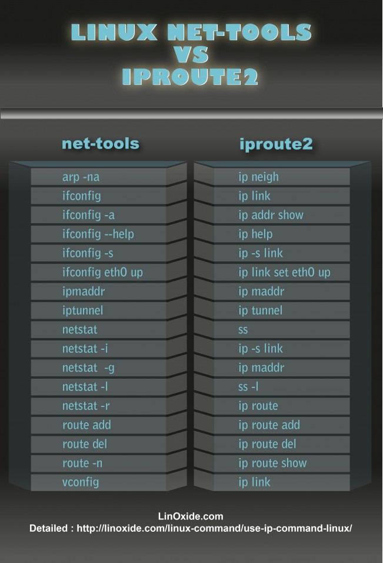

# ip

Linux的ip命令和ifconfig类似，但前者功能更强大，并旨在取代后者。使用ip命令，只需一个命令，你就能很轻松地执行一些网络管理任务。ifconfig是net-tools中已被废弃使用的一个命令，许多年前就已经没有维护了。iproute2套件里提供了许多增强功能的命令，ip命令即是其中之一。



**命令示例**

```shell
### 设置IP
sudo ip addr add 192.168.0.193/24 dev wlan0
# 注意: IP地址要有一个后缀，比如/24。这种用法用于在无类域内路由选择（CIDR）中来显示所用的子网掩码。

### 查看网卡信息
$ ip addr show eno1
2: eno1: <BROADCAST,MULTICAST,UP,LOWER_UP> mtu 1500 qdisc pfifo_fast state UP group default qlen 1000
    link/ether 4c:cc:6a:75:87:58 brd ff:ff:ff:ff:ff:ff
    inet 202.118.26.129/24 brd 202.118.26.255 scope global eno1
       valid_lft forever preferred_lft forever
    inet6 2001:da8:9000:a131:5c0e:9101:10cd:5642/64 scope global noprefixroute dynamic 
       valid_lft 2591766sec preferred_lft 604566sec
    inet6 fe80::8e92:ab7:44d3:1ae8/64 scope link 
       valid_lft forever preferred_lft forever

### 删除IP
sudo ip addr del 192.168.0.193/24 dev wlan0

### 获取不同网络接口的统计数据
$ ip -s link
1: lo: <LOOPBACK,UP,LOWER_UP> mtu 65536 qdisc noqueue state UNKNOWN mode DEFAULT group default qlen 1
    link/loopback 00:00:00:00:00:00 brd 00:00:00:00:00:00
    RX: bytes  packets  errors  dropped overrun mcast   
    10066246   121423   0       0       0       0       
    TX: bytes  packets  errors  dropped carrier collsns 
    10066246   121423   0       0       0       0       
2: eno1: <BROADCAST,MULTICAST,UP,LOWER_UP> mtu 1500 qdisc pfifo_fast state UP mode DEFAULT group default qlen 1000
    link/ether 4c:cc:6a:75:87:58 brd ff:ff:ff:ff:ff:ff
    RX: bytes  packets  errors  dropped overrun mcast   
    17397865038 12747222 0       0       0       236406  
    TX: bytes  packets  errors  dropped carrier collsns 
    427483925  5772784  0       0       0       0       
...

### 查看特定网络接口信息
$ ip -s link ls eno1
2: eno1: <BROADCAST,MULTICAST,UP,LOWER_UP> mtu 1500 qdisc pfifo_fast state UP mode DEFAULT group default qlen 1000
    link/ether 4c:cc:6a:75:87:58 brd ff:ff:ff:ff:ff:ff
    RX: bytes  packets  errors  dropped overrun mcast   
    17398010799 12748128 0       0       0       236660  
    TX: bytes  packets  errors  dropped carrier collsns 
    427520641  5772921  0       0       0       0       
$ ip -s -s link ls eno1
2: eno1: <BROADCAST,MULTICAST,UP,LOWER_UP> mtu 1500 qdisc pfifo_fast state UP mode DEFAULT group default qlen 1000
    link/ether 4c:cc:6a:75:87:58 brd ff:ff:ff:ff:ff:ff
    RX: bytes  packets  errors  dropped overrun mcast   
    17398014866 12748162 0       0       0       236668  
    RX errors: length   crc     frame   fifo    missed
               0        0       0       0       0       
    TX: bytes  packets  errors  dropped carrier collsns 
    427520641  5772921  0       0       0       0       
    TX errors: aborted  fifo   window heartbeat transns
               0        0       0       0       4       
# 当你需要获取一个特定网络接口的信息时，在网络接口名字后面添加选项ls即可。使用多个选项-s会给你这个特定接口更详细的信息。特别是在排除网络连接故障时，这会非常有用

### ARP条目
# 地址解析协议（ARP）用于将一个IP地址转换成它对应的物理地址，也就是通常所说的MAC地址。使用ip命令的neigh或者neighbour选项，你可以查看接入你所在的局域网的设备的MAC地址
$ ip neigh
202.118.26.56 dev eno1 lladdr 00:25:b3:f1:da:d0 STALE
202.118.26.122 dev eno1 lladdr 4c:cc:6a:aa:2f:fb STALE
202.118.26.254 dev eno1 lladdr 00:e0:fc:40:d7:78 REACHABLE
202.118.26.230 dev eno1 lladdr ec:a8:6b:c7:f1:ba STALE
202.118.26.238 dev eno1 lladdr f4:4d:30:57:6f:36 STALE
202.118.26.251 dev eno1 lladdr 4c:cc:6a:75:86:da STALE
202.118.26.196 dev eno1 lladdr 3c:97:0e:2a:4a:b5 STALE
202.118.26.27 dev eno1 lladdr 74:25:8a:ea:41:ed STALE
202.118.26.38 dev eno1 lladdr a0:8c:fd:ce:50:a5 STALE
202.118.26.201 dev eno1 lladdr 3c:a8:2a:07:1c:a1 STALE
202.118.26.191 dev eno1 lladdr 70:f3:95:14:24:a7 STALE
202.118.26.136 dev eno1 lladdr 6c:4b:90:03:f5:6a STALE
202.118.26.70 dev eno1 lladdr 00:11:25:3f:44:97 STALE
169.254.254.251 dev eno1 lladdr 70:5a:0f:12:f9:d4 STALE
202.118.26.124 dev eno1 lladdr 44:39:c4:91:42:53 STALE
202.118.26.221 dev eno1 lladdr 5c:b9:01:13:76:d7 STALE
202.118.26.197 dev eno1 lladdr 4c:cc:6a:aa:2f:fe STALE
202.118.26.114 dev eno1 lladdr f4:30:b9:ef:6a:90 STALE
192.168.12.51 dev ap0  FAILED
fe80::3ea8:2aff:fe07:1ca1 dev eno1 lladdr 3c:a8:2a:07:1c:a1 STALE
2001:da8:9000:a131:5eb9:1ff:fe13:76d7 dev eno1 lladdr 5c:b9:01:13:76:d7 STALE
fe80::5eb9:1ff:fe13:76d7 dev eno1 lladdr 5c:b9:01:13:76:d7 STALE
2001:da8:9000:a131::1 dev eno1 lladdr d8:67:d9:04:c0:43 router STALE
2001:da8:9000:a131:725a:fff:fe12:f9d4 dev eno1 lladdr 70:5a:0f:12:f9:d4 STALE
2001:da8:9000:a131:3ea8:2aff:fe07:1ca1 dev eno1 lladdr 3c:a8:2a:07:1c:a1 STALE
fe80::725a:fff:fe12:f9d4 dev eno1 lladdr 70:5a:0f:12:f9:d4 STALE
fe80::da67:d9ff:fe04:c043 dev eno1 lladdr d8:67:d9:04:c0:43 router REACHABLE

### 监控netlink消息
# 也可以使用ip命令查看netlink消息。monitor选项允许你查看网络设备的状态。比如，所在局域网的一台电脑根据它的状态可以被分类成REACHABLE或者STALE。使用下面的命令：
$ ip monitor all
[NEIGH]fe80::da67:d9ff:fe04:c043 dev eno1 lladdr d8:67:d9:04:c0:43 router STALE
[NEIGH]192.168.12.143 dev ap0 lladdr 64:cc:2e:6a:fd:23 DELAY
[NEIGH]192.168.12.143 dev ap0 lladdr 64:cc:2e:6a:fd:23 STALE
[NEIGH]192.168.12.143 dev ap0 lladdr 64:cc:2e:6a:fd:23 PROBE
[NEIGH]192.168.12.143 dev ap0 lladdr 64:cc:2e:6a:fd:23 REACHABLE
[LINK]3: wls3: <NO-CARRIER,BROADCAST,MULTICAST,UP> 
    link/ether 
[NEIGH]fe80::da67:d9ff:fe04:c043 dev eno1 lladdr d8:67:d9:04:c0:43 router PROBE
[NEIGH]fe80::da67:d9ff:fe04:c043 dev eno1 lladdr d8:67:d9:04:c0:43 router REACHABLE
[ADDR]2: eno1    inet6 2001:da8:9000:a131:5c0e:9101:10cd:5642/64 scope global noprefixroute dynamic 
       valid_lft 2592000sec preferred_lft 604800sec
[ADDR]2: eno1    inet6 fe80::8e92:ab7:44d3:1ae8/64 scope link 
       valid_lft forever preferred_lft forever
[ROUTE]2001:da8:9000:a131::/64 dev eno1 proto ra metric 100  pref medium
[ROUTE]fe80::da67:d9ff:fe04:c043 dev eno1 proto static metric 100  pref medium
[ROUTE]default via fe80::da67:d9ff:fe04:c043 dev eno1 proto static metric 100  pref medium

### 激活和停止网络接口
$ sudo ip link set eno1 down
$ sudo ip link set eno1 up
```

## 路由

```shell
### 查看路由信息
$ ip route show
default via 202.118.26.254 dev eno1 proto static metric 100 
172.16.22.0/24 dev vmnet1 proto kernel scope link src 172.16.22.1 
172.17.0.0/16 dev docker0 proto kernel scope link src 172.17.0.1 linkdown 
172.18.0.0/16 dev br-79d65a0af211 proto kernel scope link src 172.18.0.1 linkdown 
192.168.12.0/24 dev ap0 proto kernel scope link src 192.168.12.1 
192.168.115.0/24 dev vmnet8 proto kernel scope link src 192.168.115.1 
202.118.26.0/24 dev eno1 proto kernel scope link src 202.118.26.129 metric 100

### 查看给定IP的路由选择
$ ip route get 202.118.26.41
202.118.26.41 dev eno1 src 202.118.26.129 
    cache 
$ ip route get 172.17.1.100
172.17.1.100 dev docker0 src 172.17.0.1 
    cache 
    
### 更改默认路由
sudo ip route add default gw 20.0.0.1			# 添加网关
sudo ip route add default via 192.168.0.196
```

## 网关

```shell
### 添加网关
ip route add default gw 20.0.0.1
```

## 路由表

```shell
### 添加路由表
ip route add table 3 via 10.0.0.1 dev ethX 	# ethx 是10.0.0.1所在的网卡,3 是路由表的编号
```

## 规则(rule)

```shell
### 添加规则
ip rule add fwmark 3  table 3	# fwmark 3 是标记，table 3 是路由表3 上边。 意思就是凡事标记了 3 的数据使用table3 路由表

### 之后使用iptables给相应的数据打上标记 
iptables -A PREROUTING -t mangle -i eth0 -s 192.168.0.1 - 192.168.0.100 -j MARK --set-mark 3

### 示例
ip rule add from 192.168.3.112/32 [tos 0x10] table 2 pref 1500
# 向规则链增加一条规则，规则匹配的对象是IP为192.168.3.112，tos等于0x10的包，使用路由表2，这条规则的优先级是1500
```

## 案例

```shell
### 1
# 要求192.168.0.100以内的使用 10.0.0.1 网关上网 （电信），其他IP使用 20.0.0.1 （网通）上网
# 首先要在网关服务器上添加一个默认路由，当然这个指向是绝大多数的IP的出口网关
ip route add default gw 20.0.0.1
# 之后通过 ip route 添加一个路由表
ip route add table 3 via 10.0.0.1 dev ethX 	# ethx 是10.0.0.1所在的网卡,3 是路由表的编号
# 之后添加 ip  rule 规则
ip rule add fwmark 3  table 3 # fwmark 3 是标记，table 3 是路由表3 上边。 意思就是凡事标记了 3 的数据使用table3 路由表
# 之后使用iptables给相应的数据打上标记
iptables -A PREROUTING -t mangle -i eth0 -s 192.168.0.1 - 192.168.0.100 -j MARK --set-mark 3
# 因为mangle的处理是优先于 nat 和 fiter表的，所以相依数据包到达之后先打上标记，之后在通过ip rule 规则
# 对应的数据包使用相应的路由表进行路由，最后读取路由表信息，将数据包送出网关
```
### 查看某个接口信息

```shell
ip link show eno1	# eno1: 设备名
```

