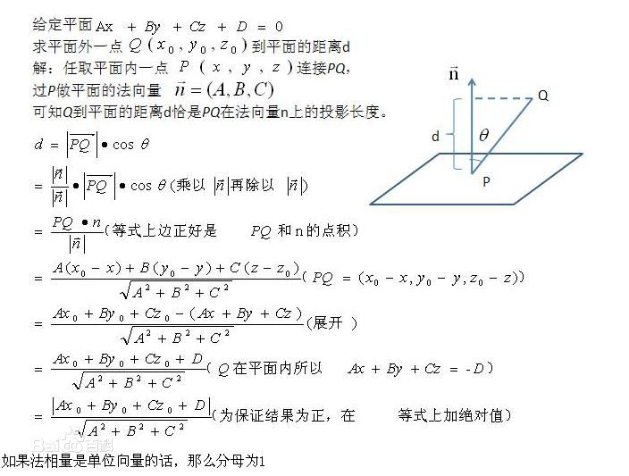

# 间隔与支持向量

## 间隔与支持向量

-   超平面

    -   通过如下线性方程来**描述**划分超平面
        $$
        \omega^T x + b = 0
        $$

    -   $$\omega$$ 决定方向

    -   $$b$$ 决定超平面与原点之间的距离

-   点到超平面距离
    $$
    r = \frac{|\omega^T + b|}{||w||}
    $$

    -   参考点到平面的距离

-   **假设超平面能够正确分类样本**，则可以通过对 $$\omega$$ **缩放**可以使得下式成立
    $$
    \begin{equation}
    \begin{cases}
    \omega^T x_i + b \geqslant +1  & y_i = +1
    \\
    \omega^T x_i + b \leqslant -1 &  y_i = -1
    \end{cases}
    \end{equation}
    \\ 等价于 \\
    y_i(\omega^Tx_i + b) \geqslant 1
    $$

-   距离超平面最近的训练样本点被称为 **支持向量** ，支持向量到超平面的距离是 $$\frac{1}{||\omega||}$$，所以两个异类支持向量到超平面的距离之和为
    $$
    \gamma = \frac{2}{||\omega||}
    $$
    它被称为 **间隔**

-   找到具有 **最大间隔** 的划分超平面，也就是找到约束的参数 $$\omega  和 b$$ ，使得 $$\gamma$$ 最大，即
    $$
    \max\limits_{\omega,b} \frac{2}{\omega}	\\
    s.t. \ \ \ y_i(\omega^Tx_i + b) \geqslant 1, \ \ \ i=1,2,\cdots,m.
    $$

    -   $$b$$ 通过约束隐式地影响着 $$\omega$$ 的取值，进而对间隔产生影响

-   为了最大化间隔，仅需最大化 $$||\omega||^{-1}$$ ，等价于最小化 $$||\omega||^2$$，得到支持向量机的**基本型**
    $$
    \min\limits_{\omega,b} \frac{1}{2} ||\omega||^2	\\
    s.t.\ \ \ y_i(\omega^Tx_i + b) \geqslant 1,  \ \ \ i = 1,2,\cdots,m.
    $$

## 对偶问题

-   间隔划分超平面所对应的模型
    $$
    f(x) = \omega^Tx + b
    $$

-   上述支持向量机基本型，是一个凸二次规划问题，可以用现成的优化计算包求解，但可以用更高效的方法。使用拉格朗日乘子法可得到其 **对偶问题**。每条约束添加拉格朗日乘子 $$\alpha_i \geqslant 0$$ ，则该问题的拉格朗日函数可写为
    $$
    L(\omega,b,\alpha) = \frac{1}{2}||\omega||^2 + \sum\limits_{i=1}\limits^{m}\alpha_i(1-y_i(\omega^Tx_i+b))
    $$

-   其中 $$\alpha = (\alpha_1;\alpha_2;\cdots;\alpha_m)$$ 。令 $$L(\omega,b,\alpha)$$ 对 $$\omega$$ 和 $$b$$ 的偏导为零可得
    $$
    \omega  = \sum\limits_{i=1}\limits^{m} \alpha_i y_i x_i \\
    0 = \sum\limits_{i=1}^{m}\alpha_iy_i
    $$

-   带入 $$L(\omega,b,\alpha)$$ 得到**对偶问题**
    $$
    \max\limits_{\alpha} \sum\limits_{i-1}\limits^{m} \alpha_i - \frac{1}{2} \sum\limits_{i=1}\limits^{m} \sum\limits_{j=1}\limits^{m} \alpha_i\alpha_jy_iy_jx_i^Tx_j	\\
    s.t. \sum\limits_{i=1}\limits^{m} \alpha_iy_i = 0,	\\
    \alpha_i \geqslant 0, i = 1,2,\cdots,m.
    $$

    -   $$\alpha_i 对应着训练样本 (x_i,y_i)$$

-   解出 $$\alpha$$ 后，求出 $$\omega$$ 和 $$b$$  即可得到模型
    $$
    f(x) = \omega^Tx + b \\
    = \sum\limits_{i=1}^{m} \alpha_i y_i x_i^Tx + b
    $$

-   又不等式约束，因此上述过程需满足 KKT 条件
    $$
    \begin{equation}
      \left\{
       \begin{aligned}
       \alpha_i \geqslant 0  \\
       y_if(x_i) - 1 \geqslant 0 \\
       \alpha_i(y_if(x_i) - 1) = 0
       \end{aligned}
       \right.
      \end{equation}
    $$
    ​

# 附录

## 点到直线距离

## 拉格朗日乘子法与KKT条件

拉格朗日乘子法(Lagrange Multiplier)和KKT(Karush-Kuhn-Tucker)条件**是求解约束优化问题的重要方法**。

-   在有等式约束时使用拉格朗日乘子法
-   在有不等约束时使用KKT条件
-   前提是：只有当**目标函数为凸函数**时，使用这两种方法才保证求得的是最优解

### 拉格朗日乘子法

问题
$$
\min f(x)	\\
s.t. \ \ \ h_i(x) = 0 \ \ \ i=0,1,\cdots,n
$$
可转换为
$$
min [f(x) + \sum\limits_{i=1}^\limits{n}  \lambda_i h_i(x)]
$$
其中 $$\lambda_i \neq 0$$，称为拉格朗日乘子

### KKT条件

KKT条件是解决最优化问题的时用到的一种方法。我们这里提到的最优化问题通常是指对于给定的某一函数，求其在指定作用域上的全局最小值。

# 参考

## 参考网址

-   [拉格朗日乘子法及KKT条件](https://www.cnblogs.com/zhangchaoyang/articles/2726873.html)
-   [KKT条件](http://blog.csdn.net/johnnyconstantine/article/details/46335763)

