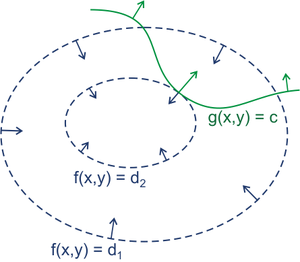

# 拉格朗日乘子法描述

问题
$$
\min f(x)	\\
s.t. \ \ \ h_i(x) = 0 \ \ \ i=0,1,\cdots,n
$$
可转换为
$$
min [f(x) + \sum\limits_{i=1}^\limits{n}  \lambda_i h_i(x)]
$$
其中 $$\lambda_i \neq 0$$，称为拉格朗日乘子

# 合理性解释

-   现有一个二维的优化问题
    $$
    \min f(x,y)	\\
    s.t. \  g(x,y) = c
    $$

-   画图来辅助思考

    

-   绿线标出的是约束 $$g(x,y)=c$$ 的点的轨迹。蓝线是的 $$f(x,y)$$ 等高线

    -   箭头表示斜率，和等高线的法线平行

    -   要想让目标函数的等高线和约束相切，则他们切点的梯度一定在一条直线上

    -   从图上可以直观地看到在最优解处，$$f(x,y)$$ 和 $$g(x,y)$$ 的法线方向刚好相反（或者说叫梯度共线），即

    -   $$
        \nabla [f(x,y)+\lambda (g(x,y) - c) ] = 0 \ \ \ \ \   \lambda \neq 0 \\

        \nabla 代表梯度
        $$

-   满足上述等式的点，亦满足下式

-   $$
    \min F(x,y) = f(x,y) + \lambda(g(x,y) - c)
    $$

-   上式和待优化问题等价

-   新方程 $$F(x,y)$$ 在达到极值时与 $$f(x,y)$$ 相等，因为 $$g(x,y) - c = 0$$

-   易求在无约束极值和极值所对应的点

# 附录

## 梯度

梯度的本意是一个向量（矢量），表示某一函数在该点处的方向导数沿着该方向取得最大值，即函数在该点处沿着该方向（此梯度的方向）变化最快，变化率最大（为该梯度的模）。

# 参考

-   [拉格朗日乘子法及KKT条件](https://www.cnblogs.com/zhangchaoyang/articles/2726873.html)