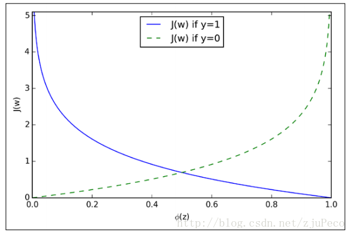

# 基本形式

线性模型（linear model）试图通过属性的线性组合来进行预测的函数，即：
$$
f(x) = \omega_1 x_1 + \omega_2x_2 + \omega_3x_3 + ... + \omega_dx_d + b
$$

线性模型，形式简单，易于建模。

# 多重线性回归

线性回归（linear regression）试图学得一个线性模型以尽可能准确地预测实值输出标记。

**多重线性回归**

多重线性回归(multiple linear regression) 是简单直线回归的推广，研究一个因变量与多个自变量之间的数量依存关系。多重线性回归用[回归方程](https://baike.baidu.com/item/%E5%9B%9E%E5%BD%92%E6%96%B9%E7%A8%8B/11042494)描述一个因变量与多个[自变量](https://baike.baidu.com/item/%E8%87%AA%E5%8F%98%E9%87%8F/6895256)的依存关系，简称**多重回归**。

-   均方误差

    -   是回归任务中最常用的**性能度量**
    -   几何意义：对应了常用的**欧几里得距离**或简称**欧氏距离**

-   最小二乘法

    -   基于均方误差最小化来进行模型求解的方法称为**最小二乘法**
    -   线性回归中，最小二乘法就是试图找到一条曲线，使所有样本到直线上的欧氏距离之和最小

-   对数线性回归

    -   $$
        \ln y = \omega ^T x + b
        $$

        或
        $$
        y = e ^ {w^Tx+b}
        $$

    -   **对数线性回归** 实际上是在试图让 $$e^{\omega ^T x + b}$$ 逼近 $$y$$

    -   形式上仍是线性回归，但实质上是在求取输入空间到输出空间的非线性函数映射

    -   这里的对数函数起到了将线性回归模型的预测值与真实标记联系起来的作用

-   广义线性模型

    -   对数线性回归是广义模型的特例

    -   考虑单调可微函数 $$g(\cdot)$$，令
        $$
        y = g^{-1} (\omega ^T x + b)
        $$

    -   函数 $$g(\cdot)$$ 称为**联系函数**

## **推导**

**原理**

**应用**

根据已知数据 $$x$$ 和拟合函数 $$h_\theta(x)$$ 训练其中未知参数 $$\theta$$ ，使得拟合损失 $$J(\theta)$$ 达到最小。然后用所得的拟合函数进行预测。 

-   **假设** 
    $$
    h_\theta(x) = \theta^Tx
    $$

-   **参数**
    $$
    \theta = \begin{bmatrix}  \theta_0 \\  \theta_1 \\  \theta_2 \\ \vdots \\ \theta_n \\  \end{bmatrix} \hspace{2em} \theta \in \mathbb{R}^{n+1}
    $$

-   **损失函数**
    $$
    J(\theta_0,\theta_1,\cdots,\theta_n) = \frac{1}{2m}\sum\limits_{i=1}^{m} (h_{\theta}(x^{(i)}) - y^{(i)})^2
    $$

-   **拟合参数**

    -   梯度下降

        -   Repeat

        $$
        \theta_j := \theta_j - \alpha \frac{1}{m}\sum\limits_{i=1}^{m} (h_{\theta}(x^{(i)}) - y^{(i)})^2	\hspace{2em} j=0,1,2,\cdots,n
        $$

        ​

# 逻辑回归(对数几率回归)

## **简介**

-   名字是“回归”，但实际却**是一种分类学习方法**

## **对数几率函数**

$$
y = \frac{1}{1 + e ^ {-z}}
$$

对数几率函数是一种 **Sigmoid函数**，将 $$z$$ 值转化为一个接近0或1的 $$y$$ 值。

将对数几率函数作为 $$g^- (\cdot)$$ 代入$$y = g^{-1} (\omega ^T x + b)$$ ，得到：
$$
y = \frac{1}{1 + e ^{-(\omega ^ T x + b)}}
$$
类似于 $$\ln y = \omega ^T x + b$$ ，可变化为
$$
\ln {\frac{y}{1-y}} = \omega^T x + b
$$

**几率**

若$$y$$ 视为样本 $$x$$ 作为正例的可能性，则 $$1-y$$ 是其反例可能性，两者的比值
$$
\frac{y}{1-y}
$$
称为 **几率(odds)**。**反映了 $$x$$ 作为正例的相对可能性**。对几率取对数则得到 **对数几率** 
$$
\ln{\frac{y}{1-y}}
$$

-   可知，公式 $$y = \frac{1}{1 + e ^{-(\omega ^ T x + b)}}$$ 实际上是在用线性回归模型的预测结果去逼近真实标记的对数几率，因此，其对应的模型称为 **对数几率回归**

## 优缺点

**优点**

-   直接**对分类可能性进行建模**，无需事先假设数据分布，这样就**避免了假设分布不准确所带来的问题**
-   不仅预测出“类别”，而是**可得到近似概率预测**，对许多需利用概率辅助决策的任务很有用
-   对率函数是任意阶可导的凸函数，有**很好的数学性质**

**缺点**

-   对数据和场景的适应能力有局限性，不如决策树算法适应性那么强

## 推导

已知数据 $$x$$ 和 拟合函数 $$g(z),h(\theta)$$ 训练其中未知参数 $$\theta$$ 使得对数似然函数 $$\ell(\theta)$$ 最大。然后用所得的拟合函数进行二分类。 

**应用**

- **Sigmoid函数**
  $$
  g(z) = \frac{1}{1+e^{-z}}
  $$

-   **假设**
    $$
    h_{\theta}(x) = g(\theta^Tx) = \frac{1}{1+e^{-\theta^Tx}}
    $$

-   参数
    $$
    \theta = \begin{bmatrix}  \theta_0 \\  \theta_1 \\  \theta_2 \\ \vdots \\ \theta_n \\  \end{bmatrix} \hspace{2em} \theta \in \mathbb{R}^{n+1}
    $$

-   损失函数
    $$
    J(\theta) = \frac{1}{m}\sum\limits_{i=1}^{m} cost(h_\theta(x^{(i)}), y_i)	\\
    \hspace{10em} = - \frac{1}{m} [\sum\limits_{i=1}^{m}y^{(i)}\log h_\theta(x^{(i)}) + (1-y^{(i)})\log (1-h_\theta(x^{(i)}))]	\\
    其中 \hspace{1em}
    cost(h_\theta(x),y) =
    \left\{
    \begin{aligned} 
    	-log(h_\theta(x)) \hspace{2em} if \hspace{1em} y = 1	\\
    	-log(1- h_\theta(x)) \hspace{2em} if \hspace{1em} y = 0	\\
    \end{aligned}
    \right .  \hspace{1em} 等价于 \\ \hspace{1em} \\ 
    cost(h_\theta(x),y) = -y\log(h_\theta(x)) - (1-y)log(1-h_\theta(x))
    $$

-   **拟合参数**

    -   想要 $$\min \limits_{\theta} J(\theta)$$

- 梯度下降

  - Repeat 
    $$
    \theta_j := \theta_j - \alpha \frac{\partial}{\partial \theta_j} J(\theta) \\
    其中 \hspace{1em} \frac{\partial}{\partial \theta_j} J(\theta)  =
    \frac{1}{m}\sum\limits_{i=1}^{m} (h_\theta(x^{(i)} - y^{(i)})x_j^{(i)} \hspace{1em}  等价于\\
    \theta_j := \theta_j - \alpha\sum\limits_{i=1}^{m} (h_\theta(x^{(i)} - y^{(i)})x_j^{(i)}
    $$

-   **做出预测**

    -   给定新的 $$x$$，输出 $$h_\theta (x)$$ ，即 $$p(y=1|x;\theta)$$

## 逻辑回归中的代价函数

-   如果模仿多重线性回归，使用最小二乘法
    $$
    J(\theta) = \sum\limits_{i=1}^{m}\frac{1}{2}(h_\theta(x^{(i)}) - y^{(i)})^2	\\
    其中 \hspace{1em} h_{\theta}(x) = g(\theta^Tx) = \frac{1}{1+e^{-\theta^Tx}}
    $$

-   会发现这时一个非凸函数，意味着代价函数有许多局部最小值，不利于求解

-   换一种思路，$$h_{\theta}(x)$$ 可是视为 $$y=1$$ 的后验估计，所以有
    $$
    p(y=1|x;\theta) = h_\theta(x)	\\
    p(y=0|x;\theta) = 1-h_\theta(x)
    $$

-   两式写成一般形式 
    $$
    p(y|x;\theta) = h_\theta(x)^y (1-h_\theta(x))^{1-y}
    $$

-   用极大似然估计，根据给定的训练集，估计出参数 $$\theta$$
    $$
    L(\theta) = \prod\limits_{i=1}^{m}p(y^{(i)}|x^{(i)};\theta) = \prod\limits_{i=1}^{m}h_\theta(x^{(i)})^{y^{(i)}} (1-h_\theta(x^{(i)}))^{1-{y^{(i)}}}
    $$

-   为了简化运算，上等式两边取对数
    $$
    \ell(\theta) = \ln {L(\theta)} = \sum\limits_{i=1}^{m}y^{(i)} \ln (h_\theta(x^{(i)}) ) + 
    (1-y^{(i)})\ln (1-h_\theta(x))
    $$

-   上式，要求的使得  $$\ell(\theta)$$ 最大的 $$\theta$$ 。两边取负号，得到代价函数，以便优化算法最小化代价函数
    $$
    J(\theta) = -\ell(\theta) = - \sum\limits_{i=1}^{m}y^{(i)} \ln (h_\theta(x^{(i)}) ) + 
    (1-y^{(i)})\ln (1-h_\theta(x))
    $$

-   向量化
    $$
    J(\theta)  = -y\ln(h_\theta(x)) - (1-y)ln(1-h_\theta(x))
    $$

-   等价于
    $$
    J(\theta) =
    \left\{
    \begin{aligned} 
    	-log(h_\theta(x)) \hspace{2em} if \hspace{1em} y = 1	\\
    	-log(1- h_\theta(x)) \hspace{2em} if \hspace{1em} y = 0	\\
    \end{aligned}
    \right .
    $$

-   这样一个函数

    

    -   上图中 $$J(\omega) = J(\theta),\phi(z) = h_\theta(x)$$，可以看出
        -   如果样本的值是1的话，估计值$$h_\theta(x)$$越接近1付出的代价就越小，反之越大
        -   如果样本的值是0的话，估计值$$h_\theta(x)$$越接近0付出的代价就越小，反之越大

**参考**

-   [参考一](http://blog.csdn.net/zjuPeco/article/details/77165974)

## 用途

-   寻找危险因素
    -   寻找某一疾病的危险因素等
-   预测
    -   根据模型，预测在不同的自变量情况下，发生某病或某种情况的概率有多大
-   判别
    -   实际上跟预测有些类似，也是根据模型，判断某人属于某病或属于某种情况的概率有多大，也就是看一下这个人有多大的可能性是属于某病

# 线性判别分析

线性判别分析（Linear Discriminat Analysis，LDA）是一种经典的线性学习方法。

**基本思想**

-   给定训练样例集，设法将样例投影到一条直线上
-   使得同类样例的投影点尽可能接近、异类样例的投影点尽可能远离
-   在对新样本进行分类时，将其投影到同样的这条直线上，再根据投影点的位置来确定新样本的类别

# 多分类学习

-   利用二分类学习器来解决多分类问题
-   多分类学习的基本思路是 **拆解法**， 将多分类任务拆为若干个二分类任务求解：
    -   先对问题进行拆分，然后为拆出的每个二分类任务训练一个分类器
    -   在测试时，对这些分类器的预测结果进行集成以获得最终的多分类结果

**拆分策略**

-   一对一
    -   将N个类别两两配对，产生 $$N(N-1)/2$$ 个二分类任务
-   一对其余
    -   N个训练样例，将一个类的样例作为正例，所有其他类的样例作为反例
    -   **比较：** 
        -   OvO 储存开销和测试时间开销通常比 OvR 更大
        -   OvO 的训练时间开销通常比 OvR 更小
        -   性能相当
-   多对多

## 参考

- [参考一](https://www.cnblogs.com/Rambler1995/p/5467071.html)

# 类别不平衡问题

-   类别不平衡问题指分类任务中不同类别的训练样例数目差别很大的情况
-   观测几率：$$\frac{m^+}{m^-} = \frac{正例数据}{反例数目}$$
-   分类器的预测几率高于观测几率就应判定为正例
    -   $$\frac{y'}{1-y'} = \frac{y}{1-y} * \frac{m^+}{m^-}$$
-   针对类别不平衡一个基本策略是 **再缩放**
    -   对反类样例进行 **欠采样**，使正负样例数目相近
    -   对正类样例进行 **过采样**，使正负样例数目相近
    -   直接基于原始训练集进行学习，但是将公式$$\frac{y'}{1-y'} = \frac{y}{1-y} * \frac{m^+}{m^-}$$ 嵌入决策过程，称为 **阈值移动**

# 问题

## 逻辑回归于多重线性回归的区别

两者最大的区别是因变量不同。

|                  | 线性回归                 | 逻辑回归                               |
| ---------------- | ------------------------ | -------------------------------------- |
| 目的             | 概率                     | 分类                                   |
| $y(i)$           | 未知                     | {0,1}                                  |
| 函数             | 拟合函数                 | 预测函数                               |
| 参数计算方式     | 最小二乘                 | 最大似然估计                           |
| 因变量类型       | 连续性数值变量           | 分类型变量                             |
| 变量分布         | 服从正态分布             | 没有要求                               |
| 变量和因变量关系 | 线性关系                 | 没有要求                               |
|                  | 分析因变量与自变量的关系 | 分析因变量取某个值的概率与自变量的关系 |

>   Logistic回归与线性回归实际上有很多相同之处，最大的区别就在于他们的因变量不同，其他的基本都差不多，正是因为如此，这两种回归可以归于同一个家族，即广义线性模型（generalized linear model）。
>
>   这一家族中的模型形式基本上都差不多，不同的就是因变量不同，如果是连续的，就是多重线性回归，如果是二项分布，就是logistic回归。logistic回归的因变量可以是二分类的，也可以是多分类的，但是二分类的更为常用，也更加容易解释。所以实际中最为常用的就是二分类的logistic回归。

| 因变量分布类型 | 回归名称     |
| -------------- | ------------ |
| 连续           | 多重线性回归 |
| 二项分布       | 逻辑回归     |
| Poisson分布    | Poisson回归  |
| 负二项分布     | 负二项回归   |

### 参考

-   [1](http://blog.csdn.net/yunhaitianguang/article/details/43877591)
-   [2](http://blog.csdn.net/gcs1024/article/details/77478404)