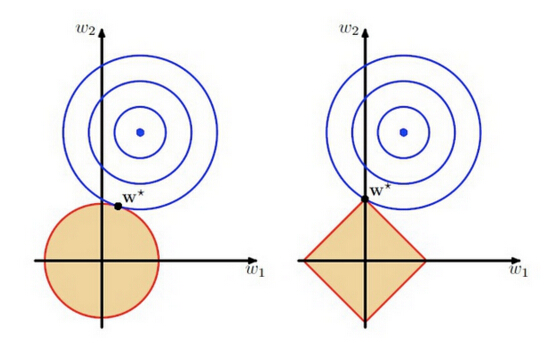
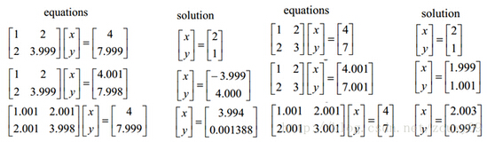
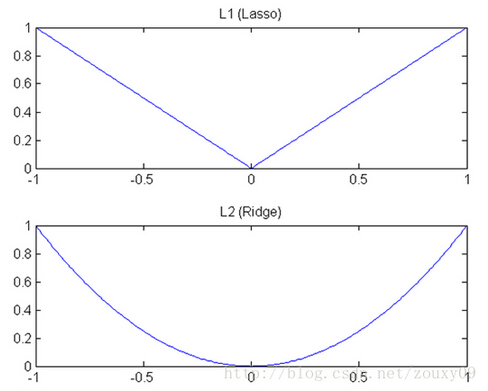
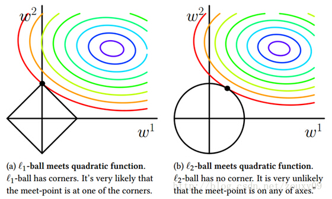

# 过拟合

**定义**

给定一个假设空间 $H$ ，对于假设 $h \in H, \exists \ h' \in H$ 使得在训练样例上 $h$ 的误差要比 $h'$ 小，但在整个实例分布上， $h'$ 比 $h$ 的误差率小，那么就说假设 $h$ 过度拟合训练数据。

# 原因

- 数据问题
  - 训练样本过少，不足以对整个样本空间进行分布估计
  - 通常会假设样本空间中全体样本服从一个未知的分布，训练样本数据是独立地从这个分布上采样获得的，即**独立同分布**，训练样本数据可以很好地反映出样本空间的特性。但是，实际训练数据，**独立同分布条件可能不成立**，即训练数据的分布可能发生变化
- 模型问题
  - 模型学习能力过于强大，学习到了训练样本中的非一般特性
- 交叉验证方法在可获得额外的数据提供验证集合时工作得很好，但是小训练集合的过度拟合问题更为严重

# 处理方法

## 早结束

模型训练过程中常用到迭代的思路，例如梯度下降算法。Early stopping是在迭代收敛之前，就通过一定标准提前终止迭代来防止过拟合。

> 具体做法是在每个Epoch结束时（一个Epoch集为对所有的训练数据的一轮遍历），查看模型性能评价指标的变化情况，如果模型性能不再提高，就停止训练。这里的重点就是如何确认模型性能不再提高了。以准确率为例，并不是说一旦准确率发生下降就是不再提高了，因为可能经过这个Epoch后，准确率降低了，但是随后的Epoch又让准确率又上去了，所以不能根据一两次的连续降低就判断不再提高。
>
> 判断准确率是否提高的做法是，在训练过程中记录到目前为止最好的准确率，当连续10次Epoch（或若干次）没有达到这个最佳准确率时，就认为不会再提高，停止迭代。

## 数据集扩增

根据独立同分布假设，更多的数据往往对样本空间的整体分布估计更准确，不过实际应用中由于种种原因，并不一定总能获得足够的数据，例如成本问题。

通俗得讲，数据机扩增即需要得到更多的符合要求的数据，即和已有的数据是独立同分布的，或者近似独立同分布的。

一般有以下方法：

- 从数据源头采集更多数据
- 人工合成数据
  - 复制原有数据并加上随机噪声，产生新数据
  - 根据当前数据集估计数据分布参数，使用该分布产生更多数据等
- 重采样

## 正则化

正则化方法是指在进行目标函数或代价函数优化时，在目标函数或代价函数后面加上一个正则项。

- **L1正则**

  - L1正则是基于L1范数，即在目标函数后面加上参数的L1范数和项，即参数绝对值和与参数的积项，即： 

  - $$
    C= C_0+\frac{\lambda}{n} \sum\limits_{\omega}|\omega|
    $$

  - 其中$C_0$代表原始的代价函数，$n$ 是样本的个数，$\lambda$ 就是正则项系数，权衡正则项与 $C_0$ 项的比重。后面那一项即为L1正则项。 

  - 在计算梯度时，$\omega$ 梯度变为
    $$
    \frac{\partial C}{\partial \omega} = \frac{\partial C_0}{\partial \omega} + \frac{\lambda}{n} \operatorname{sgn}(\omega)
    $$

  - 其中，$\operatorname{sgn}$ 是符号函数，那么便使用下式对参数进行更新

  - $$
    \omega := \omega + \alpha\frac{\partial C_0}{\partial\omega} + \beta\frac{\lambda}{n} \operatorname{sgn}(\omega)
    $$

    - 对于有些模型，如线性回归中（L1正则线性回归即为Lasso回归），常数项 $b$ 的更新方程不包括正则项，即： 

  - $$
    b := b + \alpha \frac{\partial C_0}{\partial b}
    $$

    - 在梯度下降中，$\alpha < 0,\beta < 0$ ，在梯度上升中则相反

  - 从上式可以看出，当 $\omega$ 为正时，更新后 $\omega$ 会变小；当 $\omega$ 为负时，更新后 $\omega$ 会变大

  - 因此**L1正则项是为了使得那些原先处于零（即$\omega \thickapprox 0$）附近的参数 $\omega$ 往零移动，使得部分参数为零**，从而降低模型的复杂度（模型的复杂度由参数决定），从而防止过拟合，提高模型的泛化能力。 

  - 其中，L1正则中有个问题，便是L1范数在0处不可导，即 $|\omega|$ 在0处不可导，因此在 $\omega$ 为0时，使用原来的未经正则化的更新方程来对 $\omega$ 进行更新，即令 $\operatorname{sgn}(0) = 0$，这样即： 

  - $$
    \operatorname{sgn}(\omega)|_{\omega>0} = 1,\operatorname{sgn}(\omega)|_{\omega<0} = -1,\operatorname{sgn}(\omega)|_{\omega=0} = 0
    $$

- **L2正则**

  - L2正则是基于L2范数，即在目标函数后面加上参数的L2范数和项，即参数的平方和与参数的积项，即： 

  - $$
    C = C_0+ \frac{\lambda}{2n} \sum_\omega \omega^2
    $$

  - 其中 $C_0$ 代表原始的代价函数，$n$ 是样本的个数，与L1正则化项前面的参数不同的是，L2项的参数乘了$\frac{1}{2}$，是为了便于计算以及公式的美感性，因为平方项求导有个2，$\lambda$ 就是正则项系数，权衡正则项与 $C_0$ 项的比重。后面那一项即为L2正则项。

  - L2正则化中则使用下式对模型参数进行更新

  - $$
    \omega := \omega + \alpha \frac{\partial C_0}{\partial \omega} + \beta \frac{\lambda}{n}\omega
    $$

    - 对于有些模型，如线性回归中（L2正则线性回归即为Ridge回归，岭回归），常数项bb的更新方程不包括正则项，即： 

  - $$
    b := b + \alpha \frac{\partial C_0}{\partial b}
    $$

    - 梯度下降算法中，$\alpha < 0,\beta < 0$，梯度上升算法中则相反

  - 从上式可以看出，L2正则项起到使得参数 $\omega$ 变小**加剧**的效果，但是为什么可以防止过拟合呢？一个通俗的理解便是：更小的参数值 $\omega$ 意味着模型的复杂度更低，对训练数据的拟合刚刚好（奥卡姆剃刀），不会过分拟合训练数据，从而使得不会过拟合，以提高模型的泛化能力。

**总结**

正则项**是为了降低模型的复杂度**，从而**避免模型区过分拟合训练数据**，包括噪声与异常点（outliers）。

**正则化可以避免过拟合的解释**

- 从另一个角度上来讲，**正则化即是假设模型参数服从先验概率**，即为模型参数添加先验，只是不同的正则化方式的先验分布是不一样的。这样就**规定了参数的分布，使得模型的复杂度降低**（试想一下，限定条件多了，是不是模型的复杂度降低了呢），**这样模型对于噪声与异常点的抗干扰性的能力增强，从而提高模型的泛化能力**。
- 还有个解释便是，从贝叶斯学派来看：加了先验，在数据少的时候，先验知识可以防止过拟合；从频率学派来看：正则项限定了参数的取值，从而提高了模型的稳定性，而稳定性强的模型不会过拟合，即控制模型空间。 
- 另外一个角度，过拟合从直观上理解便是，在对训练数据进行拟合时，需要照顾到每个点，从而使得拟合函数波动性非常大，即方差大。在某些小区间里，函数值的变化性很剧烈，意味着函数在某些小区间里的导数值的绝对值非常大，由于自变量的值在给定的训练数据集中的一定的，因此只有系数足够大，才能保证导数的绝对值足够大。
- 另外一个解释，规则化项的引入，在训练（最小化cost）的过程中，当某一维的特征所对应的权重过大时，而此时模型的预测和真实数据之间距离很小，通过规则化项就可以使整体的cost取较大的值，从而，在训练的过程中避免了去选择那些某一维（或几维）特征的权重过大的情况，即过分依赖某一维（或几维）的特征（引用知乎）。 

- 正则化是假设模型的参数服从先验概率，即为模型参数添加先验分布，不同的正则化方式的先验分布不一样（L1正则是**拉普拉斯先验**，而L2正则则是**高斯先验**）。规定了参数的分布，降低了模型的复杂度，增强对噪声和异常点的抗干扰能力。

- L2与L1的区别在于，L1正则是拉普拉斯先验，而L2正则则是高斯先验。

  - 它们都是服从均值为0，协方差为 $\frac{1}{\lambda}$ 。
  - 当$\lambda=0$时，即没有先验。没有正则项，则相当于先验分布具有无穷大的协方差，那么这个先验约束则会非常弱，模型为了拟合所有的训练集数据， 参数$\omega$可以变得任意大从而使得模型不稳定，即方差大而偏差小。
  - $\lambda$越大，标明先验分布协方差越小，偏差越大，模型越稳定。
  - 即，加入正则项是在偏差bias与方差variance之间做平衡tradeoff。

  

  - 上图中的模型是线性回归，有两个特征，要优化的参数分别是$\omega_1$和$\omega_2$，左图的正则化是 $L2$，右图是$L1$。蓝色线就是优化过程中遇到的等高线，一圈代表一个目标函数值，圆心就是样本观测值（假设一个样本），半径就是误差值，**受限条件就是红色边界（就是正则化那部分，**我的理解是这个红色边界就是限定了先验分布**）**，二者相交处，才是最优参数。**可见右边的最优参数只可能在坐标轴上，所以就会出现0权重参数，使得模型稀疏**。

## Dropout

Dropout方法在神经网络里面很常用，通俗讲就是在训练的时候让神经元以一定的概率不工作。

具体做法是在每次迭代中，随机选取一定数量的隐藏层神经元，使其不工作，同时保持输入输出层神经元的个数不变。

# 问题

## L1和L2正则对比

  - L1正则是拉普拉斯先验，而L2正则则是高斯先验

  - L1正则更加容易产生稀疏解，L2正则倾向于让参数 $\omega$ 趋向于0
  - 下降速度及模型空间限制对比见附录

# 附录

## 机器学习中的范数规则化

监督学习的过程可以概括为：最小化误差的同时规则化参数。最小化误差是为了让模型拟合训练数据，规则化参数是为了防止过拟合。参数过多会导致模型复杂度上升，产生过拟合，即训练误差很小，但测试误差很大，这和监督学习的目标是相违背的。所以需要采取措施，保证模型尽量简单的基础上，最小化训练误差，使模型具有更好的泛化能力（即测试误差也很小）。

范数规则化有两个作用：

- 保证模型尽可能的简单，避免过拟合
- 约束模型特性，加入一些先验知识，例如稀疏、低秩等

### **$L0$ 范数和 $L1$范数**

- $L0$ 范数是指向量中非零元素的个数。如果用$L0$规则化一个参数矩阵$\omega$，就是希望$\omega$中大部分元素是零，实现稀疏。

- $L1$ 范数是指向量中各个元素的绝对值之和，也叫**系数规则算子**（Lasso regularization）。$L1$范数也可以实现稀疏，通过将无用特征对应的参数 $\omega$ 置为零实现。

- 两者都可以实现稀疏化，但往往选择 $L1$，因为：

  - $L0$ 范数很难优化求解（NP难）
  - $L1$ 是 $L0$ 的最优凸近似，比 $L0$ 更容易优化求解

- 稀疏化的好处

  - 特征选择

    > 实现特征的自动选择，去除无用特征。稀疏化可以去掉这些无用特征，将特征对应的权重置为零。

  - 可解释性

    > 例如判断某种病的患病率时，最初有1000个特征，建模后参数经过稀疏化，最终只有5个特征的参数是非零的，那么就可以说影响患病率的主要就是这5个特征。

### **$L2$ 范数**

$L2$ 范数是指向量各元素的平方和然后开方，用在回归模型中也称为岭回归（Ridge regression）。

- $L2$ 避免过拟合的**原理**是：让 $L2$ 范数的规则项 $\omega^2$ 尽可能小，可以使得 $\omega$ 每个元素都很小，接近于零，但是与 $L1$ 不同的是，不会等于0；这样得到的模型**抗干扰能力强**，参数很小时，即使样本数据 $x$ 发生很大的变化，模型预测值 $y$ 的变化也会很有限。

- $L2$范数除了避免过拟合问题，还有一个优点是有助于处理condition number不好的情况下，矩阵求解困难的问题。condition number是对系统ill-condition程度的一个衡量标准。假设有方程组$Ax=b$，需要求解$x$。如果$A$或者$b$发生轻微改变，就会使得x的解发生很大变化，那么这个方程组系统就是ill-condition的，反之就是well-condition的。下图为例说明：

  
  - 第一行是两个原始的方程序系统；
  - 第二行对系统的 $b$ 做出轻微修改，左侧方程组的解发生较大变化，右侧的变化不明显；
  - 第三行对系统的 $A$ 做出轻微修改，同样左侧系统的解发生较大变化，右侧的变化不明显。这说明左侧的系统是ill-condition的，右侧的是well-condition的。
  - 具体到通过训练数据建立的模型中时，ill-condition可以说就是不稳定的，当输入的样本数据发生变化时，预测结果就会不准确。condition number就是用来对系统的ill-condition程度进行衡量的，condition number值小的就是well-condition，反之为ill-condition。

**$L1$和$L2$对比**

  - 下降速度对比

      - 建立模型的过程中，会尝试最小化损失函数，这个过程就像一个下坡的过程，L1和L2的差别在于坡的斜率，如下图所示。

        

- 模型空间的限制

  - 使用L1,L2范式建立模型时，损失函数可以写成如下形式：
    $$
    Lasso: \min\limits_{\omega} \frac{1}{n}||y-X\omega||^2,s.t.||\omega||_1 \leqslant C \\
    Ridge: \min\limits_{\omega} \frac{1}{n}||y-X\omega||^2,s.t.||\omega||_2 \leqslant C \\
    $$

  - 可以说成是将模型空间限制在 $\omega$ 的某个范围内，如下图所示，在 $(\omega_1,\omega_2)$ 空间上可以画出目标函数的等高线，约束条件则是平面上半径为 $C$ 的一个`norm ball`，等高线与`norm ball`首次相交的地方就是最优解。

    

  - 通过对比可以看出，`L1-ball`和`L2-ball`的不同在于 $L1$ 在和每个坐标轴相交的地方都有”角“出现，与目标函数相交的地方也是在角的位置。角的位置就容易产生稀疏性，例如图中的交点处 $\omega_1=0$。$L2$就没有这样的性质，因为没有角，相交的位置有稀疏性的概率就非常低，从直观上解释了为什么 $L1$ 能够产生稀疏性而 $L2$ 就不行。

  - $L1$ 范式会趋向于产生**较少的特征**，在特征选择时很有用；$L2$ 会选择**更多特征**，但对应**权值接近零**。

# 参考

  - [参考一](http://blog.sina.com.cn/s/blog_7103b28a0102wozt.html)
  - [参考二](http://blog.sina.com.cn/s/blog_7103b28a0102w73g.html)