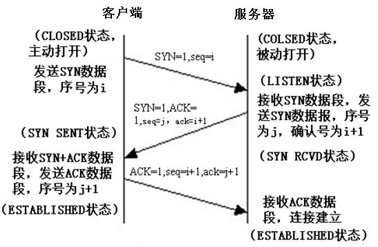
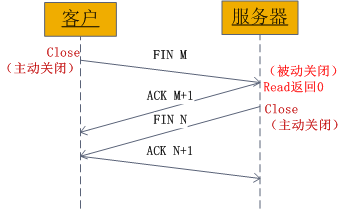
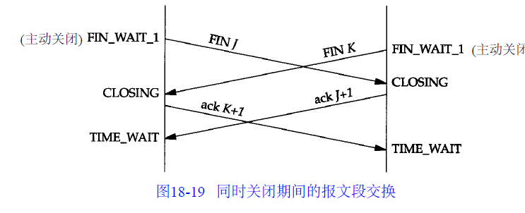

# TCP/IP

## 建立/断开连接

### TCP状态转换图

### 建立连接(三次握手)

- 客户端发送一个带SYN标志的TCP报文到服务器(报文1)
- 服务器端回应客户端(报文2), 这个报文同时带ACK标志和SYN标志. 因此, 它表示对刚才客户端SYN报文的回应, 同时又发送标志SYN给客户端, 询问客户端是否准备好进行数据通讯
- 客户端必须再次回应服务端一个ACK报文(报文3)

### 终止连接(四次握手)

由于TCP连接是全双工的, 因此每个方向都必须单独进行关闭. 当一方完成它的数据发送后发送一个FIN来终止这个方向的连接, 另一端收到FIN后, 仍可以发送数据. 首先进行关闭的一方执行主动关闭, 另一方执行被动关闭.

- TCP客户端发送一个FIN, 用来关闭客户端到服务端的数据传送
- 服务端收到FIN, 发回一个ACK, 确认序号为收到的序号加一. 和SYN一样, 一个FIN占用一个序号
- 服务端关闭客户端的连接, 发送一个FIN给客户端
- 客户端发回ACK报文确认, 并将确认序号设置为收到的序号加一

### 状态

| 状态            | 说明                                    | 备注                                       |
| ------------- | ------------------------------------- | ---------------------------------------- |
| `CLOSED`      | 初始状态                                  |                                          |
| `LISTEN`      | 监听状态, 可以接受连接                          |                                          |
| `SYN_RCVD`    | 接受到`SYN`报文                            | 正常情况下, 这个状态是服务端的SOCKET在建立TCP连接时的三次握手会话过程中的一个中间状态. 在这种状态时, 当收到客户端的ACK报文后, 会进入ESTABLISHED状态 |
| `SYN_SEND`    | 客户端已发送SYN报文                           | 与`SYN_RCVD`呼应, 当客户端SOCKET执行CONNECT连接时, 首先发送SYN报文, 随即进入SYN_SEND状态, 并等待服务端发送三次握手中的第二个报文 |
| `ESTABLISHED` | 连接已建立                                 |                                          |
| `FIN_WAIT_1`  | 等待对方FIN报文                             | FIN\_WAIT\_1和FIN\_WAIT\_2都表示等待FIN报文. FIN\_WAIT\_1状态实际上是当SOCKET在ESTABLISHED状态时，它想主动关闭连接，向对方发送了FIN报文，此时该SOCKET进入到FIN\_WAIT\_1状态, 而当对方回应ACK报文后，则进入到FIN_WAIT_2状态. |
| `FIN_WAIT_2`  | 等待对方FIN报文                             | FIN_WAIT_2状态下的SOCKET，表示半连接，也即有一方要求close连接，但另外还告诉对方，我暂时还有点数据需要传送给你，稍后再关闭连接 |
| `TIME_WAIT`   | 收到对方FIN报文, 并发送了ACK报文                  | 等2MSL后即可回到CLOSED可用状态了。如果FIN\_WAIT\_1状态下，收到了对方同时带 FIN标志和ACK标志的报文时，可以直接进入到TIME\_WAIT状态，而无须经过FIN\_WAIT\_2状态 |
| `CLOSING`     | 表示发送FIN报文后, 没有收到对方的ACK报文, 却收到了对方FIN报文 | 如果双方几乎在同时close一个SOCKET的话，那么就出现了双方同时发送FIN报 文的情况，也即会出现CLOSING状态，表示双方都正在关闭SOCKET连接 |
| `CLOSE_WAIT`  | 等待关闭                                  | 收到对方FIN报文, 并回应了ACK报文, 进入到CLOSE_WAIT状态.  在CLOSE_WAIT状态下，需要完成的事情是等待关闭连接. |
| `LAST_ACK`    | 被动关闭一方在发送FIN报文后, 等待对方的ACK报文           | 当收到ACK报文后, 进入CLOSED状态                    |

### 同时关闭/打开连接

### 问题

**为什么建立连接是三次握手, 关闭连接是四次握手?**

这是因为，服务端的LISTEN状态下的SOCKET当收到SYN报文的连接请求后，它可以把ACK和SYN（ACK起应答作用，而SYN起同步作用）放在一个报文里来发送。但关闭连接时，当收到对方的FIN报文通知时，它仅仅表示对方没有数据发送给你了；但未必你所有的数据都全部发送给对方了，所以你可以未必会马上会关闭SOCKET，也即你可能还需要发送一些数据给对方之后，再发送FIN报文给对方来表示你同意现在可以关闭连接了，所以它这里的ACK报文和FIN报文多数情况下都是分开发送的。

**TIME_WAIT后还需要SMSL**

- TCP协议在关闭连接的四次握手过程中，最终的ACK是由主动关闭连接的一端（后面统称A端）发出的，如果这个ACK丢失，对方（后面统称B端）将重发出最终的FIN，因此A端必须维护状态信息（TIME_WAIT）允许它重发最终的ACK。如果A端不维持TIME_WAIT状态，而是处于CLOSED 状态，那么A端将响应RST分节，B端收到后将此分节解释成一个错误（在java中会抛出connection reset的SocketException)。

  因而，要实现TCP全双工连接的正常终止，必须处理终止过程中四个分节任何一个分节的丢失情况，主动关闭连接的A端必须维持TIME_WAIT状态 。

- 允许老的重复分节在网络中消逝（实际也就是避免同一端口对应多个套接字）. TCP分节可能由于路由器异常而“迷途”，在迷途期间，TCP发送端可能因确认超时而重发这个分节，迷途的分节在路由器修复后也会被送到最终目的地，这个迟到的迷途分节到达时可能会引起问题。在关闭“前一个连接”之后，马上又重新建立起一个相同的IP和端口之间的“新连接”，“前一个连接”的迷途重复分组在“前一个连接”终止后到达，而被“新连接”收到了。为了避免这个情况，TCP协议不允许处于TIME_WAIT状态的连接启动一个新的可用连接，因为TIME_WAIT状态持续2MSL，就可以保证当成功建立一个新TCP连接的时候，来自旧连接重复分组已经在网络中消逝。

**关闭TCP连接一定需要四次握手吗**

不一定，4次挥手关闭TCP连接是最安全的做法。但在有些时候，我们不喜欢TIME_WAIT状态（如当MSL数值设置过大导致服务器端有太多TIME_WAIT状态的TCP连接，减少这些条目数可以更快地关闭连接，为新连接释放更多资源），这时我们可以通过设置SOCKET变量的SO_LINGER标志来避免SOCKET在close()之后进入TIME_WAIT状态，这时将通过发送RST强制终止TCP连接（取代正常的TCP四次握手的终止方式）。但这并不是一个很好的主意，TIME_WAIT 对于我们来说往往是有利的。

## Nagle算法

### 规则

- 如果包长度达到MSS, 则允许发送
- 如果包还有FIN, 则允许发送
- 设置了TCP_NODELAY选项, 则允许发送
- 未设置TCP_CORK选项时, 若所有发出去的小数据包(包长度小于MSS)均被确认, 则允许发送;
- 上述条件都未满足, 但发生了超时(一般为200ms), 则立即发送

### 其他说明

- Nagle算法只允许一个未被ACK的包存在于网络，它并不管包的大小，因此它事实上就是一个扩展的停-等协议，只不过它是基于包停-等的，而不是基于字节停-等的
- Nagle算法完全由TCP协议的ACK机制决定，这会带来一些问题，比如如果对端ACK回复很快的话，Nagle事实上不会拼接太多的数据包，虽然避免了网络拥塞，网络总体的利用率依然很低
- Nagle算法是silly window syndrome(SWS)预防算法的一个半集。SWS算法预防发送少量的数据，Nagle算法是其在发送方的实现，而接收方要做的是不要通告缓冲空间的很小增长，不通知小窗口，除非缓冲区空间有显著的增长。这里显著的增长定义为完全大小的段（MSS）或增长到大于最大窗口的一半。
- 注意：BSD的实现是允许在空闲链接上发送大的写操作剩下的最后的小段，也就是说，当超过1个MSS数据发送时，内核先依次发送完n个MSS的数据包，然后再发送尾部的小数据包，其间不再延时等待。（假设网络不阻塞且接收窗口足够大）
- 当有一个TCP数据段不足MSS，比如要发送700Byte数据，MSS为1460Byte的情况。nagle算法会延迟这个数据段的发送，等待，直到有足够的数据填充成一个完整数据段
- 为了解决大量的小报文对通信造成的影响，提高传输效率

### 参考

- [参考一](https://www.nowcoder.com/test/question/done?tid=10931850&qid=25643#summary)

## 其他

- ACK: 应答作用
- SYN: 同步作用