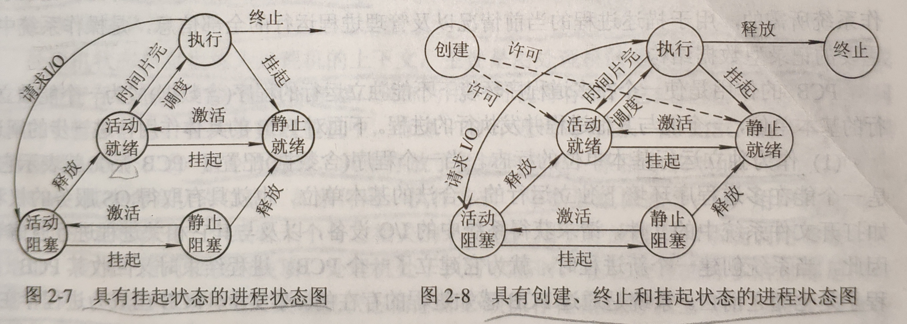

# 并发

- 程序并发执行的特征
  - 间断性
  - 失去封闭性
    - 一个程序在运行时，其环境会受到其他程序的影响
  - 不可再现性

# 进程

## 定义

- 进程是程序的一次执行
- 进程是一个程序及其数据在处理机上顺序执行时所发生的活动
- 进程是具有独立功能的程序在一个数据集合上运行的过程，它是系统进行资源分配和调度的一个独立单位

## 进程控制块

为了使参与并发执行的每个程序（含数据）都能独立地运行，在操作系统中必须为之配置一个专门的数据结构，称为**进程控制块（Process Control Block，PCB）**。

系统利用PCB来描述进程的基本情况和活动过程，进而控制和管理进程。

## 进程实体

进程实体（又称进程映像）构成：

- 程序段
- 相关数据段
- PCB

所谓创建/撤销进程，实质上是创建/撤销进程实体中的PCB。

## 特征

- 动态性
  - 进程的实质是进程实体的执行过程
  - 体现
    - 由创建而产生
    - 由调度而执行
    - 由撤销而消亡
- 并发性
- 独立性
  - 进程实体是一个独立的单位参与运行和独立接受调度的基本单位
- 异步性
  - 进程按各自独立的、不可预测的速度向前推进

# 状态及转换

## 状态

- 就绪（Ready）状态
  - 进程准备好运行的状态，即已分配到处CPU以外的所有必要资源
- 执行状态
- 阻塞状态
  - 正在执行的进程由于发生某事件（I/O请求、申请缓冲区失败等）暂时无法继续执行时的状态
  - 即进程执行收到阻塞
  - 会引起进程调度
- 创建状态
  - **进程创建步骤**
    - 由进程申请空白PCB
    - 向PCB中填写用于控制和管理进程的信息
    - 为该进程分配运行时所必须的资源
    - 把该进程转入就绪状态并插入就绪队列中
  - 如果在创建过程中不能满足所需的资源，则创建工作无法完成，此时的状态称为创建状态
- 终止状态
  - 进程终止的步骤
    - 等待操作系统进行善后处理
    - 将其PCB清零，并将PCB空间返还系统
  - 当一个进程到达了自然结束点或出现了无法克服的错误，或被操作系统终结，或被其他进程所终结，将进入终止状态

## 挂起操作

挂起状态是指进程处于静止状态，不接受调度。引入挂起操作的原因：

- 终端用户的需要
- 父进程的需要
- 负荷调度的需要
- 操作系统的需要

引入挂起原语（Suspend）和激活原语（Active）后，进程状态的转换：

- 活动就绪 -> 静止就绪
- 活动阻塞 -> 静止阻塞
- 静止就绪 -> 活动就绪
- 静止阻塞 -> 活动阻塞

# 进程控制块

进程控制块（Process Control Block，PCB），作为进程实体的一部分，记录了操作系统所需要的，用于描述进程的当前情况以及管理进程运行的全部信息。

## 作用

- 作为独立运行基本单位的标志
  - PCB已成为进程存在于系统中的唯一标志
- 能实现间断性运行方式
  - 系统可将CPU现场信息保存在被中断进程的PCB中
- 提供进程管理所需要的信息
  - 根据PCB中记录的程序和数据在内存或外存中的始址指针，找到相应的程序和数据
  - 当需要访问文件系统中的文件或I/O设备时，也都需要借助于PCB中的信息
  - 进程所需要的资源
- 提供进程调度所需要的信息
  - 进程状态信息
  - 进程的优先级

## PCB中的信息

- 进程标识符
  - 外部标识符
    - 为了方便用户（进程）对进程的访问
    - 通常由字母、数字组成
  - 内部标识符
    - 为了方便系统对进程的使用
      - 通常是一个进程的序号
- 处理机状态
  - 处理机状态信息也称为处理机的上下文，主要是由处理机的各种寄存器中的内容组成，包括：
    - 通用寄存器
      - 用户可视寄存器，用户程序可访问的，用于暂存信息
    - 指令计数器
      - 存放了要访问的下一条指令的地址
    - 程序状态字PSW
      - 包含状态信息：
        - 条件码
        - 执行方式
        - 终端屏蔽标志
    - 用户栈指针
      - 每个用户进程都有一个或若干个与之相关的系统栈，用于存放过程和系统调用参数及调用地址
  - 当处理机处于执行状态时，正在处理的许多信息都是放在寄存器中
  - 当进程被切换时，处理机状态信息都必须保存在相应的PCB中，以便重新执行
- 进程调度信息
  - 进程状态，指明进程的当前状态
  - 进程优先级
  - 进程调度所需要的信息
    - 与采用的进程调度算法有关，比如
      - 进程已等待CPU的时间总和
      - 进程已执行的时间总和等
  - 事件
    - 指进程由执行状态转变为阻塞状态所等待发生的事件，即阻塞原因

## PCB组织方式

- 线性
- 链式
- 索引

# 进程创建

## 原因

- 用户登录
- 作业调度
- 提供服务
- 应用请求

## 创建过程

- 申请空白PCB，为新进程申请获得唯一的数字标识符
- 为新进程分配其所需要的资源，包括物理和逻辑资源
- 初始化进程控制块
  - 初始化标识信息
  - 初始化处理机状态信息
  - 初始化处理机控制信息
- 将新进程插入就绪队列

# 进程终止

## 原因

- 正常结束
- 异常结束
  - 越界错
  - 保护错
  - 非法指令
  - 特权指令错
  - 运行超时
  - 等待超时
  - 算术运算错
  - I/O故障
- 外界干预
  - 操作员或操作系统干预
  - 父进程请求
  - 父进程终止

## 终止过程

- 根据被终止进程的标识符，从PCB集合中检索出该进程的PCB，从中读出该进程的状态
- 若倍终止进程正处于执行状态，应立即终止该进程的执行，并置调度标志为真，用于指示该进程被终止后应重新进行调度
- 若该进程还有子孙进程，还应将其所有子孙进程也都予以终止
- 将被终止进程所拥有的全部资源或者归还给父进程，或者归还给系统
- 将被终止进程（PCB）从所在队列中移出，等待其他程序来搜集信息

# 阻塞与唤醒

- 引起阻塞的事件
  - 向系统请求共享资源失败
  - 等待某种操作的完成
  - 新数据尚未到达
  - 等待新任务的到达
- 进程阻塞过程
  - 进程通过调用阻塞原语block将自己阻塞
  - 立即停止执行，把PCB中的现行状态有执行改为阻塞
  - 将PCB插入阻塞队列
- 唤醒过程
  - 当被阻塞进程期待事件发生时，有关事件调用唤醒原语wakeup
  - 将等待该事件的进程唤醒
  - wakeup执行过程
    - 首先把被阻塞进程从等待该事件的阻塞队列中移出
    - 将其PCB中的现行状态由阻塞改为就绪
    - 将该PCB插入就绪队列

# 进程的挂起与激活

- 挂起
  - 当系统中出现了引起进程挂起的事件时，OS将利用挂起原语suspend将指定进程或处于阻塞状态的进程挂起
  - suspend执行过程
    - 首先检查进程的状态，若处于就绪状态，便将其改为静止状态
    - 对于活动阻塞状态的进程，则将之改为进制阻塞
    - 若被挂起的程序正在执行，则转向调度程序重新调度
- 进程的激活
  - 当系统中发生激活进程的事件时，OS利用激活原语active，将指定进程激活
  - 激活原语先将进程从外存调入内存
  - 检查进程的现行状态
    - 若是静止就绪，便将其改为活动就绪
    - 若为静止阻塞，则将之改为活动阻塞

# 进程同步

进程同步机制的主要任务，是对多个相关进程在执行次序上进行协调，使并发执行的诸进程之间能按照一定的规则（或时序）共享系统资源，并能很好地相互合作。从而使程序的执行更具可再现性。

# 进程通信

- 共享存储器系统
- 管道
- 消息传递系统
  - 直接通信方式
    - OS提供的发送原语
  - 间接通信
    - 共享中间实体
- 客户机-服务器系统
  - 套接字
  - RPC

# 线程

解决程序并发执行的问题。

**和进程对比**

- 调度的基本单位
  - 能独立运行的基本单位
  - 切换线程，只需要保存和设置少量寄存器内容
- 并发性
- 拥有资源
- 独立性
- 系统开销
- 支持多处理机系统