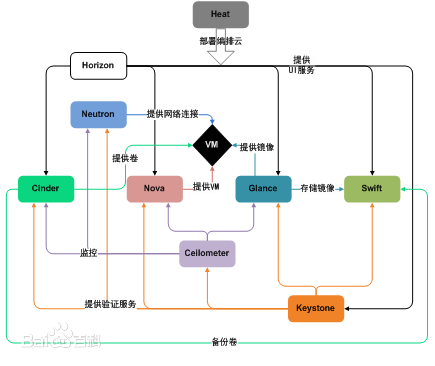

[TOC]

# OpenStack笔记

## 概述

`OpenStack`是一个开源的云计算管理平台项目, 由几个主要的组件组合起来完成具体工作, 旨在为公共及私有云的建设与管理提供软件的开源项目, 目标是提供实施简单、可大规模扩展、丰富、标准统一的云计算管理平台. OpenStack通过各种互补的服务提供了基础设施即服务（IaaS）的解决方案，每个服务提供API以进行集成。

### 组件

- Nova
- Swift

## 核心项目

- Nova: 计算(Compute)
- Swift: 对象储存(Object Storage)
- Glance: 镜像服务(Image Service)
- Keystone: 身份服务(Identity Service)
- Neutron: 网络及地址管理(Network)
- Cinder: 块存储(Block Storage)
- Horizon: UI界面(Dashboard)
- Ceilometer: 测量(Metering)
- Heat: 部署编排(Orchestration)
- Trove: 数据库服务(Database Service)

## 社区项目

- Atlas-LB: 负载均衡
- Burrow: 消息队列
- Clanavi: 云管理工具
- Crowbar: 自动部署
- Juju: 服务部署
- RedDwarf: 关系型数据库

## 架构

### OpenStack典型环境架构图

## Nova

Nova是ASA开发的虚拟服务部署和业务计算模块.

## Swift

`Swift`是`Rackspace`开发的分布式云存储模块.

*`Nova`和`Swift` 可以一起使用, 也可以分开单独用.*

 